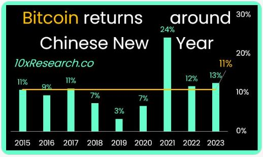

# 迎除夕，比特币大涨10%

今日除夕。昨日今日两天，比特币从43k发力上攻，一度涨超10%至47.7k，以独特的方式给全世界的bitcoiners送去了新春的祝福。

一个新鲜的知识：2023年12月22日，第78届联合国大会协商一致通过决议，将春节（农历新年）确定为联合国假日。

爆竹声中一岁除，
春风送暖入屠苏。
千门万户曈曈日，
总把新桃换旧符。

有朋友问，是不是比特币在春节都会涨呀？有没有什么统计数据呢？

10xResearch的分析师 Markus Thielen 给出了统计：从2015年起，春节前3天买入、节后10天卖出，收益率总是正的。如下图：

看起来，2024年比特币又要诚不我欺呀。

昨夜斗回北，
今朝岁起东。
我年已强仕，
无禄尚忧农。
桑野就耕父，
荷锄随牧童。
田家占气候，
共说此年丰。

祝各位读者朋友、新老会员新春快乐、阖家幸福、龙年大吉！

