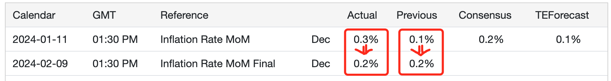
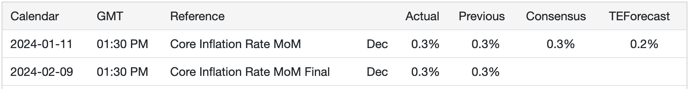

# 通胀向下，价格向上

号外：教链内参2.10《BTC真的存在春节模式吗？》

* * *

9号，美国劳工统计局BLS对1月份发布的2023年12月份通胀月环比数据进行了修订，下修了0.1%，从0.3%下调为0.2%。更骚气的是，还把前值也就是11月的数据给上修了0.1%，从0.1%上调为0.2%。

这样一来，通胀数据就从稳步上升变成了持平。美联储也许暂时不用对通胀死灰复燃提心吊胆了。

不过，核心通胀数据这边没有修订，和此前公布的数据一致。

这番将通胀数据玩弄于股掌之间，它还有多大反映真实情况的意义，就不得而知了。

以及，究竟是美联储的意志跟着通胀数据走，还是通胀数据要去迎合美联储的意志，也是一件说不清道不明的事。

通胀一词，也早已从货币（通货）数量上升这样一个清晰的定义，嬗变成了部分精心挑选出来的商品的货币价格向上变化的描述。

一旦通胀数值和货币数量脱锚，就解锁了一项超能力：印钱。

人们不无惊讶或者惊喜地发现，印钱并不必然导致通胀 —— 只要印出来的钱没有流向那部分精心挑选出来的商品流通里面去。

只要一种消费品的需求量上限受到人类物理属性的限制，并且该类消费品的总产量总是可以大于所有人总需求量上限的总和 —— 即不存在短缺，那么，这种消费的价格就很难因为印钞而上涨。

食物大抵上就是这样一种消费品。对它的总需求量，基本上受限于所有人的胃口大小。

假设世界上本来有100个人，每顿饭生产100个馒头，每人每顿饭有1元钱作为吃馒头的预算，那么1个馒头便值1元钱。现在我们印了1个亿，给第一个人。那么，作为消费者的他，仍然只会划拨1元钱去买一个馒头，因为他的饭量还是1个馒头。

财富分配忽然从非常平均变得极端不平等。但是似乎，这1个富人并没有影响到另外99个穷人吃他们的馒头。

这个富人花着穷人的物价，吃饱喝足之后，拿着剩下的钱去干什么呢？对了，买资产。中房，美股，比特币。这是过去十五年市场发生的情况。

这些资产有什么特点？和馒头不同，人对这些金融属性的资产的需求——或者叫“欲望”——天然缺乏物理限制。或者说，人们对这些东西有囤积的需求，而不只是消费。

所以我们会看到，消费品或许没有通胀，甚至物价可能还会阶段性降低，但资产的价格却似芝麻开花节节高。

人为何要囤积资产？表面的理由是保值增值。实际的含义是，它们的数量增长速度比货币数量增长的速度（原始的通胀定义）更慢一些。

如果人们对于货币不继续超发有充分信心，他们就简单持有货币好了，何苦要去投机于各种资产之中，甘冒跳进火坑，投机失败，被收割一空的结局呢？

可见，囤积资产的唯一意义，仅仅是逃避货币超发的掠夺罢了。为了这个被制造出来的需求，而诞生出来无数的投资机构、理财产品、财商课程，在货币超发造成的一次不平等的基础上，再割一波，造成二次不平等。

毕竟，绝大多数人本职工作繁忙，不可能放很多精力在学习金融和投资知识上面，又怎么能够确保自己在面对专业度远超自己、把全部时间都用在琢磨这件事的那些“专业人士”的时候，不被忽悠，不会上当，不会掏出积蓄之后才发现所托非人呢？

如果一项资产或者货币，像比特币那样，可以给人们以极大信心，总量不可能超过一个固定数字，那么，人们就会慢慢明白，又何苦去冒险囤积其他金融品，只是为了保值增值呢？

这是一种全新的思维。除了全球大部分西方国家短暂施行金本位的那几十年，在其他几乎全部人类历史中，都严重缺乏这种思维和观念。

更坏一些的情况是，前面那个得到了一个亿超额货币的人，不是一个消极享乐的消费者，甚至不是一个囤积资产、躺平生活的有产者，他有远大宏图，他要大展抱负，他野心勃勃，要用这一个亿的资本，建功立业。

要创业，要干活，就要招兵买马。于是他向另外99个人说，顺我者昌，逆我者亡。你们愿意跟我干的，我把馒头高价买下来，分给你们吃。那些不愿意跟我干的，就让他们买不起馒头，吃不上饭，饿肚子吧。

在媒体的文章里，在人们的议论中，把你干的行当，称为时代红利。人人都知道加入你的事业就是拥抱时代红利，可以拿到高薪，吃得起高价馒头。不能追随伟大的你，就是被时代抛弃，只能苦逼地赚着微薄的薪水，甚至饥寒交迫。

这个时候，我们就会在二次不平等的基础上，出现第三次不平等。

三板斧下来，追随你而吃到时代红利的人，对你感恩戴德；被无声淘汰的人，在外卖算法或打车算法的指挥下疲于奔命，没有时间也没有那个脑子去思考为什么他们会活得如此辛苦；而你，不仅稳坐你的商业帝国之巅，而且根本不担心有人会去质疑你最初的一个亿到底是怎么来的。

如果一个国家的体制无力钳制通过巧妙攫取超额货币并以此为杠杆，改变生产关系分配，进而重塑社会阶层，而自身最终富可敌国的人，那么，这个不平等的倾斜，就将持续扩大，并最终倾覆整个社会。

