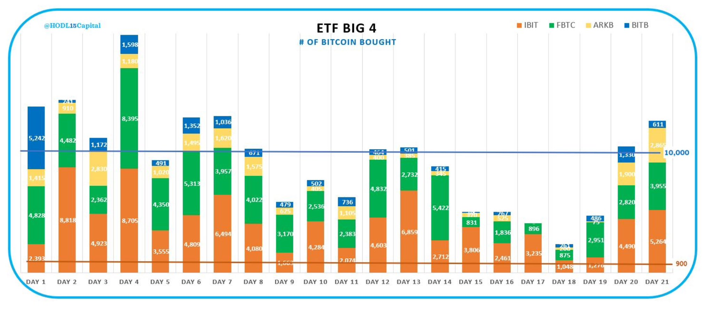
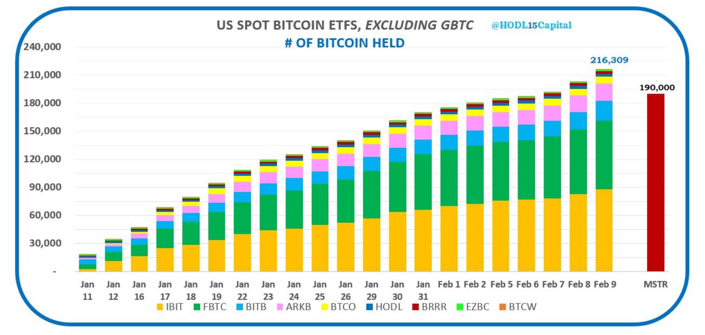
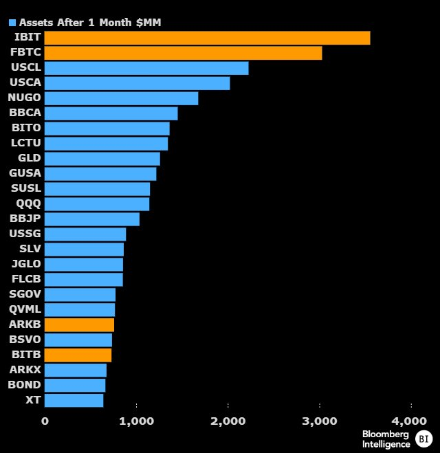
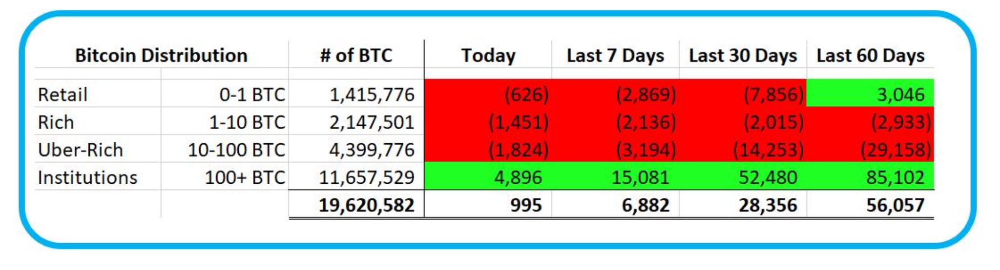

# 美比特币ETF持仓跨越20万枚BTC大关，成为华尔街有史以来最受欢迎的ETF！

号外：教链内参2.10《比特币真的存在春节模式吗？》

* * *

自SEC在2024年1月份一口气批准了十多支比特币现货ETF之后，机构们“不待扬鞭自奋蹄”，在吸收客户上使出浑身解数，激烈竞争。贝莱德（IBIT）、富达（FBTC）这俩大牌子自不待言，持仓量哗哗地涨。新贵Bitwise（BITB）和木头姐的方舟基金（ARKB）也是不甘人后，积极买进。这四支也由此成为美股市场上比特币现货ETF的“四大”（Big 4）。

在比特币现货ETF批准之后，仅仅20天光景，其中9支ETF就累计净买进了21.6万余枚BTC。这个数字已经超过了著名囤币大户微策略在过去三年多拼命买买买所积累的仓位19万枚BTC的数量。

现货ETF，实打实地为比特币带来了购买力，而且是不容小觑的购买力。这股来自美股市场的强大购买力，也让比特币现货ETF正式跻身华尔街有史以来最受欢迎的ETF之榜首！

上图显示了，在ETF上市一个月时间内，涌入的资金量，贝莱德的IBIT排名第一，富达的FBTC排名第二，与身后的各种ETF产品拉开了一个身位。

当然，也远超当年黄金ETF（图中的GLD）的表现。

但是，为何ETF发行机构在买买买的同时，市场却较之于上市之初波澜不惊呢？1月11号，BTC最高48.9k。2月11号，BTC刚刚重回48k上方。

关键在于，机构的对手盘，无论是持仓不足1个BTC的小虾米，持仓1-10个BTC的“中产”，抑或是持仓10-100个BTC的大户，在过去30天，全部是净卖出。

只有持仓100枚以上BTC的机构们，在不断地加仓。

可见，市场在过去一个月的主旋律是“换手”。

买盘力量和卖盘力量达到了一个动态平衡。散户们放弃了自己的BTC，机构囤积了它们。

在4万刀放弃的筹码，也许到10万刀之后，就会花更大的代价买回来。

在这场围绕ETF和BTC控制权的暗战中，散户和机构相向而行，擦肩而过，互道晚安。

