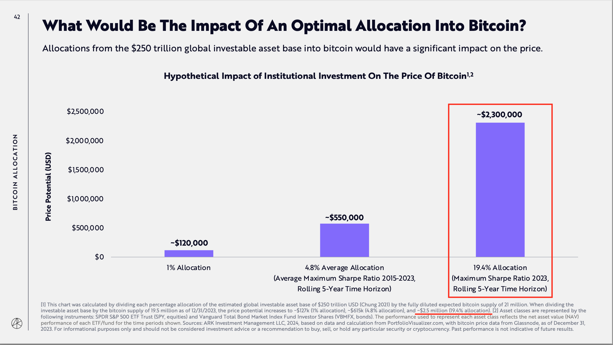

# 方舟基金：若美机构按最大夏普率配置比特币，则有望将其推升至230-250万美元

号外：教链内参2.12《方舟基金重磅报告〈大胆想象2024〉全文pdf》

* * *

方舟基金（Ark Invest）的木头姐（Cathie Wood）是业内的老熟人了。她一向以大胆的预测而著称。比如就在2023年10月份，木头姐在采访中就曾直言，根据方舟基金的市场预测，到2030年，比特币的单价最高有望达到148万美元。（参考刘教链2023.10.15文章《方舟基金预测2030年BTC或达最高148w美刀》）

而木头姐在比特币现货ETF的发行竞赛中也是十分努力。方舟基金是最早申请现货ETF的基金之一，直接或间接促成了SEC在她的申请截止日批准了现货ETF，而没有拖延至贝莱德等大牌基金的截止日。目前，方舟基金的比特币现货ETF（NYSE: ARKB）也成功跻身美股市场比特币现货ETF“四大”之列，规模大小仅次于贝莱德的IBIT、富达的FBTC以及Bitwise的BITB。（参考刘教链2.11文章《美比特币ETF持仓跨越20万枚BTC大关，成为华尔街有史以来最受欢迎的ETF！》）

现在，木头姐和她领导的方舟基金再出惊人之语！根据方舟基金最新的《大胆想象2024》（Big Ideas 2024）报告中的最新预测，若美机构都按照截至2023年的5年滚动时间窗口夏普率最大化的指导原则配置比特币，那么全球250万亿美元可投资资产的19.4%将会被投入进来，这将有望将比特币推升至230-250万美元的位置。

夏普率是一个金融领域的专业词汇，衡量的是一项投资承受单位风险所期望的回报高低。低风险、高回报，夏普率就高。相反地，高风险，低回报，夏普率就低。读者朋友们可以温习一下刘教链1.13号文章《配置BTC跑赢美股的稳健策略》更多了解。

让我们看得更仔细一点儿。在上图里，方舟基金实际上给出了两个数字。一个是250万美元，一个是230万美元。为什么会有这个差异呢？我们需要好好看一下它的算法。

脚注说了，如果把可投资资产的250万亿美元，乘以19.4%的比例，然后除以比特币最终总量21万枚，可以算出，每枚比特币的最终价值约为230,952,380美元，即约230万美元。

如果除以比特币2023年年底已产出量约1950万枚的话，那么这个计算结果就会是248,717,948美元，即约250万美元。

当然，这一次木头姐团队比较“谦虚”的一点是，没有给出时间的估计。不像去年10月份既给出了价格148万美元，又给出了时间2030年，这就很难确保预测正确。读者朋友可以温习一下刘教链提出的《交易市场中的测不准原理》（2021.3.20文章）。

因此，可别看这次他们预测的230-250万比上一次的148万高了近一倍，似乎更离谱，但是，反而有更大的概率会预测成真。因为这一次没有在给出价格的同时给出时间点，所以更符合测不准原理。只要给予足够长的时间，以及足够多的机会，总有一天，会有达成目标的概率的。

毕竟，这个价格还远没有超越哈尔·芬尼（Hal Finney）早在2009年比特币刚刚诞生时给予的1000万美元的估计值呢。（参考阅读刘教链2023.10.21文章《三分天下，300w美刀的BTC》）

