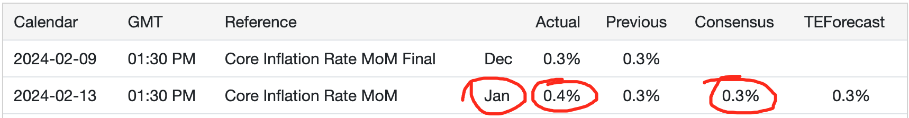
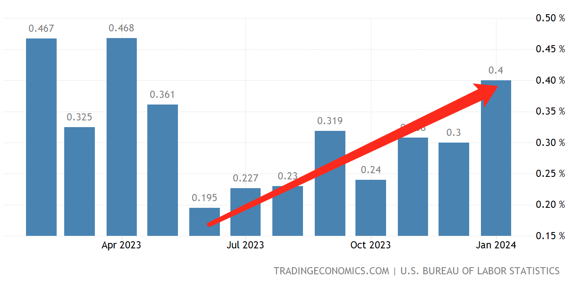
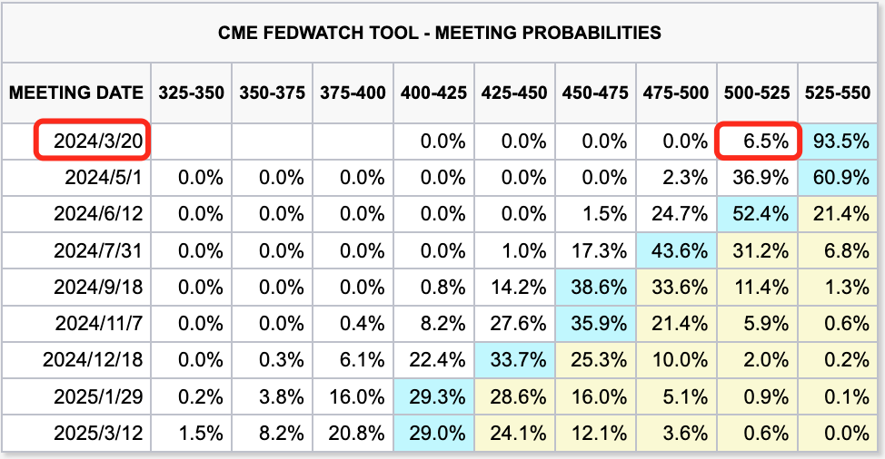
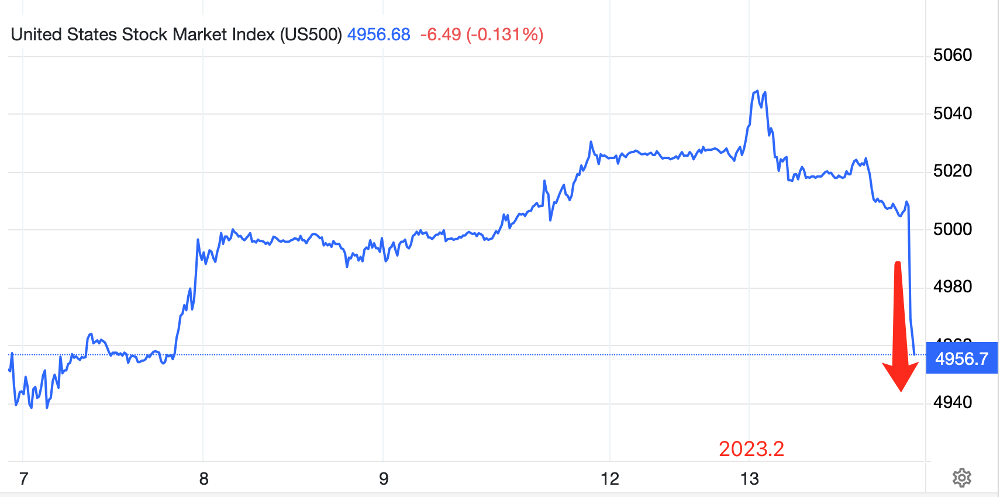
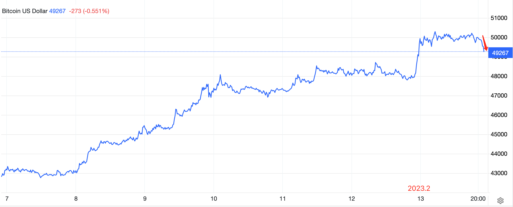

# 美核心通胀升温，促使比特币回调

号外：教链内参2.13《随着BTC一度突破5万刀，超过9成持有者已盈利》

* * *

当地时间2月13号下午1:30，美国劳工统计局（BLS）发布了最新的1月份核心通胀数据。

2024 年 1 月，剔除食品和能源等波动性项目的美国核心消费者价格环比上涨 0.4%，较前值 0.3% 的涨幅有所加快，高于市场预期的 0.3%。这标志着核心消费价格自 2023 年 4 月以来的最大涨幅，对美国经济逐步通货紧缩的趋势提出了挑战，并增强了美联储议息会议中鹰派的理由。

这一增长主要归因于住房成本（0.6% 对 2023 年 12 月的前值 0.4%）和运输服务成本（1% 对前值 0.1%）的加速上涨，从而拉高了扣除能源服务的服务消费价格指数（0.7% 对前值 0.4%）。这抵消了商品通胀的放缓，如二手车和卡车（-3.4% 对前值 0.6%）、服装（-0.7% 对前值 0%）和医疗保健商品（-0.6% 对前值 -0.1%）的 CPI 均有所下降。

这么一来，本来看上去有望逐步缓解的通胀压力骤然变成自2023年6月以来大半年稳步增长的趋势了，看下图：

这可不太妙！

如此不仅一举扭转了9号BLS下修12月通胀数据给市场带来的美联储不必担心通胀的信心，而且更让人对于此前下修12月数据是不是正好反衬出1月份的通胀反弹有些心生疑窦。

市场担心通胀数据的反弹会令美联储重新紧张，从而进一步推迟降息的步伐，并且更加不会愿意回应市场对于及早结束量化紧缩的呼声。

上个月一度高达50%以上的3月份降息概率，也已降至不足10%。5月份的降息概率，也大幅下降。

一度狂飙猛进，刚刚突破5000点历史性新高度的美股，闻讯骤然暴跌，迅速跌至5000点下方。

刚刚突破5万刀的比特币，也随之跌落5万刀，再失高地。

伴随着币圈国人回家过年拉人入局而发动的春节行情，就要这样被美联储终结了吗？：）

