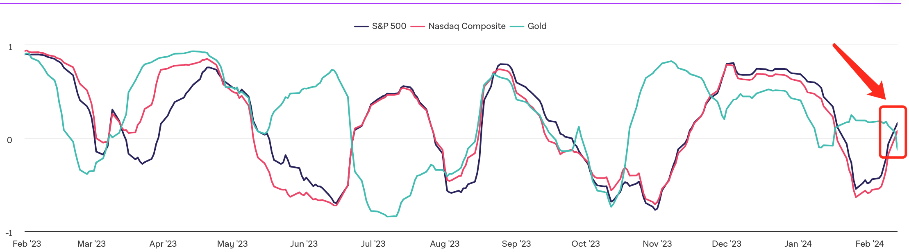
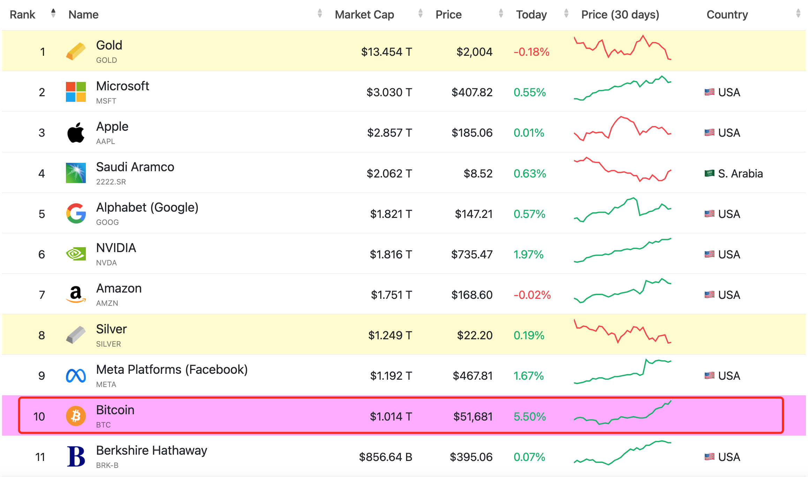
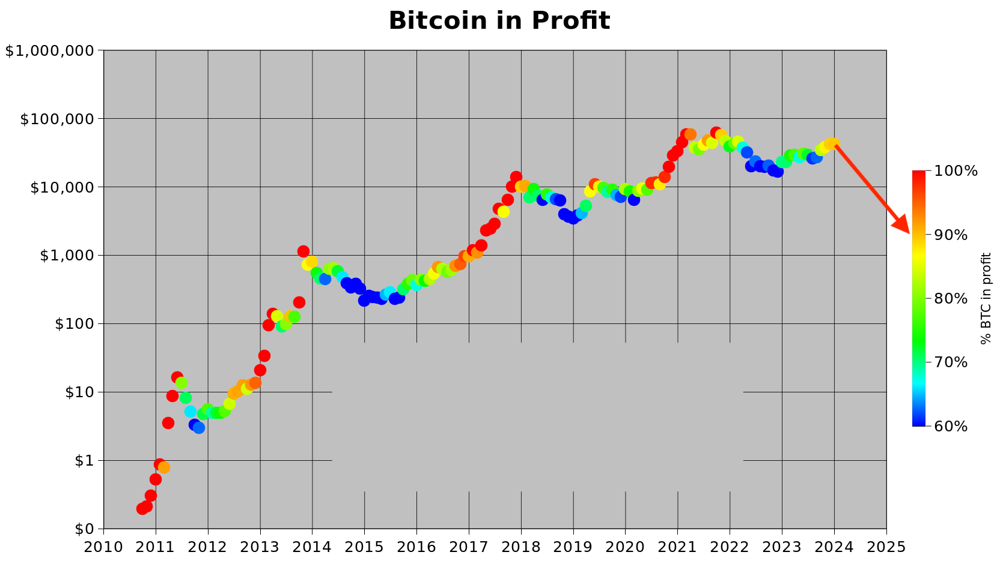

# 比特币再次上演“初五破五”精彩戏法！

号外：2.13教链内参《随着BTC一度突破5万刀，超过9成持有者已盈利》

* * *

比特币无惧美通胀数据阻击，在短暂回落之后坚决反攻，在中国农历大年初五，2月14日情人节，大涨6%，从48k绝地反击，再次上演形同2021年牛初时，气贯长虹的“初五破五（万美刀）”。此一役，不仅一举收复得而复失的50k关键心理关口，而且乘胜追击，一鼓作气，拿下51k，再下一城，挺进52k，把意志力薄弱的美股远远甩在了身后。

起初，在美国通胀数据再起的阻击之下，美股和比特币一同掉头回落，美股标普500指数跌落了刚刚突破的历史新高度5000点，比特币的战线则被从50k一度反推回48k一线。（参考阅读刘教链2.13文章《美核心通胀升温，促使比特币回调》）

不同的是，比特币迅速重整队形，展开反攻，成功收复失地，打出了一个漂亮的防守反击。而美股则依然被强大的美联储威胁所威慑，迟迟不能再上5000点。

事实上，比特币目前和美股以及黄金的相关性接近历史最低水平 —— 零相关。金麟岂是池中物，一遇春风便化龙。比特币，用铁打的事实不断证明着，其非凡品，独具一格，怎是此等传统类别资产所可与之相提并论的呢？

随着比特币突破五万刀，其市值不仅大幅超越股神巴菲特的伯克希尔·哈撒韦公司的市值，而且也突破1万亿美元大关，成为“万亿美元俱乐部”的一员。这是一个重要的标志性关口。在2021年牛市初首度突破5万刀之后，就是因为市值破万亿美元而引起传统媒体广泛关注和报道，从而彻底点燃牛市情绪的。（温习刘教链2021.2.20文章《比特币冲破万亿美元市值！》）

虽隔三秋，恍如昨日。有趣的是，相比于三年前，万亿美元俱乐部里，不仅美股“头牌”从苹果换成了微软，而且还多了几位“新”面孔——NVIDIA、Facebook，这些无不是2023年以来AI热的反映。

多个数据源如IntoTheBlock或者PlanB的分析显示，随着BTC突破5万刀，超过9成持有者都已处于盈利状态。（参考阅读2.13教链内参《随着BTC一度突破5万刀，超过9成持有者已盈利》）

比特币再次用不容辩驳的事实实力证明：你不负卿，卿必不负你。比特币从不辜负每一个不辜负它的人。（参考阅读刘教链2021.10.21文章《比特币再创新高》）

