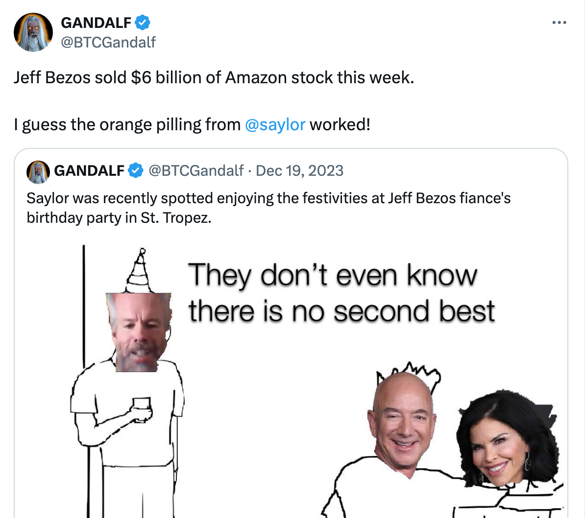

# 突发！亚马逊创始人贝索斯抛售60亿美元股票，外网疑其或加仓比特币

号外：2.16教链内参《OpenAI Sora惊艳发布，加密圈有人获利超700倍》

* * *

前世界首富、全球知名电商平台亚马逊（amazon）创始人杰夫·贝索斯（Jeff Bezos）最近一周以来接连抛售自家公司股票，累计已减持高达60亿美元。据usatoday报道，据亚马逊财报披露，贝索斯还计划在接下来一年时间里继续抛售大约同等数量的亚马逊股票。

自称从2009年囤币至今的比特币老炮GANDALF发推称，怀疑贝索斯是在为买入比特币筹措资金。去年也就是2023年12月19号，刚刚囤积比特币穿越一轮牛熊、现已成功盈利的微策略创始人迈克·赛勒（Michael Saylor）获邀参与了贝索斯新订婚的未婚妻、福克斯电视台主持人劳伦·桑切斯（Lauren Sanchez）的生日宴会，并与贝索斯相谈甚欢。GANDALF认为，赛勒也许已经成功给贝索斯吃了“橙色药丸”，即说服他入局，建仓比特币。

时年59岁的贝索斯梅开二度，于2023年5月22号和长跑5年的新女友、53岁的未婚妻桑切斯成功订婚。

当年的贝索斯，在桑切斯时任丈夫把妻子介绍给他认识的时候，就不可救药地爱上了桑切斯。于是贝索斯与妻子离婚，桑切斯与丈夫离婚，二人双向奔赴。

而贝索斯的前妻麦肯齐・斯科特（Mackenzie Scott）在2019年与贝索斯成功离婚，为25年的婚姻画上了句号。按离婚协议，斯科特获得了4%的亚马逊股份，彼时约合383亿美元，一跃登上福布斯全球富豪榜，位列第22位。贝索斯这位当时世界首富的离婚，也被誉为“史上最贵离婚协议”。

据说，按照华盛顿州法律，斯科特本可以分走夫妻二人半数持股即8%的股份。但她还是选择了大方放手，只分走了4%。同时，还承诺捐赠一半用于慈善事业。

现在，美股在美联储表面紧缩、背后定向放水推动下不断创出新高。标普500指数已经历史性地跨越5000点大关。但是，表面亮丽光鲜的背后，是美股市场结构性失衡的问题。泡沫大师格兰瑟姆不久前表示，美股的涨幅主要由7支头部科技股贡献，而其他腰部和尾部公司股票几乎没有怎么上涨，这令市场趋于极端化，美股被严重高估，并充满了结构性风险；AI被过度高估，经济衰退随时可能到来，这些因素叠加起来，极大地增加了抛售的风险。（参见2.3教链内参《BSV被coinbase下架！》）

老当益壮的贝索斯不可能不清楚自家股票的实际价值和其中的泡沫溢价。那么，最好的方法就是按照投机大师索罗斯的建议，在泡沫盛开的时候，把股票抛售给追高的人们。

参加生日宴会的老朋友、微策略创始人赛勒也是这么干的。早在今年2024年1月份，赛勒就趁着比特币现货ETF批准的炒作高峰期，大笔减持自家股票。（参见1.3教链内参《该如何计划减持》）

逢高抛售泡沫风险日益增大的美股，换仓为实打实的比特币，这真是一步妙棋。赛勒就是这么干的。他肯定要把这个心得和实操办法，趁着聚会的机会，对他的富豪朋友贝索斯倾囊相授。

而且，现在传授心法不比往日。当年2020年底微策略刚刚进场买完一些比特币之后，赛勒马上就开始给特斯拉创始人、世界首富伊隆·马斯克（Elon Musk）布道，成功拉马斯克入局，让特斯拉暴买了15亿美刀的比特币。（温习刘教链2021.2.9文章《特斯拉15亿买币：马斯克声东击西，比特币再创新高》）这俩老哥一通加仓，就把比特币从2万刀以下，迅速推升到了4万刀的水平。

当然，超级精明的马斯克也不是善茬。他可不想给别人抬轿子。于是在2021年上半年趁着市场过热，找了个“挖矿不环保”的借口，减持了一部分仓位，成功做低了特斯拉的持仓成本。（温习刘教链2021.4.27文章《特斯拉卖币，高手还是韭菜？》）

相比而言，赛勒比马斯克更笨拙。他没有马斯克那么多古灵精怪的心眼儿。他使得是好似“降龙十八掌”一般的笨功夫——坚持加仓，逢跌加仓。

从2020年底到现在，截至2024年2月5号，微策略已立即持仓19万枚比特币。建仓总资金量59.3亿美刀。折合平均加仓成本为31224美刀。（参考刘教链2024.2.8文章《微策略爆买3万枚！》）

按照目前比特币52k的价格计算，微策略目前仓位市值已接近100亿美刀，浮盈39.5亿美刀，收益率超66%！

穿越牛熊、收获颇丰的仓位，定能让迈克·赛勒在准嫂夫人的生日宴上，更加成竹在胸、底气十足地给前首富贝索斯传授“抛售美股、囤比特币”的超级心法吧！

如果亚马逊贝索斯果真重金入局，其注入的能量，绝非特斯拉马斯克当年入局所可比拟，单是想一想，全球最知名电商平台亚马逊如果开通比特币支付，将会直接实现中本聪当年的支付愿景，就已经令人激动地难以言表！以亚马逊全球每年近7000亿美刀（2022年）的交易规模，将会为比特币带来多么巨大的赋能和价值增量！

