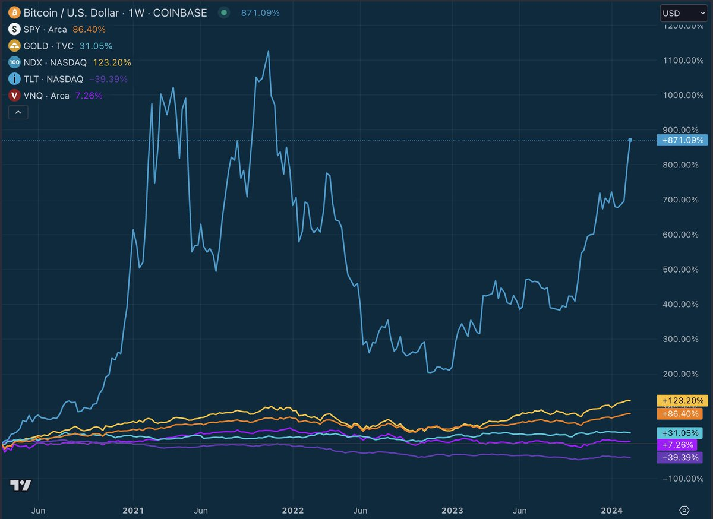

# 如何向朋友简单解释比特币？

号外：2.17教链内参《美联储官员表示2024年降息三次是合理的》

* * *

文 | Stack Hodler. 原标题：Bitcoin explained simply. 2024.2.16

* * *

**解释比特币很简单：**

你努力工作赚钱。

你用你生命中的一大部分来换取薪水。

与此同时，政府只需轻点鼠标，就能让货币供应量翻倍。

**这就是残酷的现实：** 如果你在银行持有现金，你的时间就会被偷走，因为政府会摧毁你的购买力。

因此，你唯一的选择就是投资资产，避免被政府贬值。

如果投资得当，你就能跑赢通胀，过上更好的生活。

**但是，为了更好的未来，投资这笔钱的最佳方式是什么？**

人们用房子、债券、股票甚至艺术品来存钱。

但它们都有缺点。

**它们都不是用来“储蓄”的工具，因此各有各的不完美之处。**

- 房子被固定在一个地方，有维护和保险费用，通常需要举债才能 "拥有"。

- 政府债务（债券）的供应是无限的，随着时间的推移，政府支出会失控，从而失去购买力。

- 企业的寿命有限，运营风险巨大。它们还可以凭空创造资产。

- 艺术品是不可替代的。要出售艺术品，你需要找到一个想要你的特定艺术品并愿意支付你的价格的买家。

比特币是一种新型储蓄技术，解决了如何存储财富的问题。

**它被设计成一种理想的财产形式，可以长期持有，并随着时间的推移增加你的购买力。**

它是有限的。
它以能源为后盾。
它不会像建筑物一样腐朽。
它可以少量买卖。
你可以持有数十年而无需支付任何费用。
可以随身携带。
它与任何一个国家或行业的命运无关。

而在过去的十年中，它一直是表现最好的资产。

**很简单：** 选择比特币作为主要储蓄工具的人，随着时间的推移，购买力持续大幅提升。

现在，全球最大的资产管理公司也开始采用比特币。

这意味着风险回报率从未如此之高。

现在，它已获得美国证券交易委员会（SEC）的批准，**风险** 已大大降低，并被推向贝莱德和富达客户的退休投资组合中。

在新一轮资本浪潮刚刚开始到来之际买入，**回报** 是显而易见的。

总之，现在还为时尚早。

而且，由于比特币是人类已知的最佳储蓄技术，它将永远是储存辛勤工作所得利润的绝佳场所。

**一言以蔽之：** 对于比特币持有者来说，生活会变得越来越便宜，而对于选择用其他资产来储存价值的人来说，生活会变得越来越昂贵。

所以，明智地选择你的储值方式吧。

**自 2020 年各国政府开始疯狂贬值货币以来的主要资产表现：**

