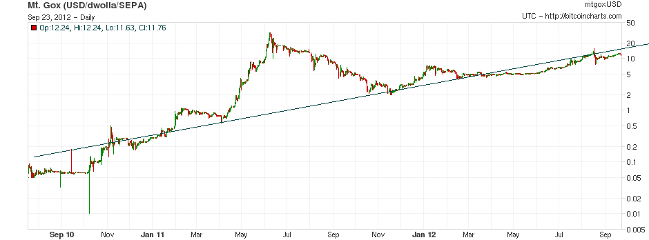

# 比特币 —— 财富再分配的一种手段

号外：2.17教链内参《美联储官员表示2024年降息三次是合理的》

* * *

文 | Rüdiger Koch. 原标题：Bitcoin - a Means for Redistribution of Wealth. 2012.9.27

## 如果很大一部分超人类主义者能够实现经济独立，将会发生令人惊叹的事情。如何才能做到这一点呢？

许多超人类主义者[注1]都有伟大的想法，但由于缺乏时间和金钱，他们从未付诸实施。只有最坚定、最执着的 H+ 人士才会无视一切拖累，继续前行。在遇到巨大困难时，许多人放弃了，但也有少数人获得了资助并继续前进。少数人还找到了工作，可以继续追求自己的梦想……

[注1] 超人类主义者，transhumanist。根据维基百科的解释：超人类主义（英语：Transhumanism，缩写为H+或h+），或译为超人文主义、超人主义或跨人类主义，是一个与人类增强类似的术语。它现在是一个国际性的文化智力运动，支持使用科学技术来增强精神、体力、能力和资质，并用来克服人类不需要或不必要的状态，比如残疾、疾病、痛苦、老化和偶然死亡。超人类主义思考者研究发展和使用人类增强技术以及其他以此目的的新兴技术可能性和后果。此外，这些强大的新技术带来的危险和好处，以及对人类生活状态的改变，也是超人类主义运动的关注方向。

显然，如果很大一部分超人类主义者能够实现经济独立，那么将会发生令人惊叹的事情。怎样才能做到这一点呢？

有一个办法……

## 我们需要重新分配财富！方法如下：

互联网上野生的开放式点到点货币代表着我们经济的命脉——货币——即将发生的范式转变。在几乎毫无争议地控制了货币供应 400 年之后，世界各国的中央银行现在面临着强大的竞争，这竞争有可能使它们彻底过时。不仅是中央银行，任何形式的资金转移都不再需要支付平台（payment processor）的帮助。无需 SWIFT 或 SEPA 等银行网络，无需任何专有电子货币，许多传统银行业务模式都将被淘汰。只要我们愿意，不进银行也能过日子。除非全世界几乎所有国家的政府一起控制互联网，或者完全取消互联网，否则任何事情都无法阻止这一发展。精灵已经从瓶子里出来了。

比特币是第一种点到点货币。与点到点文件共享一样，任何人只需下载一个客户端，就可以参与其中。比特币的特性旨在增强用户的能力，并为早期采用者提供优势：

1. 比特币无视国界。对你邻居的交易与对网络世界最偏远地区用户的交易是一样的。

2. 比特币并不像法定货币那样凭空产生任意数量。比特币是通过一个名为“挖矿”的过程以可预测的速度产生的。在撰写本文时，比特币的数量为 1000 万枚，而且永远不会超过 2100 万枚。

3. 比特币地址与其所有者没有明显的联系。除非可以通过其他方式建立这种联系，否则比特币交易是匿名的。

财富再分配的动力有二：由于供应量非常有限，如果需求增加，比特币的价值就会上升，这是可以预测的：如果用户数量增加，早期采用者就会受益，因为他们对比特币的需求会推动价格上涨。价格能涨多少？我们目前的用户数为 50,000 人，市值为 1 亿美元。如果将来有 10 亿人使用比特币，价格必须上涨 5 个数量级才能弥补。换句话说，如果你今天买了一个比特币，如果项目完全失败，你将损失 12 美元。但如果项目成功，你将获得 10 万美元或更多。

这已经说明了财富再分配是如何有利于早期采用者的。早期采用者能够以低廉的价格获得比特币。网络效应正在扩大比特币社区，比特币的价格也会上涨。现在的问题是，如果有人获益，谁会受损？毕竟，今天所有的货币都是纯虚拟的，所以这一定是一个零和游戏。如果比特币上涨，资本就会流入比特币经济。损失的是那些持有其他货币的人，因为他们将失去资本。在目前的价格下，这完全可以忽略不计，因为比特币的市值与 10 万亿欧元的 M3 和更高数额的美元相比，简直是小巫见大巫 —— 自 2006 年以来，美联储明智地决定不再公布这些数字。但是，这些货币的用户是否会感到损失是个问题 —— 欧洲央行和美联储会通过通货膨胀的手段，狠狠地搞他们一把。

图片：2010 年以来至撰文时的比特币价格。忽略泡沫，尤其是 2011 年中期的泡沫，比特币价格很好地符合指数规律。

由于比特币社区现在已经学会了如何更好地利用比特币，比特币的价格越来越受到使用的驱动，而不仅仅是投机。在市场渗透的某个阶段，比特币将取代西联汇款和其他汇款服务，因为这正是比特币从一开始设计的目的。一旦比特币的流通被封闭，即企业可以用比特币支付账单并以比特币获得收入，比特币的使用将会爆炸式增长。把钱放在比特币的进一步增长上，似乎是一个非常好的押宝 —— 比以美元或欧元计价的票据（如寿险）要好得多，因为寿险几乎可以保证会贬值，并有可能变成一纸空文。

当然，比特币在去年流行起来后也受到了不少批评。以下是最相关的批评，并附有反驳意见：

* **比特币是一个庞氏骗局：** 与庞氏骗局一样，比特币奖励早期采用者。重要的区别在于，比特币作为一种支付方式具有实用性，它不承诺支付利息，因此没有一个明显的点让投资者去追逐它。一旦泡沫破裂，庞氏骗局也就一去不复返了。比特币曾在 2011 年出现过泡沫，并在 7 月份破灭，但之后又恢复得很好。

* **比特币是一个多层次营销（传销）骗局：** 如上所述，两者有相似之处，但也有重要区别。比特币没有像传销那样的个人奖励，如果你拥有比特币，你不需要做任何事情就可以从价格上涨中获利。

* **比特币没有内在价值：** 任何东西都没有内在价值。任何事物都是有价值的，只是人们对它的重视程度不同而已。人们倾向于认为有传统价值的东西才有内在价值，比如黄金。比特币还没有悠久的传统，但这显然会随着时间的推移而改变。

* **通货紧缩是坏事：** 如果价格下降是坏事，那么半导体行业从一开始就会陷入危机。在法定货币体系中，信贷紧缩才是坏事：如果每个人都开始偿还贷款，而不是进行投资或消费，生产力就会被用于毁灭货币（这就是偿还银行贷款的本质）。因此，经济受到影响，市场力量和违约造成的通货紧缩迫使人们更加努力地偿还贷款。政府散布“通货紧缩是坏事”的神话，以“货币政策”的委婉名称为创造新货币、从铸币税和政府债务货币化中获取收益 —— 通货膨胀税 —— 进行辩护。

与任何投资一样，比特币也存在风险：

* 由于比特币几乎是匿名的，它对犯罪分子的应用显而易见。如果它被限制在这部分人群里，它的价值就会被卡住（不能继续发展）。投资不会损失，但也不会有 5 个数量级的利润。

* 椭圆曲线加密或使用的散列算法被破解：这取决于发生的方式，可能是完全损失，也可能只是中断，直到实施替代方案。针对这种情况，已经有相应的计划。

* 政府禁止比特币：这是一个非常现实的可能性，因为许多政府计划用专有的电子货币建立无现金社会，每一笔交易都将被实时监控、征税，甚至可能被否决。禁令可能是一个重大挫折，但在这样的环境下，比特币作为现金替代品对每个人来说都非常有吸引力。比特币甚至可以从禁令中获利。

* 比特币的价格有时会很不稳定。任何时候都不能保证你以后不会以更便宜的价格获得比特币。作为一个长期投资者，你必须能够忽视这种短期波动。

获取比特币的方法有很多。一旦有了比特币，你就想提现。如果你只想保存它们，可以创建一个纸质钱包，打印出来存放在你的保险箱里。别忘了再打印一份作为备份。然后将钱币提取到显示的地址，并从电脑上删除纸质钱包，这样就不会被恶意软件窃取了。就这样！到了使用比特币的时候，你可以在电脑或移动设备上扫描二维码进入钱包。

人体冷冻者会发现脑钱包这个选项很有趣：由于私钥只是一个非常大（256 位）的数字，它可以通过通行短语确定性地创建。这是一串对你有意义的单词，可能会加上你的社会安全号码等内容。既然你现在能记住这个词串，那么在你复活后也应该能记住它。因此，只要你能保持记忆，即使你在杜瓦瓶中的其他一切都被夺走了，你也能使用你的资金。更重要的是，你可以证明你是比特币地址的所有者，从而证明你是比特币地址上资金的所有者。这是通过用你的私人密钥签署一条信息来实现的。现在，任何人都可以通过这条信息和你的公钥来验证你的所有权。根据比特币的发展情况，即使是一个比特币，在你复活时也可能是一笔巨款，因此现在就投资这一小笔钱，让未来有真正的动力让你复活，似乎是明智之举。

比特币的真正价值在于将其作为一种支付方式。你需要一个电子钱包来花费它们。

超人类主义者往往是自由思想者，这意味着他们通常无法在任何事情上达成一致。这既是 H+ 运动最大的优点，也是最大的缺点。但是，如果我们能够同意使用比特币，并利用我们的个人网络来传播它，那么我们就有足够多的人使比特币的成功 —— 从而使价格上涨 —— 成为一个自我实现的预言。

