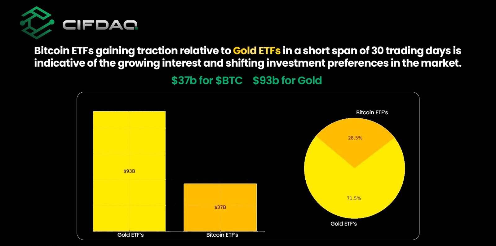
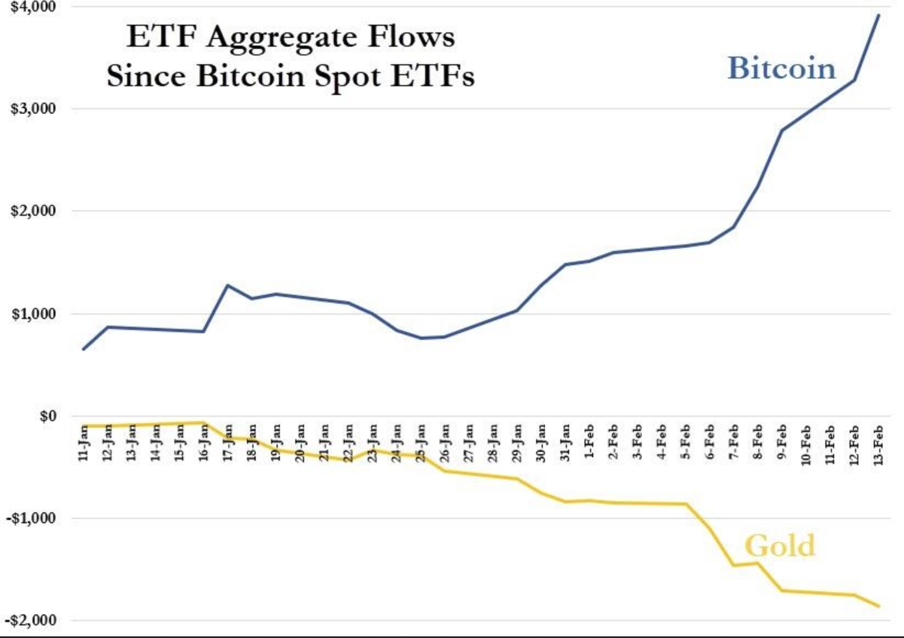
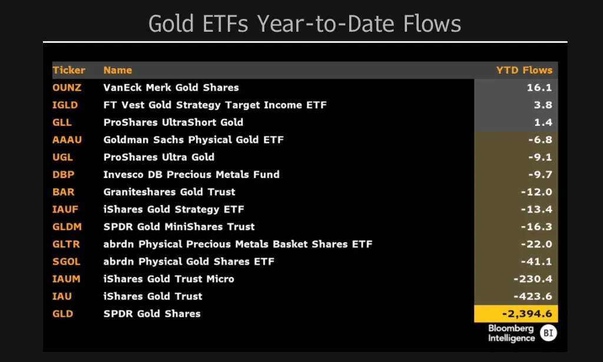
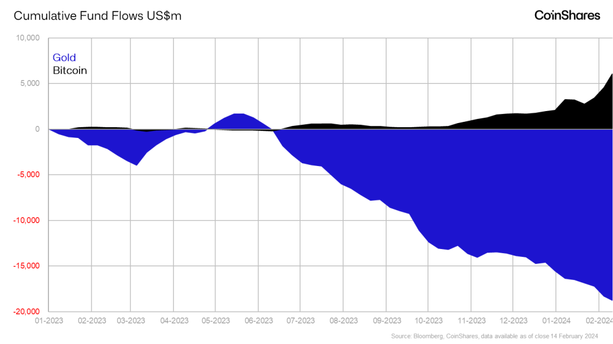
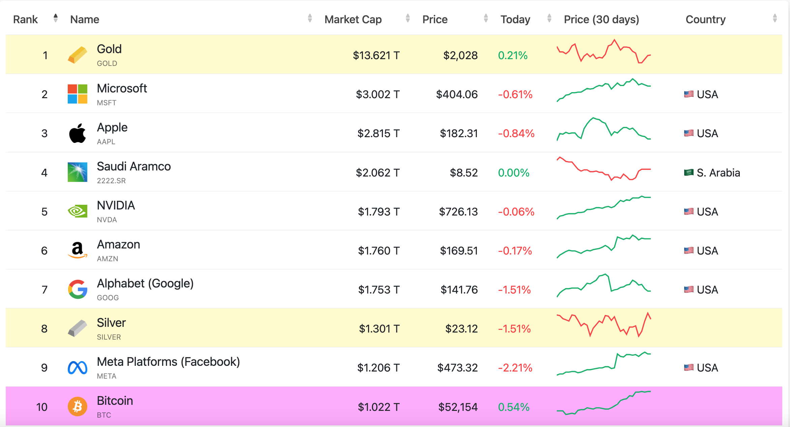

# 比特币正在蚕食黄金

号外：2.19教链内参《蹭热点、骗流量、割韭菜》

* * *

众所周知，自从美国SEC批准比特币现货ETF登陆美股市场之后，打开了美国金融市场泛滥的流动性向比特币流入的大门。只用了短短的30个交易日，比特币ETF就从零膨胀到了近400亿美元的规模，超过白银ETF约100多亿美元的规模，和规模约为900多亿美元的黄金ETF暂时形成了“三七开”的格局。

大量的美元流动性注入，使得比特币的价格得以一直维持在52k的位置。比特币现货ETF也由此成为华尔街有史以来增长最快的ETF。（参阅刘教链2024.2.11文章《美比特币ETF持仓跨越20万枚BTC大关，成为华尔街有史以来最受欢迎的ETF！》）

那么，流入比特币ETF的流动性，都是从哪里来的呢？

数据显示，很可能有一半是来自于黄金ETF损失的流动性。

从图中可以看出，自1月份比特币现货ETF上市以来，十支比特币ETF累计净流入已达40亿美元左右。而同期，14支头部黄金ETF累计损失了逾20亿美元流动性。

当然，如果把视野拉长到2023年，并拉宽到全球的相关ETF，那么可以看到，黄金ETF的加速流出从2023年中就已经势不可挡了。

这铁一般的事实无疑在确证一个我们早已重复多次的陈述：比特币是更好的黄金。（温习刘教链2021.2.5文章《比特币是更好的黄金》以及2023.3.4文章《比特币是更好的黄金》，2023.12.28教链内参《拥抱数字时代的新黄金》）

而早在2020年2月22日教链就在《教链一周谈20200222》中谈到：

「一个商品（commodity）货币化的全过程大概会经历几个阶段：（1）收藏品；（2）投机品；（3）保值避险品（SoV, Storage of Value）；（4）交易媒介（MoE, Media of Exchange）；（5）计价单位。
 
「黄金完成上述过程经历了上千年的时间。比特币的货币化可能是我们这代人有生之年能够亲眼目睹的一次伟大的货币化进程（也许无法活够久到该进程完全完成）。
 
「过去十年，比特币经过了前两个阶段，分别由理想主义分子和狂热投机分子所推动。从2019年上半年开始，比特币正式进入了第三阶段。」

显而易见的，虽然教链也多次讲，比特币的终极使命是打败美元，但是在这之前，或者说，在当前阶段，它的历史任务是首先打败和超越黄金。原因无他，只因上面讲的货币化进程的客观规律。比特币首先要先在投机品层面打败股票，然后在价值存储层面打败黄金，才能迈入下一阶段，挑战美元作为交易媒介和计价单位的货币之王的全球地位。

目前，比特币刚刚跨越1万亿美元总市值大关。而黄金的全球总市值近14万亿美元。

教链曾在2022年12月份为星球会员撰写内参资料《2022年年终复盘展望报告》时如此写道：

「诚如此前所说，crypto的行业大周期仍是由比特币推动。或者说，是由比特币所带来的增量资金和杠杆资金所推动。是比特币推动了牛市，造就了热点；而不是热点推动了牛市，造就了比特币。

「今时今日，比特币所处的16k-17k的价格，也许大致相当于2015年底的230美元，或者2020年“312”熔断低点下方的5000美元。可能接下来，比特币或者经历2015-2016那样的缓慢而艰苦的爬坡修复过程，或者经历2019年那种底部震荡的行情。但是无论如何，在2024年4月20日（预计）比特币产量再次减半（从6.25减半到3.125）之前，整个市场应该还是在修复2022年下行期间各种爆雷所造成的创伤之中，而不太可能在短期再创新高。

「至2023年底，我们也许会看到不低于25k、不高于69k（前高）的比特币。在2024年底之前，比特币有望回升至4-10万美元的区间。如果在2025年前后我们能够迎来下一轮牛市的大泡沫期的话，我们可能有机会看到比特币从10万刀下方迅速取得突破，并势如破竹，挑战40-50万美元的周期上限。

「在2021年的牛市泡沫高峰期，比特币的市值一度跻身全球前十大资产，比肩美股头部企业市值。同时，比特币也表现出了与美股走势较强的相关性。如果定义2021年的周期是挑战美股的话，2024-2025的牛市周期则是要挑战全球第一资产品类——黄金。

「今天，黄金的总市值约为12万亿美元。比特币按17k美元的价格，市值约为3300亿美元，距离黄金的总市值还有36倍的空间。比特币今天的总量是1922万枚。估计2023-2024两年还将产出约66万枚。总量达到1988万枚。按约数2000万枚计算，市值达到12万亿美元，单价应该是60万美元一枚比特币。

「在上一轮熊市2018年底底部3000多到牛市顶部2021年底69k，涨幅约23倍。按照当前17k涨幅23倍则为39万约40万美元一枚比特币，乘以2000万枚，总市值则为8万亿美元，约为黄金12万亿美元市值的67%。

「即便按照更小的涨幅，比如17、8倍，达到30万美元一枚比特币，总市值6万亿美元，约为黄金的一半。即使不超越黄金市值，达到相近的数量级，也可称得上是比肩黄金了。

「如果到时候，比特币的市值占整个crytpo行业的30-50%计算，可以推算届时crypto行业的总市值将有望达到12-20万亿美元左右。这个数字，是今天8700亿美元的13-22倍左右。

「谁能在这12-20万亿美元的市值中分一杯羹，谁就是下一轮牛市周期吃到红利的幸运儿。」

今日回望2023年，基本印证了当初的判断。而2024年初比特币现货ETF的意外提前获批，为比特币带来了汹涌澎湃的增量资金。

比特币不负众望，迅速对站在同一生态位的黄金发起了进攻，快速蚕食后者的市场，证明了自己果真是大家心目中“更好的黄金”，更优异的价值存储（SoV）。

贝莱德这个金融“新贵”，也借力比特币ETF，不动声色地向全球黄金操盘手摩根大通（JP Morgan）发起了挑战。

比特币对黄金，新贵对老钱。向黄金发起总攻的冲锋号已经吹响。号声吹响，必破楼兰！
