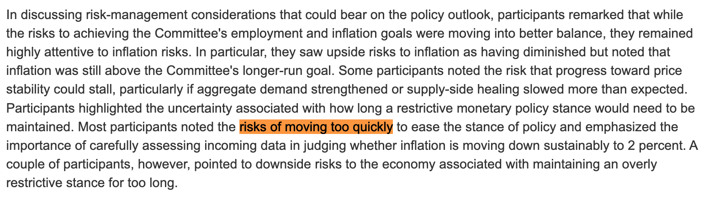

# 美联储纪要：拒绝过快降息

号外：教链内参2.22《BitMEX创始人：转向shitcoins》

* * *

隔夜美联储官网公布了1月份议息会议的纪要[1]。会议纪要显示，与会者普遍担忧“过快放松当前货币政策的风险”。

「在讨论可能对政策前景产生影响的风险管理因素时，与会者表示，虽然实现委员会就业和通胀目标的风险正在趋于更好的平衡，但他们仍然高度关注通胀风险。特别是，他们认为通胀上行风险已经降低，但指出通胀仍高于委员会的长期目标。一些与会者指出，实现价格稳定的进展可能会停滞不前，特别是如果总需求增强或供应方愈合的速度比预期的要慢。与会者强调了限制性货币政策立场需要维持多久的不确定性。大多数与会者指出了过快放宽政策立场的风险，并强调在判断通胀率是否正在持续下降至 2% 时，必须仔细评估新收到的数据。不过，也有几位与会者指出，如果长期维持过度紧缩的政策立场，经济将面临下行风险。」

最终，一月份的议息会议结论是维持联邦利率不变。

回顾刘教链2024.2.1文章《美联储作出决议，三大看点》可知，其实会后市场就已经知道，美联储对三月降息表示了明确的拒绝态度。这与此次会议纪要中所披露的细节是一致的。会议纪要，不过是还原彼时结论出台的更多背景，提供更多佐证。

但是，由于美联储的经典做法是把作为原因的纪要推迟到会议结论之后一段时间才放出来，这种颠倒乾坤的做法常常令市场心思错乱，持续感受到美联储态度的反复冲击。

市场的反应也常常证明，无论是多么明确的会议结论和表态，都不能充分传递所有的信息。市场也从来都不会仅凭一个会议结论，就充分消化和吸收美联储的意图。当会议结论的前置讨论，会议纪要，公布后，市场总是会再次发生波动，而不是心如止水。

从这一点上讲，即便是像比特币每隔大约4年产量减半这样完全透明公开的信息，也并不总是能够被市场充分定价。每次减半真实发生之时，市场才会慢慢反应过来，继而发生重大的变化。

* * *

关于教链提过多次的ON RRP中蓄水量减少的问题，此次纪要显示，美联储会上也做了讨论，并同意在后续会议继续深入讨论和做出决定。

在本次会上，美联储首先注意到了ON RRP用量持续下降的问题。

「关于货币市场和服务台业务的发展，有效联邦基金利率在会议期间保持稳定。在过去几个月的月末，包括年末，有担保隔夜融资利率经历了暂时和温和的上升压力，这种模式在新冠疫情之前很常见。在此期间，隔夜逆回购协议（ON RRP）融资机制的使用量持续下降，1 月底的余额已低于 6000 亿美元。自 2023 年 6 月暂停债务上限以来，隔夜逆回购协议机制的使用率下降速度远远快于美联储证券投资组合的下降速度，准备金余额也有一定程度的增加。」

「作为其持续市场监督的一部分，工作人员继续监测广泛的货币市场指标；这些指标表明储备供应仍然充足。工作人员还指出，一旦 ON RRP 机制耗尽或稳定在较低水平，在其他条件相同的情况下，储备金的下降速度将与美联储证券投资组合的流出速度相当。」

有关于ON RRP蓄水池的问题，请温习刘教链2023.11.13文章《美联储声东击西》。

「在会议期间，短期资金市场的状况保持稳定，年底前后出现了典型的动态变化。在此期间，存款准备金机制的使用率继续下降，这主要反映了货币市场基金将其资产重新配置到国库券和私人市场回购协议上，因为相对于 ON RRP 利率，这些市场利率更具吸引力。由于大额定期存款的流入大致抵消了核心存款的流出，银行的存款总额在去年第四季度大致持平。」

从ON RRP中跑出来的美元流动性，真的都跑去接盘美债了吗？比特币在2023年下半年高歌猛进，哪里来的流动性支撑？请参考阅读刘教链2.15文章《美联储暗渡陈仓，比特币洞若观火》并思考。

「与会者指出，持续缩减美联储资产负债表规模的进程是委员会实现其宏观经济目标总体方法的重要组成部分，迄今为止资产负债表缩减进展顺利。鉴于ON RRP机制的使用量持续减少，许多与会者建议，在委员会下一次会议上开始深入讨论资产负债表问题，以指导最终决定放缓流动性的步伐，将是适当的。一些与会者表示，鉴于对充裕储备水平的估计存在不确定性，放慢径流速度可能有助于平稳过渡到这一储备水平，或允许委员会将资产负债表径流持续更长时间。此外，一些与会者指出，即使在委员会开始缩小联邦基金利率的目标范围之后，资产负债表流失的过程仍可能持续一段时间。」

正如刘教链1.16文章《美国回购市场危机会在春季重演吗？》所指出的，ON RRP流失的问题，是一个值得美联储切实关注甚至是必须出手应对的问题。美联储缩表还能坚持多久，让我们拭目以待。

---
[1] https://www.federalreserve.gov/monetarypolicy/fomcminutes20240131.htm

