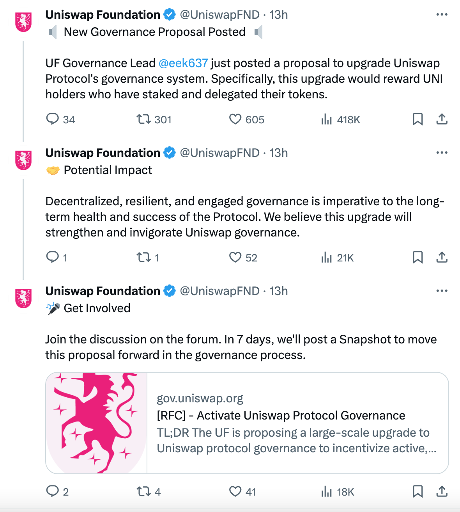
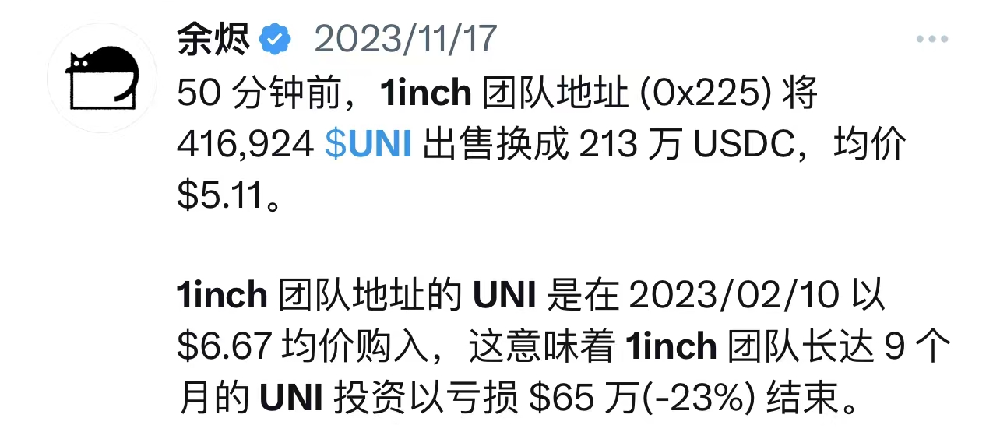

# Uniswap(UNI)骤升超50%

号外：教链内参2.23《研究报告称BTC或将在3月升至63k》

* * *

春国送暖百花开，迎春绽金它先来。火烧叶林红霞落，李花怒放一树白。

23日北京时间夜22点，Uniswap基金会治理主管eek637在知名去中心化交易协议uniswap的治理论坛上发布了关于激活Uniswap协议治理的RFC（征集意见稿）[1]，Uniswap基金会官推@UniswapFND对该提案进行了推送（如下图），与之同时，Uniswap的治理代币UNI瞬时爆拉超50%，小时线从7刀拉过11刀，并在次一小时最高拉到近12.6刀，目前仍维持在12刀的高位。

Uniswap基金会官推介绍如下：

「新的治理提案发表：UF（Uniswap基金会）治理主管 @eek637 刚刚发布了一项升级 Uniswap 协议治理系统的提案。具体地说，这次升级将奖励那些持有并委托代币的 UNI 持有者。」

「潜在影响：权力下放、富有弹性和参与性的管理对于协议的长期健康和成功至关重要。我们相信，此次升级将加强和振兴 Uniswap 的治理。」

让我们再拿起放大镜，贴近一些看，提案的要点是什么。

下面是eek637自己写的摘要：

「* UF（Uniswap基金会）提议对 Uniswap 协议治理进行大规模升级，以激励积极、参与和深思熟虑的委托。具体来说，我们建议升级协议，使其收费机制能够奖励已授权并托管其代币的 UNI 代币持有者。

「* 本提案描述了这一变化的动机，并详细描述了实施这一变化所需的技术变化和后勤工作。

「* 多个附录提供了更多背景信息。

「* 假设没有重大阻挠因素出现，该提案的快照投票将于 2024 年 3 月 1 日发布，链上投票将于 2024 年 3 月 8 日发布。」

在简要总结了Uniswap过去一年的治理成果之后，他指出了目前存在的问题：

「搭便车和冷漠仍然是 Uniswap 协议可持续发展的潜在风险。用于对某一提案进行表决的 UNI 不足流通量的 10%。此外，现有代表中有很大一部分已经“过时”。截至 2024 年 2 月 1 日，在投票权排名前 30 位的代表中，有 14 位代表在过去 10 项提案中没有投过票，其中只有 7 位代表提出过提案。」

而他尝试提出的方案是什么呢？就是给予积极参与治理的UNI持有者以激励：

「我们很高兴能通过将授权与协议费用挂钩的方式，为治理注入活力——不仅激励授权，而且激励深思熟虑和积极的授权。具体来说，我们相信 UNI 代币持有者将有动力选择那些投票和参与协议的代表，从而促进协议的发展和成功。如果这项提议获得成功，我们相信我们将看到大量新的委托人涌入。同时，由于现有代表需要重新授权才能获得代币，我们将看到“陈旧”的现有授权将转移到已证明其支持协议承诺的代表身上。此外，这一机制可以在未来自行运行——继续激励参与式委托，而不需要任何额外的便利措施。」

具体的技术方案则着重于如下三点：

「如果本治理提案得以实施，它们将：

「* 升级 Uniswap 协议治理，以实现无许可和程序化的协议费用收取

「* 将任何协议费用按比例分配给已投票并委托投票的 UNI 代币持有者

「* 允许治理继续控制核心参数：哪些资金池要收费，以及收费的幅度」

代码层面主要涉及两个新的合约，V3FactoryOwner.sol 和 UniStaker.sol，不再赘述。有希望了解者可以直接看原提案。

接下来的节奏安排：

「1. 今天，2 月 23 日：根据治理程序，本帖将保持至少 7 天的开放性对话。

「2. 今天，2 月 23 日：Code4rena 审核竞赛开始，为期 10 天。竞赛详情请点击此处(24).

「3. 下周五（3 月 1 日）： UF（Uniswap基金会）将发布快照，选项包括“是，升级 UniswapV3Factory 的owner”、“否，不升级 UniswapV3Factory 的owner”和“弃权”。

「在 Code4rena 竞赛和任何缓解措施结束后，V3FactoryOwner 和 UniStaker 的实例将在 Etherscan 上部署和验证。本帖将更新已部署和已验证合约的链接。

「4. 3 月 7 日：假设快照成功，UF 将发布链上投票，成功执行后将调用 UniswapV3Factory 的 setOwner 函数，并传递 v3FactoryOwner 地址。

「5. Immunefi 漏洞悬赏将在链上投票成功结束前生效。包括链接在内的悬赏详情将在链上投票之前公布。」

这个八字还刚提笔画了半撇的提案，竟有如此威力，把一个市值排名前20的UNI直接拉爆。在星球会员VIP群里，笔者戏称，这还没打鸡血，这是刚亮出针管子，人就已经兴奋地不要不要的了。

其实对提案的理解，也是喜忧参半。兴奋的人觉得UNI终于要分红了、赋能了。担忧的人则觉得这会让UNI更容易具有证券性质而成为SEC狙击的对象。

不过，市场短期逻辑根本不是基本面逻辑，而是资金面逻辑。有强庄要拉爆，消息不过只是配合而已。拉盘即正义。在爆拉面前，理性和逻辑都是苍白的 —— 看多的逻辑是废话，看空的逻辑是屁话。

此时，最想哭一场的，可能是像1inch团队这样倒在黎明前的割肉者吧：

穿越牛熊，目前教链的三大主力仓位（BTC、ETH、UNI）均已恢复为盈利状态。也只有穿越牛熊的持仓，才能真正考验聚焦于长期价值的眼光。

对于不了解Uniswap和DEX（去中心化交易协议）赛道的读者朋友，若想了解有关更多背景资料，不妨先温习一下教链自3年多前开始建仓以来陆续写就的部分文章：

* 2020.11.7《Uniswap(UNI)的估值分析和定投计划》
* 2020.11.13《Uniswap成功的三个关键选择》
* 2021.1.4《光荣与梦想：Uniswap的2020回顾和2021展望》
* 2021.1.26《人和猴子没有可比性：从3个层面深度剖析UNI和CEX平台币的本质区别》
* 2021.1.23《Uniswap市值超过EOS；UGP第一期项目征集报名已开始》
* 2021.3.9《Uniswap(UNI)实盘回顾：站上30刀，跻身市值前10，大幅跑赢比特币》
* 2021.3.25《一剑封喉：Uniswap V3引领AMM向CEX发起冲锋》
* 2021.4.15《Coinbase敲钟，Uniswap吹号》
* 2021.5.6《Uniswap V3主网上线！》
* 2021.10.8《无常损失漫谈》
* 2021.11.9《杠杆做市策略复盘分析》
* 2021.11.26《研究论文：Uniswap V3中的无常损失》
* 2022.5.8《研究报告：Uniswap部分交易对深度已超中心化交易所》
* 2023.2.7《Uniswap平地起风波》
* 2023.2.27《识别优秀DeFi项目的4个关注点》
* 2023.6.14《内参：Uniswap V4新特性前瞻》
* 2023.6.19《内参：Uniswap V4的源代码协议之争论》
* 2023.7.19《内参：Uniswap放出大杀器》
* 2023.10.18《内参：怎么看Uniswap前端收费这件事儿？》

更多精彩，教链将会继续一边实践、一边书写。

---
[1] https://gov.uniswap.org/t/rfc-activate-uniswap-protocol-governance/22936
