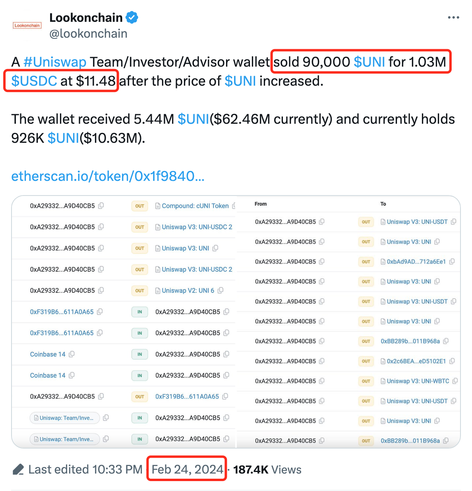
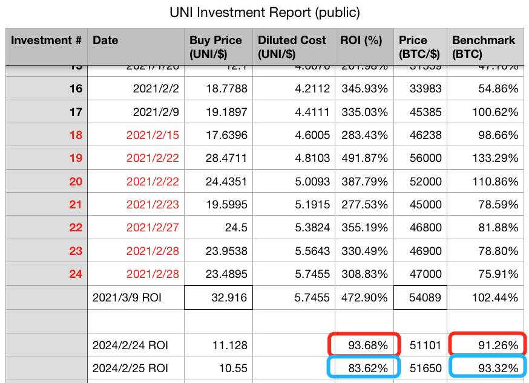
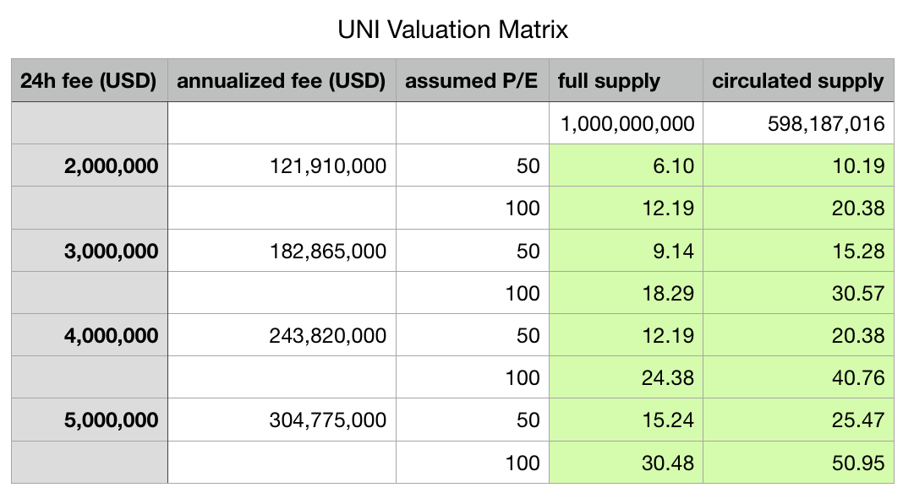

# Uniswap团队逢高出货100万刀之后……

号外：教链内参2.24《UNI短时骤升，有人薅了几十万刀》

* * *

24日文章说到，《Uniswap(UNI)骤升超50%》，皆因Uniswap基金会发了一篇帖子，看似是要开启分红赋能，网上一片兴奋。但正如文中指出，“市场短期逻辑根本不是基本面逻辑，而是资金面逻辑”，“有强庄要爆拉，消息不过只是配合而已”。

看量价关系，某平台数据，23号爆拉，日内波幅5.58刀（7刀-12.58刀），成交量1000多万(UNI)，1.08亿刀；而24号多空高位激烈互搏，日内波幅收窄到2.35刀（10.5刀-12.85刀），成交量却放大到1400多万(UNI)，1.66亿刀，放大了近50%；及至今天25号，截至发文时，波幅进一步收窄到1刀（10.6刀-11.6刀），成交量也大幅萎缩到500多万(UNI)，5500多万刀，显示出多空双方皆已战至力竭，暂时鸣金收兵。

就在24号多空激烈交战的时候，链上监控显示，Uniswap团队/投资人/顾问的持仓地址，从Compound提取了此前存入的9万枚UNI，并立即通过Uniswap V3如数逢高出货，变卖成了USDC，落袋大约100万美刀，平均成交价格11.48刀。

这点儿钱，并不算多。只是这吃相，不太雅观。虽说逢高减仓，天经地义，但是对于团队和投资人这样的大户，重量级的利益相关方，公告减持，让散户先跑，是合规证券市场上比较通行的政策办法。

对于笔者首批建仓的UNI仓位而言（参见2021.3.9文章《Uniswap(UNI)实盘回顾：站上30刀，跻身市值前10，大幅跑赢比特币》），目前这个价格恰巧处于一个比较有趣或者说比较尴尬的水平上。

如上图所示，如果以2021年3月9号收盘价计算，该批UNI仓位以ROI 472.9%对102.44%大幅跑赢BTC。而如果以2024年2月24号收盘价计算，则基本持平，略胜一毫。但今天25号继续回落，则又略输一筹。

这也是躬身入局，用真金白银验证那个道理，《为什么你的投资跑不赢比特币》（刘教链2020.12.31文章）所说的道理，穿越牛熊，跑赢比特币太难太难。

太多太多，执著于追求对BTC的alpha（超额收益），结果往往最后落得个负alpha的结局。

花钱买个明白，这就叫做交学费。

花钱还没买到明白，那就叫做学费白交了。

不过好在，Uniswap的基本面，是实打实可以计算的DeFi协议。按照刘教链2020.11.7文章《Uniswap(UNI)的估值分析和定投计划》中所用的略粗糙的估值模型，以1/6为可提取费用比例（分红赋能比例），测算UNI估值矩阵如下：

上表中，有三个维度：第一个维度是UNI供应量参数，分别取10亿作为全流通量（full supply），以及CMC数据59.8亿作为实际流通量（circulated supply）；第二个维度是协议捕获费用参数，取24h数据然后求年化（annualized fee），此处最小值200万刀是近日info.uniswap.org报告的链上实际数据，而300万、400万、500万则是假设牛市会带来更高交易量而拉高平均费用收入；第三个维度则是假设的P/E估值倍数，这里简单放了50倍和100倍两个数值。

当然，笔者的算法是非常干而粗糙的。若有朋友认为牛市一来，市场集体上头，会跑出什么“市梦率”之类的，那都属于超出理性范畴的事情，各有各的想象空间了。就像当年笔者在2020年11月7号文章《Uniswap(UNI)的估值分析和定投计划》中所记录的，测算“UNI的估值区间在1.47美元到2.16美元之间”，从而支撑彼时2刀以下开始建仓的决策，彼时又怎能料到，2021年的牛市来得那么快、那么急，而测算的估值区间1.47-2.16很快就被甩的不见了踪影，短短半年之后竟冲到了最高接近45刀的高位，达测算区间的20-30倍。

当反身性效应发生作用的时候，谁都无法预料非理性的市场会走向何方。理性计算大概能够给予我们一丝安慰的是，市场的价值底部大概会在哪里。比如，在上述估值矩阵中，6-10刀大概就是最差水准。再低，也许大概就是格雷厄姆的烟蒂了吧？
