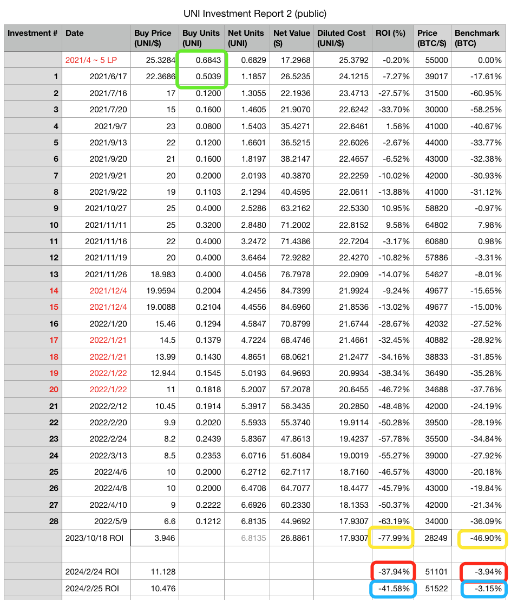
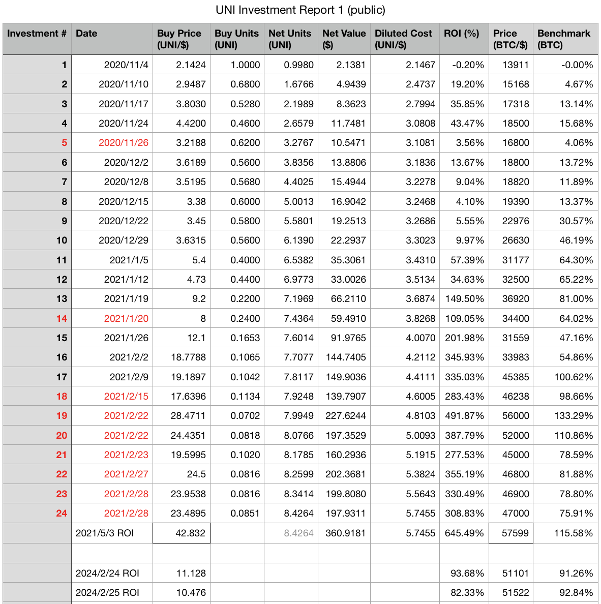

# Uniswap(UNI)二期实盘复盘：真金白银的经验教训

号外：教链内参2.26：《研究称市场现货买方强劲，或存在上行预期》

* * *

日前，Uniswap(UNI)的热度再起，教链也接连发文，与各位读者一起回顾了3年前教链所写所投，所思所感。其中尚欠缺一门功课，就是在一期建仓之后，又在2021-2022年进行了二期加仓。迫于精力有限，一直未有整理数据，复盘、回顾。所喜当年的一手记录都完好留存，于是花费了一些时间，把数据进行了整理。再整理时，当年那一个个鲜活数字，跃然纸上，仿佛依然可以清晰感到数字背后市场怦然有力的律动。

上表就是整理后的二期加仓实盘数据（作了归一化重整）。

相比于一期建仓的谨慎规划，严格遵守纪律，保持良好节奏，二期的加仓显得有些缺乏计划性，随意、散漫，节奏时快时慢，资金分配很不均匀，而这种计划性的丧失，加之又是在“逆风局”的情况下，也就收获了相对惨痛的教训。

可以说，一期的“顺风局”赢了多少，二期心态飘了之后，就在“逆风局”里又丢掉了多少。

兵法云，哀兵必胜，骄兵必败。诚不我欺也。

作为对照，上表是一期建仓的实盘数据（同样作了归一化重整）。

在2021年2月28号加完最后一次仓之后，一期建仓结束。加仓成本范围在2.1424刀至23.4895刀之间，综合平均持仓成本5.7455刀。仓位规模8.4264个单位。

在2021年3月至6月初，没有急于启动二期。事实上，最初2020年底计划的时候，并没有规划有第二期。可以参阅一下刘教链2020.11.7文章《Uniswap(UNI)的估值分析和定投计划》）

二期的到来，实属兴之所至、随性而为。

经历过2021年“519”中场暴力回调的朋友们应该还有印象，就在5月3号UNI刚刚摸到最高接近45刀高位之后，短短20天后的5月23号，就连滚带爬跌破了13刀，跌幅超70%！

大力度的折扣令逢跌加仓八字诀的我不禁感到怦然心动，于是就琢磨着开始二期加仓。心想事成，6月中旬就开始了二期第一次操作。

但是这一次，是无计划、无纪律的。

牛市令手中资金充沛，加之当时在MakerDAO加杠杆，借出了许多“粮草”，于是加仓出手特别重，从上面的实盘数据可以看到，6月17号的二期第一次出手，一次就上了5倍的量！而此时的价格，已经是一期第一次建仓时的10倍。两项相乘，这一次开销，就是一期开局的50倍！

可见，当牛市热辣滚烫时，手里的热钱一时多了起来，千万不要觉得烫手，一着急，大手大脚地不把钱当钱，四处散财；反而应当更加谨小慎微，细水长流，慢慢地花，一直花到熊市，穿越熊市。到了熊市，反而应当更加大胆地放开手脚。

另外一个思想错误就是，认为牛市比特币已经涨得很高了，止投之后，又觉得手里的可投资资金烫手，于是就去投山寨币。这其实也是牛市由比特币发动，并外溢到其他山寨币的原因。但是，铁一般的事实告诉我们，烫手的资金，最好是拿住了不花或者慢花，次之是投入比特币，最差是觉得比特币已高，去投山寨博机会。最后下来，你总会发现，在“逆风局”里，比特币是最抗打击的。

转熊之后，比特币可能会跌70%、80%，而山寨则会在跌70-80%的基础上，再跌去70-80%。

这还说的是蓝筹山寨、龙头山寨、最优质的山寨。而更次一等的山寨，更更次一等的山寨，则会跌去N个70-80%。

以UNI为例。45刀跌去70%到了13刀。13刀再跌去70%就是3.9刀。2023年10月18号，UNI最低下探到了3.946刀。这数字竟如此惊人巧合。

从二期复盘表格中可以直观地看到，当2023年10月10号UNI探底的时候，二期仓位回撤高达77.99%；大幅跑输比特币的回撤幅度46.9%。

待到前几天2月24号、25号UNI骤升至11刀左右时，二期仓位仍然浮亏40%左右，而对照仓位（同期建仓比特币）则仅有不到4%的浮亏，已接近回到水上。

更为讽刺的是，二期仓位的最大回撤77.99%，比70%还要大了近8%，这是因为分批加仓，成本被2021年下半年市场再起伏进一步拉高导致。

牛市对于八字诀爱好者而言，最大的效果就是快速推高了持仓成本。这是牛市的极大危害，一定要牢记。

二期没有计划、没有节奏还不是最严重的失误。最严重的失误出在了资金管理方面，而这个问题，是在表格上看不到的，背后的东西。

教链曾早在2022年左右就总结过这个错误。具体地，就是无论哪一期，无论以什么方式操作，都必须恪守一条红线，即仓位管理的红线：保持UNI仓位与BTC仓位市值比例不超过1:10。但是，当二者双双下跌，并且UNI跌入水下，即浮亏时，就不应继续使用市价乘以持仓来计算比例，而应以成本来计算比例。这样才能符合仓位管理的最初目标，即以主力仓位BTC的潜在收益，来覆盖甚至抹除试验仓位的潜在亏损甚至归零。否则的话，将会陷入不计成本地黑洞投入，最终造成过大损失，令主力仓位也无力覆盖，那就彻底毁掉了仓位管理最初的目标和意义。

好在，笔者及时醒悟，发现了这个错误，并及时中止了跨越红线的操作。

当前，笔者UNI仓位控制水平与BTC仓位的比例大概在5.5%左右，已经回到红线以内。

不过，在2021年初UNI狂飙猛进致令仓位比例相对BTC大幅超过10%控制线，并一度高达20%多的时候，虽考虑和研究过再平衡策略但终因准备不足而未能实施，也就错失了当年削峰填谷的机会。

跌落一个70%需要涨2.33倍才能修复，跌落两个70%需要涨10倍才能修复。回顾和复盘不是为了追忆似水年华，而是为了吃一堑长一智，在未来的机会面前，能够更加从容地把握。市场永远都不缺机会，缺的是机会来临时出手把握机会的游刃有余，云淡风轻。
