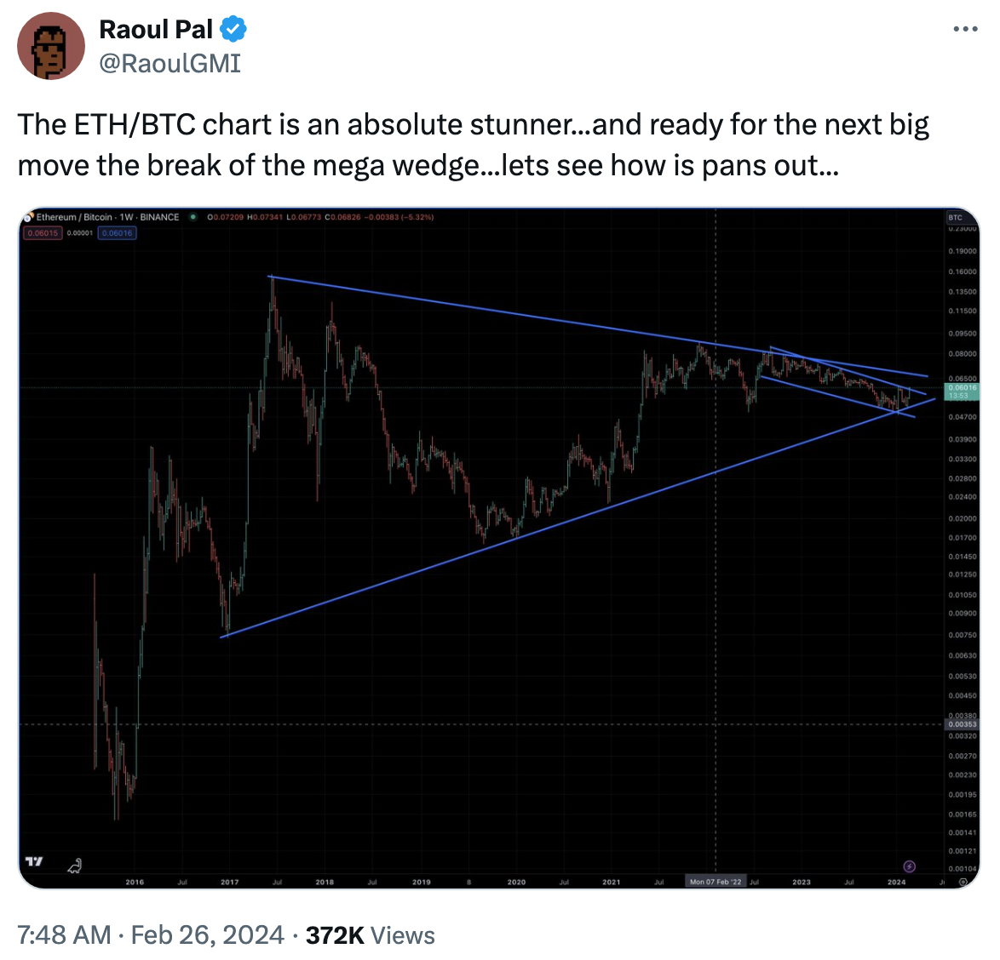
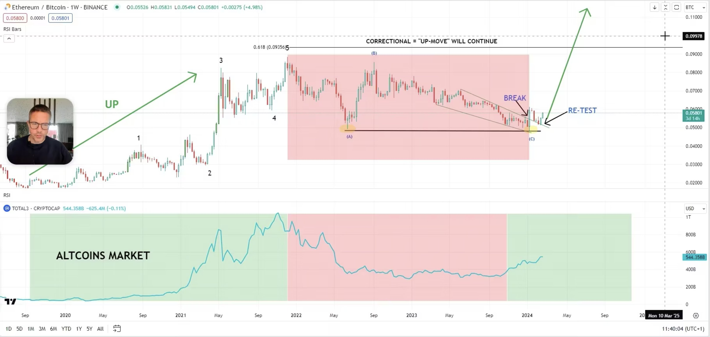

# 多位加密人士看涨ETH/BTC，或将促动山寨季的爆发

号外：教链内参2.27《大饼急攻56k，微策略再次加仓3000枚》

* * *

日前，随着BTC的急涨，带动整个加密市场向上。Raoul Pal，前GLG宏观对冲基金管理人、前高盛对冲基金销售业务管理人，近日发推称，ETH/BTC汇率即将大规模突破自2017年以来所形成的楔形结构。

「ETH/BTC的图表绝对令人惊叹......并准备好迎接下一个大动作——打破巨大楔形......让我们拭目以待......」

在他贴出的图中，他通过辅助线暗示，ETH/BTC汇率已经突破了下降通道，即将逆转为上行趋势，而这可能会导致对长达数年的下降楔形的突破。

自2017年牛市周期由于ICO热潮而引发ETH暴涨以来，ETH显然是透支了其未来数年的价值增长，以至于在此后6、7年时间里，其增长率始终未能超过BTC。

Glassnode联合创始人Jan Happel和Yann Allemann在二人共同运营的推特账号Negentropic上同样发表了对ETH/BTC汇率的看涨观点。

「“推动山寨季的汇率”

「ETH/BTC汇率是加密市场的测量标准。更高的汇率，山寨币的风险偏好就会更强！

「当ETH/BTC反弹时，山寨币也会反弹。

「经过 2021 年底以来的长期盘整，我们刚刚突破了更高的价位。

「山寨币即将爆发

「一切都指向（艾略特波浪理论的）顶部爆破（Blow-Off Top）模式」

对冲基金Morgan Creek Capital的首席执行官兼创始人Mark Yusko认为，以太坊（ETH）可能会升值到五位数的价格。

2024年2月24日，据DailyHODL报道，Yusko在接受《Altcoin Daily》的最新采访时表示，根据ETH/BTC汇率，在比特币最终触及15万美元大关的情况下，ETH可能会从目前的水平上涨到1万至1.5万美元。

「我可能没有理由违背存在已久的比特币和以太坊之间的比率。它曾经几乎完全是 10 比 1。因此，如果比特币是 20,000 美元，那么以太坊就是 2,000 美元......

「假设比特币涨到15万美元——我觉得会的——比特币和以太坊的比价不会一直回到 10 比 1，而是会达到......比方说 15:1。那么，以太坊的价格就是 10,000 美元。

「我认为有很多人的大脑中都有这个数字。很多人会说：这还不够。

「让我们假设它一路回到 10 比 1。那么以太坊的价格就是 15000 美元。所以，比较舒适的数字介于 10,000 美元和 15,000 美元之间。」

一年多前，刘教链在2022年12月向星球会员分享了内部参考资料《刘教链2022年年终复盘展望报告》（已于2023年11月解密，点击查看），其中指出，当时比特币所处的16k-17k的价格，大致相当于2015年底的底部，或者2020年“312”熔断崩盘的底部，并推算了下一轮牛市可能的BTC高度及加密市场总规模（具体请点击解密报告自行查阅）。在此基础上，对以太坊的发展进行了如下展望：

「如果在下一轮牛市周期中，以太坊依然能够占据整个crypto总市值的20%左右份额的话，那么以太坊的市值将从今天的1600亿美元左右，放大到2.4-4万亿美元，即放大15-25倍。粗略按照以太坊的流通量1.22亿枚推算（假设增发与燃烧大致相当），每枚以太坊的价格将有望达到2-3万美元。」（或者说，1.5万-3万美元）

