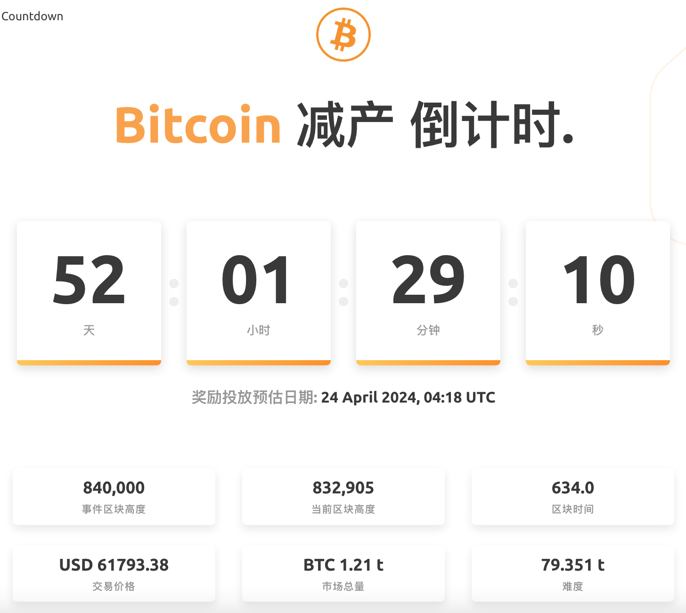
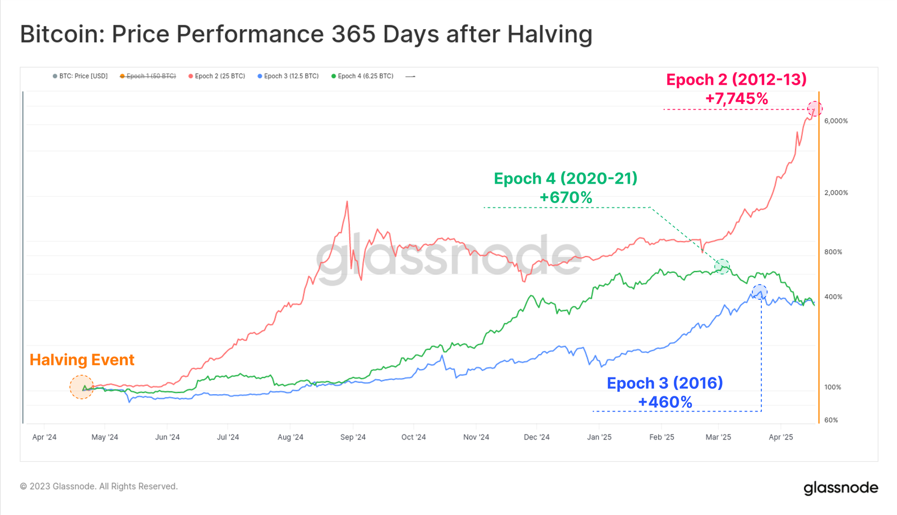
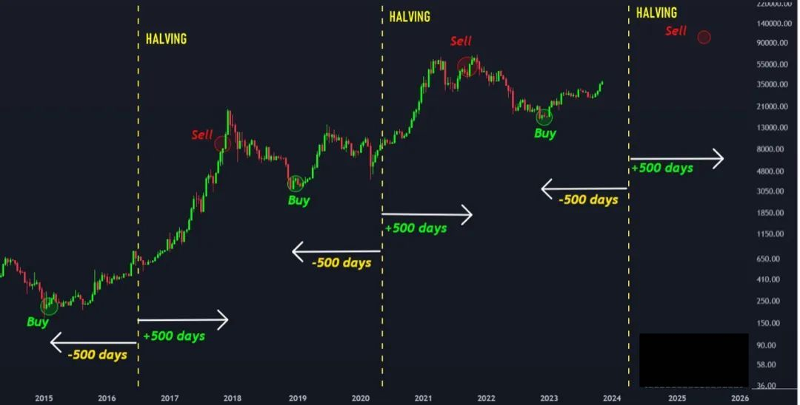
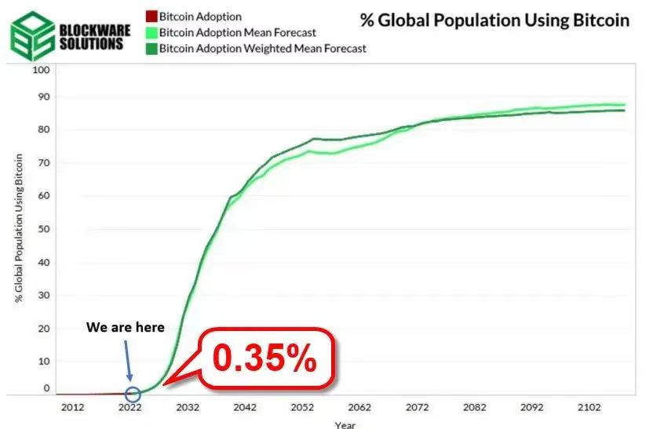

# 比特币减产倒计时！

号外：教链内参3.2《惊奇！黄金与山寨齐飞！有何玄机？》

* * *

嘀嗒，嘀嗒，比特币第四次产量减半的脚步声近了！

减半（halving）是比特币最成功的模因（Meme）之一。它的简洁令人惊叹，它的美学令人入迷，它的坦诚令人轻视，它的威力令人惊讶。

在教链2020年6月9日发表的6000字科普文《硬核：一文读懂比特币》中，是这样介绍“减半”的：

「奖励的比特币数量是如何规定的呢？这和账本的编号有关。账本是从前往后、自下而上一本本堆叠起来的，于是中本聪就在代码里和所有人提前约定好了，第1个账本，奖励50个比特币，第2个账本，还是50个比特币，......，第21万个账本，50个比特币，第21万+1个账本，减半为25个比特币，......

「像这样每21万个账本(大约4年时间)奖励数量就会减半，经过大约32次减半(131年)，到2140年左右，每个区块奖励就会减少到不足一亿分之一个比特币，也就是不到1聪(网友以中本聪的名字命名的比特币单位，1聪等于一亿分之一比特币)。此时可以认为没有更多比特币可以挖了，比特币也就挖出了几乎全部储量，大约2100万枚。」

这两段话本质上是用文字描述了下面这个无比简单而优雅的数学公式：

Sum(0.5^n) x 50 x 210000 = 2100 万

与此同时：

210000 x 10 / 60 / 24 / 365 = 4 年

这就是比特币的“算法央行”的“货币政策”。简单至极，优雅至极，公开至极，透明至极。

比特币系统最核心的“不变量”之一。

减半千古事，得失寸心知。

2020年5月14日，教链决定就减半这件重要无比的“千古事”与比特币发明人中本聪来一场跨越时空的对话，于是有了《【对话中本聪】系列之比特币减半》。

在对话中，中本聪解释道：“这样的设计，使得我们得以逃离中央控制货币的任意通胀风险，因为比特币的总流通量被限定在2100万枚。”

刘教链2018年独家研制、2019年初推出的《【30节音频精品课】刘教链比特币原理》，第7章「减半发行有上限，交易费用付工资」为之独辟一章，娓娓道来。

市场似乎从来都不曾将减半一事充分定价（price in）。

于是我们看了个清楚：第一次减半后，一年内BTC最高增长了7745%；第二次减半，一年内BTC最高增长了460%；第三次减半，一年内BTC最高增长了670%。

要更多视角回顾过往三次减半效应，不妨先温习一下刘教链2023.11.19文章《比特币的周期》。文中介绍了各种视角的多幅图表，围绕比特币产量减半和价格周期有关的，有兴趣的读者可以自行翻阅，细细品读。

也有人经过品味似乎发现了某种“财富密码”，即2023.11.20教链内参《奇妙的减半日前后1000天》所介绍的。

正如教链在2021年11月12日文章《比特币产量减半和价格自我实现》中所写的：「减半推动了牛市，而不是相反。这几乎是肯定的。减半是比特币的内生机制，其发生是预先确定的，是锚定在比特币的内生时间，也就是区块高度上的。它完全不考虑外界的感受，只是机械地到了规定的时间就自动发生。所以，减半是内因。而外因，则可遇而不可求。」（请注意：原文中介绍的关于减半后熊底不破前高的历史经验已经被2022年底跌破2万刀而证伪）

常常听到有人说，BTC的涨幅是一个周期不如一个周期。至少就减半后涨幅来看，似乎并不是事实。

况且这一次减半，是一次不同以往的减半。「因为2024年必然发生的这一次产量减半，会导致比特币的资产“硬度”（S2F）从不及黄金（约62）的57-59直接暴增至接近120，不仅全面碾压黄金，而且将成为我们这颗蓝色星球——地球——诞生46亿年以来史无前例的、硬度最高的、几乎不会随时间腐坏的资产！」（参考阅读刘教链2023.2.17文章《2024奇点将至：人类尚未准备好迎接S2F大于100的巨硬资产》；更多了解S2F，请参考阅读刘教链2023.2.19文章《小科普：什么是S2F（Stock-to-Flow）》）

于是就有了《2024减半之辩：涨幅消退或者超级周期？》（刘教链2023.12.5文章）如果我们目前正站在创新-S曲线的左端山脚下的话，那么巨大的、高耸的悬崖矗立在我们面前，却被莫测的未来大幕遮挡而视之不见。

