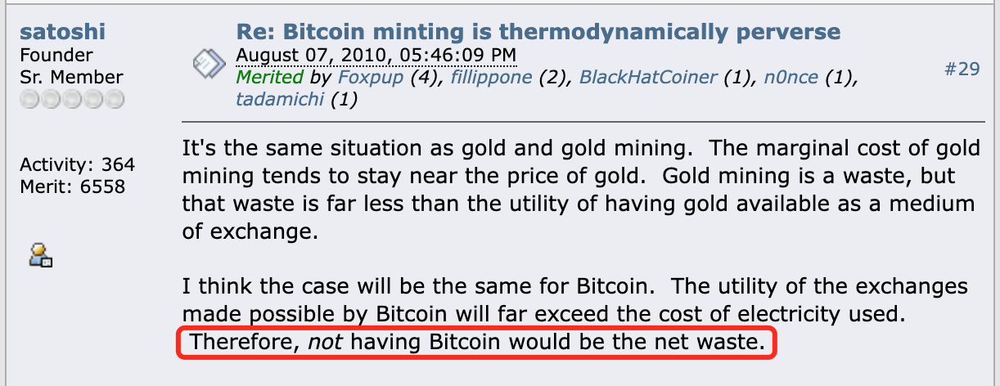

# 比特币终局：或将等于人类全部剩余的价值总和！

号外：教链内参3.3《美联储3月议息会议后，将召开教链星球私董会》

* * *

草长莺飞二月天，拂堤杨柳醉春烟。

还有不到一周，便是农历二月天。这加密市场，也真的是一片草长莺飞，春意盎然。

不久前，比特币怒发冲冠，急破6万刀重要关口。2月29日教链文章赞曰《比特币始本无名，待其有名天下惊》。

破关口就是破圈，便会引发圈外媒体的传播，增量关注和资金便开始被大量吸引。

趁比特币稍事喘息，山寨便开始争奇斗艳，竞相驰骋。《突然：山寨若狂蜂！》教链3月2日写道。加密牛市味道顿出。

但比特币似乎并不愿意给山寨太多出风头的机会，于是今日再次向上发动，破65k，续创新高，继续领涨！

恰如2.29教链内参《急冲前高已近应验，敢问前路又在何方？》末尾所讨论的：「如果从呼吸理论的角度看，现在还刚刚接近浮出水面（尚未），气息已经快要把2021牛市吸的气全部呼尽，如果不在中轨上方吸入更多气，直接崩盘扎个猛子下来，没有气在水下呼出，怎么办？似乎就不太合理。」

有星球会员问道：比特币的终局是不是（超越）黄金？也就是，10万亿美刀规模的体量。

教链答：超越黄金未必终点。

恰恰相反，超越黄金，也许只是好戏开场。

1月6日教链文章《如果BTC达到100万刀》和2023年10月21教链文章《三分天下，300w美刀的BTC》中都介绍过，最早接触中本聪、参与BTC的密码学家Hal Finney曾早在2009年就曾估计，BTC最终或将达到1000万美刀。

细看下去，Hal Finney的对标，是全世界的房地产规模。

但是教链觉得，无论是对标黄金，还是对标房地产，也许都远不足以描述BTC的全部潜力。限制我们思维的，是我们只能用已知事物去想象充满巨大未知的未来！

教链认为，比特币的终局，或将等于人类全部剩余的价值总和！

未来，今日一切具有价值储存属性的东西，包括不限于法币、房子、股票、黄金等等一切，都将经历“去价值存储化”（de-SoV-ization —— 教链合成的新词儿），回归它们各自的使用价值，而不再为人类承担价值存储的功能。价值存储功能，将统统归于BTC，由其承载。

在人类还是“地球人”，未能脱离地球，移民火星或者其他星系之前，比特币的使命不会结束。

在智人（Homo sapiens）从地球物种进化为星级物种之后，又该如何克服光速有限、比特币数据同步延时等问题，暂时无法预料。

前日问小朋友们是否知道，作为智人，是身上的哪个器官，把我们和其他所有动物区分开来，成为地球上最顶级的掠食者的吗？

小朋友们先对答说：是大脑。

我举起手摆了摆，说：不对。再想想？

小朋友们略显迟疑，试探性地反问：是手吗？

我笑了笑：对。正是我们的双手。

当猿人进化出了对生拇指的双手，就拥有了地表上具有最强攻击力的暴力器官。

在直立人站立起来之后，古猿人最后的天敌 —— 恐猫 —— 永远灭绝。一切原本的地表掠食动物，都在人类超强投掷力的绝对实力面前甘拜下风。人类婴儿的啼哭声，成为地球上所有中大型陆生动物刻在基因里的深深恐惧。

为了配合双手的灵活使用，人类的大脑飞速进化。智人诞生了。

人类双手的灵巧劳动，并不是创造或毁灭宇宙中本已有之的物质元素，而只是把各种原子排列组合，重塑形态。

距今200-300万年前，是人类社会的石器时代。石头的主要成分是二氧化硅。人类用灵巧的双手，把二氧化硅重塑成各种于自己有用的形态，譬如石刀、石斧。

人类文明进入硅基时代。

相比于其他动物，把硅（Si）玩的最好的“人”胜出了。

3000-5000年前，人类学会了制造铁器。但是，文明进入钢铁时代，得一直到18世纪工业革命。钢铁洪流，在战场上，在马路上。钢铁产量，成为工业国家强大与否的重要指标。

虽然硅（房子的主要材料）依然重要，但是铁（Fe），才是决定国力的根本。

人类把铁原子捏成导弹、捏成航母、捏成汽车、捏成工业机器人……

人类文明进入铁基时代。

把铁玩的最好的国家胜出了。

几十年-几年前，计算机、互联网，手机、AI（算力芯片）、矿机（算力芯片），信息技术洪流滚滚，正在重塑着人类文明的形态。芯片的主要元素，正是硅（Si）。

人类把目光重新聚焦到硅原子上，把它从沙子里提炼出来，在上面用激光雕刻各种电路，变成计算芯片。

把硅玩的最好的公司，股价已经涨上天了。比如，英伟达。

人类文明，螺旋式上升，此话不虚：从硅基文明时代，到铁基文明时代，如今，正在再度开启硅基时代。

硅是非金属，还不懂金属的远古人类能找到的最好的货币就是一些非金属货币，比如贝壳什么的。

铁是金属，于是懂得金属的近代人类，逐渐发现同为金属的黄金，是铁基文明时代更好的货币。

当人类重新认识硅，了解到硅是半导体之后，基于超纯硅的芯片，赋予信息以数字形态——比特（bit），于是最终在2008-2009年诞生了比特币。

黄金相较于贝壳，是具有文明代差的货币物。比特币相较于黄金，也是具有文明代差的货币物。

硅原子还是那个硅原子，芯片却不再是石头砖块。

信仰房子的人，和信仰BTC的人，思想上就属于完全不同的文明时代。不能对话，实属正常！

所有的文明时代，都是人类用双手劳动创造。

劳动改造了人。

而这一切，都是因为人进化出了不同于任何动物的手，灵巧的、适宜劳动的手。

当这双手的辛勤劳动所获取的物质资料，刚好满足人的自身需要时，没有任何剩余。但是，天有不测风云，自然界的本底波动性就会要了人的命。

于是人们更加努力，尽可能地辛勤劳动，生产出超出现时所需的东西，以备不时之需。

未雨绸缪，是人类的本能。大多数动物都是这顿吃饱，下顿再找。只有人类会在吃着这顿的时候思考，未来吃什么。

生产力进步，也就成为人类永恒的追求。

我们生产，总是超出我们的消费。当使用货币这个统一度量衡来衡量这个超额生产，便体现为赚的钱超过花的钱，收入超过支出。企业也是一样。

人们甚至发明了一个成语，“量入为出”，并视之为一种美德。

企业家要追求利润，炒币者要低吸高抛，本质上都是同样的人类本能的外化表现。

当赚的钱超过花的钱，当收入超过支出，于是便形成了储蓄。

但是，凯恩斯却提出了惊人的观点：储蓄是个体的美德，却是整体的危机。

试想，如果每个人都是生产大于消费，那么所有人加起来，就必然会有总生产大于总消费。这些总超额生产卖不出去，就造成了产能过剩，进而引发了资本主义经济危机。

凯恩斯在他的《通论》（全称《就业、利息与货币通论》）里面说，储蓄这件事，与其说是这个人要把今天的消费推迟到未来，不如说这个人就是决定了今天不消费。

今天如果我少吃一碗面，明天再吃，明天我吃的面绝不是今天的这一碗。今天的这碗面，要么被另一个人吃掉，要么就过剩了。

而卖面的老板，却必然会希望能够尽可能卖出去最多的面。因为，劳动力是最不保鲜的资源，今天闲着不使用，是决然无法推迟到明天去使用的。光阴不再来，只争朝夕。

推理到极限情况，所有人都决定今天少吃一碗面，把钱存下来，面就绝对过剩，而拉面人今天的劳动力就只能白白浪费了。

储蓄金钱，即所谓的存储价值，绝不等同于储蓄物资。储蓄金钱，并没有什么物质被保存下来留待未来之用。

储蓄金钱，就意味着减少消费。减少消费，就导致了两个后果：要么，生产者不顾一切亏本生产，于是生产过剩；要么，生产者量入为出，减少生产，于是经济衰退。

因此，凯恩斯提出的解决方法，就是从消灭储蓄这件事入手 —— 虽然这乍看起来非常反直觉！

很显然，数学是无情的。如果想配平生产和消费，使之相等，就必然会需要有一部分人或者企业、机构的消费大于生产，也就是说，不仅不会有储蓄，还需要借贷消费！

也就是说，原公式：生产 - 消费 = 剩余 > 0

现在通过货币手段促进借贷消费，使得公式变成：生产 - (消费 + 负债消费) = 0

剩下的问题只是，让谁来背负这沉甸甸的债务？是赤字开支的政府，还是贷款买房的居民？

但是凯恩斯的解法却从经济基础的底层消解了人类诚实和节俭的美德，并让金融的镰刀收割了全社会的剩余，激发出了货币超发、消费主义、信贷泡沫周期以及贫富差距急剧增大等等问题。

这个问题也许还有另外一种解法！

在这个解法诞生之前，人们思考的解决方案都是在“重新分配剩余”这个思路上打转。主流的思想其实就两种：一种是按照权力来重新分配剩余；另一种就是凯恩斯的按照负债能力来重新分配剩余，把剩余给消费掉。

如果有这样一种生产，从消费的角度看，它完全不生产任何东西，只是纯粹消耗生产所需的物资和能量，而它的消耗量可以自动动态调整，使之总是恰好“浪费”掉剩余产能，那么，生产和消费就能重新归于平衡。

其实信息产业、内容产业、AIGC产业也是一种“浪费”掉过剩物质产能的办法，只可惜，由于人一天只有24个小时，人类对于内容的消费力也是有天花板的！信息爆炸、信息过载之后，现在又出现了生产力更强的AI，内容产业自身也陷入产能过剩困境了。比如，大量up主撤退，大量尾部创作者难以赚到什么钱，都是过剩的表现。

上面所说的这种特别的生产，我们姑且暂时称之为“POW”。

于是原来的公式：生产 - 消费 = 剩余 > 0

就会变成：(生产 - POW) - 消费 = 0

不平衡的公式被配平了！

可见，在最终的平衡公式中，“POW”的“产能”就恰好与原公式的“剩余”完全相等。

19世纪欧洲工人运动也是一种尝试，通过对生产的消灭，来迫使生产消费平衡。但是，与我们提到的这个“POW”非常不同的是，欧洲工人运动捣毁机器，是一种破坏（从这个意义上讲，战争何尝不是一种终极的再平衡——毁灭性的再平衡？）；而“POW”，不仅不是一种破坏，而且是一种生产！

对生产资料的破坏显然是一种浪费（waste）。从宇宙的视角来看，不做任何价值判断的情况下，消费和浪费实在是没有什么区别，都是价值的耗散，熵的增加。

而人类所谓的生产活动，对宇宙而言同样是消耗能量、造成熵增，只不过，与消费或浪费不同的是，生产活动会在局部造成熵减 —— 即对原子、比特等劳动对象进行了有序化的组织。

开采黄金，其实也是一种净耗能极高的生产活动。但是，与开采黄金不同的是，开采黄金是扩大产能就会开采出更多黄金产量，而这个“POW”的产量却不会随着产能的增加而增加，甚至在任何一个时间窗口之内，无论人们向其投入的产能是高还是低，都不能增加或减少其产量！

当其产量达到一个上限值之后，它仍会继续不停地消耗产能，而不能生产出任何产量，从而真正成为一种净消耗型的生产。

这个净消耗产能的特别的生产“POW”，其产物有一个大家耳熟能详的名字——BTC（比特币）。

“POW”消耗了能量，却不产出任何可供消费之用的实用之物，只是用一个价值符号BTC来标记这项生产活动的成果，而BTC不是随着产能扩张而增加，却是具有上限的有限数量，并调节生产难度来消耗掉任意大的产能，其有限数量可以确保永远不会满足人类的欲求，永远不会出现任何过剩问题。

在比特币诞生的十几年来，数不胜数的经济学家，甚至诺贝尔经济学奖得主，反复批评比特币没有任何实用价值，是一种纯粹的浪费。

他们彻彻底底地错了！他们身为经济学研究者，却早已把经济学祖师爷们夜不能寐、孜孜以求所要解决的经济学根本问题给忘到了九霄云外。

比特币，恰恰就是在凯恩斯之后的时代，最有可能成为彻底解决掉这个困扰人类文明几百年的经济学根本问题的答案！

而这种解决方案，不需要任何人或者政府部门背负沉重的债务负担，不需要破坏和毁灭人类辛苦积累的生产资料和财富，因此也就不需要破产，不需要暴力革命，不需要流血战争，就能净消耗掉过剩产能，让人类内在不平衡的经济系统自动保持平衡。

当人类最终认识到BTC生产的这一重大意义之后，我们就能从上面的最终平衡公式：(生产 - POW) - 消费 = 0 变形得到：

BTC存储价值量 = POW净消耗 = 生产 - 消费 = 剩余

这变形后的公式就是比特币终局明确、清晰的表述：BTC的总价值量将等于人类全部剩余的价值总和！

BTC的生产并非一种浪费，恰恰相反，同样是乍一看起来违反直觉的，没有BTC的生产才会产生更大的浪费。恰如比特币的发明者中本聪在2010年8月7日所指出的：“没有比特币就会是一种净浪费。”（not having Bitcoin would be the net waste.）

