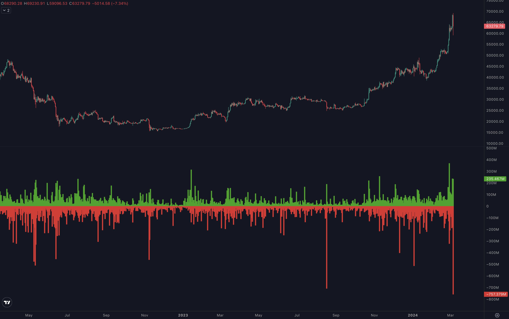
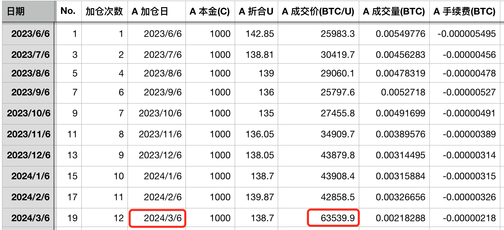
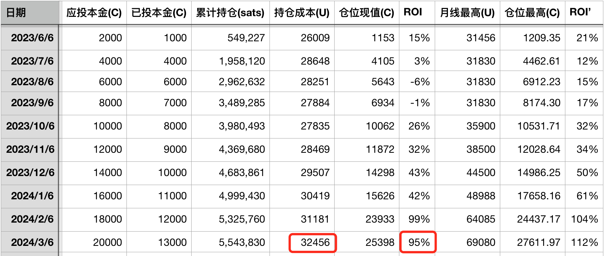

# 万刀斩：BTC拉至前高，暴跌一万刀 —— 十年之约＃19 (ROI 95%)

号外：教链内参2.29《急冲前高已近应验，敢问前路又在何方？》

* * *

昨夜西风忽怒号，风吹花落草折腰。

隔夜BTC一路拉升至前高6.9万美刀，这是2021年11月初所创下的历史高度，爆掉了埋伏在上方的空头杠杆。然后转头向下，急杀一个回马枪。从23时至凌晨3时，短短5个小时，就反向冲刺1万刀，从69k一路势如破竹跌破6万刀关口，精准地在59k急刹回拉，爆掉了绝大多数未及反应过来的多头杠杆。

数据显示，近10亿美刀被清算，一发入魂。爆仓清算规模创下了自2021年11月前高以来的最高水平！其中，清算掉多头仓位7.57亿刀，清算掉空头仓位2.35亿刀。

杠杆是BTC身上的虱子。它必然会不时抖动身体，清理一下身上的寄生虫 —— 就和很多长毛动物都会做的那样。

加杠杆，那是非常棒的通往破产之路。还想学习更多破产小妙招？请移步温习刘教链2019.6.15文章《币圈破产指南》。

都是空仓惹的祸。因为空仓，错过上涨。因为错过，所以后悔。因为后悔，所以着急弥补。因为着急弥补，所以加上杠杆。因为加上杠杆，所以被爆仓清算。因为被爆仓清算，所以亏损更多。因为亏损更多，所以更加没钱加仓。因为没钱加仓，所以继续空仓错过后续行情。

这是一个恶性循环。普通韭菜一旦陷入进去，就像人陷入了流沙坑中，越挣扎就陷得越深，不仅难以脱身，反而可能葬身其中。

教链2021.1.13文章《不动如山，方得始终》解剖了这症结：

「太多人醉心于这样或者那样的投机思想，只想一把梭哈，快进快出，快速致胜，而不愿意积跬步、致千里。有很多朋友币市浮沉三四年，炒来炒去，不断换车，最后亏的底裤不剩。越亏损则越心急，越心急则越追求短平快的高收益率。于是最后的结局十有八九就开始涉足合约市场。因为高倍杠杆的裸合约是他们最后的希望，三个月把过去三年翻盘的希望。

「市场的天理就是要消灭这种不切实际的希望。比特币的万刀斩，万刀斩之后快速反弹拉升，就是要多空双爆，而且要来回爆、反复爆。要么爆到你幡然醒悟、回头是岸，要么爆到你颗粒不剩、恨恨离场。然后比特币才会继续一路高歌，向上挺进。」

教链的心法是《不动如山八字诀》（2023.3.25）：

「一、相信长期主义

「二、反脆弱的标的

「三、恒心和毅力

「四、不all-in

「五、专注

「六、不做波段

「七、和对的人一起走」

今天是《八字诀 · 十年之约》第19次记录、第12次加仓。感谢昨夜狂风，更吹落，星如雨。市价单63539.9加仓。按usd/cnh 7.21算，加仓后持仓成本升至32456，浮盈95%。若按当下正溢价较高的usdt 7.45算，则持仓浮盈为102%。

总有人迷恋于寻找所谓的“财富密码”。可是回归常识，不难想明白，一年百倍的财富密码，只需两个，两年，1万元乘两次100倍就等于1个亿的小目标了。这样的财富密码如果真的具有可复制性，花点儿钱就能买到，买到就能管用，仅靠几个学员群就能凭空炒出一个国家的GDP出来，这可能吗？

这世上本就没有什么捷径可走。走捷径的，大多也都从悬崖上摔了下来，早已粉身碎骨了。

只有我们这些走大道的，还在迈着轻快的脚步，唱着欢快的歌声，迎着红彤彤的太阳，坚定地前行。

要走就走大道，大道上阳光好，
满仓大饼信心高，拂晓莫道君行早。

要走就走大道，大道上心情好，
烫手的山寨快点跑，重仓套牢那可不太妙。

要走就走大道，大道上风景好，
千秋一币万年一笑，人类的自由迎来了拂晓。

