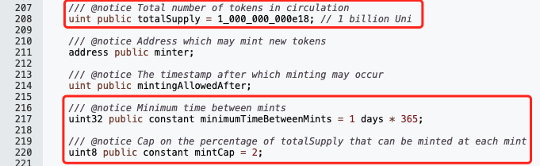
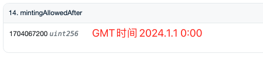
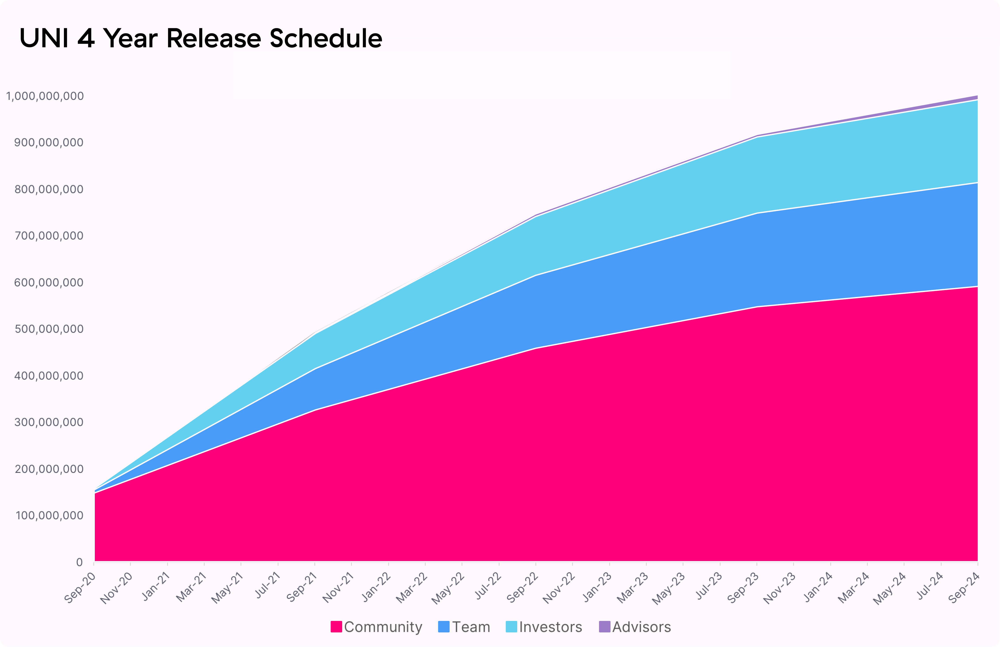

# UNI(Uniswap)投资心得

号外：教链内参3.8《“无风险”跑赢BTC的办法》

* * *

天街小雨润如酥，草色遥看近却无。

随着BTC(比特币) 6号插针放量，试了一把多头的成色。这次测试，多头取得了优异的成绩，基本做到了：空头抛出多少，多头吃进多少。多头展示出子弹无限、誓死捍卫阵地的顽强意志。在3月5日摸高到前高69k之后，5日收盘66.7k，6日收盘66.5k，7日收盘67.2k。看日收盘价的话，多头仍在日拱一卒向上移动阵地。

UNI(Uniswap)经过2月23日单日暴拉50%+、24日放量决战、守住成果，3月6日再次一度猛拉超20%，最高摸到17刀。17刀这个位置，是一个比较微妙的位置。大致相当于BTC的3万刀这个位置。怎么讲呢？

回顾一下教链2023.7.10文章《3万刀，多空双方的巴赫穆特》，便知晓，3万刀这条线，是BTC这一轮牛熊转换的关键阵线：「无论是2021年1月份，牛市启动初期的回踩（第一次支撑），还是2021年年中5月至7月，牛市的中场大回调（第二次支撑），还是2022年1月份，牛市末端的最后一次挣扎（第三次支撑）。」

当BTC穿越牛熊，历经风霜，鲜衣怒马，再破3万刀时，就已经在向着6万9的前高阵地吹响了冲锋的号角。（刘教链2023.4.11《比特币怒破3万刀，跨越牛熊分界线！》）

牛市的关键支撑位，在熊市破位后翻转为关键阻力位；再次复苏时则必先突破之，再度翻转为支撑位，作为背水一战的垫脚石。

就像大河天堑，攻过河彼岸去，河就是我方的支撑；敌攻至河此岸，河就是我方的阻力。

此时此刻，BTC已经上岸，UNI还未过河。

昨日3月8日教链内参《“无风险”跑赢BTC的办法》中，略谈了谈UNI作为跑赢BTC的“杠杆”的问题。其中的UNI估值矩阵，亦可参阅教链2024.2.25文章《Uniswap团队逢高出货100万刀之后……》。

在二次拉高到15-17刀的情况下，11.48刀跑了100万美刀的Uniswap Labs团队，便减少了“内幕交易”的指责可能。

如果它能一鼓作气、再接再厉，渡过河去，那就会奔着下一个阻力位30刀而去。

越向上，套牢盘越轻。从20到30，要比从15到20更容易。突破30阻力区，也会比突破17阻力区更容易。注意阻力区是一个范围，而不是某一个精准的点位。

穿越牛熊还能突破前高，才真正证明一个币，是一个真正值得长线持有的价值币，而不是一波流、割韭菜，每况愈下、永远新低的垃圾币。虽然，目前的市场中，99.9%的都是垃圾币。（注：2022年底底部之后才崛起的新币，就别信什么“突破前高”之类的屁话了，还没有真正穿越牛熊呢，对这种新币而言，讲“前高”就是骗人的鬼话。）

那么UNI，在最差的情况下，它退化为一个模因币（Meme）。任何一个能够流行起来的币种，必定有模因的成分。这一点教链在3.6教链内参《一日熊市结束，UNI日内怒涨20%》中就讲过，「它的“模因”就和SHIB的模因“柴犬”、BTC的模因“电子黄金”一样，UNI的模因就是“CEX杀手”、“DeFi龙头”。」

模因这个词儿，换到互联网web2的黑话就是“故事”（VC要看这个故事性不性感），换到商学院的术语就是“定位”（杰克·特劳特《定位——同质化时代的竞争之道），1969年）。

比如SHIB和Dogecoin，它们的定位都是“柴犬狗”这条细分赛道，它们的“故事”都是特斯拉CEO、世界首富伊隆·马斯克的人气喊单。按照特劳特的理论，一条赛道最多可以容纳两个头部选手并存，比如可口可乐和百事可乐，麦当劳和肯德基，苹果手机和安卓手机，等等。做老三就很痛苦，因为人们的头脑根本就记不住第三名的名号（品牌）。关于SHIB，可以读一下教链2021.5.12文章《SHIB的成功，你学不会》了解当年它崛起的背景。

但是，有一种比特劳特的Top 2更极致的情况，那就是老大有强大的黑洞效应，任何靠近它的竞争者都会被强大的万有引力吸干全部物质和信息。那么这条赛道上，或者说这个“模因”的标签下，就只会有它一个绝对头部，而老二则是流水席，匆匆而来、匆匆而去，人们根本就懒得去记住。典型的例子就是BTC（比特币）。

在电子黄金这个“模因”标签下，在价值存储这条细分赛道上，BTC是永恒的擂主，而攻擂者你方唱罢我登场，无可奈何花落去。它们的攻擂，只会增强和提升BTC的价值，进一步巩固BTC的擂主地位，而最终自己无法守住任何位置，很快就黯然退出历史舞台，不为人知了。

我们已知的事实是，Uniswap —— 当我们讲Uniswap而不是Uniswap Labs，指的是那个链上的、脱离Uniswap Labs控制的智能合约，或者叫“协议”（protocol）—— 从2018年诞生时起，直至2024年3月8日本文发出时止，都是当之无愧的AMM DEX去中心化交易协议的“一哥”；无论从正统性、技术透明度，还是从业务量、行业共识方面，都是绝对的龙头。

至于Uniswap是否具有较强的黑洞效应，那就不能妄下论断。不过至少，在2020年DeFi Summer，DEX赛道出现有力竞争者、模仿者以来，Sushiswap、Pancakeswap乃至各种山寨链上的swap层出不穷，你方唱罢我登场，有一些也通过刷单、宣传、导流、撸毛等等强运营手法短暂地在某些KPI指标比如TVL、交易量等方面“超越”Uniswap。但是，人们不是傻子，整容美女和天然美女，大部分人还是分得清的。

清水出芙蓉，天然去雕饰。

模因模因，便是可资模仿之因素。不过，模仿来模仿去，也很容易落得个邯郸学步、东施效颦的结果，反倒是贻笑大方了。

仅从模因币的角度讲，UNI是合格的。它的博弈结构和SHIB一样简单、纯粹。ERC-20，无主合约，创世总量10亿，谁都不能改动。多一丢丢设计是，4年创世期之后，恒定每年2%通胀，也是写死在合约代码里，且链上完全公开透明的，无人可以篡改。（参考教链2020.11.7文章《Uniswap(UNI)的估值分析和定投计划》）

除了持币者之外，token合约唯一的外部控制权是minter。它是Timelock合约。而Timelock合约则由Governance（治理）合约控制。这意味着，治理只能发动2%的铸币动作，其他参数都不能改动 —— 即任何人都无法改动博弈结构。

下面是链上合约代码片段的截图（物理证明 —— 区块链思想：不要相信，要验证！）：

完整代码：https://etherscan.io/token/0x1f9840a85d5aF5bf1D1762F925BDADdC4201F984#code

不知道大家从代码中看出什么门道了么？

代码揭示了一个可能很多人都没有意识到的问题：UNI代币经济模型中的4年释放，到底是从什么时候到什么时候？

也许大家会以为是2020年9月到2021年9月第一年，到2022年9月两年，到2023年9月三年，到2024年9月四年。

Uniswap Labs博客上给出的图也是这样的：

但是，事实上，在物理层面，合约代码并没有对此进行硬约束。而且，从参数设定上看，开启2%增发允许的时间戳，定在了2024年1月1日0:00而不是2024年9月。

也因此，可以换个角度来看这个四年期：2020、2021、2022、2023，四年。2024，博弈结构充分展开，成为一个完整的模因逻辑。

不要纠结于模因币所谓的“公平发射”。无论是SHIB极早期获得信息大量廉价买入，还是ordi (BRC-20)那种极早期免费（仅支付少量gas fee）大量铸造，本质上都和直接公开切分一块蛋糕给已经提前付出、把产品开发出来的团队，形异而实无不同。

只不过在展开过程中，市场定价会有一定程度的扭曲。待到充分展开，就进入了平等博弈的阶段。

确定性（可预期性、可预测性）是无价之宝。

UNI的创世总量，创世后的通胀率，都是在物理上不可变动，不可治理的。就像BTC的总量上限和发行速率，不可能由BTC持币人投个票就给强制改动了。治理本身就是一种强制的权力，一种强权。一个人的强权，和一群人的强权，都是强权，本质上并无不同。用“去中心化”的无主代码约束强权，这是区块链治理的精髓。

在这一点上，UNI和SHIB都比ETH(以太坊)要做得好。以太坊基金会，甚至Vitalik，对以太坊硬分叉变更增发策略，过去做过太多次，这严重伤害了ETH经济模型的可预期性。引入了燃烧模型的ETH，更是把这个问题带入了混沌的沼泽。以至于人们如果不上网查询，根本无法在头脑中勾勒一幅清晰的画面，什么时间，它的流通量是多少，增发量是多少，更别提像BTC那样用一个简洁、优美的等比数列求和公式进行刻画了。

Uniswap协议的设计和实现，比目前的二层(L2)和很多公链要做得好，好就好在协议完全脱离了团队的控制，只留一个fee switch开关交给治理控制。如今几乎全部的L2，资产控制权都在由团队控制的可升级合约之下。这是复杂的信任模型。而很多公链，经常可以随意（无论以什么名义）变更核心参数，比如EOS刚刚又宣布要停止增发，降低通胀率。无论团队或者实控者做事的初心和目的是好是坏，这种耦合的控制权都不是好事，而是灾难。

无需信任，到底能做到什么程度，是检验一个web3项目成色的试金石。

