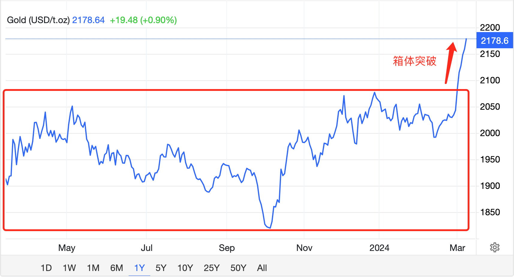
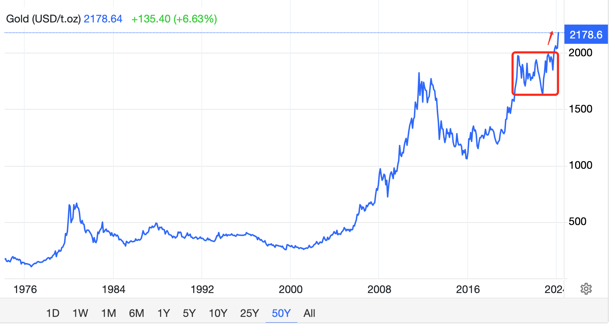
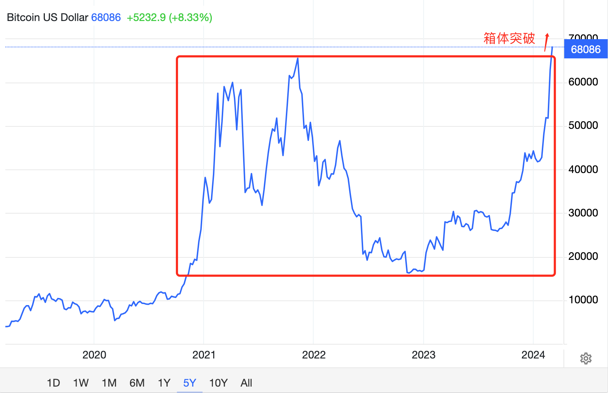
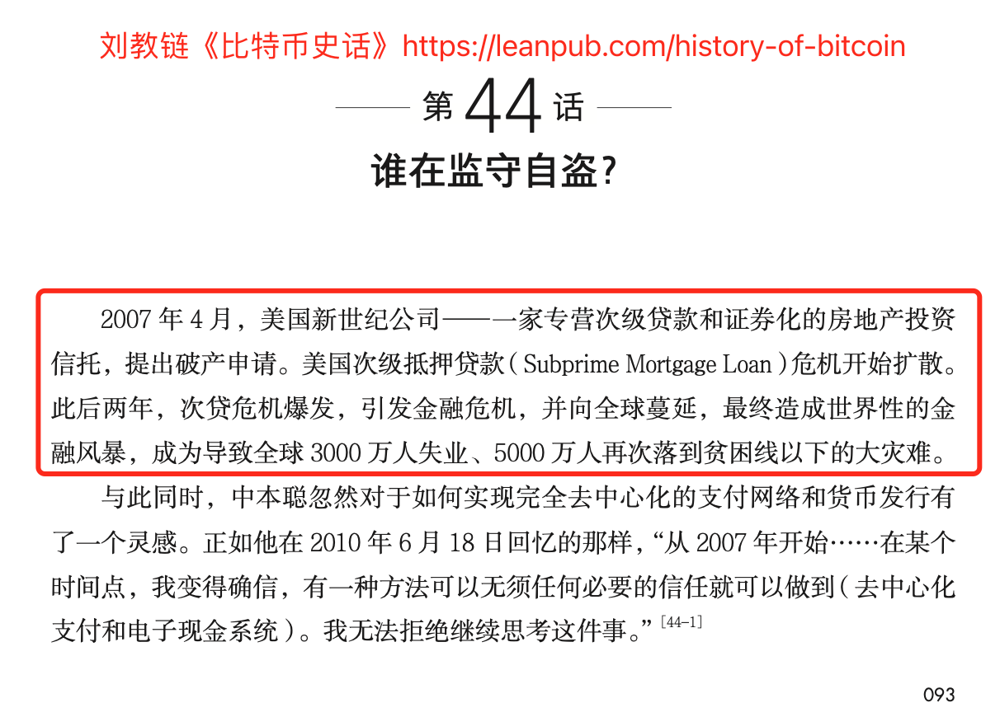

# 比特币、黄金历史新高：美联储嗅到危机！

号外：教链内参3.8《美元向下，黄金向上，大饼横盘》

* * *

月寒江清夜沉沉，美人一笑千黄金。

3月8日女神节，大饼比特币BTC诚意满满，UTC+8 23时，最高拉上7万刀！

短暂回落66k之后，又拉了回去，继续攀升。

此刻，似乎只剩下一个方向，那就是向上！

3月7日教链内参《“无风险”跑赢BTC的办法》中，宏观概要部分引了一张黄金箱体突破的图。更新一下，黄金周五已经摸到了$2200，续创历史新高。

视线拉远。这次历史性的箱体突破，突破的不仅仅是2023年的箱体，更是自2020年以来所构筑的4年箱体。

这种级别的突破，绝不简单！

黄金，自1971年布雷顿森林体系解体，美元与黄金脱锚，已经从$35一路飙升至$2200。

倒过来说，美元相对黄金的贬值幅度高达 (35-2200)/2200 = -98.4%！这还是在美国这个世界顶级霸主对黄金实行百年镇压的情况下实现的！

关于黄金的故事，还不熟悉的读者不妨温习一下教链2023.9.28文章《黄金，黄金》。

而BTC，也正在紧随黄金，走在突破4年箱体的登月之路上。如下图所示：

最奇怪的是，万籁俱寂。一切似乎都风平浪静。但越是风平浪静，越是让人心生一种毛骨悚然的感觉。

宏观背景没有任何特别的利好或利空。而价格却彷佛脱离了宏观面的指引，只顾一个劲儿地往上蹿升。

无因上涨。

好像上帝把人丢到地球的一个角落，他就会自己找到一切可以吃掉的东西吃掉，然后不断地长大，繁衍生息。

那强大而旺盛的内在生命力！

教链常讲，一切指标，都是价格的滞后指标。

反过来讲，价格是遥遥领先的指标。

不禁想起Eric Hughes《密码朋克宣言》中描述信息的精彩语句：「信息是谣言的兄弟，它更年轻，更强壮；与流言相比，信息传播得更快，有更多的角度，包含更多的知识，然而给出的结论更少。」（Information is Rumor's younger, stronger cousin; Information is fleeter of foot, has more eyes, knows more, and understands less than Rumor.）（全文参见刘教链2019.9.29文章《比特币的文化类型及其历史位置》）

价格是一种信息（Price is a kind of information）。它甚至比谣言跑得还快。而谣言，则常常遥遥领先于事实和真相，以至于网络上多有调侃，谣言是一个缩写，“遥遥领先的预言”的缩写。

早在3月2日的教链内参《惊奇！黄金与山寨齐飞！有何玄机？》中，教链就用四个字描述对这种脱离宏观、无因上涨的感觉：“暗流涌动”。

8日教链内参《美元向下，黄金向上，大饼横盘》中写到，美联储主席鲍威尔周四在参议院听证时表示，“我们离有信心降息并不远”。美联储2024年FOMC委员会执票委员、克利夫兰联储主席梅斯特则表示，美联储应该能够在今年晚些时候降息。

当然，他们仍然不忘添加那句免责条件句：如果更多数据表明通胀缓和可持续的话。

不管怎样，这是美联储开始大吹降息风了。

教链在1月23日教链内参《加密市场继续承压的内因和外因》中说过，在2023年硅谷银行破产事件中，美联储为救市而紧急推出的BTFP援助工具，在3月份就要到期了。

微妙时刻。

美联储一方面坚定地表达BTFP无需再续的信心，另一方面却开始吹降息风。

对于风平浪静的海平面之下，情况已有多么危急这个问题，美联储应该比这世界上绝大多数人看得更清楚。

但我并不想神秘化美联储的超能力，去讲美联储能看到常人根本看不到的东西。

美联储也不过是一个官僚机构而已。

既然是官僚机构，它就更像一台机器，一个工具人。

它越是恪尽职守，就越失去人的复杂反应，而向草履虫一般的条件反射退化。

就像FOMC议息会议的老爷们整天盯着通胀和就业指标来做决策那样。

个人投资者，人味儿就比机构要更足。于是反而难免会把机构的“单纯”给神秘化。就像下面这个有趣的故事所展示的：

有一个山脚下的弯道公路，不久前曾发生过一起严重的车祸，两个人命丧事故。车祸地点的位置，恰好有一根高高的灯杆。

一日，小威的妈妈开车带小威路过弯道。马路空空荡荡，只有白云悠悠。

就在车子行至车祸地点路灯杆附近时，坐在后排向外张望的小威，忽然大声说：妈妈、妈妈，上面有两个人！

小威妈妈一下子想起不久前的车祸，想起民间传言小孩子能看到常人根本看不到的东西，不禁毛骨悚然，赶紧制止小威：别乱讲，哪有什么人！

结局大家想必也知道了：

回家后，小威妈妈越想越后怕，就和小威爸爸讲了这个经过。

小威爸爸开车带小威妈妈和小威再次来到弯道处，下车查看情况。

小威爸爸问小威，你说的两个人在哪里呀？

小威朝着远处山坡上一指说：那两个人就在上面呀！

小威爸爸和小威妈妈顺着小威指向的方向看过去，发现半山腰竖着几块大牌子，牌子上写着八个大字：森林防火，人人有责！

故事讲完了。

当我们听到小威小朋友说上面有两个人的时候，想起了车祸亡灵，还是看到了森林防火，那就是两个截然不同的世界观。

如何认识世界，决定了我们如何改造世界。退一步讲，至少决定了我们如何做出反应，趋利避害。

世界观错了，认识就发生了偏差，行动就会出错。趋利的动作，反而趋向了害。避害的做法，反而避离了利。

投资是顶级的趋利避害行为。

只从媒体自媒体获取消息，一个投资者很难塑造正确的世界观。

媒体和自媒体是流量业务。流量业务的本质，是迎合大众的情绪。

看看年前年后大A市场破位3000点后，绝大多数的媒体自媒体的情绪输出多偏悲观，就可以知道，它们的存在就是在迎合大众情绪从而汇聚流量而已。

而投资，是要与大众为敌的。

在大众悲观时兴奋地寻找机会，在大众乐观情绪高涨时悄然获利离场。

迎合大众情绪的输出，对于投资而言是没有价值的。

如果你还没有看破这一层，那么说明在成长为合格投资者的道路上，还需要继续修行。

一个合格的投资者，必然需要能够从纷繁芜杂的信息中，分辨清楚，哪些是大谈“车祸亡灵”，哪些是讲的“森林防火”。

分辨不清，必然被错误引导，误入歧途。

2023年8-9月间，教链写了宏观三部曲：《人造繁荣：财富大转移》（2023.8.21），《隔山打牛：金融大崩溃》（2023.9.19），《华山论剑：最后的决战》（2023.9.22）。

尽写教链所见：当今环球，两大高手，隔空比拼内力，僵持不下，互不相让。

这一方想隔山打掉那一方。那一方也想隔山打掉这一方。于是两方共同用力，把这山推高。

恰如双手挤气球，气球变圆盘，直径便会被挤大。

又如地壳板块运动，两个大陆板块碰撞挤压，便在地表挤出高山。

这山，就是黄金和电子黄金——比特币。

正像教链在2023.9.19《隔山打牛》一文末尾所讲的：「每一个黄金的购买者，每一个耐心的囤饼人，都是隔山打牛的战略同盟和统一阵线。」

「而所有参与这个统一阵线的人，都将通过手中资产的大幅上涨而受益于美联储的失败，以及美国金融的再次崩溃。」

2023年9月19日，BTC 2.7万美刀，黄金1900多美刀。

2024年3月9日，今天，BTC 6.8万美刀，黄金近2200美刀。

“资产大幅上涨”的前半句已然应验。“美联储失败”的后半句拭目以待。

我们都知道，从技术上讲，美国金融不会崩溃，美联储也不会失败，因为它有无限印钞的超能力。

哪怕是像2020年3月份的超级黑天鹅，也可以在美联储紧急无限QE下起死回生。

但是，每个人心中，也都有一杆秤。

大家都心知肚明，美联储将会如何投降，举起白旗。

美联储一旦嗅到金融崩溃的危机前兆，就会开闸放水、大举救市，于是也就宣告了美联储的失败。

美元环流，流动性潮汐涨落，降息放水推高资产泡沫获利，加息收水打爆泡沫，再降息放水低价收割骨折资产，推高资产泡沫高位抛售，循环往复，屡试不爽。不明白的读者可以再读读教链2023.9.4文章《美元的吸血鬼攻击》。

但是2007-2008年那一轮，美元玩砸了。加息收水把自己的房地产次级贷打爆了。

美联储稍有迟疑，金融海啸席卷世界。

美联储赶紧投降，开启了量化宽松的大放水时代。

天降神人中本聪，恰好也是在2007-2008年，灵感爆发，发明了比特币。

比特币，给世人提供了“退出”美元游戏的工具。

彼时彼刻，东方配合西方。

把美元还给美国，换来满手美债。

财富向西，债务向东。

4万亿，终究是远隔重洋的勤劳民族默默承受了所有，救搞砸了一切的华尔街于水火。

此时此刻，东方不再配合西方。

十年磨一剑，霜刃未曾试。今日把示君，谁有不平事？

把美债抛入太平洋，把美元借给穷国。

借用《让子弹飞》里的经典台词：

兄弟们：大哥，谁是穷国？
张麻子：谁穷，谁就是穷国。
黄老爷：绿油油的美元散给了穷国，造孽啊！

这一轮，黄老爷加息收水没有打爆泡沫崩塌的穷国，因为张麻子把这十年隐忍积攒的美元借给了他们。

黄老爷抽走多少水，张麻子就贷放过去多少水。

哪里缺水（美元流动性），就去哪里下雨（放贷）。

黄老爷的抽水机开了两年，没有抽死哪个穷国，自己反而有些扛不住了。

毕竟，这天底下美元流动性饥渴症患者中，病得最深最重，病入膏肓的，正是黄老爷自己啊！

美国自己，才是欠债最多的那一个。（参考阅读刘教链2023.10.10文章《巴以开战，美联储投降》）

正如教链在2023.11.17文章《美元美债双螺旋系统崩溃的小尺度预演》中所分析的：

「当美债的规模还比较小的时候，美元-美债双螺旋，通过内外两条管道抽水和掠取价值，运转的还算比较稳定。

「可是，当美债规模快速膨胀，超过33万亿美元的今天，高息也成了不可承受之重。

「庞大的债务规模和付息压力，再加上对内不仅抽不到水还得为了选票直升机撒钱，对外靠美军收割价值也遇到了硬茬啃不动，双螺旋就有些难以为继了。

「于是，曾经巧妙的MMT（现代货币理论）和美元潮汐，现在就要有减速倒转，逆转成死亡螺旋的危险。」

这世界悄然之间，换了新颜。

美元，也分成了美国的美元，和离岸美元。

美国的美元，黄老爷说得算。

离岸美元，张麻子说得算。

君不见，去年黄老爷想打汇率战，直接就被张麻子给死死摁住了。（参考阅读刘教链2023.9.12文章《暴打空头》）

从去年9月央妈放话，直到今天2024年3月份，半年过去，CNH把USD盯得死死的。不管美元指数怎么波动，USD/CNH钉死了7.2，纹丝不动。

咬定青山不放松，立根原在破岩中。千磨万击还坚劲，任尔东西南北风。

从两大绝世高手笃定华山论剑、决一雌雄的那一刻起，隔山打牛局既成，黄金和电子黄金BTC的暴涨，就成为不可避免之事了。

「神话故事里有“女娲补天”的传说。默默地抛美债、囤美元，搞逆周期调节，美紧缩我宽松，美元走了我去填坑，把美元的暴力去（全世界的）杠杆，化解成温柔、优雅的和谐去杠杆，堪比新时代的女娲补天。」（语出刘教链2023.10.26文章《美元求仁得仁》）

此时此刻，美元求仁得仁。
