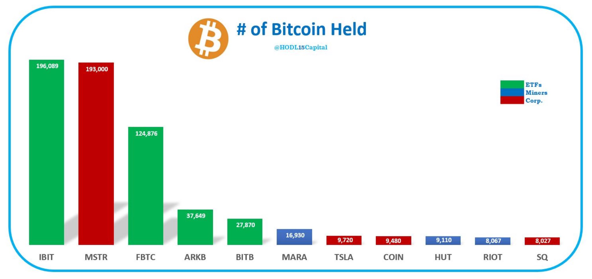
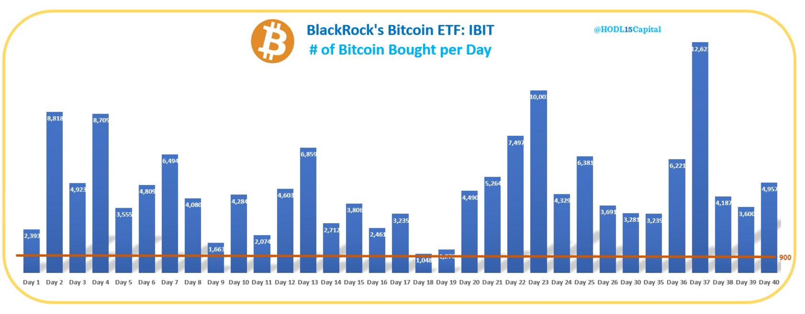
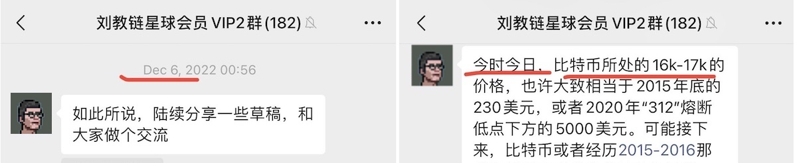

# 贝莱德40天赶超微策略！

号外：教链内参3.9《这轮熊市黑天鹅难道是牛市提前1年启动？》

* * *

近水楼台先得月，向阳花木易为春。

在比特币现货ETF 1月11日获美SEC批准上市（参考：刘教链2024.1.11文章《BTC登堂入室，SEC欲迎还拒》）之后，其中的领头羊，贝莱德集团（BlackRock）的比特币现货ETF产品IBIT，在短短40天时间里，一骑绝尘，其BTC现货比特币持仓已经超越四处借债、苦哈哈囤币近4年的微策略公司（Microstrategy）。

贝莱德IBIT基金的BTC日流入量是这样的：

微策略从2020年8月11日以均价11652.8美刀买入第一笔21545枚BTC起（参考：刘教链2023.12.28文章《已囤积189150枚BTC，微策略的策略会暴雷吗？》），到2024年2月27日再次加仓3000枚BTC，平均买入成本已攀升至51813美刀（参考：2.27教链内参《大饼急攻56k，微策略再次加仓3000枚》）。

四年囤币两茫茫，不思量，自难忘。

微策略四年不断疯狂借债，疯狂加仓，囤积了高达19.3万枚BTC，平均成本31544美刀，浮盈数十亿美刀。

微策略四年之功，贝莱德仅用40天就轻松超越。

贝莱德才是专业玩金融的，它巧妙借助的，是别人的力量。

微策略借债投机，是一种杠杆。贝莱德借助ETF吸收资金投机，也是一种杠杆。

不同之处在于，微策略的“投机”，主语是微策略；贝莱德的“投机”，主语是“资金”，也就是投资者。

主语不同，显示着金融风险的分配不同。

微策略要以一己之力，承担杠杆的风险。贝莱德却是让杠杆撬动的投资者来承担风险，自己坐收渔利（管理费）。

这就是专业金融选手对非专业金融选手的维度优势。

好风凭借力，送我上青云。

贝莱德善于呼风唤雨，躺着就被风送上了天，超越了微策略。

2020年11月20日，《当比特币站上$18000》时，教链还在讲，《为什么10万元的比特币在机构眼里并不贵》（刘教链2020.11.24文章）。

如今看来，别说是18000美刀的比特币了，就是68000美刀的比特币，对专业机构而言，都是小菜一碟。

只可惜，当2022年底11-12月比特币跌至16000美刀的时候，无人问津。

真的是应了那句调侃的话：1万6的大饼没人要，6万1的大饼抢着买。

高买低卖，十分常态。

散户常常亏损，大抵也就是这个原因了。
