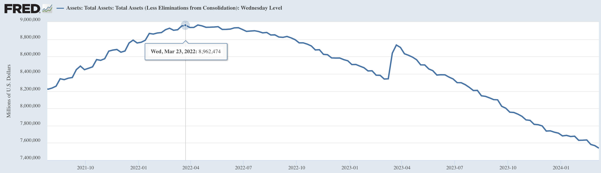
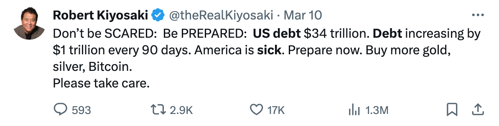
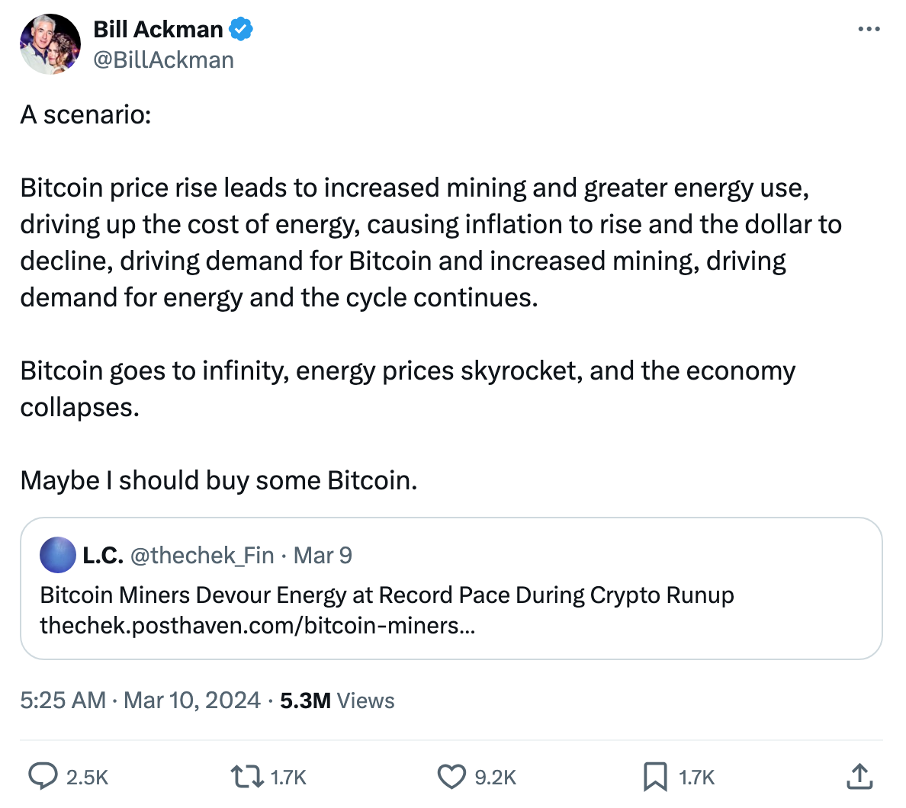
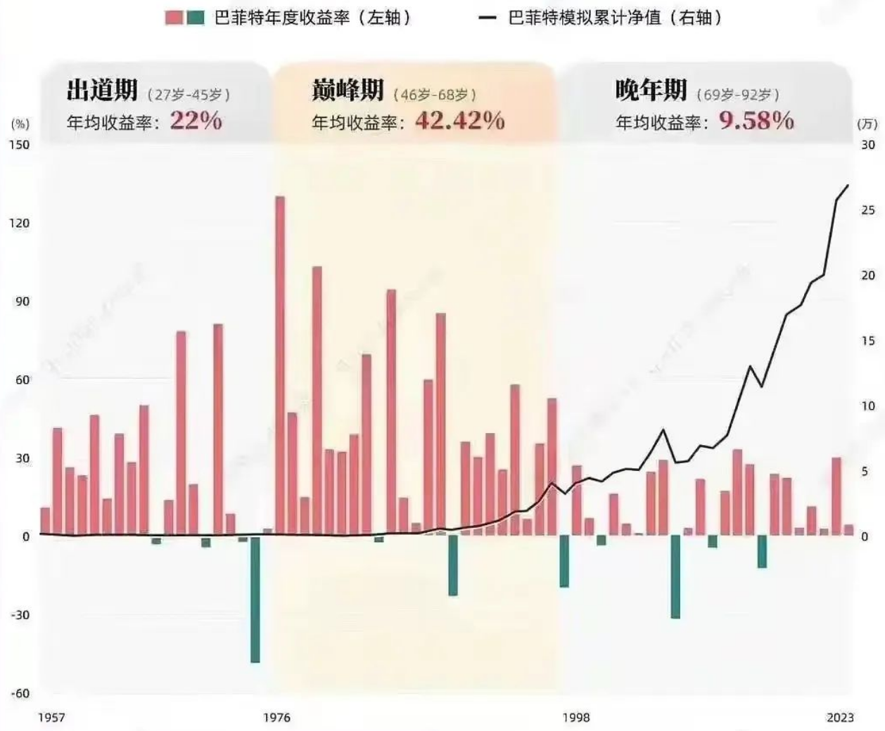

# 一个长线投资者的巅峰期：46岁-68岁

号外：教链内参3.10《轮番上涨》

* * *

随着BTC（比特币）重新浮上水面，市场也就多了一些春天的气息。只是这BTC好像是要在水面蛙泳，一会儿把头抬出水面吸气，一会儿又把头埋进水里呼气，在前高阻力区这里上下波动，让盼涨的人和盼跌的人手心里都捏着一把汗。

美联储缩表两年，从历史最高近9万亿美刀的规模，一路降到如今的7.5万亿美刀。两年缩减了1.5万亿美刀。

两年前，美联储资产负债表规模见顶的2022年4月，BTC 4万刀。如今，缩表两年之后，2024年3月，BTC已近7万刀。

K线的星，在漆黑的天幕上划过，画出了一个大大的对勾：半年多从4万到2万，再一年多从2万到7万。

缩表，缩了个寂寞。

「不要害怕：做好准备：美国债务 34 万亿美元。债务每 90 天增加 1 万亿美元。美国病了。现在就做好准备。购买更多黄金、白银、比特币。请保重。」——《富爸爸穷爸爸》作者Robert Kiyosaki

对冲基金大佬Bill Ackman则推论存在一个推动BTC价格趋向于无穷大的正反馈循环：BTC价格上升，能源利用率上升，能源价格上升，美元下降，更多资金离开美元，进入BTC，推动BTC进一步上升，激励矿工进一步扩产，能源利用率进一步上升，能源价格进一步上升，美元进一步下降，推动更多资金离开美元，进入BTC，…… 如此循环往复，把BTC价格推上天。最后他说：“也许我应该买一些比特币。”

一直不看好BTC的巴菲特，著名的长线投资者，数十年如一日地做空美元、做多股票，收获了巨额财富。

巴菲特99%的财富，是50岁以后赚到的。而直到60岁，他也才刚刚赚到目前拥有财富量的3%！高达97%的财富，是60岁以后才赚到的。

长线投资者的财富积累与短线投机者不同。短线投机者追求的是年轻得志。长线投资者追求的则是厚积薄发。

在网上有这么一张有趣的巴菲特66年投资生涯统计图：

图中把巴菲特的投资生涯分成了早年的出道期，27岁-45岁，年均收益率22%；中年的巅峰期，46岁-68岁，年均收益率42.42%；末段的晚年期，69岁-92岁，年均收益率9.58%。

可见，46岁-68岁，才是他作为一个长期投资者的黄金时期。

不过，巴菲特27岁开始涉足投资，也是在摸爬滚打了20年之后，才进入巅峰状态。

对于大多数人，可能要到37岁有了一定的原始积累，且思想开窍之后，才会开始认真地涉足投资。

那么，按巴菲特的速度，也要到56岁才能摸到门道，进入财富增长的快车道。

假设加密市场的发展速度两倍于传统市场，那么我们的人生也许可以被加速，出道10年，即可进入巅峰状态。

如此一来，即便出道年龄37岁比巴菲特晚了10年，但是到达巅峰期的时间，仍然有望赶上巴菲特的速度，即46岁。

教链目前深耕加密行业6年，投资组合复合年化收益率34%（按今日BTC 68k、ETH 3.9k、UNI 14计算），其中BTC的复合年化收益率(CAGR)为37.5%。距离巴菲特的巅峰速度还差一丢丢。

不过我还有4年时间，足够再跑一轮加密周期了。希望穿越牛熊再相会时，CAGR能跑到40%以上，向巴菲特看齐。继续加油吧！

