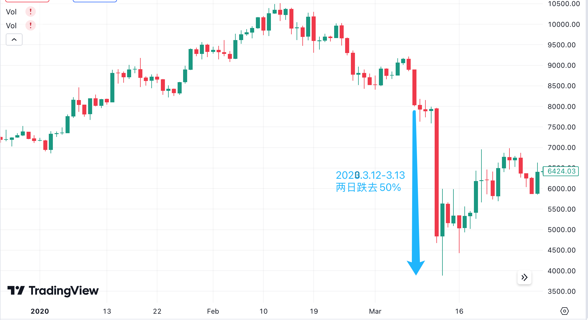
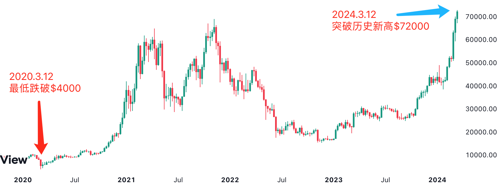

# 又是一年312

号外：教链内参3.11《大饼加速向上突破箱体上沿7万刀心理关口！》

* * *

天街小雨润如酥，草色遥看近却无。最是一年春好处，绝胜烟柳满皇都。 

比特币涨起来，不讲道理。几乎是以迅雷不及掩耳之势间，就连破前高69k、心理关口7万刀，径直杀到72k以上，超越白银市值1.389万亿刀。（参阅教链内参3.11《BTC加速向上突破箱体上沿7万刀心理关口！》）

越是恐高，就越是追不上。追不上，真的追不上。

言犹在耳：“熊市是建仓良机。几乎所有的牛市盈利，都来自于熊市的积累。”（语出教链2023.8.7文章《大饼的黎明静悄悄》，BTC时价29k）

空仓犹豫、等待的人，此刻耳边响起回声：曾经有一个建仓大饼的机会摆在我的面前，我没有珍惜，等到失去的时候才后悔莫及，人世间最痛苦的事情莫过于此。如果上天能够给我一个重新来过的机会，我会对那个价位的大饼说三个字：“我要买！” 如果非要给仓位加上一个限定的话，我希望是 —— 满仓！

“这尘世上没有天长地久的爱情，每个幻想投机发财的人想的都是逃顶获利而不是长期持有，即使大饼一而再、再而三地给上车的机会，也没有人会珍惜这些机会——直到失去的时候才后悔莫及，然后顶部追涨。”（语出教链2022.1.24文章《空头的梦想一样会落空》，BTC时价35k）

“就像多头的牛市梦会在跌跌不休中摔个粉碎，空头的熊市梦想也一样会在不断上涨中彻底落空。市场是公平的，它对多空双方一视同仁。重点是，谁的春秋大梦，谁的花样年华，谁的眼泪在飞，谁的魂断蓝桥？”（同上）

不知不觉之间，又是一年312。

312，一个日期，3月12日，已成一个专有名词。币圈人刻骨铭心的记忆。

2020年3月12日-13日，BTC急速下坠，两日跌去50%。时人戏称，大饼还没减半，仓位先减半了。

如果从2020年2月13日最高10500刀开始计算，3月13最低跌至3900刀，短短一个月，打了三折！

平移到今天，打三折是个什么概念？这意味着从72000刀，一个月后跳崖，直接跌破3万刀，回到25k附近！闭上眼睛，想象一下，你现在72k追加1万刀仓位，一个月后缩水至不到4000刀。大概就是类似这种感觉吧。扎心吗？心痛吗？后悔吗？

教链在2022.1.23文章《312、519、122三大崩盘实战复盘》中回忆道：“2020年312的时候我只是八字诀囤大饼，所以并没有觉得有多么腥风血雨。回顾了一下当时的实盘操作记录，我大概在5-6k的时候就打光了子弹。当时虽然场外有备用金，但是在崩溃中OTC市场完全歇业，无法入金。很多人眼睁睁看着自己的杠杆被血洗爆仓。”

永远不要轻视每一个满仓拿住大饼的人。“拿住比特币只有一种方法，拿不住比特币却有无数种方法。”（教链2021.2.28文章《拿住比特币就是最大的功力》）

有无数种短期暴涨的诱惑，和跑赢大饼的承诺，骗走你手里的BTC。业内老韭菜有句戏言：“守币如守寡。”

活寡易守，大饼难持。把持得住身子，把持不住手里的BTC，忍不住去把它投给花枝招展的各种土狗项目。于是就破了功。

壁立千仞，无欲则刚。之所以破了拿住大饼的至纯至阳至刚的功力，正是因为你被小妖精们迷了双眼，欲火焚身，不能自持。

妖精易躲，真爱难防。御弟哥哥唐三藏差点儿泄了元阳一次，正是对女儿国国王的真情流露动了心。那是整本西游中最为凶险的一次。其凶险程度，远高于很多次被妖怪抓去要杀要吃。

被妖怪捉住，杀了吃掉，并不可怕。死了还可以转世重生，再取真经。唐僧此前已经多次转世，仅在流沙河处被沙僧杀掉的前世就有许多，头骨都被沙僧做成了项链，挂在脖子上。

但是，一旦动了真情，破了童身，泄了元阳，就彻底Game Over了。还想继续取经成佛，位列仙班，那就永远都不再可能。

上了女儿国国王的床，就永远不可能再上佛祖西天的莲花宝座。

佛家讲的是万世轮回。一旦放弃了心向佛祖，不只是这一世不能登莲台，而是你这一条线就永远和佛断了因缘，佛祖不再会考虑栽培你，你将和无数凡人一样，永远进入人鬼道的无尽轮回之中。

在神仙、妖怪大混斗的加密市场，拿住大饼，就是修行，取得本聪真经，“汝亦登莲台”（如来佛语）。

取经路上多磨难，拿住大饼好轮回。

每一轮周期，就是一次轮回。无论轮回多少次，只要满仓大饼，就永远没有失去机会，继续前进，到达西天极乐世界，成仙成佛的机会。

每一次轮回中，最凶险的，不是遇到恶棍和妖魔，而是遇到了，令你动心的真爱。你动了真情，上了真爱的床，把佛抛到了脑后。你抛售了大饼，换成了令你怦然心动的山寨和土狗。你自欺欺人地在心里说，等我在土狗上赚了钱，就会再换回大饼。这就好比说，等上完了真爱的床，再穿上衣服去取我佛真经，岂不是十分滑稽可笑？

一旦抛弃了佛，就和佛永远断了因缘，陷入无尽轮回之苦。

东土80亿芸芸众生，佛祖只预备了2100万席莲花宝座。

一币可称佛。

当你登上莲花高台时，向回俯瞰取经来时路上许多磨难，竟是那么地渺小，不值一提。

又是一年312。

当2024年3月12日，BTC冲上历史新高度，把前高69k从压力位翻转为支撑位后，彻底打开了超级周期的上升通道。

站在72k的高度，回看2020年312，宛若一个小水坑，渺小若无。

当年的惊心动魄，竟如此不值一提。

只因你的境界和高度，离佛又近了一步。
