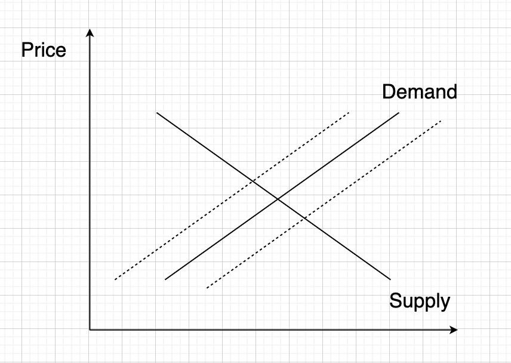
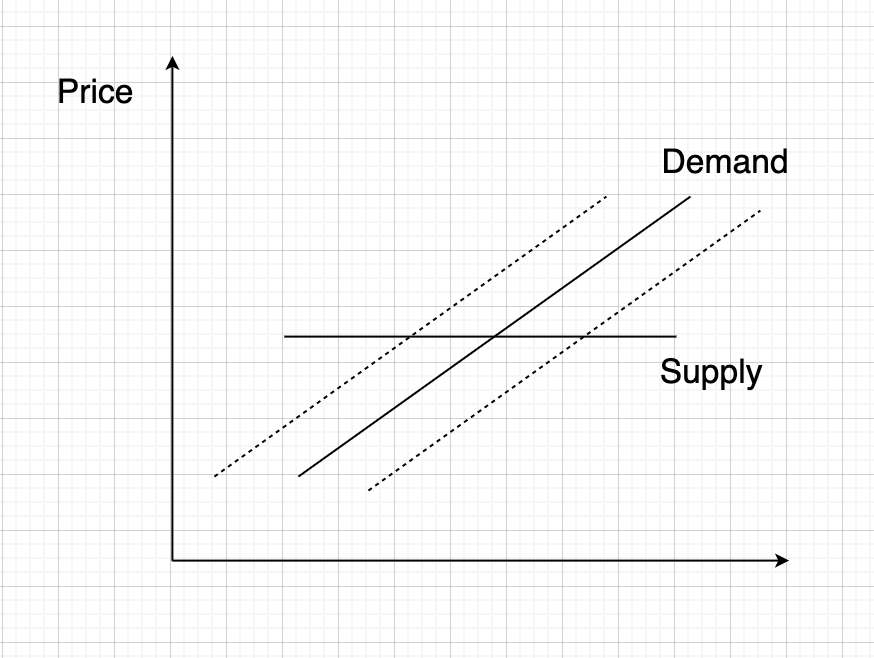
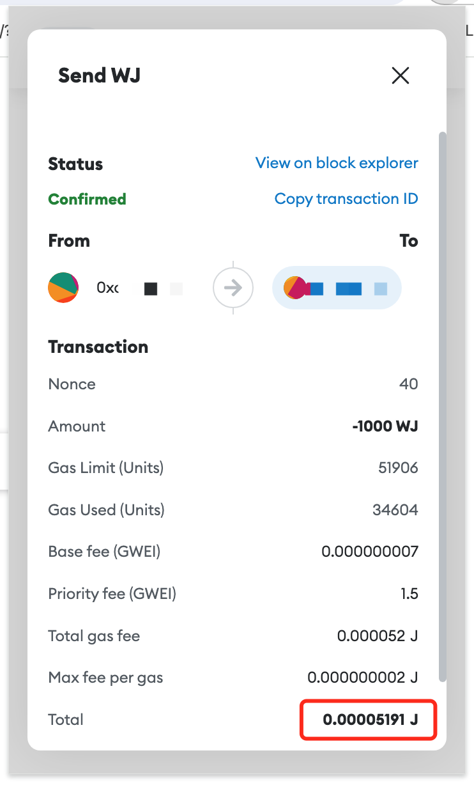
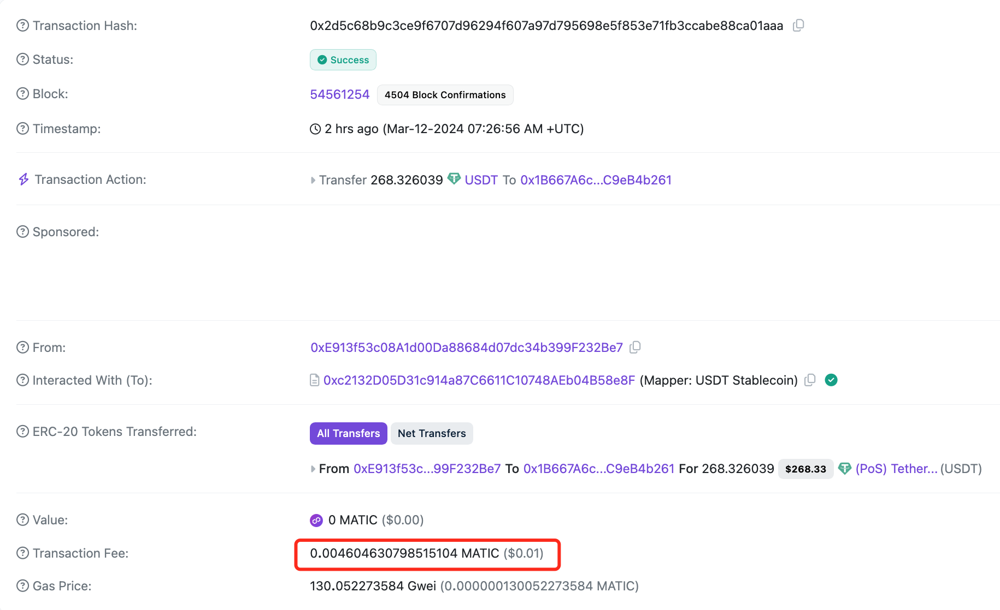

# 公链实用代币的微观经济学

尝有朋友问，一个公链实用代币的价值是如何估计的。

靠拍脑袋肯定是拍不出来的。我们需要确立对标，并运用一点儿微观经济学的供需平衡理论知识。

这里的公链实用代币（utility token），指的是用来支付该公链上链记账之系统资源使用手续费（俗称gas fee）的代币（token）。

侧链、Layer-2等类似的记账系统，大抵上也是类似。

通常我们所了解的公链，如以太坊、Polygon等，其市场价格并不完全是其gas的估值，主要是在于它们的代币存在二级市场，催生了投机性的交易需求，从而扭曲了代币的实用价值。

投机价值，常常会使得代币的价格超出其作为gas的实用价值，从而反过来抑制了其作为gas的使用，因为太贵了用不起，这就是教链常讲的“自限性问题”。

当我们考察其投机价值的市场均衡价格时，供需关系符合经典的供需曲线，即，供应多了或需求少了，价格下降，供应少了或需求多了，价格上升，如下图所示：

在图中，实线的供给曲线倾斜向下，需求曲线倾斜向上，二者交叉点即为均衡价格。当供应变动时，需求曲线则向两条虚线所示的方向移动，或向左（供应减少，价格上升），或向右（供应增加，价格下降）。这是我们在微观经济学教科书上常见的示意图。

这是人们在商品市场中发现的一般规律。

比如，在纺织业中，当技术进步导致纺织品产量大幅上升时，早期效率领先的纺织厂的确比竞争对手赚取了更多的钱，但是，随着新技术的快速普及，很快的，所有纺织厂都不再存在技术领先的比较优势，纺织品的产量的大量增加，导致纺织品价格大幅跌落，纺织工厂的盈利能力依然未能改善，最终反映在股价上就是股价难有起色。这就是巴菲特投资生涯早年在伯克希尔纺织厂上所学到的深刻教训。

但是，如果我们继续追问，当需求饱和时，为什么不能把商品囤积起来，以获得更高价格的均衡点呢？

于是我们发现了深一层次的秘密：实物商品因为库存成本和保质期的问题，导致其无法长期保存，因此必须被迫在有限的期限内出售出去，否则就要赔本。

也就是说，实物商品的价格底部并不是零，而是负数。这似乎违背直觉，但却是经济事实。

当年原油宝产品穿仓，就是投机这个产品的人们，压根儿做梦都没想到，原油作为一种实物商品，其价格居然能够跌成负数。负数，意味着卖家不再想承担高昂的仓储成本，急于出手，甚至愿意倒贴一笔钱给买家。

这时候就会出现诡异的一幕，也是我们在中学教材中学的：在经济危机中，美国农场主宁肯把牛奶倒入密西西比河，也不愿意免费送给买不起牛奶的穷人。这并不是农场主冷酷无情，而是理性计算的结果。当倒掉牛奶的综合成本低于派送牛奶的综合成本时，理性的决策就是倒掉它。

那么，我们再继续思考，如果牛奶的保质期无限长，且无需浪费任何仓储成本，那么会有什么不同的结果吗？

当然。农场主就一定会囤积牛奶，等到未来合适的时候再拿出来卖。原油也是一样。

在所有商品中，有一种商品，具有最高的耐久度。这就是货币，或者货币商品。

数字资产，如BTC，没有仓储成本。任意持有许多，持有任意长时间，不需要支付一分钱。（当然，深究的话，其仓储成本可以认为是由使用者、投机者代为承担了）

更重要的是，保质期长短。如果一个币，你总是担心它背后的项目方跑路，那么，你肯定无法安心持有这个币到永远。这个币，就是有限保质期的。

而BTC，可以认为是无限保质期的。

思考到这一层，就很容易发现，去中心化到底有什么意义和价值？

有很多人觉得，去中心化和中心化并没有什么不同。

从最表层的代币符号、价格波动、投机炒作上看，的确没啥区别。

但是，当我们考察到最底层的保质期或者耐久度问题时，就会发现它们之间，天壤之别。

土狗币烫手，人人都知道要赶快跑，这就是保质期短，大家都心知肚明。BTC很稳，人人都知道可以放心留给下一代，这就是保质期长，大家也十分清楚。

去中心化，其目的正是在于永久保质期。

保质期长短，恰恰决定了，一个商品是否趋近于货币商品，是否适合于长期甚至永久囤积，从而达到一个微观经济学的结果：放平供应曲线。

当一个商品的供应曲线被放平，意味着，无论该商品的供应变小或变大，都不会影响价格！像下图这样：

注意，从这里开始，我们要暂时脱离BTC的场景了。BTC的价格，是由投机市场的交易发现的。在投机市场的交易中，仍然由边际供需的平衡来确认价格的发现。

我们接下来要讨论的，是最开始标题中的问题，即，作为gas fee使用的公链实用代币的价值会被如何估计。

不考虑该实用代币的投机市场，仅考察其作为使用价值的商品属性，我们会发现，它的价格估计更像放平供应曲线的供需图形。

当然，我们假设该实用代币具有永久保质期。即，其基础设施具备充分的去中心化等特性，使得其可以近乎永久地存在，而具有在人类看来相当长的生命周期。

这就意味着，无论该实用代币的供应量有多少（只考虑充分供应，不考虑短缺不够用的情况），都不会影响其价值估计，或，均衡价格。

也即是说，其价格将完全由市场需求可以接受的上限决定。

打个比方，假设馒头具有零仓储成本和永久保质期，那么馒头的价格将仅取决于人们愿意为吃馒头支出多少钱。作为馒头卖家的你，就算你有无限个馒头，就算你的馒头成本都是天上掉下来的（零成本），你也会慢慢地卖，而不会免费派发（为了做慈善等特殊目的除外）。人们愿意支付1个馒头1块钱，你就会1个馒头卖1块钱。人们愿意支付10块钱，你就会卖10块钱。

现在我们清楚了，在估计公链实用代币的使用价值时，供应量就不是最关键的因素。人们愿意为使用该公链，而支付多少代价，是唯一的限制。

那么，为了对这个数字进行定量，可以有两个方法：试验法；以及对标法。

试验法，就是多次尝试不同的定价，去找到用户能够接受的价格，并最终发现最高均衡价格。

比如，已知，该公链进行一次ERC-20 token transfer所消耗的gas为0.00005191 J。设J为该公链gas的计量单位。

假设我们经过试验，发现用户为一次ERC-20 token transfer所能接受的最大费用为0.02 cny。cny为某法币单位。

那么，我们就可以推算出J的价值估计为：0.02 / 0.00005191 = 385 cny。

对标法，就是我们以市场中已经存在的某一同类公链，比如Polygon，已经发现的价格作为参照，进行推算。

比如，观察Polygon上一次ERC-20 token transfer的成本（tx fee）为 0.0046 MATIC x $1.2 / MATIC = $0.00552, $0.00552 x 7.2 = 0.04 cny。

由于这是市场真实使用，据此至少可以知道，有目前Polygon上用户数量这么多的一群用户，可以接受上述使用成本。

那么，若其他条件相同，可推算出在这样的用户可接受的使用情形下，J的价值估计为：0.04 / 0.00005191 = 770 cny。

以上，就是一个公链实用代币的价值是如何估计的微观经济学。

数值推导仅供演示思维逻辑，不作为任何参考依据。

欢迎交流探讨。

