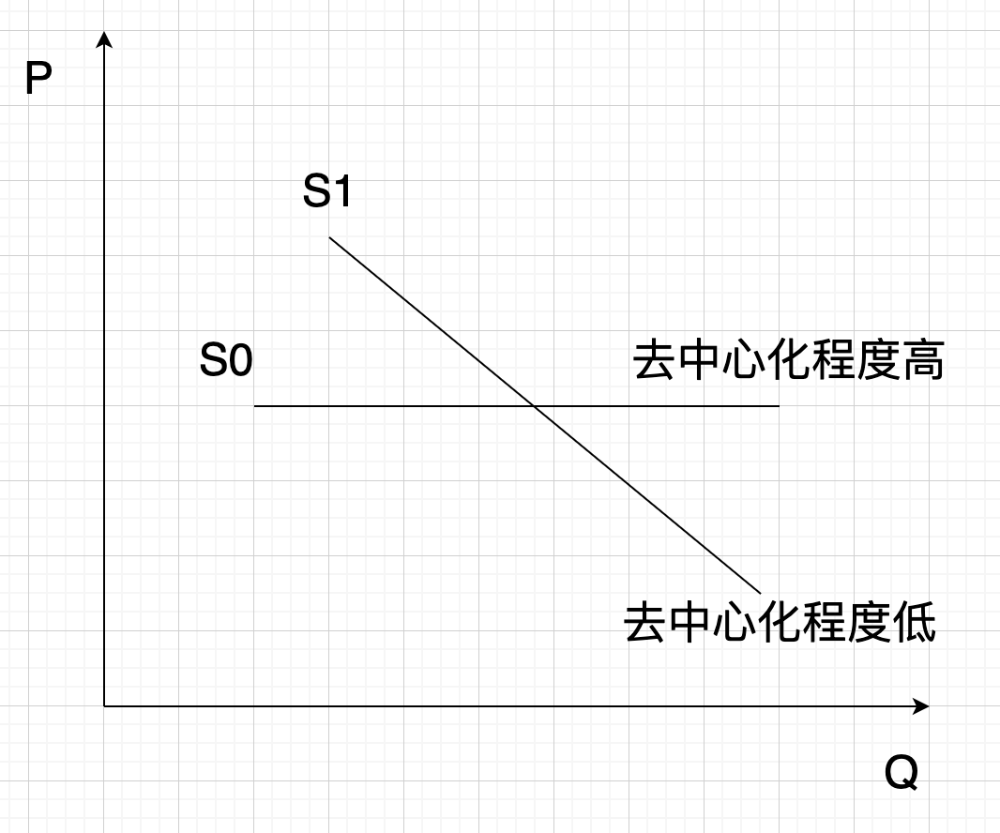

# 超安全资产：BTC估值9万刀-21万刀

号外：教链内参3.12《以太坊坎昆升级是否会打开上升空间？》

* * *

昨夜小楼又东风，心有灵犀一点通。

12日下午，教链在备份号“刘教链Pro”发表新作《公链实用代币的微观经济学》，其中创造性地提出了，“去中心化”的经济学意义，就在于拉平供应曲线。即：去中心化程度越高的公链，其供应曲线越接近于水平，即无弹性供应曲线(S0)。如下图所示：

在当日晚间教链又在3.12《内参：以太坊坎昆升级是否会打开上升空间？》中，运用这一代币微观经济学理论，剖析了以太坊的扩容对ETH币价的潜在影响。

“去中心化”，是一种“安全”技术（technology for security）。这里的安全，不仅仅包括技术安全，比如免遭破解，而且，更重要的，包括了经济安全，比如，不会腐败，永存不朽，不会灭亡，不会变质，不会被中心化超发贬值，不会被没收，等等。

在比特币之前，黄金和美元的最大价值，是全球性的安全资产。（参阅教链2022.3.4文章《美元霸权的黄昏》）

当然，它们各有缺点，或者说，重大安全漏洞。黄金在免遭抢劫和没收方面差强人意（1933年罗斯福没收黄金历历在目，参阅教链2023.9.28文章《黄金，黄金》）。美元则明牌具有中心化无限超发机制（美债庞氏螺旋，参阅教链2023.10.12文章《美元的“四大谎言”》）。

比特币刚刚好克服了它们的所有缺点。

比特币是一种超安全资产（ultra-secure asset）。

作为一种超安全资产，比特币的供应曲线比其他所有已知商品和货币商品都要更接近于无弹性水平(S0)！

这里谈论的，并非BTC的二级交易市场，或者说，投机市场，而是BTC的一级市场，特别的，是需求端，也就是应用端。

BTC有两个一级市场，一个在生产端，另一个在需求端，它们之间，通过二级市场相连通。示意如下：

M0 -> M2 -> M1

投机市场M2的作用，是润滑了生产端的M0和需求端的M1之间的交易摩擦，提高了流通效率。

M2是严格遵循弹性供需平衡的自由市场，具有价格发现的功能。

中本聪在M0处做了一个绝妙的设计：第一，无论矿工怎么扩产提高算力，都不能增加M0产出BTC的速率；第二，这个产出速率大约每4年下降一半。

这为M2带来了边际的供应冲击，强迫M2的供需平衡发生改变。

因为M0、M2不是本文讨论的对象，就此打住，不再继续展开。

让我们重点关注一下M1。

BTC作为超安全资产，在边际上，其在M1中的供应曲线是水平的。

也就是说，无论M0透过M2向M1输送多少数量的BTC，都不会改变M1中BTC的边际价值。

在M1中，BTC的边际价值将完全由需求接受度上限决定。

这要感谢囤积效应：因为囤积BTC的成本几乎为0，而BTC的超安全性，让人们可以有信心永远囤积下去，也就不会出现被迫出售，打压价格，出现价格低于边际价值的情况。

简单定量：人们在需求端所能接受的BTC边际估值是多少呢？

已知：BTC的主要使用价值便是作为超国界、无需许可、低摩擦的价值传输工具。

主观估计，平均而言，人们为一次国际汇款所愿意支付的代价约为10美元。

客观对标，查询可知，某银行国际电汇业务收费标准为，汇款金额的1‰，最低50元/笔，最高1000元/笔，另加收电讯费。显然，10美元的主观估计，已经远低于目前银行业的收费标准。

继而，通过BTC区块链公开数据可知，近期平均交易手续费为0.00011 BTC (36 sats/vB)，中位数费率为0.000047 BTC (14.8 sats/vB)。

使用上述数据，便可以计算出BTC的边际估值：$10 / 0.00011 BTC = $90909/BTC，$10 / 0.000047 BTC = $212766/BTC。

即，BTC的边际估值范围为9万刀-21万刀。

当前二级市场给予的BTC定价是7万刀多，这表示，二级市场正在补贴需求端的用户，给他们提供了打折的使用费。这为实际使用BTC的用户创造了经济学上所谓的“消费者剩余”（consumer surplus）。

同时，我们也很容易发现，为什么铭文一类造成网络拥堵的活动，虽然提高了矿工的收入，但却提高了手续费率，从而降低了BTC的边际价值，并最终损害了整个系统的经济价值。（参阅教链2023.12.26文章《铭文杀死比特币》）

