# 微策略创始人迈克·赛勒通往世界首富之路

号外：[小白课三期报名进行中](https://github.com/hmisty/supernoobs/)

* * *

微策略（Microstrategy）是加密行业中为数不多的明牌囤比特币大户。得益于其创始人迈克·赛勒（Michael Saylor）激进的囤币策略，从2020年到2024年，截至3月12号，微策略已经囤积了20.5万枚BTC，平均加仓成本为33706刀，按BTC 72k计算，浮盈超78亿刀，真可谓是赚爆了。（参阅3.12教链内参《以太坊坎昆升级是否会打开上升空间？》）

国外网友Michael Sullivan推算了一下，按照这个势头增长下去，如果不下道儿、不爆仓的话，Michael Saylor登顶世界首富的道路将会是这样的：

目前，赛勒是全球第 600 位最富有的人，拥有 51 亿美元的净资产，他的绝大部分财富来自比特币和微策略公司的股票。

如果比特币达到 10 万美元，赛勒自己保管的比特币和微策略公司的股份将大幅增加。使他的财富达到 72 亿美元左右。在世界富豪榜上排名第 380 位左右。与彼得·蒂尔（Peter Thiel）齐名。

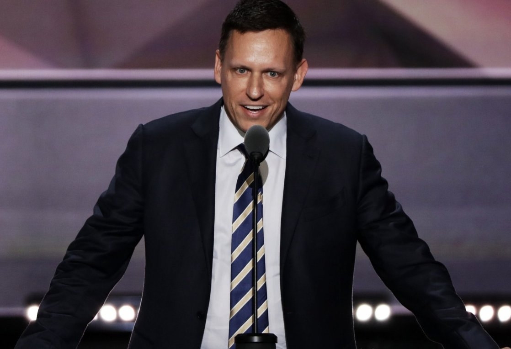

但这列高速列车不会停。当比特币20万美元时，赛勒的身价将跃居世界富豪榜第130位，超过达拉斯牛仔队老板杰里·琼斯（Jerry Jones）。

在比特币 30 万美元的时候，他的身价可达 235 亿美元。该网友认为，这也是我们真正开始看到微策略超过比特币的超额收益开始递减的时刻。这使他的排名超过了前谷歌首席执行官埃里克·施密特（Eric Schmidt）。

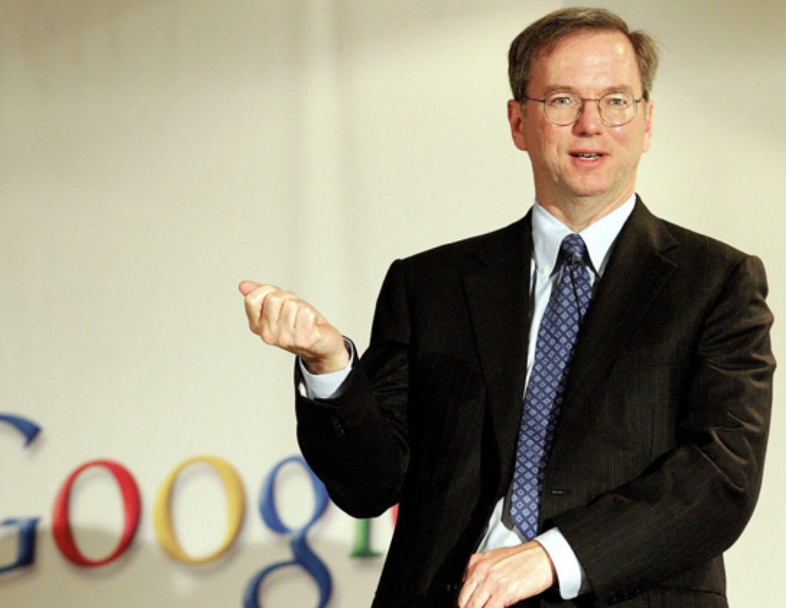

40 万美元的比特币将会使赛勒的净资产达到 315 亿美元。世界前 50 名。在这个水平上，他将在理论上超过****** cz（此处隐去该网友骂cz是shitcoin scammer的不雅用语）。但该网友怀疑，一旦 CZ 被捕，资产被罚光，该网友自己的净资产也会超过 CZ。

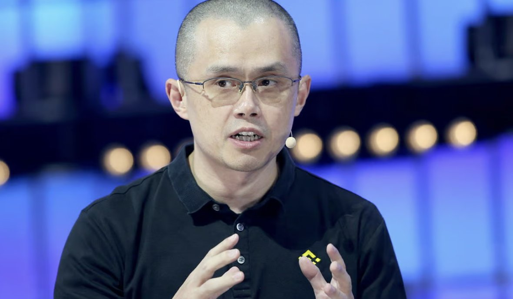

50 万美元的比特币。我们会在这个周期到达这里吗？如果能，赛勒的身家将达到 400 亿美元。就在耐克的菲尔·奈特（Phil Knight）上面。比特币对世界的重要性是鞋子的1000倍。

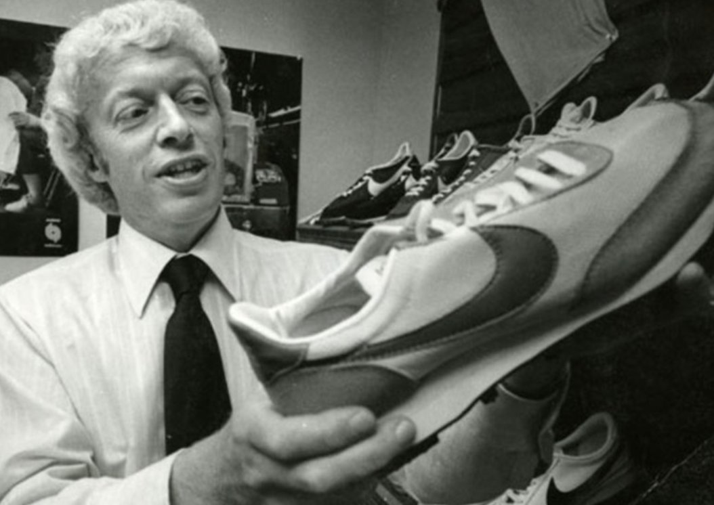

当到达 76 万美元后，比特币超过黄金的总市值。此时，赛勒：拥有 610 亿美元的净资产；彼得·希夫（Peter Schiff，著名的黄金鼓吹者，因丢失了早年保管比特币的私钥而转变为比特币喷子）：精神彻底崩溃，终于不再参与比特币的“耕耘”。在这时，赛勒将成为世界上第 25 位最富有的人。击败查尔斯·科赫（Charles Koch）。

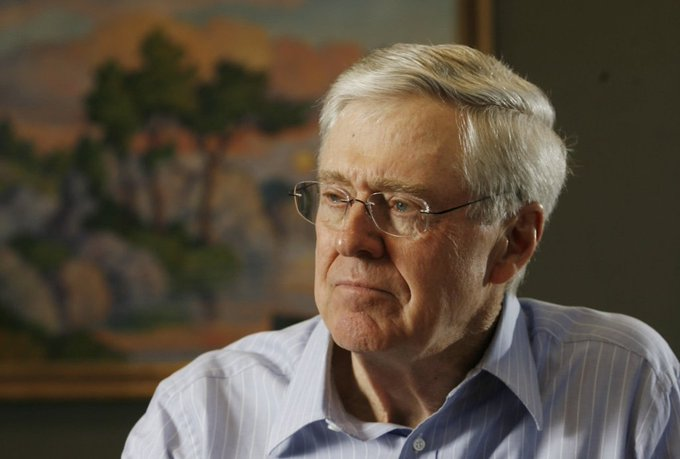

100 万美元的比特币。你准备好了吗？我准备好了吗？熊准备好了吗？我向你保证赛勒已经准备好了。此时，他的净资产将超过沃尔玛的吉姆（Jim）和罗伯·沃尔顿（Rob Walton），跃居我们榜单的第 17 位。

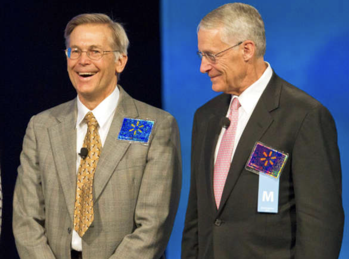

但是前十名呢？他需要怎样才能进入前十名？目前，谢尔盖·布林（Sergey Brin）和他的联合创始人拉里·佩奇（Larry Page）分别以 1140 亿美元和 1180 亿美元排名第十。当比特币 142 万美元时，赛勒将超越布林，147 万美元时，超过佩奇。

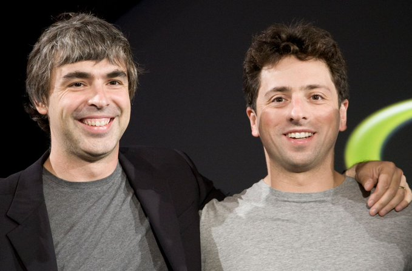

下一位：比尔·盖茨。在比特币到达 161 万美元后，赛勒的身价将取代盖茨，跃居第 7 位，其净资产达到 1300 亿美元。该网友调侃道，如果盖茨继续用他的钱为世界注射疫苗，并告诉我们如何吃饭，那么这可能会更快发生。

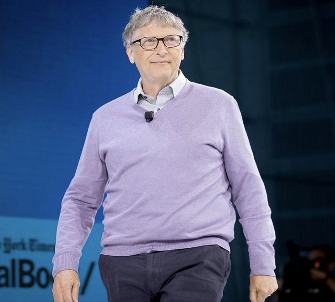

但比特币是“老鼠药的平方”！这位网友幽默地说：赛勒或许永远也无法超越我们真正的主和救世主沃伦·巴菲特（Warren Buffett）。但他可以的。他会的。在比特币增长至 168 万美金后，赛勒将会排在第六位。老鼠终于被毒死了。

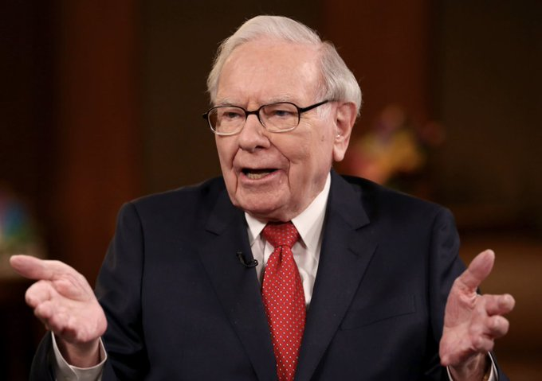

218万美元的比特币将使得迈克·赛勒的净资产飙升至1750亿美元。这使他在我们的榜单中排名第四。超过了喝水的半机械人和柔术蓝带，马克·扎克伯格（Mark Zuckerberg）。

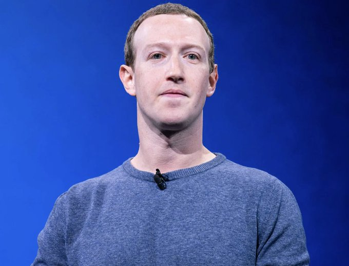

要想升至榜单第 3 位，比特币的价格必须超过 240 万美元。如果伊隆·马斯克（Elon Musk）能继续研究货币，而不是用狗屁币来唬弄全世界就好了。汽车、火箭和推特其实也挺酷的。

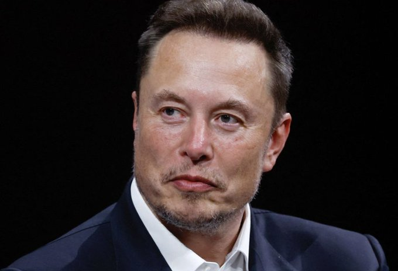

当比特币 245 万美元时，迈克·赛勒就能战胜拥有 1960 亿美元净资产的杰夫·贝索斯（Jeff Bezos）。杰夫，你的巨型山钟很酷，但你知道什么更酷吗？去中心化的时间链比人类创造的任何实物都更有弹性。

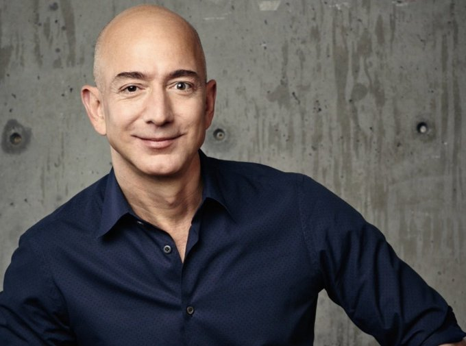

目前的世界首富是贝尔纳·阿尔诺（Bernard Arnault）。想不出还有什么比这位净资产高达 2378 亿美元的法币时尚偶像更合适的终极Boss了。你做的衣服很漂亮，但你知道什么更漂亮吗？自由货币。

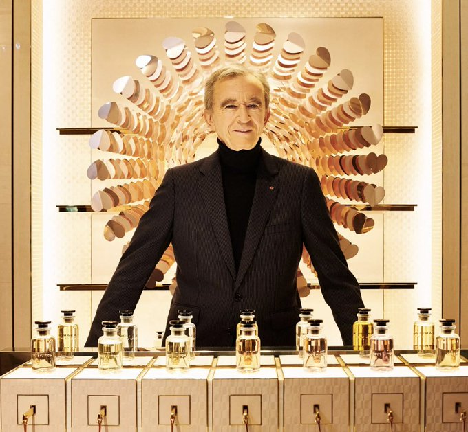

在比特币 300 万美元之时，迈克·赛勒终于登上了世界首富的宝座。他正式拥有了网络空间中那座美丽闪耀的城市中最大的一块。比特币第一，真的不存在第二。

最后，请慎重对待这些数据。

如果某个大公司开始积累 BTC，这些数字可能会发生巨大变化。

仅供娱乐。

还记得教链2022.7.1文章《比特币已胜》的结尾吗？

「“我不会骄傲自大到不去学习了。如果我看到一百万年前，有人带着火出来，我不是那个喜欢我别做那事儿的人，那不是我的主意。我可以借一些那火吗，先生？谢谢你，为我带来了光明。”——迈克尔·赛勒，跨越时空传输货币能量|赛勒系列|第5集(WiM005)」

向人类文明的盗火者迈克·赛勒（Michael Saylor）致敬！
