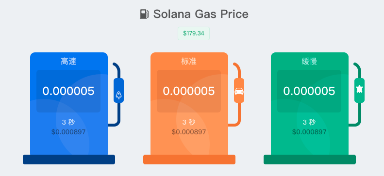
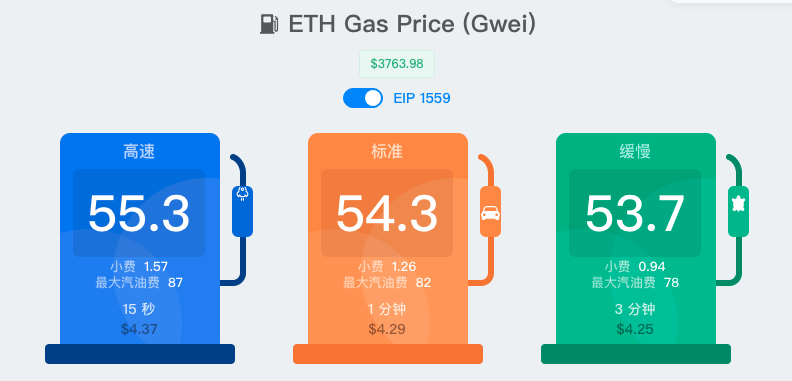
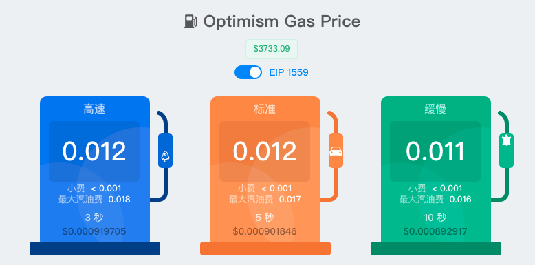

# 以太坊升级，Solana大涨

号外：教链内参3.14《内参：研究称BTC将在4月初升至77k，90天内升至14.6w刀》

* * *

啪啪打脸。

3月13日晚间近10时(UTC+8)，以太坊主网迎来重要升级：坎昆升级。其中激活一项重要协议，EIP-4844 proto-danksharding（原型阶段的数据分片）。（参阅教链内参3.12《以太坊坎昆升级是否会打开上升空间？》以及教链内参3.13《以太坊坎昆升级完成，助力L2阻击新公链》）

一如既往的，市场把成功升级视为利好出尽。3月12日ETH摸到了局部高点4090刀。升级之后两天，3月15日开盘已经回落到3845刀，距最高点跌幅已近6%。

而从逻辑上应该被以太坊扩容所阻击的“敌人”——新公链的代表——Solana，却从3月11日开盘143刀开始发动行情，向上猛攻，至15日开盘已到167刀，毫不停歇，反而进一步加速，至本文撰写时，更是日内爆拉10%，一度突破180刀近期高点，距离2021年1月历史高点259刀仅有一步之遥。从143到180，短短5天功夫，爆拉超25%。

Solana用拉盘甩了以太坊及其小弟L2（二层）们一个响亮的耳光。

耳光响亮，绕梁不绝。

于是就马上有高明的KOL（意见领袖）站出来表态了：市场永远是正确的。坎昆升级，让以太坊退化成了区块出租者，应用税转给了L2小弟们，但是无奈小弟们不争气，没有一个能打的。于是被Solana打得落花流水、丢盔弃甲。

市场定价总是有效的、正确的，这是著名的有效市场理论。市场常常出现定价错误，创造了投资机会，这是价值投资者所信奉的理论。

也许关键在于，韭菜们信哪个。

如果韭菜们相信市场永远正确，那么就给庄家拉高出货创造了收割机会。

以太坊升级，Solana大涨。背后的原因可以有三种：

一：以太坊升级已经宣告了扩容路线的失败，证明了新公链崛起和以太坊的没落。二级市场正确地发现了这一点，并通过价格反映了出来。

二：以太坊扩容路线是成功的、务实的，新公链们没有几年蹦跶的时间了，以太坊终究要统治智能链的市场。二级市场误判了这一趋势，出现了暂时性的错误定价。

三：以太坊没有失败，但是其成功仍不为人所认识，而挑战者将会失败。庄家对此有更为深刻、透彻和领先的认知，于是要赶在市场醒悟过来之前，好好利用这个窗口期，拉盘出货，在高位把项目交到韭菜们手里。这样的话，新公链在二级市场就会出现回光返照般地奇迹上涨，吸引韭菜高位接盘。

那么目前的情况，属于哪一种呢？每个人，都有每个人自己的自由心证。

在粗糙的加密市场上，宣扬己方正义的方式简单粗暴而往往有效，那就是“拉盘” —— 就像古代兴师征讨时所举起的一杆大旗。

大旗之下，民心归附。拉盘之上，蜂拥而至。

ETH的持有者一日不改其志，一日不变心，一日不割ETH换仓新公链，那就一日不停拉涨，一直拉到你信仰改变、割肉换仓、生生涨服为止。

此情此景，谁还关心什么“宕机链”？（参阅教链2022.6.2文章《Solana沦为“宕机链”：TPS修正主义的又一次失败》）

此时此刻，只剩下《Solana拉盘出信仰》（教链2023.12.21文章）。

是的，这个局早已布下。早在2023年底，“一定程度上代表了西方加密投资机构主流意见的投研机构Messari”，就“在其年终报告里”，“强烈表达了看好Solana、看空以太坊的观点”。（出处同上）

论去中心化，EOS不比Solana更去中心化？论性能，EOS不比Solana性能更高？说Solana能颠覆以太坊，EOS一百个不服气。但EOS就是败了。生不逢时也好，自作自受也罢，手里拿着从韭菜那里募集的大量BTC的Block.One，舒服躺平，混吃等死，哪里还关心EOS本身之成败？

简单观察一下当下的实际数据：

Solana网络大约3000 TPS。一笔链上tx的gas fee大概是0.000005 SOL，按现价$179计算约等于$0.0009不到$0.001。

以太坊L1网络约15 TPS。gas fee约55 Gwei，按现价$3765计算约等于$4。

以太坊L2网络，以Optimism为例，不到10 TPS。gas fee约为0.011 Gwei，折合$0.0009，不到$0.001。

以上，TPS不是网络最大设计容量，而是实际交易速率。如果链不活跃，那么不管链能够承载多大的交易量，其实际TPS都比较低。

以太坊从ETH2.0计算分片+数据分片的扩容路线，取舍而成为数据分片+L2的新扩容路线。坎昆升级，只是数据分片的前奏。真正的一层分片，还需要后续的升级，实现“大爆发”（The Surge）路线图中最终超10万TPS的目标。（具体参见《刘教链2022年年终复盘展望报告》，已于2023.11.20解密）

路虽远，行则必至；事虽难，做则必成。

当终达目的地的一天，你也许又会怀念，蓝天白云的旧时光，耳边响起熟悉的旋律：

「那时候天总是很蓝 / 日子总过得太慢 /
你总说毕业遥遥无期 / 转眼就各奔东西 /
谁遇到多愁善感的你 / 谁安慰爱哭的你 /
谁看了我给你写的信 / 谁把它丢在风里」

