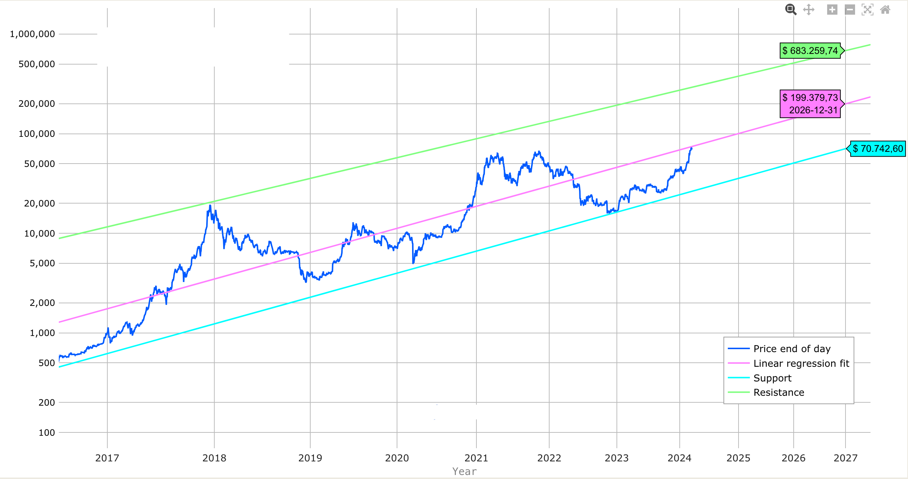

# BTC现阶段或不具备长期下跌基础

号外：教链内参3.15《全面回调！》

* * *

好风凭借力，送我上青云。

自打年初1月10日比特币现货ETF被美国SEC正式批准上市之后（参阅教链1.11文章《BTC登堂入室，SEC欲拒还迎》），BTC就在摸高到49k之后，先是用了大半个月时间一路回调至38.5k，然后按耐不住开始回升，2月8日一个鲤鱼打挺收涨5%站回到45k上方，自此马不停蹄地从45k一路扶摇直上，至1个月之后的3月13日就收到了历史新高72.6k，有效突破并超越2021年11月10日69k前高，发出了牛市的技术性信号。

正如2022年12月份教链在《2022年终复盘展望报告》中，指出当时16-17k很可能是周期低点；那么，当现在，2024年3月份，BTC已经突破前高，来到70k附近这个历史新高度时，教链已经在3月14日教链内参《研究称BTC将在4月初升至77k，90天内升至14.6万刀》中提示中场风险正在升高了。当时内参中是这么说的：

「目前73k基本是在中轨位置了。从这里再向上，风险就开始增加。升的越高，风险越大。

「熊市去杠杆几乎都能跌个70-80%，因为这基本代表了牛市积累的杠杆有多么大的规模。就算涨到35万刀这个很多人可能不敢想的高度，回调70%就回到了10万刀；回调80%呢，就回到了7万刀，正是目前牛市启动时所在的区间。如果山顶没有35万这么高呢？那么回调后的高度就只会更低。

「因此，从7万刀开始，是此前退圈远离的韭菜们纷纷杀回来的“确认信号”，却也是市场从低风险向高风险转换的分水岭。熊市是建仓良机。现在已是牛市，很多这时候才进入的人，可能在穿越这一轮牛熊之后，赚不到什么钱。」

本着料敌从宽的精神，在加密市场，5倍收益的盈亏数学期望就已经等于0了。这还是风险最低的BTC。

如果仍看旧的双对数价格走廊，2024年底的上轨37.7w刀，下轨35.5w刀。2025年底上轨51.2w刀，下轨5w刀。2026年底上轨68.3w刀，下轨7w刀。（参阅教链2021.7.24文章《比特币的价格走廊》）

肉眼可见的，有几个直观推断：

一、今年底我们有望看到10w+的BTC。

二、如果本轮牛市能够“充分发育”（即碰触上轨）的话，那么我们或可有幸在未来1-2年看到30w-50w的BTC。

三、如果“四年周期”依然有效，那么2026年底的熊市会向下轨7w逼近。这正是今天BTC的价格区间。

心中有数：
30w -70% = 9w, 30w -80% = 6w; 
35w -70% = 10w, 35w -80% = 7w; 
40w -70% = 12w, 40w -80% = 8w; 
45w -70% = 13w, 45w -80% = 9w; 
50w -70% = 15w, 50w -80% = 10w。

还记得李宗盛的《山丘》所唱的吧：越过山丘，才发现无人等候。还未如愿见着不朽，就把自己先搞丢。

希望此时进场的朋友们，越过山丘，不要迷路。到达山丘的那一边，会发现教链早已在等候。

四、如果老韭菜要“逃顶”的话，不妨把仓位分成两份：一份是5w刀以下加仓的，几乎可以不动如山；另一份是7w刀以上加仓的，或许可在向上穿越10-15w之后，分批减仓。

减仓的觉悟必须是不要想占BTC的便宜，即还想着能以更便宜的价格买回来更多。减仓就要承担应有的“卖飞”风险。将来买不回来，别后悔就行。没这个豁达的态度，必败。

你说能不能等20w甚至30w以上再开始减仓？其实你想等多少都行。那是你的自由。至于能不能等得到，那得看命。

理解概率。抛弃非黑即白的思维。

五、根据教链提出的“呼吸理论（假设）”（参阅教链2023.1.16文章《比特币2023年价格前瞻》），在2022年5月份回到水下，一直呼出到今天，似乎是早已呼尽了2021年至2022年上半年所吸入的全部气量。比特币现在整个肺活量都已用尽，亟需探出水面（中轨）去吸入新鲜空气（资金），也就是本文标题所说的，BTC现阶段或不具备长期下跌基础。

其实这个话教链早在2月29日教链内参《急冲前高已近应验，敢问前路又在何方？》中就已经说过。原话是这么讲的：

「如果从呼吸理论的角度看，现在还刚刚接近浮出水面（尚未），气息已经快要把2021牛市吸的气全部呼尽，如果不在中轨上方吸入更多气，直接崩盘扎个猛子下来，没有气在水下呼出，怎么办？似乎就不太合理。」

这段评论，是在点评当时某基金创始人称3月份BTC要回调15%的言论时给出的。

从宏观因素，也就是外因的角度看，3月份BTFP工具的到期退出，美国通胀势头再起，美联储议息会议想必不会迅速转向宽松，这些都不会是什么好消息。加上过去几个月BTC确实急拉猛涨，让人望而生畏。此时此刻，换任何一个宏观分析师来看，可能都会告诉你BTC应当走出一波幅度不小、长度不短的回调。

但是，如果我们从内生矛盾运行，也就是从内因的角度看，却又“拔剑四顾心茫然”，看不出BTC该如何在这个地方直接一个猛子扎下去。

很多人觉得肯定是外因决定内因嘛。但是，教员的《矛盾论》始终明明白白地告诉我们，是内因决定外因。“所以胜败，皆决于内因。”

外因只能通过内因发挥效果。内因不允许，外因怎么施加都没有用。就像你的孩子不爱学习，你怎么逼他也不可能把他逼成一个学霸。

我想，强大近乎神的美联储，也决然战胜不了教员的思想。

这不意味着不能插针式急跌急拉。插针的时间极为短促，不占用呼吸气量。哪怕是插一根-90%的针呢，其积分面积也几乎为零。为了爆仓，一切皆有可能。

理论推导，学术探讨。大胆假设，小心求证。不作为任何投资依据或交易建议，切记切记。
