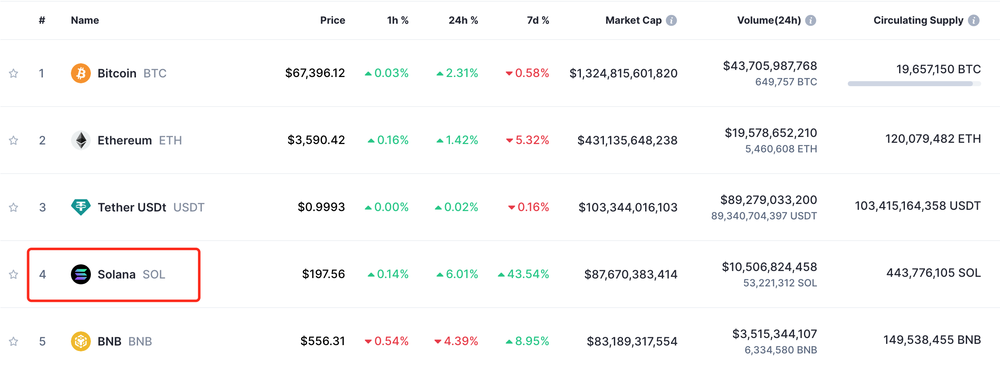
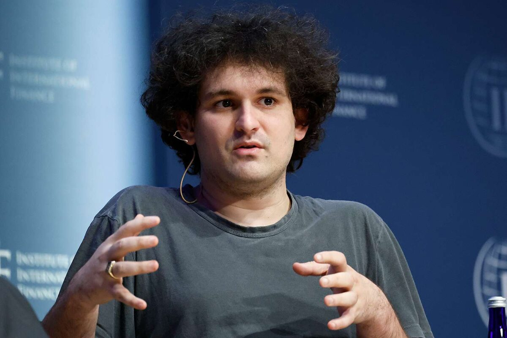

# Solana(SOL)超越BNB背后的恩怨情仇

号外：教链内参3.17《神盘已死，不用烧纸》

* * *

春色满园关不住，一支红杏出墙来。

模因好攻略，土狗高端局，神盘大将军。众盘之下盘，素有“宕机链”之誉的Solana，终于在土狗们的不懈努力之下，“红杏出墙”，勇攀新高，燃料代币SOL逼近200刀，市值接近900亿刀，超越第一“CEX币”BNB，跻身加密市场市值第四。

CEX不是SEX，而是中心化交易所的英文缩写。BNB本是币安平台的积分，后来币安想搞自己的单机链，于是有了BSC（币安智能链），后改名BNB链，以BNB为燃料代币（gas token）。彼刻，此为一时之风。教链在2021年1月22日文章《CEX的末日狂欢》中如是记述：「在这一小波牛市的尾部，CEX们开始自己下场搞公链、搞孵化了。所谓公链，就是fork复制的以太坊的开源代码，改了改名字啥的。」「搞一套技术可能不难，难的是生态，是有那么多开发者学会开发这些东西，这太难了。所以，CEX脑筋也终于转过弯了，还自己费人费钱费时间的开发啥，直接把以太坊的代码抄过来改改不就行了？大呼真香。」

但是BNB的重要赋能来源，还是在于Binance交易平台的业务量。持有BNB的人，也是冲着交易所的手续费优惠、打新活动、燃烧回馈利润等等价值而去的。可能其创始人CZ（赵长鹏）在官司缠身之前，也曾有意推动BNB链的发展，但是现在CZ已被美国扣为人质，《长鹏插翅难飞》（教链2023.11.28文章），这种打破既定内部利益格局的推动或许也就无人可以为之了。

BNB显然是一个“公司币”，其价值全系于Binance之成败与守诺。做一类比，或可将其视为一种无投票权的虚拟分红股。

CEX赛道，是华人继BTC（比特币）矿业之后啃下的第二个加密高地。在2017-2021这个周期，全球交易量最大的CEX平台，华人创办运营者，雄踞前列。

华尔街资本对于大举进入加密市场，所最担心的无非有二：一，BTC采矿业上下游几乎均为东方所垄断；二，加密交易平台CEX赛道，华人占据压倒性优势地位。

2021年5月，因缘际会，BTC采矿业被国家主动“帮助”进行了“去中心化”。矿业资本流出东方，分散到了世界各地。美国加密矿场和矿池迅速崛起。（参阅教链2021.6.27文章《杀君马者道旁儿》）

同期，美国白人小伙儿、“爆炸头”（因其外表形象得名之外号）SBF（全名Sam Bankman-Fried）于2019年5月所创办的交易平台FTX崭露头角。

今天，SBF已经在监狱里蹲了1年零3个月有余了。2022年12月12日，他在巴哈马被捕，随即被引渡回美国。

出道比CZ晚，进去比CZ早，SBF的加密之旅，如烟花之绚烂，究竟是没能活过BTC一轮周期。

而CZ创立的Binance，是在比FTX早两年的2017年7月，那一轮牛市而起。穿越2021年牛市，至今仍是全球交易量最大的CEX，却也在新一轮加密牛市到来之前，匆匆换帅。（参阅教链2023.11.22文章《美国鲸吞币安，长鹏认罪伏法》）

真道是：

滕王高阁临江渚，佩玉鸣鸾罢歌舞。
画栋朝飞南浦云，珠帘暮卷西山雨。 
闲云潭影日悠悠，物换星移几度秋。
阁中帝子今何在？槛外长江空自流！

话说回到FTX在2022年的崩盘，这是促成SBF新星陨落的直接原因。而促成FTX崩盘的直接诱因和“罪魁祸首”，却也正是CZ。

时钟拨回到2022年11月。那正是新一轮熊市的“至暗时刻”。彼时BTC已经有效跌破3万刀牛熊分界线，并一路破位2017前高2万刀，跌到了“深不可测”的1.6-1.7万刀区间。整个加密市场陷入了巨大的恐慌和流动性危机之中。（参阅教链2022年年终复盘展望报告）

瞅准时机的CZ，仅仅通过在推特上的一系列言论攻击，就将外强中干的FTX一击必杀，堪称令人啧啧称奇的商战案例。其情其景，绝不逊于三国演义中，诸葛亮阵前骂死王朗的经典一幕！

11月初，CZ突然出招。指责FTX已资不抵债，要抛售所持有的FTT（FTX的平台币）。SBF起初回怼，但打铁还须自身硬，实际已经被他自己亲手掏空身体的FTX，在韭菜闻风而逃的挤兑中迅速崩溃。

SBF不是被自己的双手掏空了身体，而是被他的小女朋友掏空了身体。在FTX之前，2017年11月，他搞了一个加密量化交易基金Alameda Research —— “量化交易”、“研究”这样的字眼显然都是高大上词汇的障眼法，Alameda本质上就是一个炒币基金 —— 并交给他的小女朋友 Caroline Ellison 掌舵。

而SBF自己，则亲自负责悄悄地在背后把FTX平台上海量炒币用户的“存款”挪用，源源不断地向Alameda“输血”，供其小女朋友炒币。可惜的是，小女朋友炒币技术不佳，亏得个底朝天，爆仓连连，把挪用的公款给输得精光。

就在这种情况下，CZ出招了。果断，精确，狠辣。一剑封喉。

十步杀一人，千里不留行。

SBF扛不住压力，决定向CZ下跪求饶。8日，CZ称FTX正在寻求Binance对其进行收购。

9日，CZ称经过DD（收购前的尽职调查），决定中止对FTX的收购。

SBF气得破口大骂，称CZ利用假意为之的收购，利用调查的机会，进一步窃取了FTX的数据和机密，并反手补了一刀，让一息尚存的FTX彻底归了西。

11日，FTX正式宣告破产。未及提币逃生的众多用户，伤亡惨重。

SBF张皇失措，匆忙出逃。

12月，SBF在巴哈马被捕。

在SBF崛起之路上，曾受CZ提携。Binance在FTX早期，就曾参与投资，并获得了一定的FTT平台币。对同行后辈的投资，实则有两重含义：其一，可以看作是对后起之秀的提携，在资金和经验上予以支持；其二，则亦可看作是对潜在未来竞争对手的先下手为强，收下做弟子，从此入师门。

可是SBF骨子里终究是个白人。精明到每一个毛孔的犹太血统，让他不可能甘心自此俯首拜于黄皮肤、褐眼睛、黑头发的CZ的门前廊下。

在加密市场牛市如火如荼的2021年前后，SBF频繁出入华尔街和国会山，“谈笑有鸿儒，往来无白丁”，与花街大佬过从甚密，和国会老爷谈笑风生。在2022年美国大选中，SBF一掷千金，给民主党捐赠了高达3980万美刀的政治献金，成为仅次于索罗斯的第二大个人捐赠者。

作为CZ提携过的晚辈和小弟，他飘了。他多次公开发帖，点名讥讽CZ就是个暴发户而已，根本不可能有机会跻身美国政要高层。话里话外的弦外之音，他SBF必将借助第一霸权之力，把CZ踩在脚下。

SBF终究还是太年轻。又或者，他很好地遗传了血统里的那种目空一切、唯我独尊的气质，丝毫不懂得掩饰眼中的杀机、嘴上的锋芒。

以隐忍为强技的华夏神力，专克此等浮薄不逊的毛头巨婴。

SBF押中了民主党，却被CZ精准狙击、一枪爆头。

SBF虽然不在了，但是他的身后却留下了大量的政治遗产。Solana (SOL)便是其中之一。（SHIB其实也是，本文不再展开。）

教链在2022年6月2日文章《Solana沦为“宕机链”：TPS修正主义的又一次失败》中写到，「自从去年下半年新公链猛炒了一波，Solana在SBF的资本运作之下脱颖而出之后，它就迅速遭遇了一次著名的停机。」

自2021年下半年至2022年上半年，Solana不停地宕机，但也丝毫不能阻挡SBF这个操盘手的拉盘热情。《Solana拉盘出信仰》。虽然是2023年12月21日的文章，但是放到3年前，丝毫不违和。

华尔街的大佬，国会山的老爷，跟着SBF这个小弟弟，大口吃肉，大碗喝酒，赚个盆满钵满。SBF一时之间，成了为他们招财进宝的善财童子。

可就是这么一个人见人爱的招财大宝贝，竟然被出自东方的CZ给一招毙了。断了老爷们的财路，老爷们岂能善罢甘休？何况还是手握世界第一霸权的老爷们？

于是2023年底，美国老爷们终于把CZ“请”到了美国。（参阅教链2023.11.22文章《美国鲸吞币安，长鹏认罪伏法》）

而作为全盘复仇中的一环，Solana的拉盘，给老爷们解套，也是绝不可少的。

毕竟，携新公链之威名，干翻创始人出身俄罗斯、天使投资来自东方的以太坊（Ethereum），也是十分符合时下帝国的政治正确的。

于是我们看到2022年底投研机构Messari吹响Solana进攻以太坊的号角（参阅2023.12.20教链内参《Messari看空以太坊，ETH/BTC再创新低》），看到《Solana拉盘出信仰》（教链2023.12.21文章），看到Solana模因土狗生态爆炸，看到“神盘3天上币安”（参阅3.16教链内参《神盘3天上币安，谁破防了？》），看到华尔街风投发文鼓吹，“模因币并非零和游戏，而是一种新的资产类别，并且其市场规模可能比博彩业还要大10倍。”

把CZ拉下马，关起来。再把SBF的遗产Solana拉起来，土狗泡沫吹起来。然后把“我，秦始皇，打钱”的拙劣诈骗手法一般的土狗神盘，光速上了币安（Binance）。其情其景，宛如将一位万千韭菜心目中苦求不得的白月光女神，扒个精光，再让一生着癞疮、蓬头垢面、脏兮兮无比、嘴角流涎的流浪汉，将其强上，还要直播给全世界的韭菜看，吸引一群韭菜跟风而至，大泄欲火，精尽人亡。

世界第一霸权，可不只是嘴上说着玩的，全都是真刀真枪的功夫。

模因币和土狗币们，也终于在以太坊“贵族链”发迹（ERC-20代币）、比特币“生态”新生（BRC-20铭文）之后，找到了更快、更便宜、更黄更暴力的Solana平台。真tnnd天作之合（此处请用《亮剑》李云龙配音朗读）。

而Solana也终于超越了BNB，冥冥之中完成了对Binance的复仇。

自此，加密市场便呈现了极其滑稽和可笑的排面：

除了第一名比特币坚持去中心化，第二名以太坊PoS半中心化之外，老三USDT是纯正的中心化代币，老四Solana是中心化区块链，老五BNB是中心化交易平台平台币。

市值最大的加密资产，五分之三都是纯正的中心化标的！

这，就是牛逼哄哄的加密行业当前的现状。

自古暴利诱之而不改其志者，鲜矣！

在土狗喧嚣的噪音之中，谁还会记得中本聪当年的话呢：

“由于自 20 世纪 90 年代以来所有那些失败的公司的缘故，很多人自动地把电子货币看作是注定不会成功的事情。很明显，仅仅是因为那些系统的中心化控制的本质让他们注定失败。我认为这是我们第一次尝试去中心化、基于非信任的系统。”（刘教链《比特币史话》第十章第44话）

诗云：

加密江湖风云荡，你方唱罢我登场。
恩怨情仇轮回苦，拿住比特岁月长。
