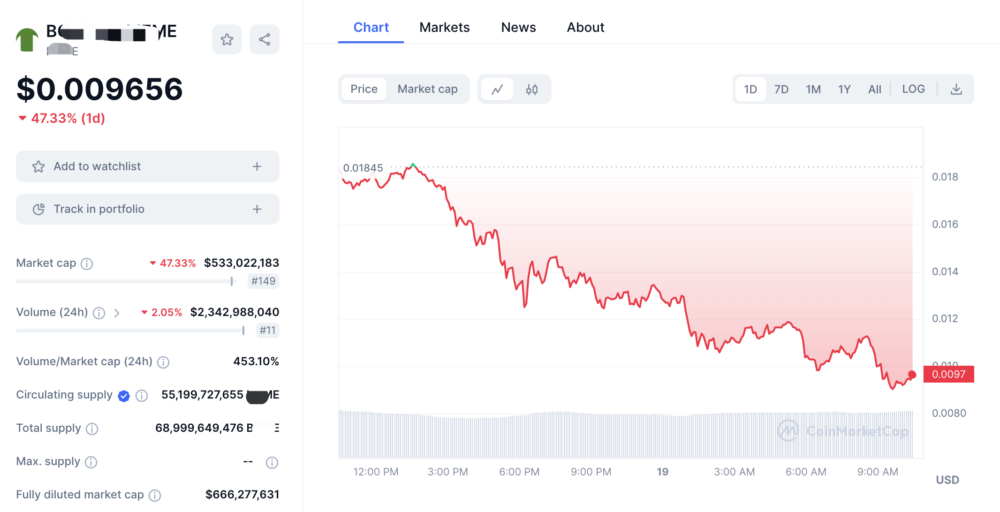

# 熊市买入，长期持有

号外：教链内参3.18《美联储开会前，土狗的末日狂欢》

* * *

昨夜星辰昨夜风，画楼西畔桂堂东。

随着“土狗链”Solana上土狗模因的快速借鉴、抄袭、复制，资金、韭菜和关注度迅速被分散、稀释和冲淡，第一神盘24h近乎腰斩。3.17教链内参一语成谶：《神盘已死，不用烧纸》。

早在3.16教链内参《神盘3天上币安，谁破防了？》中的话，言犹在耳：「破防之后，就是眼红。眼红之后，就是一窝蜂地抄袭。抄袭一起，骗子就多了。十盘九骗。恐怕接下来万盘齐飞时，冲进来接盘的韭菜们要好好出出血了。」

万千土狗敢死队员们的命运，早已在冥冥中标好了价格。

在投机市场中，还有什么比千里送人头，把斩断自己人生命运的铡刀交到操盘者的手上，飞蛾扑火一般地给操盘手送钱，更令人叹息的事呢？

菩萨说：众生皆苦。不过那经文，却早已没了出处。

娃儿问我：为什么投资亏钱的人是大多数呢？

我答：因为他们都喜欢往人多热闹的地方扎堆儿。数学分布严格决定了，赚钱的人只能是少数。一人赚10块，必须有10人各亏1块。于是，根据概率原理，与大多数为伍大概率会亏钱。与11人为伍，有10/11 = 90.9%的概率会是亏掉1块的输家。

娃儿悟了：因为他们都想赚钱，所以他们都亏了。

我说：对的，正是如此。他们被赚钱的欲望，蒙蔽了双眼。

娃儿若有所思，又问：那如果他们都想着亏钱，是不是他们就会赚钱了？

我答：是的呀。这正是我常说的，“逢跌加仓”。

娃儿懂了，说：那我知道了，有一个投资的秘诀。

我问：是啥呀？

娃儿说：熊市买入，长期持有。

我说：对，说的非常正确！

娃儿又连忙补充：只适合于优质的、不会归零的标的，比如比特币。

我击节赞曰：没错。

娃儿又问：是不是还要加一个“牛市卖出”呢？

我回道：如果一项投资你知道它会一直涨，那么在不需要用钱的时候，需要卖出吗？

娃儿说：不需要。一直拿着就好了。

我说：是的，长期持有就可以了。

过去，所谓“八字诀”讲的是，“坚持定投，逢跌加仓”。这是战术操作。今天，我们谈的“熊市买入，长期持有”，则是战略思想。

孔子说：学而不思则罔，思而不学则殆。（《论语·为政》）

只是去冲、去梭，却不知道思考总结策略、心法，那就会稀里糊涂地亏钱。整天沉迷于理论、分析，却不敢真金白银下场操作，那最终只会是镜中花、水中月，什么结果都拿不到。

更直白地翻译一下：没有研究的仓位是送钱，没有仓位的研究是扯淡。

孔子又说：敬鬼神而远之。（《论语·雍也》）

鬼手，神盘，只可远观，不可亵玩。神盘是销金窟。神盘是骷髅镜。神盘是埋骨地。

身后有余忘缩手，眼前无路想回头。

莫不如，打一开始，就不要入了迷局。

孔子还说：富而可求也，虽执鞭之士，吾亦为之。如不可求，从吾所好。(《论语·述而》）

富贵如果可以求得，即使是给别人赶马车的车夫，我也愿意去做。如果不可求，那就做符合我的兴趣、自己喜欢的事情。

在当今社会，送外卖、开网约车，大致上相当于孔子说的“执鞭之士”了吧？其实大多数的职业，基本也都属于碌碌之功而已。关于这一点，多读几遍《资本论》就十分豁然了。

关键问题在于，富贵如何才能求得？

对于这个问题的思考，教链已经写在了《从投资小白到财务自由》（2021.8.21文章）、《储蓄比特币给你财务自由》（2021.3.19文章）以及《人生储蓄比特币》（2021.1.9文章）等几篇里。

一份索然无味的工作，如果能够长期为我提供储蓄BTC之资，那么它就蓦地看起来没有那么面目可憎了。

储蓄BTC，确实拉平了职业的天然差异，让从事不同职业的人和人之间，变得更加平等。

若此法为孔子所知，其或赞曰：虽执鞭之士，囤BTC，富而可求，吾亦为之。

