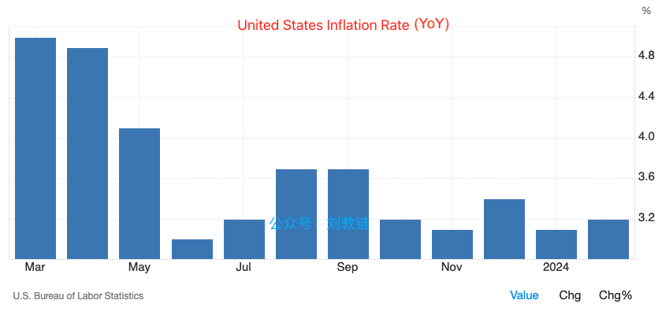
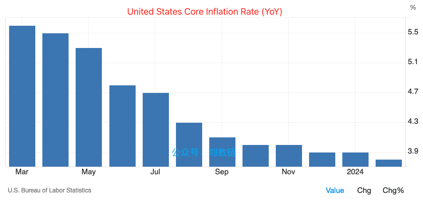

# 美联储掩耳盗铃，比特币应声大涨

号外：教链内参3.20《多头反攻30日线支撑》

* * *

晓看红湿处，花重锦官城。

一切就像是早有预谋似的。BTC（比特币）用了6天时间，自14日7dMA（7日均线）上方的73.8k，一路跳崖，下来踩一踩30dMA（30日均线）的63k，非要试一试这里的深浅。20日，《多头反攻30日线支撑》（3.20教链内参），成功守住这个关键心理支撑位，收到了30dMA上方的63.6k。

翌日晨，美东时间20日下午2点，美联储结束了为期两天的3月份议息会议，对外发布了会议结论：维持联邦利率5.25-5.5不变。维持2024年内3次降息预期不变。

此言一出，风险资产暴涨，标普500指数遽然拉升，再破历史新高5240点。避险资产暴涨，徘徊多日的黄金猛然拉升，突破历史新高2200刀/盎司。加密资产暴涨，BTC结束了对支撑位的试探，掉头向上，猛攻至67-68k，将30日均线远远甩在了身后。

犹记3月16日教链文章《BTC现阶段或不具备长期下跌基础》。回测30日均线，踩踩更健康。时间换空间，为接下来继续牛市之路奠定更为坚实的基础。

前几日听信空头、恐慌下车的，或者贪图新低、不敢上车的，这下子又要口瞪目呆、瞠目结舌了。大饼（BTC）急涨的时候，盼着它倒车接人。可当大饼真的倒车接人时，却又扭扭捏捏不上车。神仙都救不了。

所以教链的八字诀讲的是“逢跌加仓”，而不是“逢低加仓”。因为几乎目之所及的所有人，就没有几位能精确抓住低点的。包括教链自己。

正因为根本无法判断什么是“低”，所以，遇到大跌打折的机会，该上就得上。

打折促销的时候不买，那就等涨价之后再买咯。

美联储现在，显然是不惜睁眼说瞎话也要为降息做预热。这就应了教链早在3月9日所说的：“美联储嗅到危机！”（刘教链2024.3.9文章《比特币、黄金历史新高：美联储嗅到危机！》）

在20日文章《日本结束负利率，美联储是否会跪倒在渡边太太的石榴裙下？》中，教链指出，“现在日银加息了，这就把难题抛给了美联储：是继续维持高息甚至拉得更高，维持套利空间不变，留住渡边太太们；还是顺势借坡下驴，降息放水，把渡边太太们撤离后留下的空洞给填满，撑住资产价格？”

美联储看起来有两个选项，其实可能只有一个必选项，那就是——降息、放水。因为日增万亿的美国国债，再这么硬撑下去，没有把东边的对手耗死，自己可能要先崩溃了。（延伸阅读：教链2023.9.26文章《架空美联储：鲍威尔和高息，哪个先下台？》）

其实早在去年2023年9月5日教链内参《美元美债一盘棋&现货ETF获批时间的推演》中，就对美联储有必要在2024年中或3季度前降息进行了推定。推定的依据就是当时耶伦执掌的美国财政部超额发债，承诺次年也就是2024年年中回购。当时内参中是这样写的：「所以大家看到，耶伦在8月份大发债的时候，甚至还多发了一些，说是今天多融一些米，明年好回购。明年年中或Q3回购，回购高息债，置换为低息债，这是一个降低负担的思路。如果是这样打算的话，鲍威尔就要在置换之前配合把利息给降下来。」

为什么我们说美联储对此前天天挂在嘴边犹如“圣旨”一般要紧的通胀忽然“视若无睹”了呢？不妨简要回顾一下过去数日的教链内参中，对于宏观层面的追踪报告：

* 教链内参3.12《以太坊坎昆升级是否会打开上升空间？》：「主要和核心年度通胀率均略高于预期。」「同时，月度消费者物价和核心消费者物价上涨了 0.4%。」
* 教链内参3.13《以太坊坎昆升级完成，助力L2阻击新公链》：「强于预期的美国通胀数据进一步给美联储何时开始降息的前景蒙上了阴影。周二的数据显示，美国2月份的总体通胀率加快至3.2%，高于预期和1月份的3.1%，而核心通胀率从3.9%放缓至3.8%，但仍高于共识的3.7%。」
* 教链内参3.14《研究称BTC将在4月初升至77k，90天内升至14.6万刀》：「美国生产者通胀率高于预期，初请失业金人数减少，使投资者重新调整了对美联储降息的押注。2024 年 2 月，美国最终需求生产者价格指数月率上升 0.6%，创去年 8 月以来最大增幅，是预期的两倍。」
* 教链内参3.15《全面回调！》：「自 CPI 和 PPI 数据高于预期以及初请失业金人数减少以来，美联储降息的不确定性促使投资者重新调整对宽松货币政策的押注。美联储6月降息的可能性已从一周前的74%降至约50%，这削弱了持有非收益资产的吸引力。」
* 教链内参3.18《美联储开会前，土狗的末日狂欢》：「由于美国通胀数据强于预期，抑制了提前降息的预期，美元和国债收益率走强。」
* 教链内参3.19《加密瀑布，利空扑面而来》：「由于通胀数据强劲，交易商们已经缩减了对 6 月份降息的押注。」
* 教链内参3.20《多头反攻30日线支撑》：「市场普遍预期美联储将把利率维持在当前水平，而在美国通胀数据强劲的情况下，市场缩减了对 6 月份降息的押注。」

鲍威尔领导的美联储，视数据为天命，不敢稍有僭越。可这会前的风声鹤唳，敢情就是为了惊吓一波市场，暴打一下多头是么？

看看会后鲍威尔是怎样掩耳盗铃的说辞吧：

「今年某个时候开始降息是合适的。」

「如果劳动力市场显著疲软，那么就会是降息的理由。」

「尽管最近数据有所变化，但通胀数据并未改变整体情况，即通胀逐步下行」

「不久之后放慢缩表步伐是适宜之举。」

翻出来美国通胀数据（年率）：

再翻出来核心通胀数据（年率）：

请注意，上面图表的Y轴不是从0开始的，这在直观上给人造成了一种视错觉。我们扩展一下大概应该是下面这样，直觉才更符合现实：

通胀：

核心通胀：

于是乎：横看竖看两相宜，解读全凭一张嘴。

如果要鹰派一些，那就说，我们现在离2%的通胀控制目标还很有距离（而且看起来减缓速度显然在降低，离目标更加遥遥无期）。

如果要鸽派一些，那就说，我们看到整体趋势在逐步下行嘛。

由此我们也就看穿了美联储的伪装和假象：它根本就不是根据数据进行决策，而是根据政治需要做出决策，然后倒过来根据决策的需要去解读数据。

枝上柳绵吹又少，多情总被无情恼。

无情出块、一往无前的比特币，无情加仓、坚定持有的囤币人，是这个市场上最无烦恼的。

意志孱弱、瞻前顾后的美联储，必败无疑。

意志如钢铁般不可撼动的比特币人，必将获胜。

