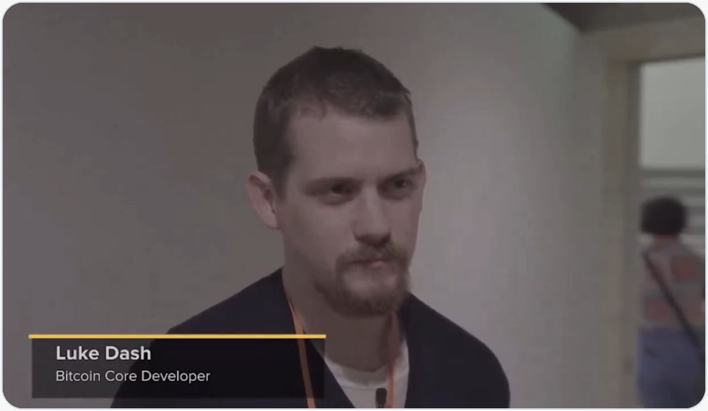
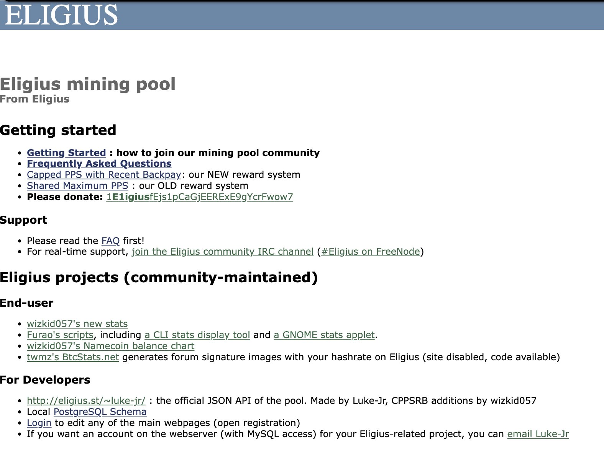
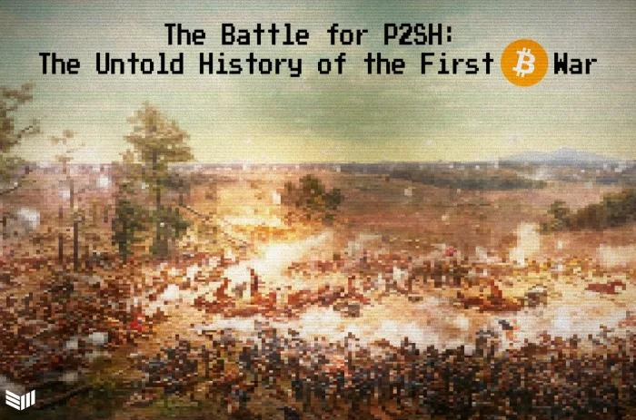
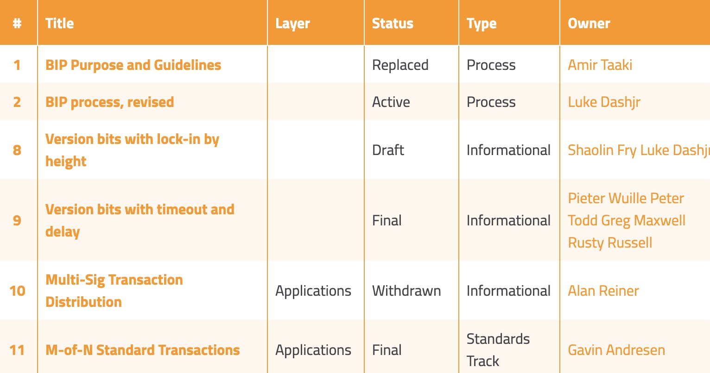
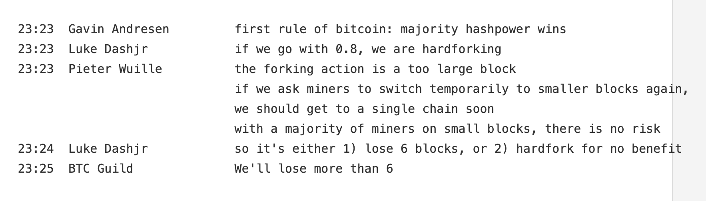
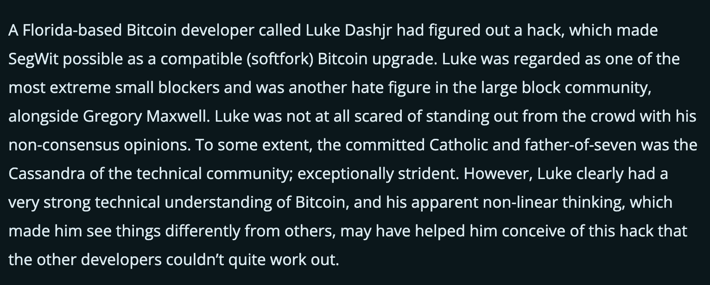
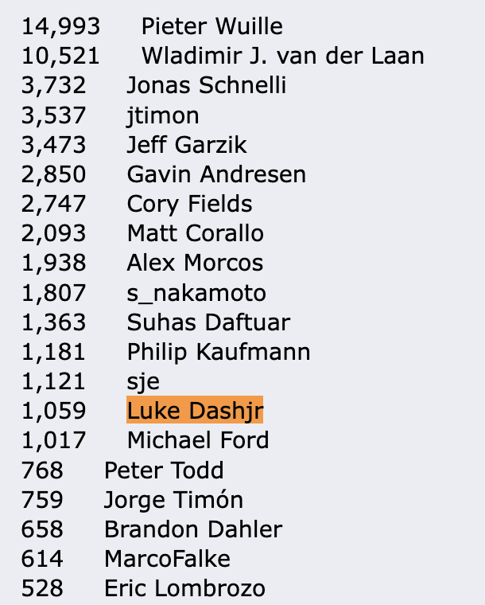
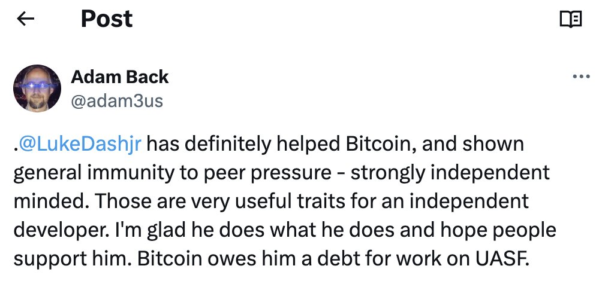
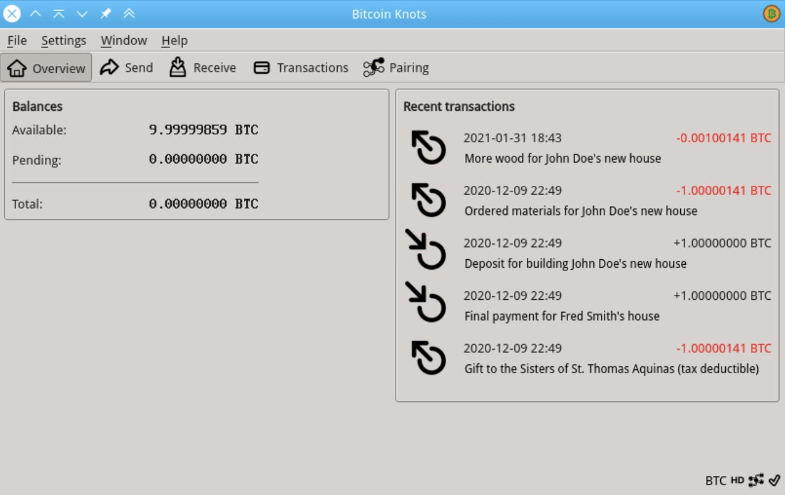

# Luke Dashjr: 比特币传奇

号外：教链内参3.21《BTC后市两点看多、两点看空》

* * *

青海长云暗雪山，孤城遥望玉门关。

当比特币在2021前高69k下方盘旋之际，市场对于后市多空，分歧显著。教链昨夜在3.21教链内参《BTC后市两点看多、两点看空》中已尽阐释，此处不再赘述。

去年所谓比特币生态上BRC-20铭文模因币火爆的时候，有一个OG（老炮）开发者跳出来，以虽千万人吾往矣的大无畏精神，与被“比特币生态”的绚烂烟火激起狂热情绪的整个社区逆行，振臂高呼：序数（ordinal）就是骗局，铭文（inscription）是对比特币主链的攻击，应当升级比特币客户端，过滤这些垃圾数据！

不了解这段过去不久的故事的朋友，可以回顾一下教链的几篇文章：
《他想要杀死铭文》（2023.12.7文章）、
《铭文杀死比特币》（2023.12.26文章）、
《铭文是更好的NFT》（2023.12.30文章）、
《向比特币核心铭文漏洞提交了意见》（2023.12.11文章）、
《内参：铭文已被CVE和NVD漏洞数据库收录》（2023.12.10内参）、
《内参：疯狂的铭文》（2023.12.15内参）、
《内参：铭文和BTC的反向运动》（2023.11.19内参）、
《模因之王BRC-20》（2023.5.4文章）、
《历史是一个圈》（2023.5.2文章）、
《ordi的博傻共识》（2023.12.8文章）。

这个试图以一己之力给铭文狂热盖棺定论的男人，叫做Luke Dashjr。你说他不自量力也好，你说他不识时务也罢，你不得不承认，比特币历经磨难，闯过多少生死关口，从2009年一文不值，一路走到2024年3月份目前接近7万美元，在每一个历史的岔路口，都极其幸运地选择了正确的道路，与自其诞生以来，从创始人中本聪开始，一代代坚守初心、矢志不渝、不惧挑战的关键开发者的努力和守护，密不可分。

今天我们要说的这个Luke Dashjr，被推特创始人Jack Dorsey誉为比特币的“守护天使”（Guardian Angel）。从2010年比特币不到1美元时，他就开始参与到比特币的开发工作中，义务贡献至今，在比特币发展的几个重要转折点中，发挥了重要的作用。下面，我们就来回顾一下Luke Dashjr的比特币之旅，由教链根据网友Peter Rizzo的帖子汇编整理而成。

Luke Dashjr是在2010年末，从某个跨年夜晚会的IRC聊天频道中，发现了比特币。当时比特币的价格大约是0.3美元（或者更低）。

但是仅仅在半年多之后，比特币迎来了历史上第一个牛市。2011年6月，据记载，比特币的价格从0.06美元飙升到了29美元，一年涨了500倍！

2011年，Luke Dashjr建立了比特币历史上第一个矿池：Eligius。这个矿池累计开采了超过30万枚比特币。对用户完全免费！

教链简单解释一下：比特币是通过提供算力开采产生。矿工可以自己一个人挖，也可以把自己的算力接入矿池，人多力量大，挖到比特币之后，按照算力贡献度分配。通常而言，矿池会收取一些手续费。不过当年Luke Dashjr建立的第一个矿池，则是完全公益地提供给所有想挖比特币的人免费使用。关于比特币的工作原理，可以阅读教链的《【硬核】一文读懂比特币》（2020.6.9文章），或者花点儿时间，在线学习教链的30节音频课《比特币原理》。

2012年，在P2SH软分叉方案上，中本聪衣钵继承人、时任比特币核心首席开发者Gavin Andresen提出的方案，惹恼了Luke Dashjr。Luke认为，Andresen的方案为比特币协议增加了复杂度，接下来会造成不可预料的后果。他发起了反对行动。他说，“如果你想要一个帝国货币的话，为什么不直接使用美联储的美元呢？”

顶着Andresen的压力，Luke决定实现一个与P2SH相竞争的方案——CHV。在这场事关比特币愿景的大辩争中，Andresen一度要求Luke彻底停止贡献比特币代码，但是Luke无视他给予的压力，继续工作。各方案的支持者们经过激励的辩论，最终通过算力投票，确定了采用P2SH方案。这场比特币历史上的第一次“战争”，划上了句号。

虽然这场“斗争”最后Luke的方案未能获得采用，但是，这为比特币代码究竟应该如何演进，以及如何在不同观点和方案中进行抉择，提供了宝贵的实战经验。

从2011年开始，Luke Dashjr正式成为一名BIP编辑。他志愿对BIP提案进行检查，评估其对比特币的造成的改变。

2013年，Luke Dashjr率先发现了一个硬分叉危机，这可能会造成比特币网络分裂。他迅速提出问题，避免了比特币遭受重创。

在2015-2017年绵延数年的“大小区块”之争中，Luke Dashjr找到了一种通过“隔离见证”，即将见证数据也就是签名数据外挂到中本聪区块之外的方法，来实现区块尺寸的扩容。这也是今天的比特币能够具有4MB区块数据的原因。

截至2016年，Luke Dashjr是全球前20位比特币贡献者名单中的一份子。这个贡献度名单的排名，完全是根据对比特币核心的代码贡献度排序。

2017年，“大区块战争”之年，Luke Dashjr是唯一个支持UASF（用户激活的软分叉）的比特币核心开发者。通过UASF协议，全体节点得以施行权利，通过了隔离见证技术的落地。

UASF的成功实施证明了，不是商业机构，也不是矿工，而是最广大的用户，驱动共识的升级。

如今，Luke Dashjr开发了比特币客户端Bitcoin Knots (https://bitcoinknots.org)，作为比特币核心的替代品。在Knots里，特别突出的，就是对网络去中心化至关重要的关键功能和特性。

如果你不想让铭文小图片充斥你宝贵的硬盘，那么你可以使用Knots客户端，打开过滤开关，“蚊虫一扫光”，从此神清气爽。

2023年，Luke Dashjr启动了一个新的矿池，叫做Ocean Mining（海洋采矿），并获得了700万美元的融资。

Ocean Mining最小化了资产托管（矿池跑路风险），通过在区块coinbase交易里直接把比特币支付给矿工，实现了去中心化采矿。（教链注：传统的矿池都是先把挖到的BTC先统一存在平台，定期发还给矿工。如果矿池跑路，就很容易卷走尚未发放的BTC。）

“一个人为人民做好事，人民是不会忘记他的。”

老兵的传奇故事，还在继续……
