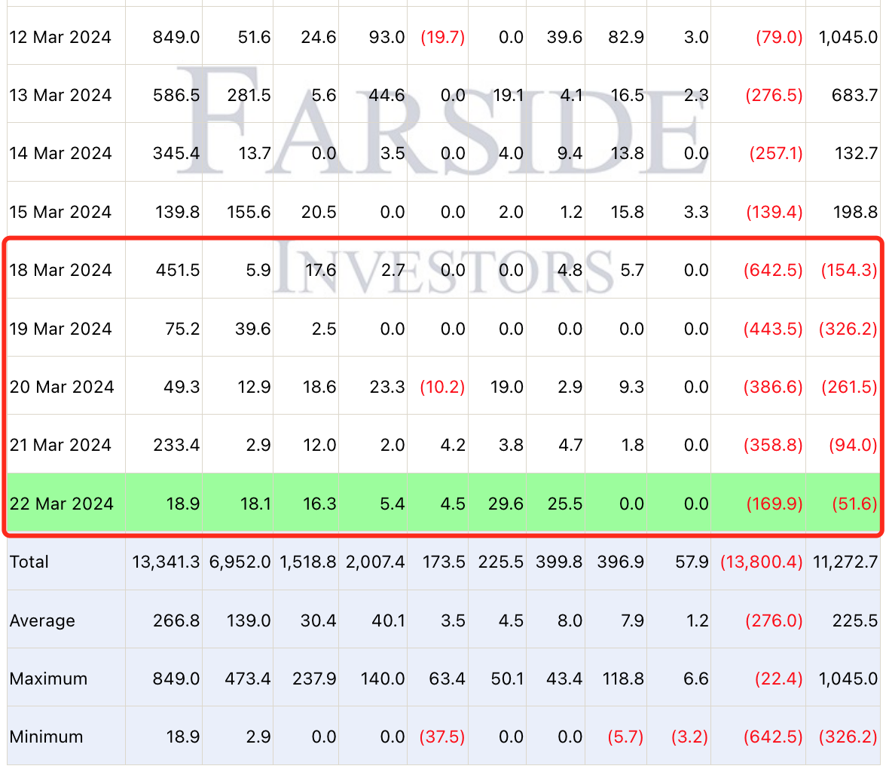
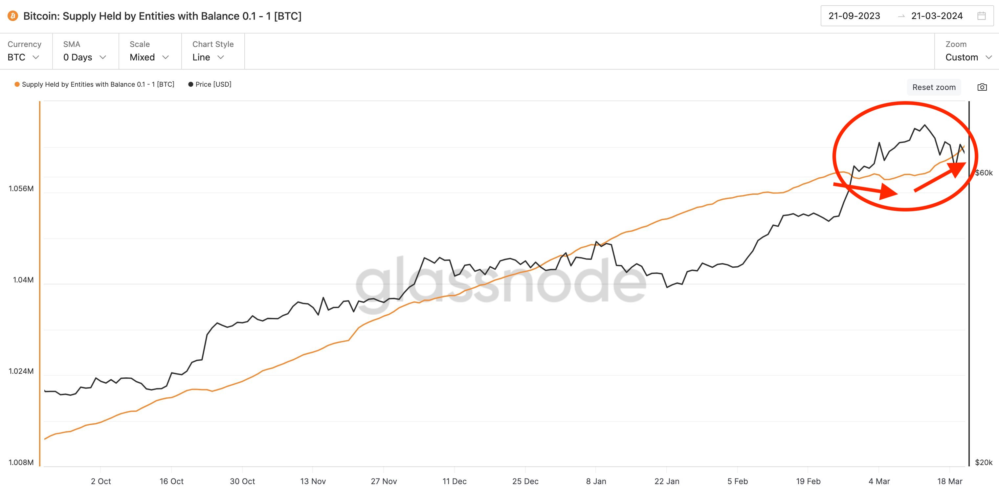
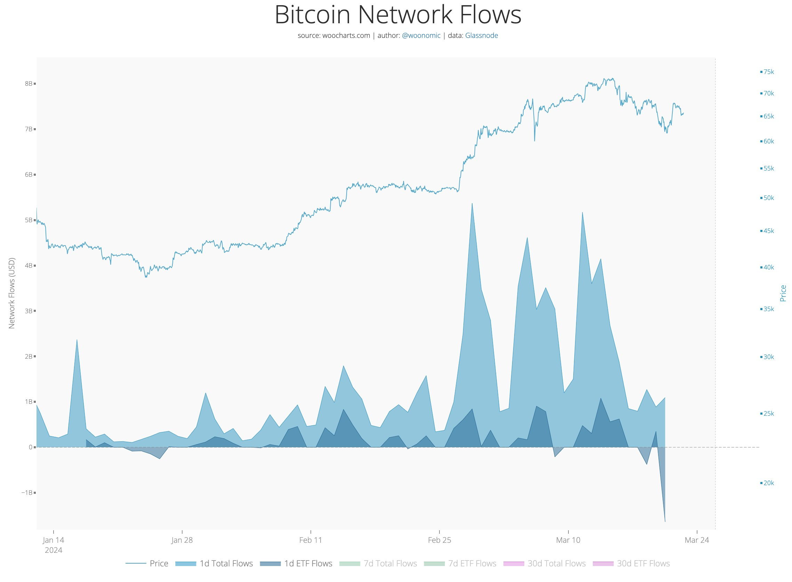

# ETF连续净卖出，链上小户逢跌加仓

号外：教链内参3.22《摩根大通称BTC抛售尚未结束，减半后或跌至42k》

* * *

相见时难别亦难，东风无力百花残。

从3月18日到22日，比特币现货ETF已经连续5日净流出。伴而随之的，是BTC从3月14日73.8k新高一路下行至今64.5k，已经回到了30日均线64k一线。

有人说，ETF的流出导致的抛压，造成了价格的连连下滑。有人说，除了灰度GBTC在流失之外，其他几支新获批ETF其实一直在保持买入，市场下跌应另有其因。

因果从来都不是一种客观事实，而是人类用来理解客观事实的一种认知工具。况且，在反身性效应强烈的金融市场上去追求因果，就像是春日午后的蓝天白云之间寻找龙。

我们常说，下跌是因为卖的量比买的量多。这其实是一种不太准确的叙述。所有的成交价格都意味着买入和卖出是相等的。一个人卖出多少，同时必然意味着另一个人买入多少。反之亦然。

价格下行的现象，微观上是在越来越低的价格上成交。卖方无法在更高的价格上找到足够的买方，而他们又急于出售，于是只好屈尊俯就，寻找出价更低的买家成交。

而价格上行则相反。市场上的买方迫切的买入，由于无法在更低的价格上找到足够的卖方，于是就去寻求更高的出价，从而推高了成交价格。

可见，下跌时，市场是一个“买方市场”，急切抛售的卖方在竞争买方的出价。而上升时，则是一个“卖方市场”，急切加仓的买方在竞争卖方的出价。

因此，当我们对市场进行切片时，就会发现观察对象会出现某种“冻结反应” —— 类似于人类在面临突如其来的危险时，瞬间腿脚动弹不得的情况。

比如，在3月初价格迅速突破7万刀关口，急剧拉升时，虾米级别的持有者群体（持仓0.1-1 BTC，持仓等级参见教链2022.5.17文章《朋友，你A9了吗？》），加仓速度明显放缓（橙色曲线）。如下图所示：

至3月14日价格开始回调以来，他们的加仓速度才又恢复。

价格上升时，市场是卖方市场。而虾米们在积累BTC的竞争中落败，因为他们提高出价的意愿，追不上价格上升的速度。

是谁把他们想买的货给买走了呢？

这从下面的图中可以清晰地看到：从2月26日起，BTC价格从5万刀附近突然开始发力加速冲高，一直冲到3月14日的7万刀以上。相应的，图中浅蓝色所示的BTC网络总流入出现了三个高耸的山峰。

ETF的买入（深蓝色）也相应出现了三个峰值。不过，并没有格外地突出和放大。

一定是有隐身大佬在爆买。但是除了明牌加仓的微策略，目前我们并不知道还有哪些巨鲸的大量买入，推动了这一次对2021前高的突破。

当价格转入下跌，特别是过去数日跌破65k之后，ETF就转向了流出。深蓝色面积转向了X轴下方，变成了负数。可见，这也佐证了教链之前在3月6日教链内参《一日熊市结束，UNI日内怒涨20%》中推断的，ETF现阶段的客户主体是散户。彼时内参中如此写道：

「我们仍然不知道，贝莱德ETF究竟是什么人、什么机构在持有。别看今天买得猛，当有朝一日逆转，夺门而逃的时候，也会发生踩踏事故。」「ETF是分散的持仓主体。和微策略这种自主行动主体不同。微策略可以自己咬牙扛熊市，ETF的散户们是乌合之众，一定会如鸟兽散的。」

「按照机构办事的进度，估计目前还真的不是机构资金在主导ETF的买入。」「这话换个角度说就是，仅仅是散户抢跑就让ETF发展一日千里了。如果机构下场，岂不是要一飞冲天？」

机构进场，肯定要挑一个好的价位和姿势。而BTC，也总是会祭出打折的优惠，来欢迎他们的进场。
