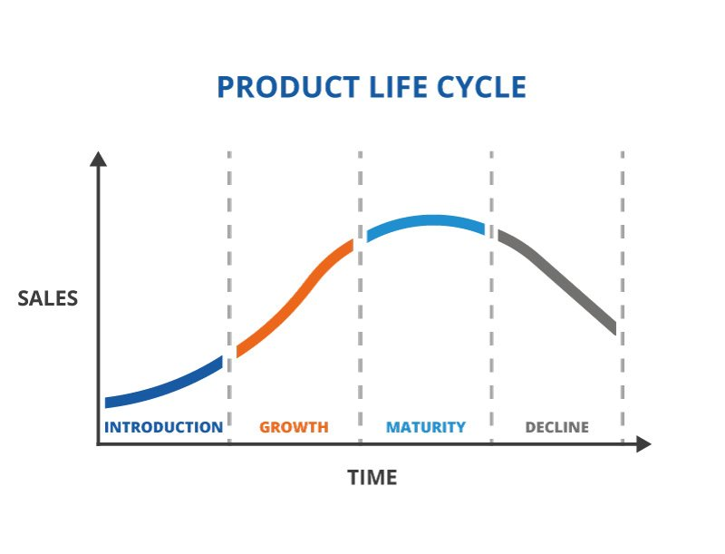
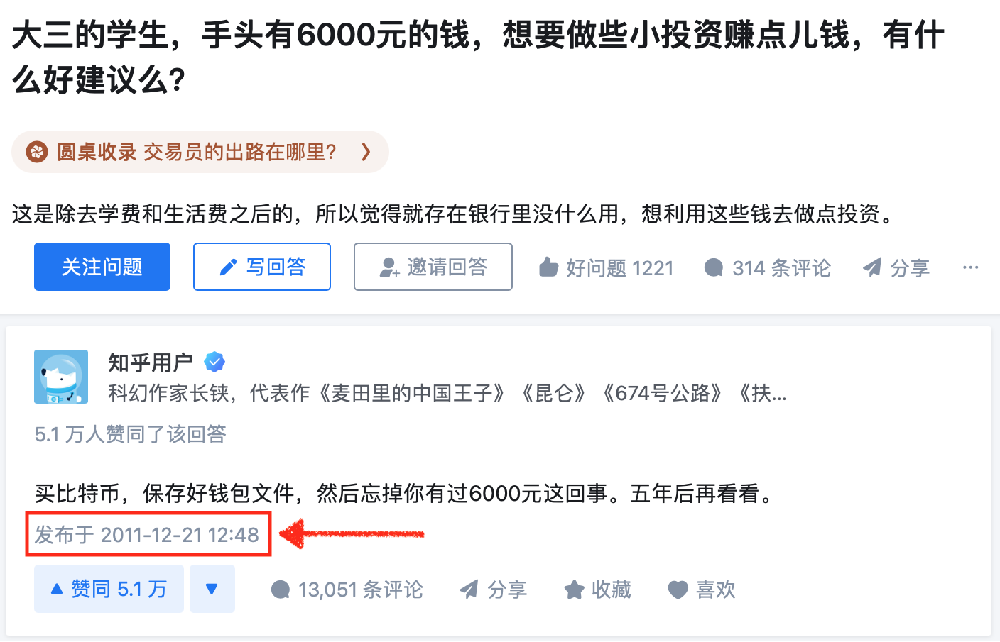
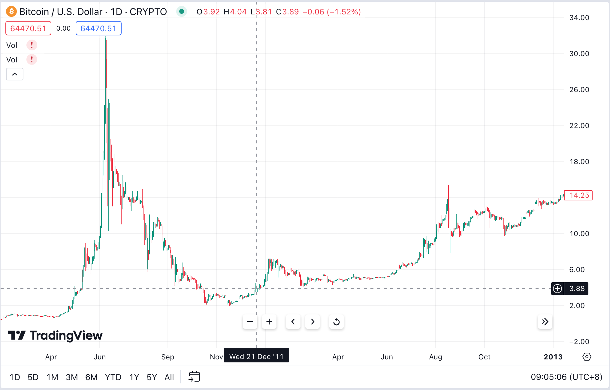

# 如果你在2010年拥有5000个比特币

号外：教链内参3.22《方舟基金木头姐上修BTC目标价至230万美刀》

* * *

锦瑟无端五十弦，一弦一柱思华年。

今时今日，BTC重回64-65k。回到2010年或者2011年初，BTC不到1美刀的时候，花费5000刀就可以轻松获得5000个BTC。又或者，2010年参与挖矿，每开采一个区块就可以获得50个BTC，开采100个区块就能轻松获得5000个BTC。

但是，当年拥有5000个BTC的人，今何在？不得不说，大部分都在历史巨浪的浮沉中，早早下车了。

如果你在2010年有5000个BTC。那么很快，随着2011年6月份超级大牛市的到来，价格最高突破30刀。你手里不名一文的资产一夜之间涨了30倍！5000刀的投入，突然变成了15万刀！而彷佛就在前一天，你还觉得这玩意儿是个游戏币。就问你会不会动心赶紧抛售获利？绝大多数人，都肯定抵抗不住获利了结、改善生活的诱惑。

你在见顶之后，急速下跌到20刀左右的时候，抛售掉了90%的仓位，4500个BTC，获利9万美刀。你用这笔收益，买了一辆梦想已久的宝马汽车。投入产出比9万-5000=17倍。你很聪明，甚至还留下了10%的仓位，500个BTC，以待后市。

结果，市场果然很快暴跌。到了2011年底，短短半年时间，就跌回到了2刀。你十分得意，幸好及早抛售，否则就要与心爱的宝马汽车擦肩而过了。

你剩下的500个BTC，现在仅值1000刀。对你而言已经不值一提。你就把它们扔在那里，忘在脑后。

时光如水，岁月荏苒。到了2013年底，你忽然从媒体上看到报道，说BTC不仅没有死掉，反而暴涨到了1200美刀！你已经快要忘掉的500个BTC，此时已经价值60万美刀了！

你赶紧回家翻箱倒柜，把好几年前抄写私钥的书本从柜子最深处找了出来。更新了最新版本的客户端，把私钥输入进去，500个BTC还在！你长出了一口气。

眼看着市场就要暴跌，现在已经回落到1000刀左右了。事不宜迟，你赶紧把450个BTC转入交易所抛售，获利45万刀。保留了50个BTC。你用45万刀，在远郊购买了一幢Summer House（夏日度假小屋）。

市场再次如你所料，很快在2014年底跌回到了200刀左右。你剩下的50个BTC，已经缩水为1万刀了。不值一提的一万刀。你又把它锁在了箱子里。

光阴似箭。一眨眼到了2017年底，你再次从朋友口中听到一个爆炸的消息，BTC居然涨到近2万刀了。真是不可思议啊！

你正好想置换一下自己的房子。于是你再一次把BTC找了出来。这次你卖掉了45个BTC，获利80万刀。剩下了5个BTC。

你搬进了新家。

就在你搬进新房子不久，2018年底，BTC跌回到了3000刀。5个BTC，缩水到了15000刀。

你感谢BTC，靠着它，你已经数次改善了自己的生活！

那5个BTC，就留个纪念吧。你觉得，几年过去，BTC从不到1美刀，最高涨到近2万美刀，这太疯狂了，太不可思议了。

你对产品生命周期理论还是略熟于心的：任何一个产品，都会经历导入期、成长期、成熟期、衰亡期四个阶段。

2011年暴涨，是第一个阶段导入。2013年暴涨，是第二个阶段成长。2017年暴涨，你想，也许2万刀，就是BTC这个产品的第三个阶段成熟了吧。那么接下去，就应该进入第四个阶段走向衰亡了？

你已经从BTC上早早连本带利获得了太多。你也不指望它能再有什么发展。你甚至觉得它应该要步入衰退了。

于是你再次将其抛诸脑后。直到2021年，你的妻子问你是不是还留有一些BTC —— 因为她从电视上看到，BTC已经涨到了6万美刀一枚！

看起来BTC并没有衰亡，反而愈发成长。你们决定抛售掉全部的BTC。因为你看到2021年走了一个大大的双头顶，看起来这一次是真的大周期筑顶，接下去要全面反转，步入衰亡期了。

不过到了最后，你还是决定保留0.5个BTC，就当作是对中本聪的致敬。

你们抛售了4.5个BTC，以5万刀左右的价格，获利22.5万美刀。正好用以缓解孩子上大学学费的压力。

到了2024年，BTC重回6万刀，并最高摸到7.5万刀历史新高时，你这位曾经拥有5000个BTC的大户，现在手里只剩下0.5个BTC。

如果你把5000个BTC拿住至今，现在它价值大约是3.2亿美刀（以64k现价计算）。而你实际上只留下了0.5个，价值3.2万美刀。

你表示，内心并不感到后悔，因为这些年来，车子、房子、子女开支，你已经从BTC这里受益良多。

但是每每回想起当年手里曾经握着的5000个BTC，你的思绪就会突然白茫茫一片，不知道应该让什么涌入自己的脑海。

此情可待成追忆，只是当时已惘然。

在2011年末的时候，有一个自称大三学生的用户，发问称自己有6000元，有什么比较好的小额投资建议么？

2011年12月21日，科幻作家长铗回复说：「买比特币，保存好钱包文件，然后忘掉你有过6000元这回事。五年后再看看。」

回看一下数据，2011年12月21日，BTC价格约为4美刀，折合约30元。6000元，可以换到200个BTC。

200个BTC拿到今天BTC 64k的话，大约价值1280万美刀，接近1个亿的“小目标”。

记得后来有人找到了当年这位同学。他没有买。不过，他也表示，从未感到过后悔。

有人常讲，多早多早就听说了BTC。其实，就算时光穿越，把你送到过去，让你回到BTC的早期，你是不是能把听说变成行动，买入后又是否能够一轮轮周期拿住，历经熊市的恐慌、牛市的诱惑，黑客的偷盗、平台的失窃，专家的唱衰、各国的打压，还能坚定持有、不动如山、穿越周期呢？其实真的是宛如西天取经一般地困难重重。

有人不喜熊市，因为熊市会亏损。这其实还是法币本位思维。熊市又如何？1 BTC恒等于1 BTC。反而因为价格打骨折，而有更多机会低价加仓。即便是法币本位思维，很多散户也能在套牢死死拿住，拒绝割肉。但是，一旦价格回到前高，牛市开启，再稍稍涨上一些，套牢已久的韭菜们就开始纷纷获利了结，“逃出生天”了。

所以牛市才是让币量减少的罪魁祸首。要警惕牛市。

真正币本位思维的比特币人，是不应为牛市所动的。

要知道，全世界总共80亿人，却最终只会有2100万个BTC，能够拥有1个BTC的人，绝不会超过全球人口的千分之3。

下车太早只因愿景太小。

云山苍苍，江水泱泱，比特之风，天高水长。
