# 比特币的时间幂律模型及其协整性再探讨

号外：教链内参3.24《24日私董会数往知来，'24年后市如何？》

* * * 

教链按：本篇是译自 Harold Christopher Burger 及 Peter Vijn 合作的论文《比特币的时间幂律模型及其协整性再探讨》（Bitcoin’s time-based power-law and cointegration revisited），理论性较强，适合有一定统计学基础的读者阅读。为了便于基础不够的读者理解，教链先做一些简单的阐释。

关于所谓的时间幂律模型，教链在过去数载曾写过多篇文章进行介绍。最早应该是在2021年7月24日教链文章《比特币的价格走廊》中对这一模型进行过专门的介绍。后来，又多次在文章中引用过该模型，典型例子比如2023年1月16日教链文章《比特币2023年价格前瞻》。继而，教链在此模型的基础上率先提出了“呼吸理论”。该理论于2023年1月16日文章提出后，又在2023年12月6日文章《【十年之约#13】比特币在呼吸》中进行了复盘，并构成了2023年12月星球内部资料《2023年年终复盘展望报告》的理论基础之一。这一点，在2024年3月16日教链文章《BTC现阶段或不具备长期下跌基础》，以及3月24日星球会员私董会（3月24日教链内参《24日私董会数往知来，'24年后市如何？》）都进行了复盘和回顾。详细情况各位读者可以点击上述各篇文章或内参，具体查阅。

在3月24日星球会员私董会，以及此前文章，比如2023年2月17日教链文章《2024奇点将至：人类尚未准备好迎接S2F大于100的巨硬资产》中，都提及了另外一个指标，即所谓的S2F硬度。关于什么是S2F硬度，不了解的朋友可以回顾一下教链曾写过的一篇小文《小科普：什么是S2F（Stock-to-Flow）》（2023.2.19文章）。业内有一位比较知名的匿名分析师PlanB一直比较推崇用S2F硬度来和价格进行建模，这就是所谓的S2F模型。不过很可惜：S2F模型是错的。但请注意，这不代表S2F这个指标没有意义，只是说，S2F硬度的变化，与价格的关系，不像PlanB所描绘的那样“激进”。

下面这个图就很清晰地展示了幂律模型和S2F模型的相对关系：

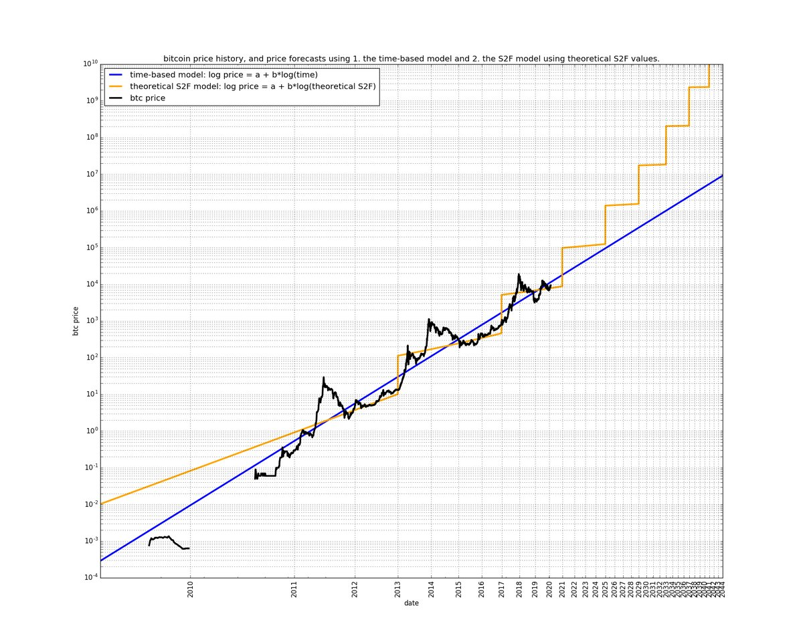

显然，S2F模型认为时间线性流逝就可以推动价格的指数增长，而幂律模型则认为时间的指数流逝才能推动价格的指数增长。

教链倾向于使用S2F硬度来形象化产量减半所导致的“相变”，但使用幂律模型把比特币变换到双对数空间中进行线性回归。幂律模型的优雅特别有支持向量机（SVM）的神韵，所以甚合我意。

下面，就是 H. Burger & P. Vijn 的论文。Enjoy!

* * *

## 导言

比特币基于时间的幂律，最初由 Giovanni Santostasi 于 2014 年提出，我们于 2019 年重新表述（作为走廊或三参数模型），描述了比特币价格与时间之间的关系。具体来说，该模型描述了比特币创世区块之后的天数对数与比特币美元价格对数之间的线性关系。

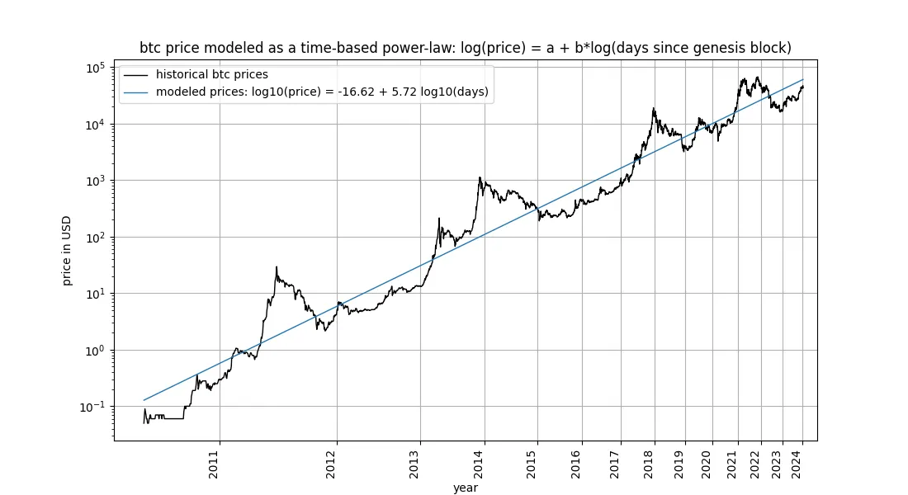

该模型吸引了包括 Marcel Burger、Tim Stolte 和 Nick Emblow 在内的多位批评家，他们各自撰文对该模型进行了 "反驳"。在本文中，我们将逐一剖析这三个批评中的一个关键论点： 时间与价格之间不存在协整性（cointegration）的说法，认为该模型 "无效"，只是表明了一种虚假的关系。

### 真的是这样吗？

在本文中，我们将对这一问题进行深入研究。这使我们认定，严格来说，协整不可能存在于时间相关模型中，包括我们自己的模型。然而，不可否认的是，协整所必需的统计属性之一在基于时间的幂律模型中是存在的。因此，我们得出结论认为，基于时间的幂律模型在狭义上是协整的，我们的批评是错误的，该模型是完全有效的。我们证明，这一结论同样适用于“存量增量比”（S2F）模型，以及在长期股票市场指数价格中观察到的指数增长。

## 概念入门

### 啥是协整性

你已经迷失方向了吗？也许你对“协整性”一词并不熟悉？别担心：因果推论和非虚假关系领域的专家、《为什么之书》的作者 Judea Pearl 声称自己对这个问题一无所知。我们将努力充分阐明手头的相关术语。

在推特上比特币相关话题讨论中，关于协整性的争论非常有趣，而且相当引人入胜。许多“存量增量比”和“幂律”的追随者都感到困惑。有兴趣的读者可以通过搜索“什么是协整”来亲眼目睹这一点。随着时间的推移，一些贡献者似乎已经掌握并完善了他们的理解，而另一些贡献者则仍然感到困惑、转换阵营或迷失方向。直到现在，我们才开始关注这个话题。

### 先了解一些背景情况

随机过程涉及随机变量。随机变量的值不是预先确定的。与此相反，确定性过程可以提前精确预测 —— 它的方方面面都是事先已知的。股票市场价格等属于随机变量，因为我们无法提前预测资产的价格。因此，我们将股票或比特币价格等时间序列视为随机变量的观测值。

相反，时间的流逝遵循确定性模式。每秒钟都有一秒钟过去，不存在任何不确定性。因此，事件发生后的持续时间是一个确定变量。

### 一个信号的固定性

在研究协整之前，我们先来看看协整的基础概念：平稳性（stationary）：

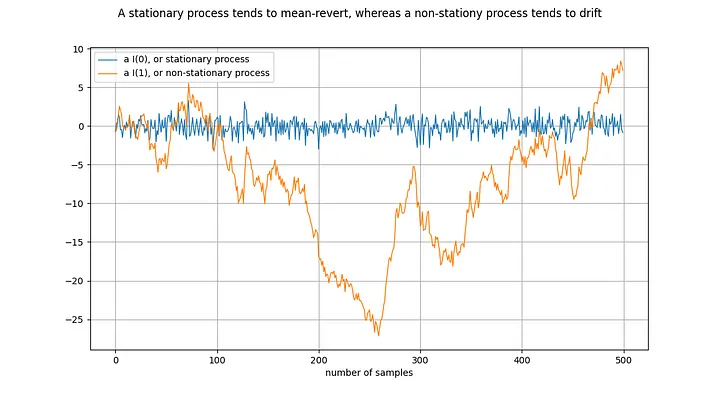

图释：将橙线差分一次，就得到了蓝线。对 I(1)时间序列差分一次，就得到了 I(0)时间序列。

平稳过程（stationary process）是一种随机过程（stochastic process），从广义上讲，它在一段时间内具有相同的性质。例如，对于平稳过程来说，其均值和方差是确定和稳定的。静止时间序列的同义词是 I(0)。源于平稳过程的时间序列不应该“漂移”（drift），而应该趋向于平均值，通常是零值。

非平稳过程的一个例子就是随机漫步，例如物理学中的布朗运动或粒子扩散：随机漫步中的每个新值都取决于前一个值加上一个随机数。非平稳过程的属性（如均值和方差）会随时间而改变，或者没有定义。非平稳过程为 I(1)或更高，但通常为 I(1)。源于非平稳过程的时间序列会随着时间的推移而“漂移”，即倾向于偏离任何固定值。

符号 I(1) 指的是一个时间序列需要“差分”（differenced）多少次才能达到静态。差分是指求取时间序列中的值与其前值之间的差值。这大致相当于求导数。平稳时间序列已经是平稳的 —— 它需要经过 0 次差分变成平稳的，因此它是 I(0)。I(1)时间序列需要经过一次差分才能达到平稳。

上图的绘制方式是，通过对橙色时间序列进行一次差分，得到蓝色时间序列。等价地，橙色时间序列是通过对蓝色时间序列进行积分得到的。

单位根过程（unit root process）指的是自回归模型（autoregressive models）（更准确地说是 AR(1) 类型），其 rho 参数被估计为等于 1。虽然我们可以交替使用 rho 和根，但 rho 指的是过程的真实值，而这个值通常是未知的，需要进行估计。估计结果就是“根”值。

rho 的值表示进程对先前值的记忆程度。u 的值指的是误差项，假定为白噪声。

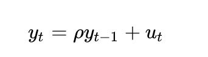

单位根过程是随机游走过程，属于非平稳过程。“根”或 rho 值低于 1 的过程往往不会漂移，因此是平稳的。即使是接近（但低于）1 的值，从长期来看也倾向于均值回归（而不是漂移）。因此，单位根过程的特殊性在于它与根值非常接近 1 的过程有着本质的不同。

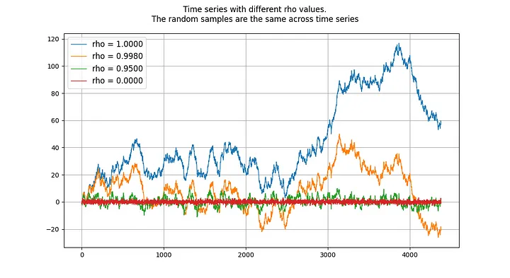

### 两个信号的协整

两个随机变量（本例中为时间序列）之间存在或不存在协整性（协整关系）。要使这对变量具有协整关系，两者必须具有相同的积分阶次，并且都是非平稳的。此外（这是关键部分），两个时间序列的线性组合必须是平稳的。

### 无协整信号示例

如果两个时间序列是非平稳的，那么线性组合（在这种情况下，我们只需选择两个时间序列的差值）通常也是非平稳的：

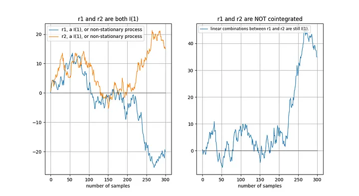

### 协整信号示例

如果两个非平稳时间序列在长期内“以同样的方式”漂移，那么线性组合（这里我们选择```r2-0.5*r1```）可能是平稳的：

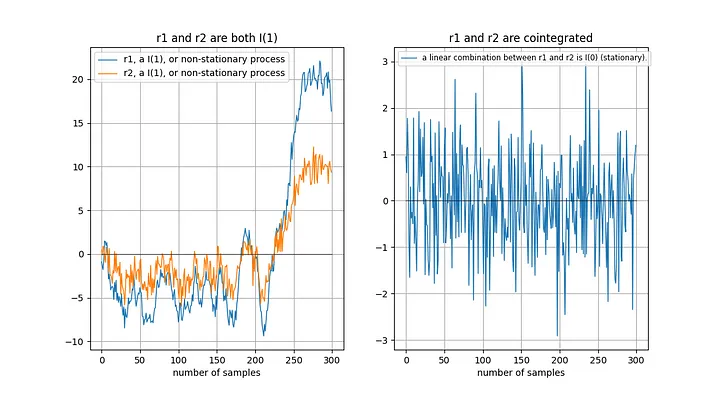

Tu 等人[1]直观地描述了协整关系：

> "时间序列之间存在协整关系意味着它们在长期内具有共同的随机漂移"。

为什么两个非平稳时间序列的线性组合是平稳的？假设我们有两个时间序列 x 和 y，我们试图根据 x 建立 y 模型：```y = a + b*x```。我们的模型误差由 x 和 y 的线性组合给出：模型误差```error = y - a - b*x``` 。我们希望模型误差是平稳的，即不会长期漂移。如果模型误差长期漂移，那就意味着我们的模型不好，不能做出准确的预测。

## 细节是魔鬼（细节决定成败）

在 Engle 和 Granger [2]（Granger 是协整概念的发明者，曾获 2003 年诺贝尔经济学奖）的《协整与误差修正：表示、估计和检验》一文中，定义了协整的关键概念和检验方法。该论文的关键是假设时间序列是随机的，没有确定性成分（我们稍后再谈）。

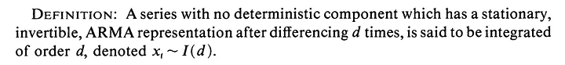

如果存在确定性趋势，则应在分析前将其去除：

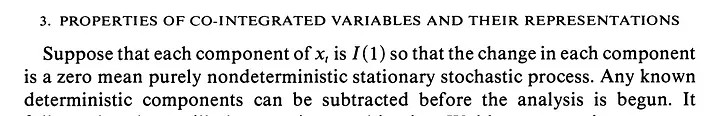

## 应用于时间和比特币价格

在基于时间的幂律中，我们有两个变量：

1. log_time：创世区块之后天数的对数
2. log_price：价格的对数

根据 Engle 和 Granger 的定义，两个变量都必须是随机变量，没有确定性成分，而且必须是非平稳的。此外，我们必须能够找到这两个变量的静态线性组合。否则，这两个变量之间就不存在协整关系。

在深入探讨细节之前，让我们先展示几张模型数据本身的图表，其中不包含任何平稳或协整概念。请注意，基于时间的幂律产生的拟合效果直观看来相当不错。残差向量（residuals vector）并没有立即显示出漂移。

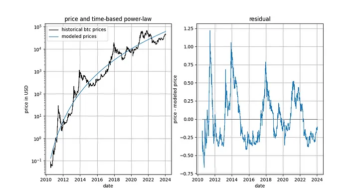

此外，该模型还显示出卓越的样本外性能（见下文）。出色的样本外性能并不意味着该模型是虚假的 —— 基于虚假相关性的模型应该只是虚假的，即无法准确预测。检验样本外性能的方法是在有限的数据量（截至某个日期）上拟合模型，并对模型未拟合的时间段进行预测（类似于交叉验证）。在样本外期间，观察到的价格经常与建模价格交叉，观察到的价格的最大偏离也没有系统性地进一步远离建模价格。

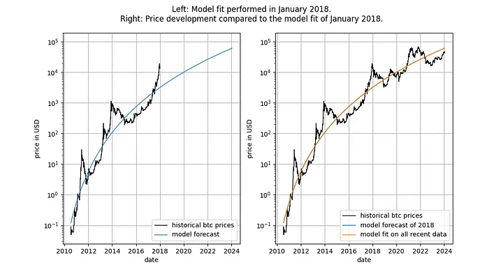

我们可以更加严格，观察模型发布之后（2019 年 9 月）的表现，因为模型发布后，我们不可能有任何作弊行为 —— 我们不能事后更改模型。

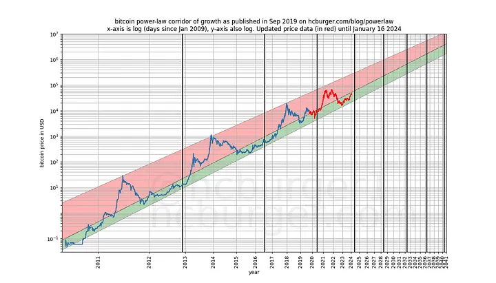

如果有人指责该模型只是基于一种虚假的相关性，那么该模型的预测能力应该已经让人感到怀疑了。

## 逐步实现协整

要使 log_time 和 log_price 之间可能存在协整关系，这两个变量必须是同阶随机变量，且至少是 1 阶随机变量。

### log_price 变量

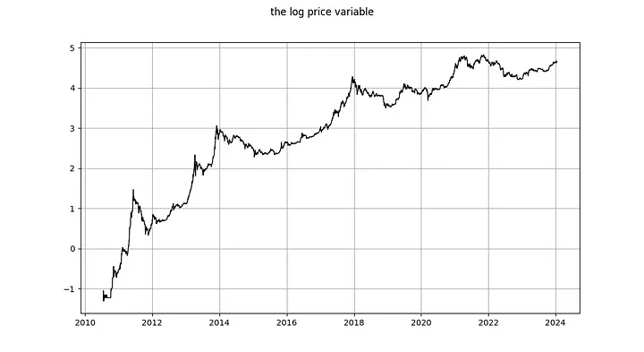

log_price 是平稳时间序列吗？Nick 使用未指定类型的 ADF 检验（非平稳性检验）和 KPSS 检验（平稳性检验）得出结论，log(price) 毫无疑问是非平稳的，因此是 I(1)或更高。Marcel Burger 通过目测得出结论，它是 I(1)。Tim Stolte 提出了一个更有趣的观察：他对不同时期进行了 ADF 检验（未指定类型），并指出情况并非一目了然：“因此，我们无法坚定地拒绝非平稳性，并得出 log-price 存在非平稳性迹象的结论。”

让我们自己跑一下分析。与 Tim Stolte 类似，我们将在不同的时间窗口进行 ADF 检验：总是从第一个可用日期开始，每天增加一天（我们使用每日数据）。这样，我们就能看到 ADF 检验的结果是如何随时间变化的。但与 Tim 和 Nick 不同的是，我们要指定运行哪个版本的 ADF 检验。根据维基百科，DF 和 ADF 检验有三种主要类型：

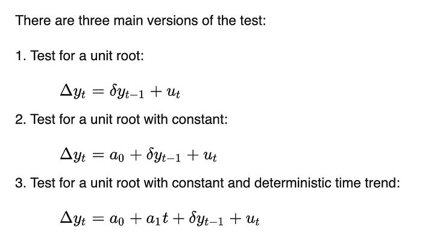

这三个版本的区别在于它们能够适应（移除）不同的趋势。这与 Engle 和 Granger 要求去除任何确定性趋势有关 —— 这三个版本能够去除三种简单的确定性趋势类型。第一个版本试图只使用过去的 log_price 数据来描述每日的 log_price 变化。第二个版本允许使用常数项，其效果是 log_price 可以具有线性趋势（向上或向下）。第三个版本允许二次方（抛物线）成分。

我们不知道 Tim 和 Nick 运行的是哪个版本，但我们将运行所有三个版本。

我们在 ADF 检验中使用的最大滞后期为 1，但使用更长的滞后期不会对我们的结果和结论产生有意义的改变。我们将使用 python 的 statsmodels.tsa.stattools.adfuller 函数，"maxlag"为 1，"regression"参数使用 "n"、"c "和 "ct"（相当于维基百科上面描述的三种类型）。在下图中，我们显示了测试返回的 p 值（统计显著性的衡量标准），p 值越小，表示平稳的可能性越大（通常使用的临界值为 0.05）。

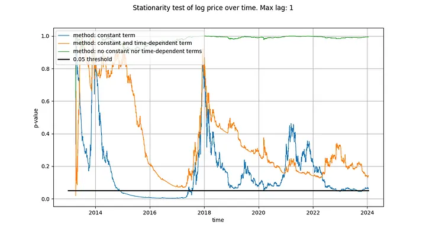

我们注意到，第一种方法（绿线）得出的结论是，log_price 时间序列是非平稳的。第三种检验方法（橙色线）的结论相同，但不那么果断。有趣的是，允许常数项的检验（蓝线）无法判定时间序列是否平稳（很可能 Tim 也使用了带有常数项的 ADF 检验）。为什么这三个版本有如此大的差异，特别是为什么带有常数项的版本不能排除 log_price 是平稳的？

只有一种解释：在 log_price 差分中仅使用常数项（导致 log_price 中的线性项）可以“很好地”拟合时间序列，从而产生看起来几乎是平稳的残差信号（尽管起点和终点的偏差相当大）。完全不在 log_price 中使用确定性趋势，或使用二次项确定性效应，效果都远不如前者。

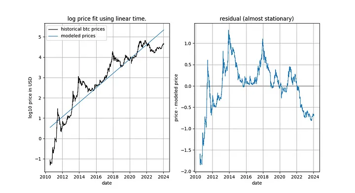

这已经给了我们一个强烈的暗示，即时间与 log_price 之间存在关系。事实上，如果使用常数项进行的 ADF 检验得出的结论是信号是平稳的，这就意味着线性时间项能够很好地近似 log_price，从而得到平稳的残差。获得平稳的残差是可取的，因为它是非虚假关系的标志（即我们找到了正确的解释变量）。线性时间趋势并不完全符合我们的要求，但我们似乎正在接近它。

我们的结论与 Marcel Burger 的结论明显不同，他（在另一篇文章中）说：

> “在之前的分析中，我表明比特币的价格是一阶整合的，这一点仍然有效。比特币在价格随时间演变的过程中并没有表现出任何确定性因素。”

我们的结论是，线性时间并不能充分解释比特币的价格随时间变化的行为，但 log_price 有一个确定的时间因素是绝对清楚的。此外，在去除适当的确定性成分后（如 Engle 和 Granger 所要求的），也不清楚 log_price 是否为 I(1)。相反，它似乎是趋势平稳的，但仍需找到适当的确定性成分。

如果我们要寻找协整关系，log_price 不是 I(1)就已经是个问题了，因为要使两个变量协整，它们必须都是 I(1)或更高。

### log_time 变量

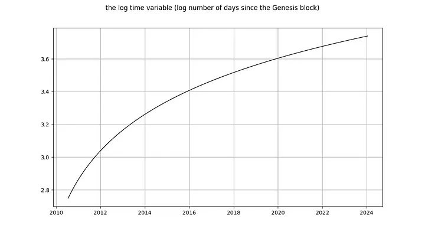

现在让我们看看 log_time 变量。Marcel Burger 的结论是，log_time 似乎进行了 6 阶积分（他一直在进行差分，直到遇到数值问题）。他期望像对数这样的数学函数能从一个完全确定的变量转化为一个随机变量，这种做法是毫无道理的。

Nick 对 log_time 的结论与对 log_price 变量的结论相同：毫无疑问，它是非平稳的，因此 I(1) 或更高。Tim Stolte 声称 log_time 在构造上是非平稳的。这些说法都令人吃惊！积分阶次和协整是指随机变量的概念，其中任何确定性趋势都已被剔除（见上文 Engle 和 Granger [2]）。需要提醒的是：确定性变量的值是预先知道的，而随机变量的值是不知道的。时间（显然）是完全确定的，对数函数也是完全确定的，因此 log_time 也是完全确定的。

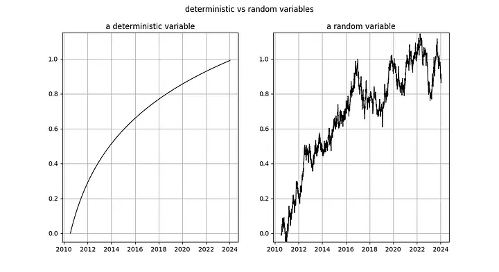

图释：左图：自创世区块之后的天数的对数是完全确定性的。右图：随机变量（看起来有点像左边的确定性变量）。

如果我们按照 Engle 和 Granger 的方法，从 log_time 中移除确定性趋势，那么剩下的就是一个零向量，因为 log(x) - log(x) = 0，也就是说，我们仍然有一个完全确定的信号。这意味着我们陷入了困境 —— 我们无法将 log_time 这个完全确定的变量转化为随机变量，因此我们无法使用 Engle 和 Granger 的框架。

要想知道完全确定的变量在协整分析中会有多大问题，还有一种方法，那就是考虑 Dickey-Fuller 检验等平稳性检验如何处理它。让我们考虑最简单的情况（其中 y 是感兴趣的变量，rho 是需要估计的系数，u 是假定为白噪声的误差项）：


会发生什么？误差项 u_{t} 在所有 t 值中都为 0，因为我们没有随机成分 —— 应该不需要误差。但由于 log_time 是时间的非线性函数，因此 rho 的值也必须取决于时间。

对于随机变量来说，这个模型更有用，因为变量 rho 可以捕捉到之前的随机值在多大程度上被记住了。但如果没有随机值，这个模型就没有意义了。

对于确定性变量，其他类型的检验也存在同样的问题。

因此，完全确定性变量不属于协整分析的范畴。或者换一种说法：协整分析不适用于确定性信号，如果其中一个信号是确定性的，那么协整分析就是一种声称存在虚假关系的不合时宜的工具。

## 怎么解释

只有两个变量都是 I(d)，且 d 至少等于 1 的情况下，才存在协整关系。我们已经证明 log_time 是一个完全确定的变量，不能用于静态检验。我们无法判断 log_time 是 I(0)、I(1) 还是 I(6)。此外，log_price 也不是 I(1)，而是趋势平稳的。

log_time 和 log_price 之间不存在协整关系，这是否意味着基于时间的幂律在统计上是无效的或虚假的？

**当然不是**

在任何适当的统计分析中，使用混合确定变量和趋势平稳变量都是完全正确的。协整并不像我们的批评者试图让人相信的那样，是统计关系分析的中心点。

因此，协整分析是不可行的。但是，应用于幂律模型的平稳分析可能还有用武之地。让我们进一步探讨这个问题。

我们之所以首先对输入变量进行协整分析，是因为我们希望找到二者的平稳线性组合。将一个确定性变量（log_time）和一个趋势平稳变量（log_price）进行组合，从而得到一个平稳变量，这从根本上说是不可能的。因此，与其寻找严格意义上的协整关系，我们可以简单地对残差进行平稳性检验（因为残差只是两个输入信号的线性组合）。如果残差是平稳的，那么即使我们没有严格遵循 Engle-Granger 协整检验，我们也找到了一个平稳的线性组合（这正是协整的目的）。

## 深入探讨

James G. MacKinnon [3] 在他的论文《协整检验的临界值》中正是这样解释的：如果已经进行了“协整回归”（将 log_time 与 log_price 联系起来的回归），那么协整检验（Engle-Granger 检验）与对残差进行的平稳性检验（DF 或 ADF 检验）是一回事：

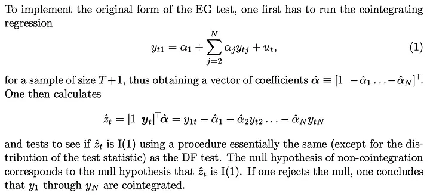

MacKinnon 重复了这一说法：如果连接 log_time 和 log_price 的参数是先验已知的，那么就可以跳过 Engle-Granger 协整检验，转而对残差进行三种常见类型之一的平稳性检验（DF 或 ADF 检验）：

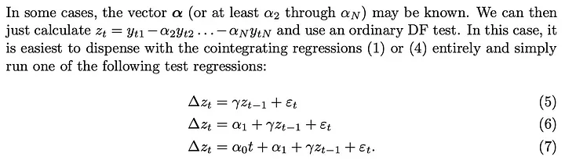

因此，我们可以使用两种方法中的任何一种，除了得出的检验统计量之外，这两种方法是相同的：

1. 将 log_time 与 log_price 拟合，计算残差（误差）。根据残差计算 DF，或者更好的是 ADF 检验。由此得出的统计量可以说明残差是否平稳。
2. 假设 log_time 和 log_price 是 I(1)，并运行 Engel-Granger 协整检验。得出的统计量也能说明残差是否平稳。

对于 ADF 检验，我们使用 python 的 statsmodels.tsa.stattools.adfuller 函数；对于 Engle-Granger 检验，我们使用 statsmodels.tsa.stattools.coint。对于这两个函数，我们都使用了不使用常数（不随时间不断漂移）的方式，因为我们的残差不应该包含随时间不断漂移（因为这意味着随着时间的推移，模型开始高估或低估价格）。

我们曾写道，ADF 检验和 Engle-Granger 检验是等价的，但事实并非如此：它们不会产生相同的检验统计量。Engle-Granger 协整检验假设有 N=2 个随机变量，而 ADF 检验假设有 N=1 个随机变量（N 是自由度的量度）。一个随机变量可以受另一个随机变量或一个确定变量的影响，但一个确定变量不能受一个随机变量的影响。因此，在我们的案例中（只有一个确定变量 log_time），ADF 检验（假定 N=1 个随机变量）返回的统计量更可取。原则上，Engle-Granger 检验和 ADF 检验可能存在分歧，但在基于时间的模型中，实际情况并非如此。如下图所示，结论是一样的：我们得到了一个平稳的残差向量。两种检验的得分都远远低于 0.05 临界值（表明残差是平稳的），而且长期以来一直如此。

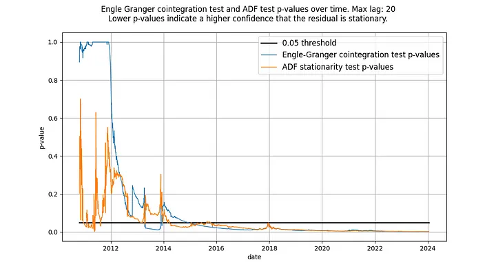

图释：根据 ADF 和 Engle-Granger 检验，基于时间的幂律从 2016 年左右开始具有平稳的残差。

两种检验最初都没有显示出平稳的残差是正常的。这是因为残差信号中的低频成分会被误认为是非平稳信号。只有随着时间的推移，残差的均值回归才会变得明显，实际上是平稳的。

## S2F 与长期股指价格

S2F 模型被普遍否定，似乎是因为严格意义上的协整被证明是不可能的，其原因与基于时间的幂律相似：输入变量是（部分）确定的。然而，该模型产生的残差看起来非常平稳。

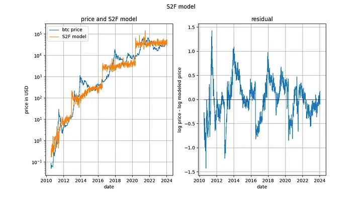

事实上，Engle-Granger 协整检验和 ADF 平稳性检验（因为有一个确定变量和一个随机变量，所以更可取）得出的 p 值都非常接近 0。因此，不应以“缺乏协整性”（实际上是“缺乏平稳性”）为由排除 S2F 模型。

然而，我们在 2020 年初指出，还有其他迹象表明 S2F 模型不成立。我们预测 BTCUSD 的价格将低于 S2F 模型的预测，事实证明这一预测是有先见之明的。

观察长期股价指数与时间的对比也很有趣（此处为不含红利再投资的标准普尔 500 指数）。众所周知，主要股票市场指数平均以 7% 左右的指数速度增长。事实上，我们通过指数回归也证实了这一点。

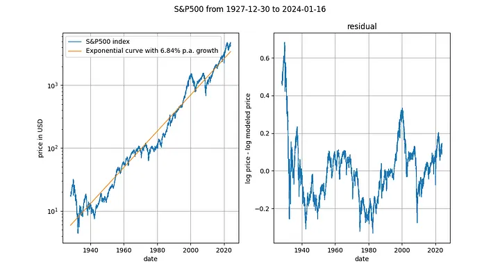

在这里，我们又遇到了一个确定性变量（时间）。Engle-Granger 协整检验得出的 p 值约为 0.025，ADF 检验（首选）得出的 p 值约为 0.0075（但这些值在很大程度上取决于选择的确切时间段）。再一次，平稳的残差。股票价格的指数时间趋势是有效的。

## 影响

S2F 模型最初受到高度评价（尤其是 Marcel Burger 和 Nick Emblow），原因是该模型据称具有良好的计量经济学基础，特别是存在协整关系。随着潮流的转变，S2F 模型显然不存在严格意义上的协整关系，Marcel 和 Nick 都跳船了，宣布 S2F 模型无效。似乎在这一事件之后，大众对 S2F 模型的看法也发生了变化。Eric Wall 对事件的转折做了一个极好的简短总结。

我们已经解释过，而且计量经济学文献（MacKinnon [3]）也同意我们的观点，即协整性和平稳性几乎可以互换使用（统计量的值除外）。根据这一观点，我们认为 S2F 模型在协整性/平稳性方面没有任何问题，因此，因为所谓缺乏协整性而改变对 S2F 模型的看法是错误的。我们同意 S2F 模型是错误的，但其错误的原因不在于缺乏协整性。

比特币的时间幂律模型因缺乏协整性而受到批评，据说这标志着 log_time 和 log_price 之间的关系是虚假的。我们已经证明，比特币基于时间的幂律模型的残差明显是平稳的，因此批评者的推理是值得商榷的。

比特币的时间幂律模型是有效、稳定和强大的。一如既往。

* * *

参考文献

1. "Universal Cointegration and Its Applications" Tu et al., including supplemental information
2. “Co-Integration and Error Correction: Representation, Estimation, and Testing” by Robert F. Engle and C. W. J. Granger
3. “Critical Values for Cointegration Tests”, James G. MacKinnon


