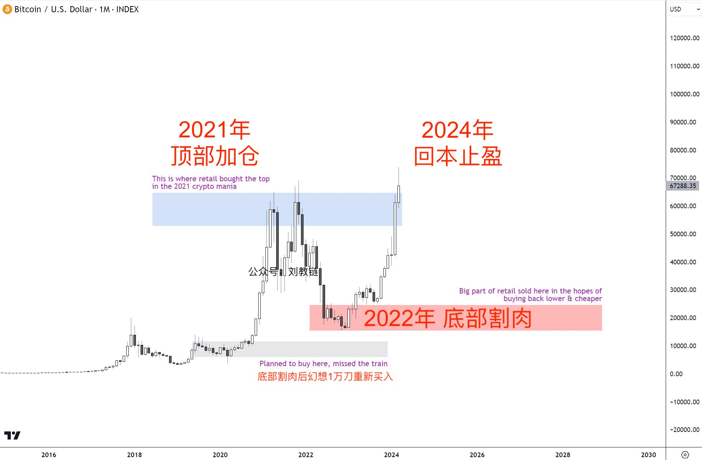

# 比特币再破7万刀

号外：教链内参3.25《AI的本质和英伟达迷局》

* * *

—— 2033年底BTC百万美刀时，且听风中吟唱

在沿着30日均线爬行5天，拉着7日均线回归30日均线之后，BTC（比特币）突然发力，左脚尖一踩右脚尖，右脚尖一踩左脚尖，倏地向上飞起，迅速脱离30日均线65k的“地面”，一跃而上7万刀的“墙头”。围观群众纷纷拍手叫好，仿佛在他们眼中，BTC就如一位武艺高强、劫富济贫的大侠，略施轻功身法，便腾起6个点，赢得满堂喝彩。

昨日3.25教链内参《AI的本质和英伟达迷局》中援引分析师的话，“本次 BTC 73000-61000 回调大概率已经进入尾声”。教链点评道，“没有长期下跌基础”。此语出自教链3月16日文章《BTC现阶段或不具备长期下跌基础》。说此话时，BTC刚刚跌破7万。余音犹在，BTC已重回7万。

早在3月9日教链内参《这轮熊市黑天鹅难道是牛市提前1年启动？》和3月11日教链内参《BTC加速向上突破箱体上沿7万刀心理关口！》两篇内参中，就指出了7万刀这个关键位置，实是2021年至今所筑的跨周期大箱体的上沿（盖子）。

当时教链还画了下面这张图，以便于直观地阐释当时的盘面：

事实上，在教链9日（BTC 68k）画完此图后不久，5天之后，3月14日，BTC就冲击了一次中轨74k（图中紫红色线），最终摸到了73.8k。关于这个中轨的来历，有兴趣的读者可以回读一下教链3月25日文章《比特币的时间幂律模型及其协整性再探讨》。

三年囤币两茫茫，持币不动又何妨？
七万比特今犹在，不见当年炒币郎。

回首过往种种，教链坚持的研究方法是，结合理性认知和盘感直觉提出假设，然后用事实检验假设。这是波普尔否证论科学真理检验原则的实践方法，即将“可证伪性”作为科学与否的判定标准。波普尔大家可能不知道，但是他有一个学生，大家应该很多人都知道。这个学生就是大名鼎鼎的索罗斯。

早在2021年12月18日，也就是箱体前三分之一处，BTC 46k的时候，教链写了文章《牛市仍在中场》。在该文中，教链大胆假设了“大中场理论”，认为以3万刀为下沿、6万刀为上沿，BTC正在构筑一个跨周期的大箱体。而中场之说，盖源于此。由此，中线4.5万刀就是这个大箱体的波动中枢。

今天回看，2021年的牛市，的确是一个箱体准备。有偏差之处在于，对箱体下沿的估计偏高了一些，最终是回落到了16k。但对波动中枢估计的影响微乎其微：实际箱体的中枢是(70 + 16)/2 = 43k，即4.3万刀。（请注意对数坐标系上每1万刀的视觉间距是不一样的，不能看视觉中线）

那么，既然早知如此，当BTC跌破中枢之后，应该做的事情是什么？显然只有一个，“逢跌加仓”。

如今，BTC正在箱体上沿测试压力位反转支撑位，一旦确认支撑，将彻底打开箱体，宣告三年箱体阶段的结束，开启新的征程！

上图左边是BTC，红色箭头所指的位置就是我们现在所处的阶段。右边是英伟达的美股走势图，红色箭头是在阶段突破后的回踩测试支撑位，然后确认支撑之后，一飞冲天。在技术图形上，我们可以看到其中投机模式上的相似之处。

这与Wyckoff底部吸筹模式中，右侧D阶段确认模式结束的SOS信号（Signal of Strength）是十分相像的！关于Wyckoff底部吸筹模式，不了解的读者可以回看教链2021年8月12日文章《在夏季市场的向下摊平》。

这个位置，恰恰也是众多散户下车，然后再也上不了车的终点站！

犹记得教链在《小杂感》（2021.6.30文章）中总结的“韭菜三宝”：顶部加仓；底部割肉；回本止盈。

7万刀，对于2021年6万刀迎风站岗3年的韭菜们而言，正是“回本止盈”的绝佳良机！

而对于更多还在空仓或者半仓等待的老韭菜（指经历过一到两次减半的），则很多还在等待再一次减半前的暴跌，就像2020年“312”的大幅回撤那样。（参考阅读教链2024年3月12日文章《又是一年312》）

基于上述种种心理，在这个位置要进行最后的换手，下车的和上车的互道珍重。

谁是带团上车的导游？对，正是现货ETF们：贝莱德、富达、方舟基金、Bitwise、…… （参考阅读教链2024年2月11日文章《美比特币ETF持仓跨越20万枚BTC大关，成为华尔街有史以来最受欢迎的ETF！》）

旅游团人来人往，对导游而言最重要的是什么？保持旅游团一直有人、有资金流动。正所谓：铁打的旅行团，流水的游客。就像导游赚的是导游费，贝莱德赚的是管理费。无论上涨下跌，只要一直有客户，一直保持ETF的规模，贝莱德就躺着赚钱。

简单计算可知，若贝莱德管理50万枚BTC规模的ETF基金，在20万刀的情况下，每年稳赚2.5亿刀的管理费收入。

所以，贝莱德们肯定会使出浑身解数，拼命招揽客户，扩大资产管理规模，并极力留住客户，不要早早抛售。他们希望客户长期持有，数年甚至十年以上，越久越好，这样就可以长期吃管理费吃到手软。（当然，作为开放式基金，并不能强迫客户锁仓，所以只能发挥影响力，或者在ETF基础上再开发衍生产品，锁定客户资金。）

ETF们是在什么位置上的车？5万到7万这个区间段。

对他们而言，7万刀，才刚刚发车。

对他们而言，充满新鲜感、激动人心的加密之旅也才刚刚开始。

