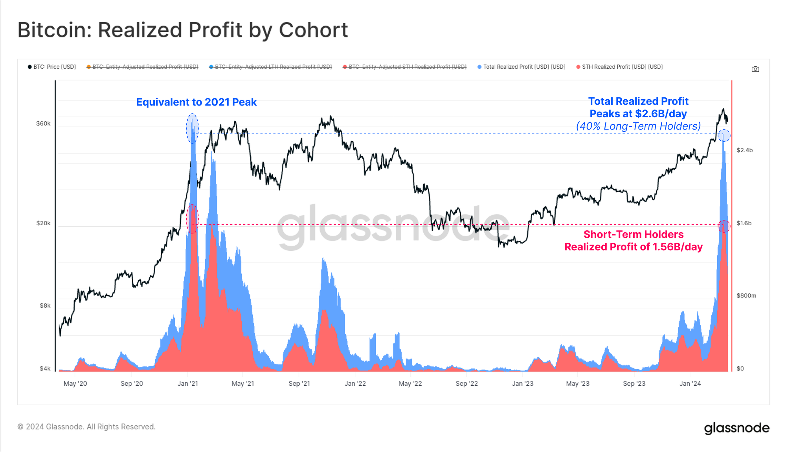
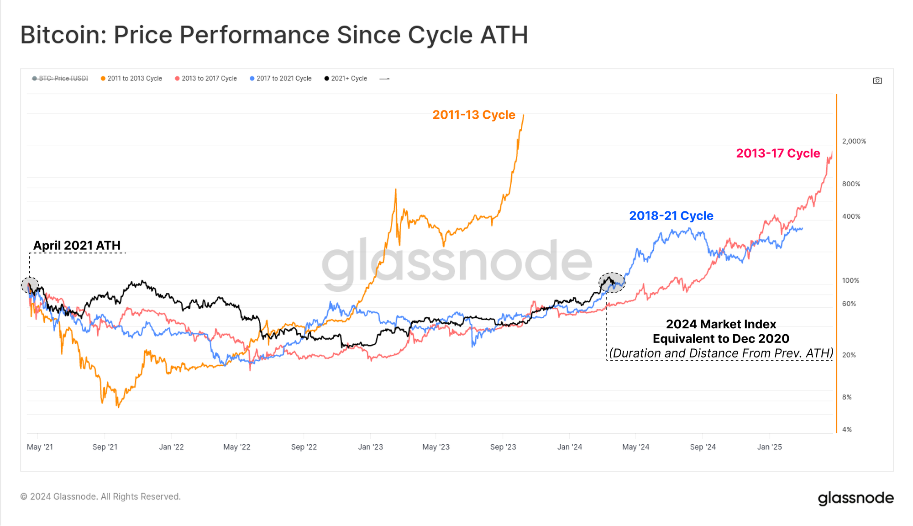

# 比特币正在摆脱地心引力

号外：教链内参3.26《天量期权即将交割，将如何影响市场？》

* * *

两个黄鹂鸣翠柳，一行白鹭上青天。

BTC（比特币）在7万刀这个高度的换手，是继续飞升的必要环节。

中本聪为BTC设计了每4年产量减半（严格地讲是每21万个区块减半一次）的机制，好比是32级动力火箭。技术原理和细节请回顾教链2020年6月9日文章《【硬核】一文读懂比特币》以及2023年1月29日文章《中本聪的错误：比特币产量减半为什么是32次？》。

在人类现代航空技术中，常用三级火箭推进的设计，每一级都有独立工作的燃料和发动机，通过逐级分离丢弃，克服单级火箭在速度和载荷能力上的限制。互联网产品界则借用这个概念，用以描述产品增长的三个阶段：流量获取；沉淀用户；商业闭环。

为什么不是二级或四级火箭呢？二级太短，动力不足以摆脱引力。四级太长，控制复杂度陡升，出错概率大大增加。这就很符合中国传统哲学观念：事不过三。

BTC如何能够做到32级火箭呢？超乎人类的控制能力！

Think out of the box.（跳出条条框框思考）

Out of control. （失控）

WIRED（《连线》杂志）创始主编凯文·凯利（Kevin Kelly）曾经在距今30年前的1994年出版了一本神作，《失控》。此书全名《失控：机器、社会与经济的新生物学》（Out of Control: The New Biology of Machines, Social Systems, and the Economic World）。此书后来被微信创始人张小龙奉为圭臬。坊间曾一度传闻，若谁可与张小龙对谈此书，将可免试直接进入微信团队。

无论是航天火箭，还是互联网产品，都依赖于人类的中心化控制。而人类的控制能力，总是超不过“3”这个神奇的天花板。

事不过三。事在人为。恰恰因为事乃是人为之事，所以才过不得三。

人为事，天为道。

事不过三。道生无穷。

《比特币近乎道》，教链在2022年2月28日如是说。

比特币虽脱胎于人之手。但一旦出生，便如孩子脱离了娘胎，呱呱坠地，有了自己独立的生命，不再是任由父母摆弄的提线木偶。

去中心化。消除人类的单点控制。失控。

近乎道，于是便突破了“3”的限制，以至于可以坐拥高达32级加速。

自2009年比特币启动以来，过去15年，我们已经燃尽并抛弃了3级火箭。第一级结束于2012年。第二级结束于2016年。第三级结束于2020年。（参考阅读教链2023.11.19文章《比特币的周期》，2024.3.3文章《比特币减产倒计时！》）

还有20多天，第4级火箭就要燃尽，第5级火箭开启，继续推动我们飞向星辰大海！

每一级火箭的推动加速都会产生极强的“推背感”，那便是所谓的“牛市”。一级推动加速，2011年牛市。二级推动加速，2013年牛市。三级推动加速，2017年牛市。四级推动加速，2021年牛市。

四级火箭接续推动之下，就将BTC从地面，推动了7万美刀的外大气层。

随着每一级火箭的脱落，都会完成大量的换手。不愿意继续星际之旅的人，早早地就下车了。只留下极少数人，和新的探险者，继续上路。

尤其是到了第三级、第四级这里，7万美刀，外大气层，我们即将脱离地球，飞往太空。太多太多人，脱离了空气和土地就不能活。他们不愿意从地球物种进化为星际物种。他们对地球无限眷恋。于是他们纷纷下车。

对于远古巨鲸而言，从当年几可忽略不计的成本，拿到今天十几亿、几十亿美刀的财富，套现离场，改善生活，实乃人之常情。毕竟，常人绝难抵挡如此巨额财富的诱惑。不妨再读一读教链在3月24日所讲的故事，《如果你在2010年拥有5000个比特币》。

一鲸落，而万物生。

有人说，这不就是早期巨鲸收割后来者么？不。只要价格还能再攀新高，就不是收割，而是鲸落，不是么？

闲云潭影日悠悠，物换星移几度秋。
比特大户今何在？槛外长江空自流。

看一下glassnode的数据，随着BTC攀上高峰，每天有高达26亿刀的抛售获利。其中，40%是来自于长期持有者的抛售，每天10.4亿刀；60%来自于短期持有者，每天15.6亿刀。

这一换手模式，与2021年1月份前后，上一轮牛市刚破前高之时，十分相像。

从牛市ATH（周期新高）开始的走势图上来看，目前的形势，也最为接近于2018-2021这一轮周期。

不要刻舟求剑。下一级火箭，未必如上一级那样，“噗”、“噗”爆燃两次，推出两个小牛顶出来。

资本市场上金融产品千千万，让人挑得眼花缭乱，但是其中绝大多数，都无法逃脱终将被地心引力俘获，坠落地面的宿命呢？

我推敲日久。偶一日踱步到村东头，遇到了一位双手着地、双脚朝天的“颠倒道人”。遂以此所苦思之题问之。

道人笑而不语，忽以单手站立，另一只手伸入怀中，掏出几张绿油油的美钞。

只见他屈膊将美钞送到嘴边，猛地以嘴吹之。美钞被他吹了起来，飘飘然地。但人之气终短，不能一直吹。美钞也在地球引力的作用下，翻着滚儿落到了离道人不远处的地上。

就在我口瞪目呆之际，那道人已经以双手为足，渐渐地走远了。
