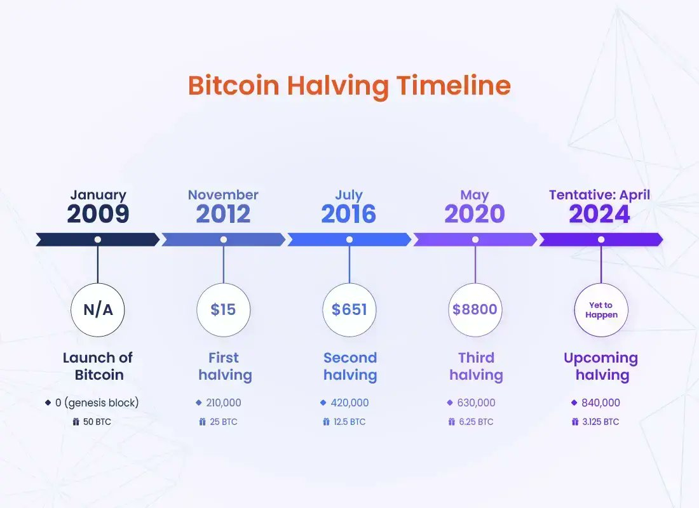

# 比特币减半，山寨始探春

号外：教链内参3.27《机构投资者BTC配置比例拟由1%升至3%》

* * *

落霞与孤鹜齐飞，秋水共长天一色。

渐渐地，渐渐地，春天的脚步声近了。渐渐地，渐渐地，比特币（BTC）产量减半的脚步声也近了。昨天27日文章《比特币正在摆脱地心引力》中已经讲到，「还有20多天，第4级火箭就要燃尽，第5级火箭开启，继续推动我们飞向星辰大海！」

BTC产量减半事件，是加密行业的大事件。这是火箭切换的时机，一旦切换成功，新一级火箭就会将BTC推向更远、更深的太空。

这不仅对BTC是一件大事，对山寨币们更是一件大事。减半前后，BTC占有率会达到局部高位。而后随着牛市的进展，则会渐次跌落。到牛市最为疯狂之时，则会达到最低。这意味着，山寨币们此起彼伏地竞相拉升，陷入了被称作“山寨季”的狂欢！

群芳争奇斗艳时，BTC就被冷落了。正如词中所描摹的那样：

驿外断桥边，寂寞开无主。
无意苦争春，一任群芳妒。

上面这幅配图，出自于2023年12月9日教链内参《山寨的春天》。即，4个月前，教链就早早地在内参中提示了2024年减半和山寨季的即将来临。当时内参里是这么说的：

「现在马上要到2024，又快到减半时刻。山寨的春天。所谓春天，就是播种的时节。如果挑到了好种子，等夏日到来，流动性扩散的时候，就会忽然长成参天大树。种瓜得瓜，种豆得豆。就像教链在2020年10月开始种不到2刀的uni。只是，果子拔苗助长，快速成熟后，要及时摘果子。别等果子烂在地里。风险控制非常关键。别超过10%仓位。试试能不能跑赢。要有跑输的准备。做好面对最坏结果的准备。」

及至今年2月28日，教链文章《多位加密人士看涨ETH/BTC，或将促动山寨季的爆发》中援引网友Negentropic的观点，即ETH/BTC的反弹将推动山寨季的汇率，这将会是艾略特波浪理论的顶部爆破（Blow-Off Top）模式。

让我们靠近一些，来看一看过去几轮周期的山寨季演进情况，以史为鉴。

### 2016年的山寨季

2016年的山寨，在BTC产量减半之后，经过了长达7-8个月的低迷和准备，到了2017年开始，才随着BTC大牛市的启动，迅速爆发。

但是要注意，2016-2017年的时候，山寨市场根本就是几乎不存在。在2017年山寨季爆发之前，BTC的市场占有率居于绝对95%以上的绝对统治地位。

### 2020年的山寨季

2020年的山寨，在BTC产量减半之后，这一次迫不及待就开始了加速上冲。等到了2021年上半年，随着BTC冲上第一个小牛顶，山寨总市值也达到了局部高位。而后在年中“519”暴力回调中，也剧烈向下波动。在2021年底随着BTC冲第二个小牛顶，山寨也又开启了第二春。

由此，我们可以观察到：

首先，山寨季的爆发紧密依赖于BTC的爆发节奏。BTC先慢后快，山寨季就先抑后扬，比如2017。BTC急冲急落、再冲再落，山寨季就也急冲回调，再冲再回调。

这很好的印证了教链多次说过的，“只有比特币才有能力发动一场牛市”（温习教链2023.1.30文章《比特币天天向上》）。

BTC减产是牛市的原因（内因）。牛市又是山寨季的原因。

可以说，任何论证某某山寨将要造就牛市，无论是2017年讲是ICO造就了牛市，还是2021年讲是DeFi和新公链造就了牛市，抑或是2024-2025年讲RWA、DePIN或者什么东西会造就牛市，种种说辞，无一例外，要么是纯粹的不懂装懂，要么就是心知肚明的嘴上忽悠。简称“非蠢即坏”。

其次，在减半之后，山寨无论是向下还是向上，回调的准备时间都只有一个不长的窗口期。想在2024年寻找alpha（金融术语：即相对于基准收益率beta之上的超额收益率）的投资者，并不会有太多的时间去仔细遴选，慢慢建仓。

就像教链在2020年，牛市爆发前，当Uniswap发币开盘冲高8刀又回落至2刀以下后，开启了建仓（参阅教链2020.11.7文章《Uniswap(UNI)的估值分析和定投计划》）。但是，由于牛市过快启动，加仓成本被迅速拉高。穿越牛熊，来到今天，12刀的UNI，仓位仅仅是微微盈利罢了，远未跑赢BTC。（关于UNI投资的复盘，有兴趣的朋友可以读一读教链的总结，分别是2024.3.8文章《UNI(Uniswap)投资心得》，2024.2.26文章《Uniswap(UNI)二期实战复盘：真金白银的经验教训》，2021.3.9文章《Uniswap(UNI)实盘回顾：站上30刀，跻身市值前10，大幅跑赢比特币》）

不过，教链对于这次“寻找alpha”的实验，心态是平淡的。2021年1月1日心知肚明的教链就写下文章《为什么你的投资跑不赢比特币？》。事实上，教链的先验推理，也被一些实证研究所证实，在2024.1.4教链内参《大部分热门板块跑不赢BTC》中已有所介绍。

在加密行业，beta策略就是持有BTC不动，1 BTC = 1 BTC。alpha策略则能产生相比持有BTC不动之上的超额收益，也就是跑赢BTC的部分。

BTC就是金标准。Bitcoin is the new gold standard.

因此，alpha超额收益意味着，换回BTC能够使得你手上的BTC绝对数量增加。

无论从先验理论，还是教链亲自穿越牛熊的实验验证，都证明了一个铁打的道理：持有山寨一定要在牛市抛售，把alpha超额收益落实为实打实的BTC现货。最佳时机就是山寨大幅跑赢BTC的时候。

至少，要把alpha超额收益的部分减持，换回BTC。

从这个意义上讲，持有山寨相当于一种软性的杠杆。用杠杆的思维和视角去审视一个山寨币，可能会有全新的认识和透彻的理解。

抛弃法币本位的收益率思维和目标吧，什么10倍、100倍之类的。换成BTC本位，就问你的山寨一个牛市能不能跑出5倍的alpha？

即，把现在价值1个BTC的山寨，变成实打实5个现货BTC。

能？那可就太酷啦！

不能？那还是老老实实地囤BTC吧。
