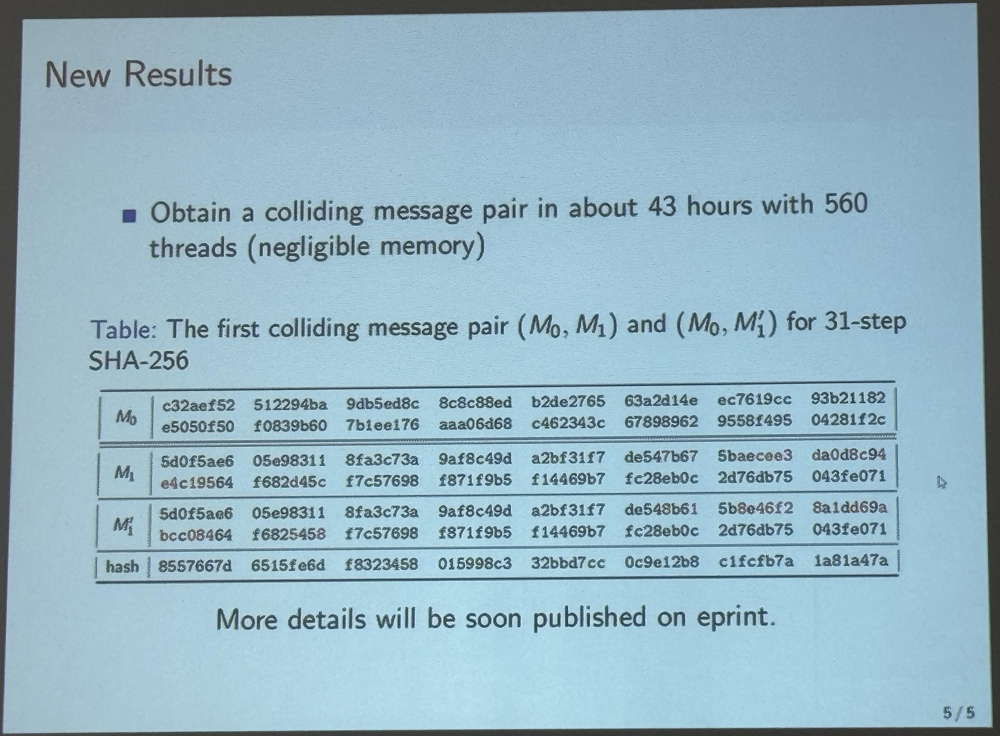
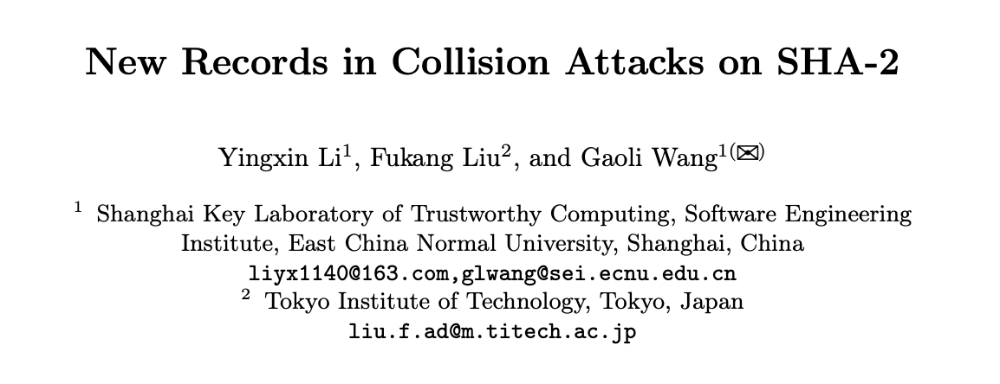
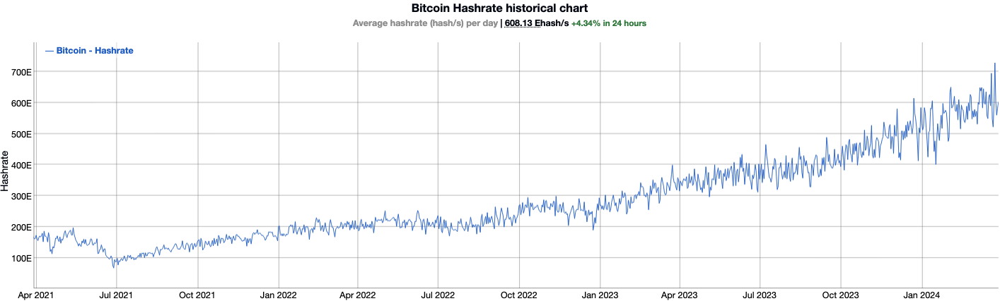
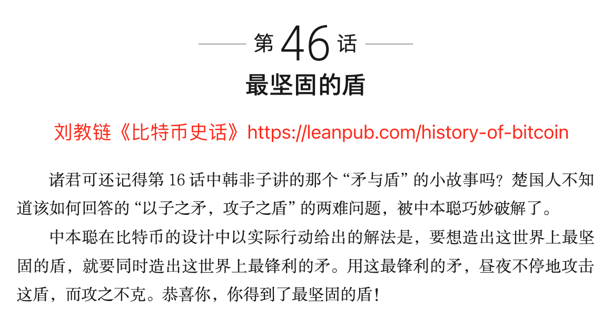
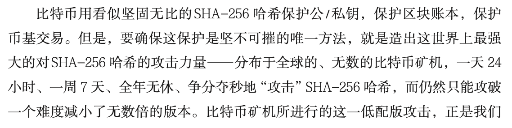
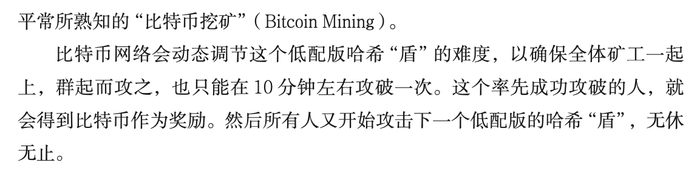
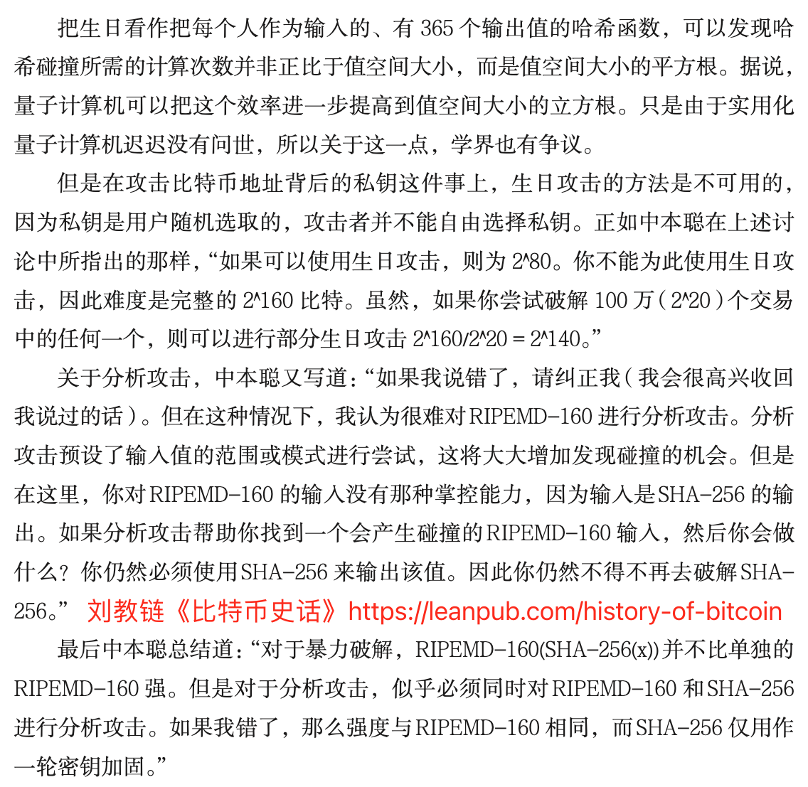
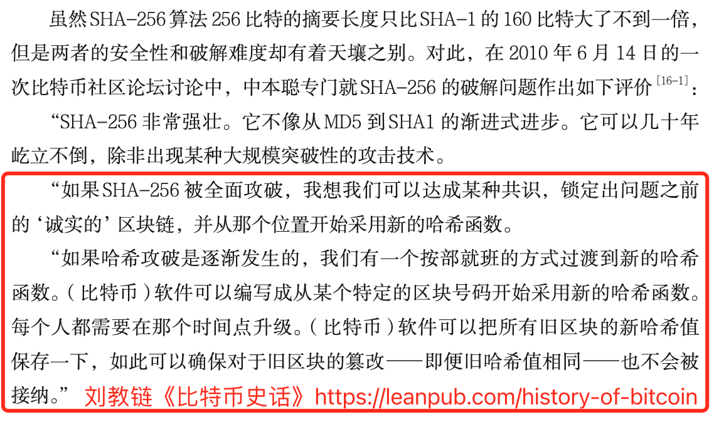

# 攻破SHA-256！？你的比特币还安全吗？

号外：教链内参2.28《贝莱德的代币化基金BUIDL究竟为何物》

* * *

挽弓当挽强，用箭当用长。射人先射马，擒贼先擒王。

就在BTC（比特币）还在7万刀附近游走之际，密码学界隔空传来一声霹雳：对SHA-2的碰撞攻击方法取得新进展！

运用这一最新的碰撞攻击方法，研究者在全球首次成功攻破了31步长的SHA-256哈希、28步长的SHA-512哈希以及40步长的SHA-224哈希。

该成果是由来自华东师范大学和东京工业大学的联合研究小组所取得的。

大家都知道，比特币地址正是SHA-256哈希。如果我能轻易构造出与你的比特币地址相同的SHA-256哈希，那就意味着我可以轻松转走你地址里的所有比特币。

不仅如此，比特币挖矿也是计算SHA-256哈希。如果我能轻易构造出任意SHA-256哈希，那也意味着我可以不用耗费巨大算力、电费以及长达十分钟的时间来去蛮力计算，就可以轻轻松松做出合格的区块哈希，比世界上任何一台矿机都更快地挖出新区块。这意味着，我将成为世界上最强大的矿工，所有剩余待挖的比特币都将被我挖到。

你不禁担心：我的比特币还安全吗？比特币系统会不会崩溃？

简单的回答是：目前还很安全。因为比特币系统采用的是64步长的SHA-256哈希。

还差33步呢！—— 当然，绝大部分人对这个数字并没有什么概念。

教链在音频课《比特币原理》第五章中曾经用形象化的比喻来向大家描绘SHA-256的大小：

在这么巨大的数字面前，人类直觉是失灵的。2的256次方，不过就是256个随机的1和0的组合嘛，感觉好像很小的数字哎。可是你知道吗，找到两个可以发生碰撞的哈希原象（即输入），也就是找到两个不同的输入，它们的哈希值是相同的，这样的概率有多小呢？这个概率比你读完这篇文章刚好一颗小行星撞击地球毁灭的概率还要小。

还有一个方法帮助理解破解SHA-256哈希的难度。把2的256次方拆成8个2的32次方相乘。2的32次方大概是40亿。40亿这个数字就属于人类想象力能够理解的数字大小了。然后：
1. 1台具有4个显卡的计算机1秒钟可以计算大概40亿次哈希。
2. 设想一家超级电脑公司，有40亿台这样的电脑。（这家公司大概是几千家谷歌公司的规模加起来那么大）
3. 设想地球上有40亿人（占80亿人口的一半），每人都拥有一家这样的超级电脑公司。（全自动化的吧，不需要员工：）
4. 设想银河系有40亿颗恒星系（占银河系4千亿颗恒星的1%）中，每一个星系中都有这样一个地球，每个球上都有40亿人，每个人都有一家超级电脑公司。这个银河系就是一个超级计算银河系。
5. 设想宇宙中有40亿个这样的超级计算银河系（占全宇宙几千到几万亿个星系的很小一部分）。这就组成了一个超级宇宙计算机。这台计算机的算力大概是2的160次哈希每秒。
6. 这样一台超级宇宙计算机连续计算40亿乘以40亿秒，也就是5000多亿年，大概是目前宇宙年龄（138亿年）的40倍时间，有多大概率能够破解一个SHA-256哈希呢？也只有40亿分之一的概率能够破解成功！

像上面这样靠强大的算力去计算的破解方法，叫做brute-force（暴力）破解法。今天遍布全球的比特币矿工，干的就是这个事情。

所以，其实世界上最强大的强攻比特币的家伙是谁呢？正是比特币自己！

有趣吧？

今时今日，比特币所动用的用以攻击自身的算力已经超过600 Ehash/s。

这就是教链在《比特币史话》里所讲的“矛”与“盾”的故事。

不过，战争的艺术在于，总是有两条路。强攻不成，还可智取。

比特币矿工们走的是强攻的路线。而密码学家们走的，则是智取的路线。他们一直在尝试，通过巧妙的构造法，能够不借助于算力蛮干，就能找到SHA-2这一类哈希的“弱点”，将其一举攻破！

所有的稳态都是暂时的平衡。矛盾运动的张力始终有天然的冲动。博弈的均衡换来了动态的和平。因此，忘战必危。

软柿子的命运就是被捏。软骨头的民族必定遭受欺侮。只有视死如归，才能震慑敌人。只有不惧战争，才配拥有和平。只有确保相互毁灭，才能避免世界大战。这就是纳什均衡。

但是要在搜索空间接近整个可观测宇宙原子数（约10^80，即2^266）的SHA-256中找到有效的碰撞，比大海捞针还要难上近乎无穷大倍。

何况，找到两个碰撞的原象，与找到指定哈希的原象，其难度又不在一个数量级上。前者被称为“生日攻击”。

2010年7月25日，中本聪就讨论过这个问题：

而且，比特币系统并非是僵化不变的系统。事实上，早在2010年6月14日，中本聪就讲过，比特币应当如何面对未来SHA-256哈希可能被攻破的情况。他是这样说的：

我想，如果真有那么一天，可能还需要做一次链上转账，把旧哈希保护下的地址里的比特币，全部转移到新哈希函数的地址中去。

一个可以不断升级的比特币系统，本就不是一成不变的黄金，而是一艘“忒修斯之船”。正如教链在《比特币史话》的序言里所说的：（参阅2023.2.28《上帝掷骰子，比特币向前进》）

「比特币究竟是一成不变的还是持续进化的，它又如何能应对未来百年乃至千年的变数和挑战呢？如果未来出现了量子计算机、可控核聚变，或者人类征服了火星，进化成了星际物种，比特币在充满变数的未来世界，又将如何适应呢？比特币就像一艘忒修斯之船，核心设计保持不变，其余一切皆可改变。我们会看到“变与不变的矛盾统一”的辩证法，在比特币身上的技术体现。」

