# 比特币幂律理论：为何其价格将继续等比例增长？

号外：教链内参3.29《对冲基金称BTC有望再涨150%》

* * *

编译 | 刘教链

教链按：还有不到20天，BTC（比特币）就要迎来其历史上的第4次产量减半了。（参阅教链3.28文章《比特币减半，山寨始探春》）

加密行业的资深OG（老炮，老玩家）们普遍认为，每次减半都将推动下一轮牛市。

对此，教链也曾多次撰文，辨析究竟是减半推动了牛市，抑或牛市是对下一次减半的“抢跑”。典型文章比如2020.5.14文章《【对话中本聪】系列之比特币减半》、2021.11.22文章《比特币产量减半和价格自我实现》、2023.11.19文章《比特币的周期》等。

以贵金属行业的S2F硬度模型（教链2023.2.19文章《小科普：什么是S2F（Stock-to-Flow）》）来度量BTC，便得出了BTC每4年会发生一次硬度“相变”的推论。把硬度相变作为价格“相变”的依据，便得出了S2F价格模型（为匿名分析师PlanB所主推）。有关于硬度相变，教链亦曾撰文多篇介绍，最近的如2023.12.5文章《2024减半之辩：涨幅消退或者超级周期？》、2023.8.28文章《比特币的币时模型》、2023.7.19内参《PlanB：S2F模型显示BTC下轮减半周期或达45.6万刀》、2023.2.17文章《2024奇点将至：人类尚未准备好迎接S2F大于100的巨硬资产》、2023.1.6文章《S2F：比特币即将超过黄金》等等。

3月25日，教链分享了文章《比特币的时间幂律模型及其协整性再探讨》。其中介绍的时间幂律模型，教链最早在2021.7.24文章《比特币的价格走廊》中就有所介绍。后来更是在多篇文章中反复回顾，并作为价格前瞻的工具。一些文章在3月25日文章“教链按”中有所提及，此处不再一一枚举。

此处有一个矛盾点，不知道有没有读者发现。本质上，幂律模型否定了S2F。因为在幂律空间中，只有时间（time）维度而并没有供应量（supply）维度。借用科幻小说《三体》里，造成众多物理学家死亡的那个问题，套用过来可以这么说：

减半不存在了。

曾经有老韭菜绝望地发问：如果说产量减半对BTC有决定性地推动作用，那么为什么它对LTC（莱特币）就没有作用呢？

减半和牛市，不过是一种虚妄的联想。也许减半牛从来就没有存在过，将来也不会存在。

如果减半不存在了，那么我们也就完美的解决了文首辨析的问题。答案很简单：既不是减半推动了牛市，也不是牛市领先于减半，二者并没有什么关系。

虽然听上去很难接受，但是对于信奉奥卡姆剃刀原理的教链来说，剃除减半的幂律理论，确实更优美。

今天，教链就先把幂律模型的提出者Giovanni Santostasi最近（2024.3.20）的一篇文章《比特币幂律理论》（The Bitcoin Power Law Theory）介绍给各位读者，作为后续继续深入探讨有关话题的基础。

* * *

图释：比特币类似于自然现象，并非普通资产。这幅美丽的艺术作品归功于 @BainterSAT

### 与金融资产相比，比特币更像一座城市和一个有机体。

12 年前，我开始研究比特币。

我在 Reddit 上发表我的探索，而不是在期刊上发表，主要是因为我想接触更广泛的比特币社区，而不是发表一篇非专业科学家不会阅读的论文。

我的主要发现是，比特币受幂律支配。其规律性表明，比特币的行为更像一个物理系统，而不是资产。这一直觉是基于比特币价格与时间的关系中观察到的惊人的幂律。

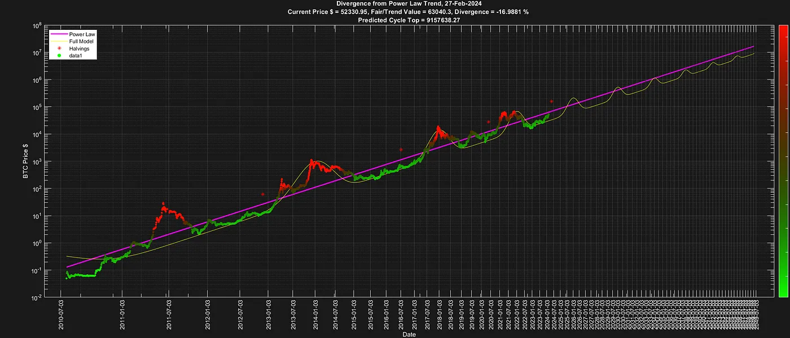

### 比特币幂律理论。

我的幂律模型现在已经发展成为一个完整的比特币行为理论，能够以科学连贯和可证伪的方式解释所有主要链上参数，并描述比特币采用率的增长：比特币幂律理论或 PLT。

下图概括地解释了 PTL 理论，并显示了支持该理论的主要数据。价格、哈希率和地址（我们使用高于阈值的地址来消除灰尘地址）都是彼此和时间的幂律。

它们在一个连续的反馈循环中相互作用、相互影响。

幂律是 y=A x^n 形式的数学表达式，在自然界中无处不在，在社会现象以及与城市或国家发展相关的许多参数中也是如此。

它们之所以如此常见，是因为可以用数学和物理学的方法证明，只要有某种过程，输出就会在迭代过程中成为新的输入，它们就会出现。

这正是比特币的情况，例如，现在的哈希率会影响以后的哈希率，形成无限循环。因此，比特币的行为具有幂律，这不仅令人惊讶，而且也完全符合比特币的本质。

下图支持这种相互作用，这在社区中是众所周知的。这张图不是我发明的，但我用它来说明理论是如何运作的。

该理论基本上是一种数学表达，基于逻辑、物理和数学的反馈回路。

1. 最初，比特币需要被中本聪圈子的第一批用户接受和采用。
2. 比特币的“价值”（现在是“价格”，可全天候在线查询）随着用户数量的平方而增加（经验测量值更像是 1.95，但为了简单起见，我们将以下所有幂数四舍五入为整数）。这证实了梅特卡夫定律的理论结果。
3. 价格上涨带来了更多的资源，尤其是采矿能力。
4. 价格上涨减少了开采一个区块的时间，但由于“难度调整”，开采一个区块所需的哈希率会反复变化。由于挖矿几乎无利可图，因此补偿机制需要与价格的增长成正比，而价格的增长是通过 P=users² 和奖励本身来实现的，因此从逻辑和维度上讲，我们可以得出哈希率=价格²（这正是在幂律的经验值接近 2 或价格=哈希率^1/2 时观察到的结果）。
5. 哈希率的增加会给系统带来更多的安全性，从而吸引更多的用户。现在有些读者可能会说，大多数人购买比特币并不是因为“安全”，但他们间接地购买了比特币，因为如果它不是一个安全的系统，就不会有人在它身上投入巨大的价值。所以是的，系统的安全性直接或间接地带来了新用户。
6. 随着时间的推移，用户数量会以 3 的幂次增长。这也是该理论的一个新结果。大多数比特币应用模型都采用 S 型曲线增长。S 曲线是电视、冰箱、汽车、手机等许多技术应用的典型曲线。比特币并不遵循 S 型曲线，它最初是指数型的。它在时间上遵循 3 的幂律。事实证明，许多现象在采用或传播时都有一个潜在的 S 曲线机制（以病毒为例），如果它们有一个抑制机制，它们就会变成幂律。就比特币而言，“难度调整”和任何类型的投资所涉及的风险都是抑制机制，这就是为什么我们通过经验观察到，比特币的采用率增长在时间上呈现 3 的幂律。有大量文献显示，在涉及风险的疾病传播中存在这种抑制现象，例如艾滋病（比特币不是艾滋病，但这些研究表明，如果疾病的传播涉及某种决策，例如与伴侣发生性关系，那么疾病的传播在时间上就会呈现 3 的幂次，而不是 S 曲线或其他类型的逻辑曲线）。
7. 这种循环无限重复。泡沫是这一循环的重要和必要组成部分，下文的推论将对其进行单独讨论。
8. 那么，采用率的这种幂律增长（连同之前解释过的幂律）就解释了为什么我们能及时观察到其他幂律：地址=t³，价格=地址²=(t³)²=t⁶，哈希率=价格²=(t⁶)²=t¹²。

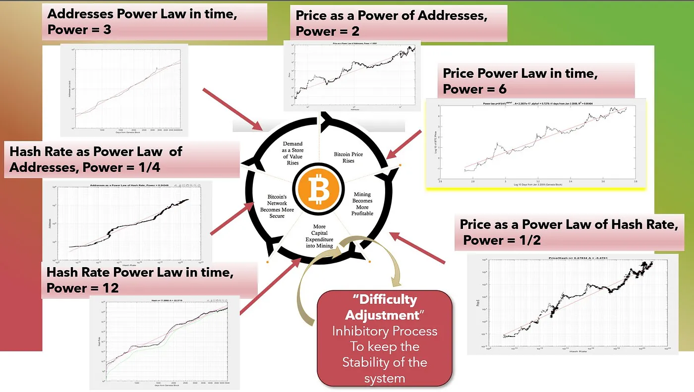

下面的图表显示了所有相互幂律及其拟议的因果解释。

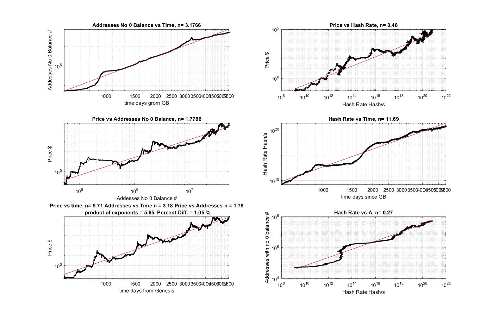

### 幂律理论的后果和预测。

这一理论解释了比特币的长期行为，并产生了许多后果。

其中最令人震惊和最相关的，也是大多数普通比特币投资者经常误解的，就是标度不变性（Scale Invariance）。

标度不变性是物体或定律的一种特性，当长度、能量或其他变量的标度乘以一个公共因子时，它们保持不变。它是物理学、数学和统计学中的一个特征。

标度不变性是受幂律支配的系统的典型特征。

从本质上讲，它表示系统在以相同的方式增长时将继续扩大规模（scale），这就是为什么我们可以使用标度不变性来进行预测，鉴于系统的增长已经超过了 9 个数量级，几乎可以肯定的是，其他 1 或 2 个数量级的增长也将继续发生（达到 100 万 BTC 大约需要 10 年时间）。虽然这听起来不可思议，但从长远来看，系统、价格、哈希率和采用率等一切重要因素都是可以预测的。

标度不变性还能让我们理解大型机构 ETF 最近对比特币系统的投资流入等事件的作用和重要性。

标度不变性告诉我们，这些事件不会极大地影响比特币的价格轨迹，相反，它们是比特币系统继续保持标度不变增长所必需的关键事件。

这也意味着，许多人很难理解，幂律趋势（加上泡沫）就是你所得到的一切。不多也不少。

这是该理论最令人震惊的预测。

所有理论都是可证伪的，而这正是证伪该理论（至少是目前形式的理论）的方法之一。

未来的理论可以修改，增加斜率变化或相变，但目前的理论认为，比特币的价格路径已经确定，除非发生灾难性事件，否则不会发生改变，尤其是在 1 或 2 个数量级上，而这只是比特币整体历史增长的一小部分。如果比特币在 15 年中保持标度不变，那么在接下来的 10 年（下一个数量级）中，比特币也可能保持标度不变。

顺便提一下，就规模而言，未来 10 年与之前的 15 年是不相容的，因为这只是另一个数量级。对于大多数不熟悉这些概念的人来说，需要花一些时间来理解对数比例的工作原理。

该理论还有更多的内容（例如，为什么我们会看到如此吻合的底部遵循幂律），但我们将在后续文章中详细阐述。

### 理论的推论。

#### 泡沫是如何产生的？

与稀缺无关，与摩尔定律有关。

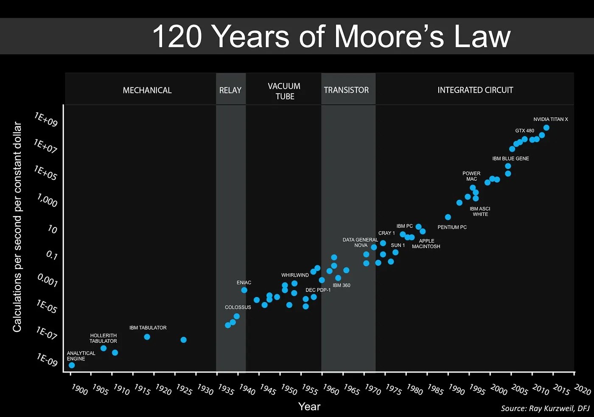

中本聪知道摩尔定律。这是一个启发式定律，宣称计算能力每两年翻一番。“难度调整”机制确保你需要花费大量的金钱和精力来获得一些额外的比特币。

但摩尔定律给了你一个不公平的优势。4 年后，你将拥有 4 倍的哈希值计算能力，基本上与 4 年前的机器（大致相同）的能耗成本相同。由于磨损，你无论如何都需要更新，而机器的成本只是运营成本的一部分。事实证明（我在理论中解释了以何种方式），无论是从逻辑上还是从经验上，我们都可以得出价格（或通常所谓的奖励）=哈希率¹/2。因此，基本上 4 倍的哈希率只能带来 2 倍的收益。但减半后，收益减半，增加的收益为零。这一切都是为了让矿工处于盈利的边缘，永远不允许有免费的午餐。这太完美了，不可能是偶然的，我认为中本聪正是这样计划的。

4年，而不是2年或者连续减少奖励，是因为这在供应链方面也是一个好主意，因为芯片行业的更新和进步需要时间，也给了矿工时间去计划更新，让设备自然贬值。这纯属天才之举，与比特币有关的任何事情都极其务实，切中要害。泡沫是“安全吸引更多采用”这一循环的结果。这个循环并不是我发明的，而是其他人发明的，而且它一直被用来解释采用比特币的周期。

这是有道理的，因为直接提高安全性会吸引更多的人，让你对比特币存储价值的能力更有信心。没有这一点，就没有价值。我有一个最好的比喻，当人们搬到一个发展中的城市（就像赛勒（教链注：微策略公司创始人）说的，比特币是数字世界中一个闪亮的城市）时，会出现一阵活动。你想搬进去，因为那里有桥梁、房屋、道路等等。你不一定会直接考虑这些事情，但你会被这些活动所吸引。所有的新事物和好事都在那里发生。这就产生了一种暂时的“FOMO”（教链注：害怕错过），这种“FOMO”是好的“FOMO”，因为它是基于基本面的，而不是一些愚蠢的猜测，也许“FOMO”不是一个最好的词，所以你可以帮我找一个更好的词。但你知道我的意思。

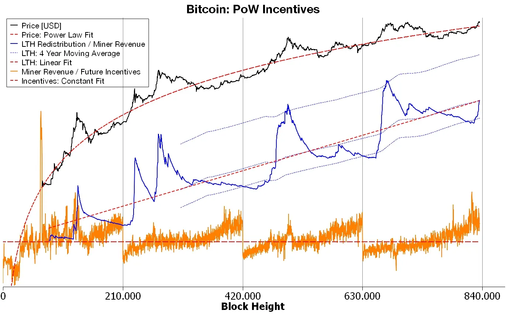

图释：kuntah ⚡ 是这张神图的作者。

价格上涨很快，几乎呈指数增长。这是价格唯一一次出现这种情况，而不是按幂律增长。事实上，从下图中可以看出，它几乎是完全对称的，价格下跌的速度和上涨的速度一样快（有时更快）。泡沫破灭后，它又会回到平衡状态。这是一种点状进化，是比特币增长的必要条件。

“所谓点状平衡，是指进化是以脉冲的形式发生的，而不是达尔文所说的那种缓慢而稳定的进化。在物种灭绝或新物种出现方面几乎没有活动的长期停滞期，被间歇性的突发活动所打断。”

因此，泡沫也是比特币故事的一部分。它们并不是整个幂律增长的主线，但它们也是其中重要的一部分和必要的一部分。

我认为，这就完美地解释了整个周期中泡沫外（约 2 年）和泡沫内（约 2 年）的增长。请告诉我你的想法以及这是否合理。

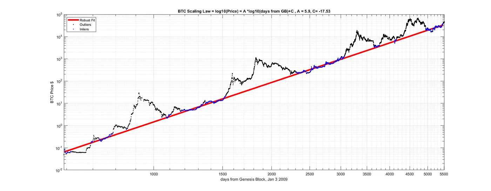

知名物理学家 D. Sornette 的这篇论文对泡沫的起源和性质持非常相似的立场。

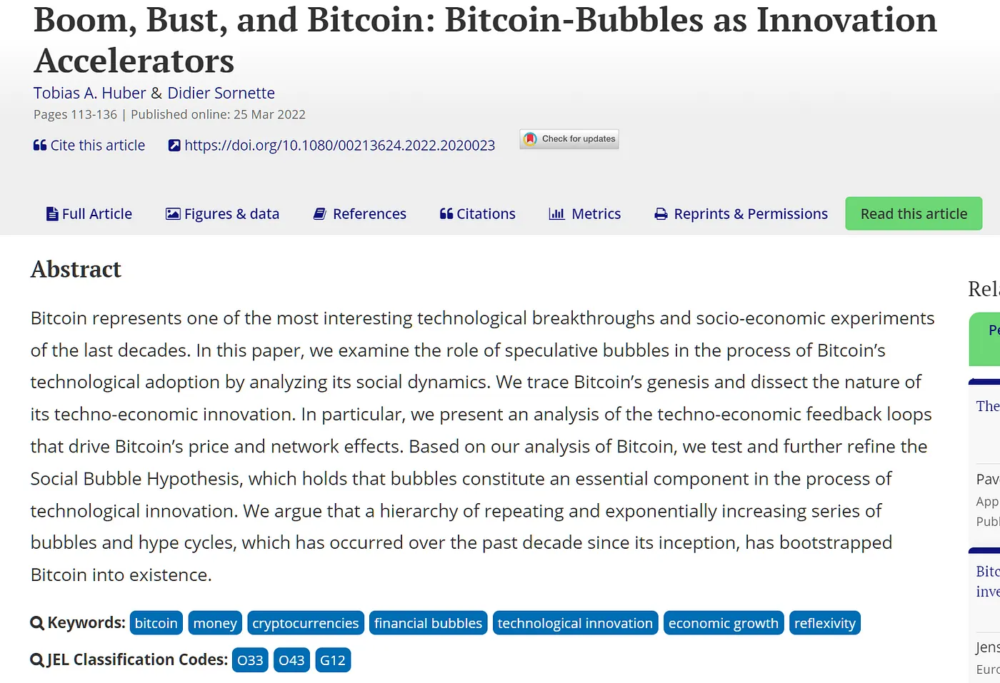

### 注释

稀缺性在这一理论中完全不起作用。稀缺性没有任何机制或解释力。

### 附录

一些模型证实了我的发现。比特币幂律理论（BPLT）比这些工作要早几年，但其他研究人员也发现了类似的结果，这一点令人欣慰：

https://stephenperrenod.substack.com/p/bitcoins-lindy-model

斯蒂芬是另一位拥有哈佛大学博士学位的天体物理学家。

### Q&A

#### 我不明白什么是幂律

幂律是一个简单的概念，它是一种 y=A x^n 的关系式。

这种等式虽然简单，但它代表了自然界和人为现象中的许多现象。

#### 但是，既然比特币是由人类互动产生的，那么幂律怎么可能出现在比特币中呢？

首先，比特币并非仅由人类互动产生。毕竟，比特币是一个拥有精确算法的代码，通过精确的数学公式运行。“难度调整”是系统中存在的众多反馈回路之一，其作用类似于恒温器，因此可以将其作为一个物理系统来研究。矿工对能源的需求也是纯物理学。但是，更多基于社会互动的物理学，比如新比特币用户的采用，也可以用类似于物理学和生物学中的方程式来建模，比如病毒的传播。

单个个体可能有自由意志并独立行动，但当你考虑到大量的代理人时，就会出现一些模式，这些模式可以用我们为理解自然现象而开发的工具来研究。我们称之为“普遍性”，这意味着我们可以在自然界中找到与所研究现象的特殊性质无关的相似模式。

科学家们已经将这些方法应用于社会网络的增长、城市如何发展、企业如何生存等许多方面。这些社会或经济现象往往遵循幂律。甚至恐怖袭击也遵循幂律。

#### 稀缺性、需求和供应又是什么？

它在比特币幂律理论中的作用为零，我们将在今后的文章中详细阐述。

#### 为什么不使用美元以外的其他货币？

与世界上大多数货币相比，美元仍然是稳定的。虽然通货膨胀，但这对比特币来说只是一个小小的修正。当我们研究物理时，我们首先会简化，排除可能出现的复杂情况，如摩擦或空气阻力。我们可以稍后再添加，但首先，我们要了解现象的本质，不要分心。

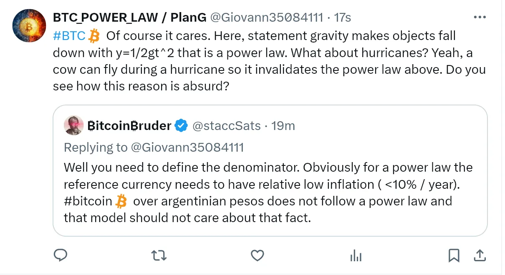

#### 幂律对通货膨胀货币有效吗？

我不知道，我为什么要尝试？我们能从中得到什么信息？我可以这么做，但我有 300 件关于比特币的事情想要探索，这似乎是在浪费时间，就像这些货币一样浪费。

不过，一般来说，BTC 的幂律与稳定的通货膨胀有关。如果你的通货膨胀率过高（比如通货膨胀率快速上升），那么问题就不在于幂律，而在于通货膨胀的货币。

这就好比我告诉你地心引力会让物体向下运动。然后你又问，那在飓风中呢？是的，猪在飓风中可以飞起来，你和你的房子也一样。这并不违反万有引力定律。

你看到这里的逻辑谬误了吗？

#### 2060 年的价格是多少？

10²⁹⁹⁹¹²³⁵，您现在满意吗？幂律理论不能被用于预测2040年以后的情况。雷·库兹韦尔（Ray Kurzweil）的“技术奇点”（technological singularity）接下来就会到来，而所有的预测都是错误的。历史上有一个字面意义上的奇点，所以没人知道会发生什么。

#### 它不可能永远上涨

1. 我们不知道，因为我们不知道未来有多少价值会转移到比特币中。我们可能会开始开采小行星或发明纳米技术，从而开创一个富足和财富的新时代，这样比特币就会永远上涨（见上文问题）。
2. 这个模型可以很容易地进行调整，加入一个缩减的部分。幂律基本上是该模型的近似值。顺便说一下，这些模型不会导致指数行为，但事实上，它们比幂律本身更温和。就目前而言，没有必要添加这个会使模型变得更加复杂，却对我们的理解没有实际益处的成分。

#### 你说价格=哈希率^(1/2)，但等式的维度不对。

为了简单起见，我们的意思是这种关系在本质上是成正比的，正确的等式当然是价格=A 哈希率^(1/2)，其中 A 是一个常数，单位正确，使等式在维度上有效。

#### 价格是自相关的，因此幂律是虚假的

这是统计学家和经济学“专家”最喜欢的论点之一。价格当然是自相关的，但我们声称它是确定性的。所以你是在支持我们的假设？总之，关于这个荒谬的论点还有很多可说的，你可以在下面的链接文章中读到，我们在文章中揭穿了揭穿者的谎言。

另外，请注意下面一篇关于比特币的同行评议文章，它以一种更礼貌、更专业的方式提出了类似的论点，即如果你一开始就说你声称因果关系是由于一种似是而非的机制，那么你就可以忽略这些更正式的因果关系测试，因为如果存在因果关系并且数据是部分确定性的，那么数据显然是相关的。

我们观察到的所有幂律都声称是由因果过程产生的，如梅特卡夫定律、“难度调整”、幂律，如社会信息的传播和比特币网络用户之间的互动。

因此，在将比特币作为一个自然过程（基于类似于生物学、网络理论和物理学中的原理和机制）来研究的背景下，我们将在下文中运用同样的论点来论证这些测试的遗漏及其不恰当性。

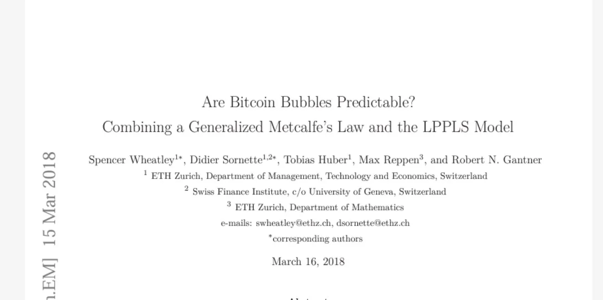

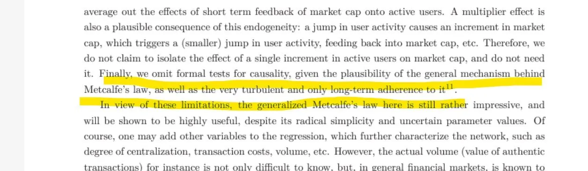

而且，Sinz 给出了一些解释：

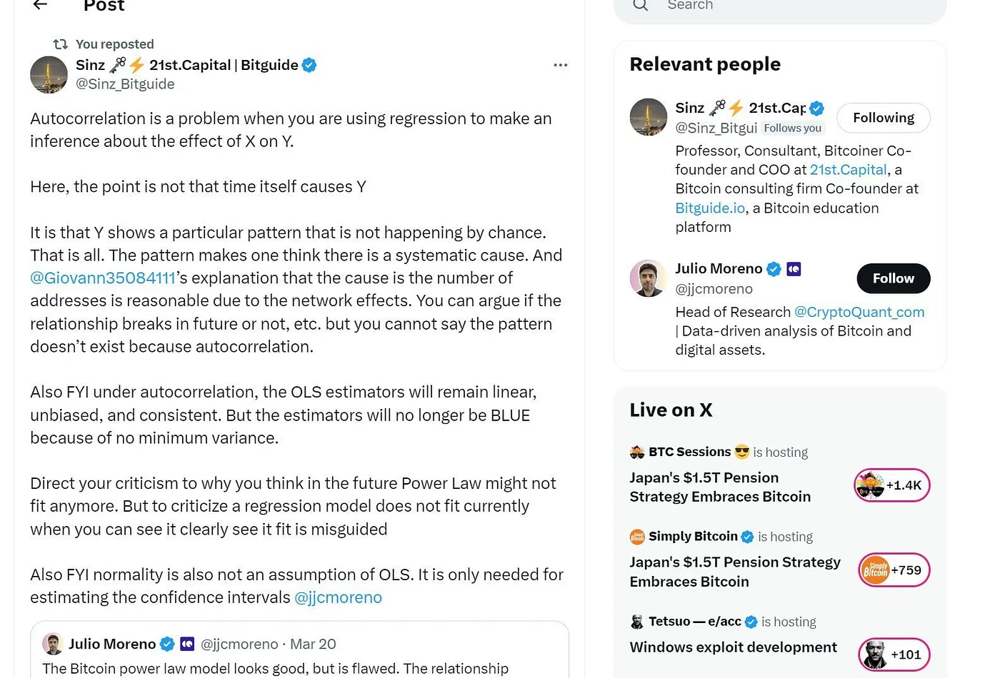

#### 那么 S2F 或其他价格模型呢？

S2F 充满了数学和概念上的错误，请参阅我们之前关于此主题的讨论。基本上，它就是一派胡言。没有自相关性或协整性也杀不死这只吸血鬼。基本概念和模型构建中使用的数学才是关键。

#### 如果美元出现恶性通货膨胀会怎样？模型是否会崩溃？

这是最常见也是最烦人的问题之一。提问者想暗示什么？他很快就会成为百万富翁？

1. 上行到什么程度？甚至更多不值钱的美元？你梦想过这样的场景吗？你将成为不值钱货币的百万富翁。开心吗？
2. 你知道这会导致内战，甚至核战争吗？那你的比特币怎么办？
3. 如果那样的话，比特币（价格）图表将是你最末位的问题了。

#### 所有的“模型都将被摧毁”

（微策略创始人）赛勒（Saylor）指的根本不是比特币模型，而是一些通用的经济模型。我不得不回去听听那个采访。完全不相关。让我们停止思考，让人们自己去思考，包括我在内。你可以的。我爱赛勒，爱得要死，但我相信他从来没有自己绘制过比特币图表，即使有，他也没有花几年时间去研究。当他对比特币说三道四的时候，我在试着理解它。好吧，让我们妥协，所有的模型都将被摧毁，幂律理论是一个理论，而不是一个模型。好吗？

#### 难道我们正处于 S 型曲线的起点？

不是，原因有几个（我们很快会讨论）。

#### 如果知识真的变得普及，价值就会暴涨，因为人们会以未来的价格来定价？

不，这违背了幂律理论的主要预测和基本原则之一。任何形式的操纵都可能使价格瞬间上涨或下跌。但这种情况不会持续，一般来说，趋势会得到尊重。

这是一个很难理解的概念。你可以意识到专利与城市规模之间的关系，这是一个幂律，但你不能改变它或者改变太多，这是系统的基本属性。它的存在并非偶然。它就是系统的本质。

我们在比特币中观察到的幂律就是比特币的本质。

除非从根本上改变比特币，否则我们无法改变它们。

这是理论中最强大、最有影响的部分，随着时间的推移，它可以被证伪，或者更多的观察结果会支持它。

