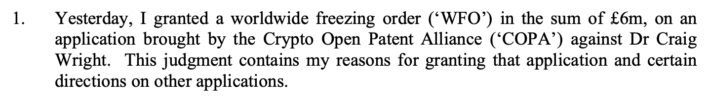
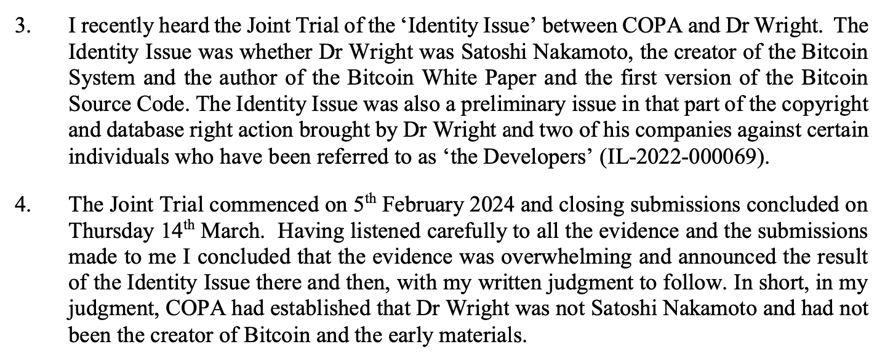
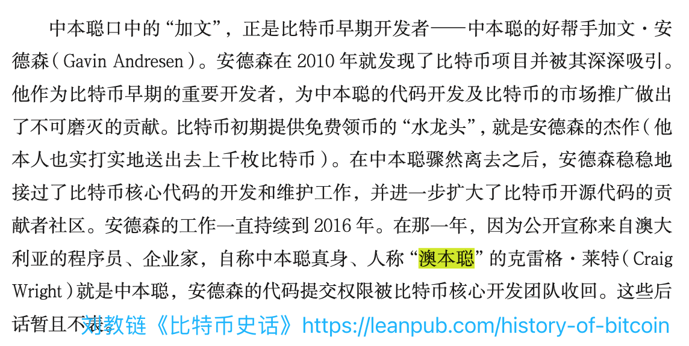
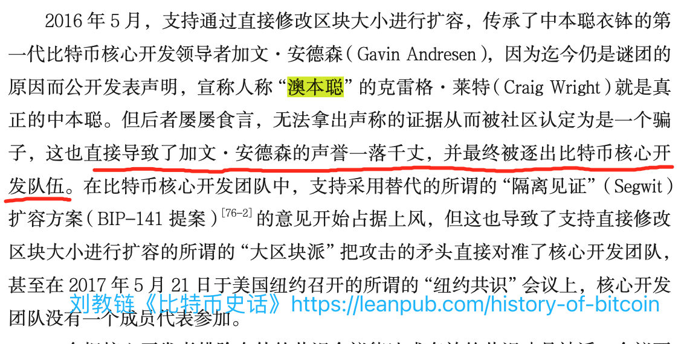

# 冒牌货澳本聪被实锤证伪，600万英镑冻结令生效

号外：教链内参3.31《鲍威尔面露鹰色，黄金勇攀新高》

* * *

双兔傍地走，安能辨我是雌雄？

就在BTC（比特币）暂时回撤至7万刀下方时，大快人心的消息传来：COPA诉澳本聪的案子判了。法庭认为，有压倒性地证据证明，澳本聪就是冒牌货，绝不是中本聪。他此前无耻抢注的白皮书和代码版权统统作废，且禁制令禁止其再次进行版权主张。另外，为了防止他逃避支付法庭费用（已有转移个人资产的动作），法庭已经批准了对澳本聪600万英镑的全球冻结令。

「1. 昨天，我根据加密开放专利联盟（Crypto Open Patent Alliance，简称 "COPA"）对克雷格·赖特博士（Dr Craig Wright）提出的申请，签发了金额为 600 万英镑的全球冻结令（WFO）。本判决书包含我批准该申请的理由，以及对其他申请的某些指示。」（教链注：赖特博士就是澳本聪）

「3. 我最近聆讯了 COPA 和赖特博士之间关于“身份问题”的联合审判。身份问题是赖特博士是否是比特币系统的创造者、比特币白皮书和第一版比特币源代码的作者中本聪。在赖特博士及其两家公司对某些被称为“开发者”的个人提起的版权和数据库权利诉讼（IL-2022-000069）中，身份问题也是一个首要问题。」

「4. 联合庭审于 2024 年 2 月 5 日开始，3 月 14 日星期四结束陈述。在认真听取了向我提交的所有证据和陈述后，我得出结论，证据是压倒性的，并当场宣布了身份问题的结果，我的书面判决将随后公布。简而言之，根据我的判断，COPA 证实赖特博士不是中本聪，也不是比特币和早期材料的创造者。」

关于这个2月5日开庭的案子，教链已在2024.2.5文章《是时候结束澳本聪对比特币开发者的骚扰活动了》中进行了介绍。

澳本聪原名克雷格·赖特（Craig Wright），因其来自澳洲，冒称是中本聪，故中文社区的网友戏称其为“澳本聪”。英语社区的网友则直呼其为"faketoshi"（假本聪）。

澳本聪在2018年下半年趁着当年硬分叉发币的投机风潮，硬分叉了BTC的硬分叉BCH，冠名BSV（Bitcoin Satoshi Vision，“比特币中本聪愿景”，很中二的名字），骗了不少圈内的小白，以及没有识别力的韭菜。而BTC在2018年年底的骤然暴跌，进入谷底，也和此硬分叉不无关系。

2021年12月9日，教链写了一篇文章《澳本聪欺世盗名》，介绍他与大卫·克莱曼（David Kleinman）家人的官司。那场官司他也败诉了，被判赔1亿美元。大卫·克莱曼，则是众多被怀疑为中本聪本尊的人物之一。不幸的是，克莱曼已经早在2010-2011年左右暴病身亡。

澳本聪这些年来，对比特币以及整个加密社区造成了很大的骚扰和破坏。他不仅诱骗了最早的比特币核心开发者、中本聪衣钵传承人加文·安德森（Gavin Andressen），迫其离开比特币开发队伍；四处给加密社区的领导者们发传票进行骚扰；还分叉比特币，欺骗韭菜抛弃BTC、转投BSV，亏得底裤不剩。

神奇的是，韭菜们的“斯德哥尔摩症候”十分严重。虽然澳本聪不是华人，但是十分奇怪的是，华语加密社区居然有不少为其摇唇鼓舌的孝子贤孙。一个正常的韭菜，如果被澳本聪骗了，入局BSV被套了，还因此抛售了BTC而错过了这些年来财务自由的机会，内心显然是失落的，但应对这悔恨的正确方法应该是去集体诉讼澳本聪赔钱啊，为何反倒屁股一转，站到了澳本聪一边，成为帮凶，助纣为虐，拼命忽悠后面的小白接盘BSV，以为这样就能让自己早日解套了吗？

美国心理学家利昂·费斯廷格（Leon Festinger，1919年5月8日—1989年2月11日）在上世纪 60 年代首次提出了认知失调理论。为这类人的心理现象提出了一种科学的解释。

认知失调的经典例子就是各种有关“世界末日”预言的信众，以及有关“地震”等大灾难的谣言传播。

费斯廷格解释道，传播骇人听闻言论的目的并不是为了增加不安，而是为自身已经产生的不安进行心理上的辩护，从而缓解认知失调所带来的不适。

当一件事情和自己已有的认知产生冲突时，人类并不会根据科学事实改变从前的想法，而是会选择扭曲事实，来调和自己想法中的矛盾之处。

我们的大脑有一个极其强烈的倾向，就是要为产生的每个情绪、发生的每件事找到自认为合理的解释，以缓解自己焦虑或恐惧的情绪。

在费斯廷格 1956 年的著作《当预言失灵》中，他与两位同事秘密加入和观察了一个小型的末日宗教组织。该组织认为世界会在 1954 年 12 月 21 日毁灭，只有最忠诚的信徒才会被外星人解救。

结果到了毁灭日，信徒们聚集在一起，等了一夜都没有等到世界毁灭。最后他们提出了一个解释：正是因为他们虔诚的祈祷，让外星人决定拯救整个地球，作为对他们的回报。

这个解释的提出得到了所有成员的一致点赞和认可。他们每个人都觉得自己成了拯救地球的英雄，内心充满了自豪感。于是，预言的落空反而让他们每个人对于该末日组织的信仰更加坚定了！

把认知失调理论运用到金融市场上，就会产生我们熟知却难以摆脱的经典现象：

套牢产生信仰。套得越深，信仰愈坚！

失足的少女会诱骗家乡的姐妹一起下海。深陷传销组织的成员会积极发展邻里乡亲成为下线。被套牢的韭菜会动员身边亲朋好友进场接盘。人性的弱点被聪明的收割者利用得淋漓尽致。
