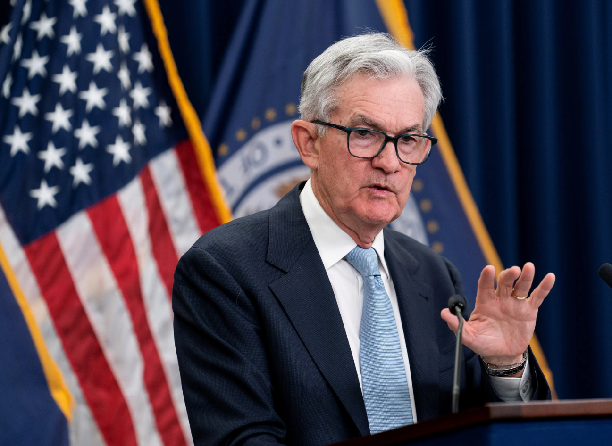

# BTC连续7个月收涨，三月收超7万刀——十年之约＃20（收益率120%）

号外：教链内参3.31《鲍威尔面露鹰色，黄金勇攀新高》

* * *

竹外桃花三两枝。正是河豚欲上时。

不知不觉间，我们已经送走了乍暖还寒的3月，送走了2024年的第一个季度。3月份，BTC（比特币）开盘62.7k，最高73.8k（历史新高），最低59k（3月6日插针），收盘70.4k，月度成功收于7万刀上方，为历史最高月度收盘价，比上一轮牛市2021年10月收盘价60.4k整整高出了1万刀。

十年之约实盘长投计划已经到了第20期（参阅教链2023.6.7文章《八字诀·十年之约》）。由于3月收涨，这次仍然跳过一次逢跌加仓。自2023年6月，至2024年3月，已累计加仓12次，累计持仓554万聪，持仓成本3万多刀，收益率120%。

另外可以看出，去年（2023年）8、9月份，收益率回撤到负值，陷入浮亏时，恰恰应当是加大力度加仓的好时机。

比特高百尺，手可摘星辰。
不敢高声语，恐惊天上人。

“天上人”鲍威尔（美联储主席）突然鹰派表态，表示不宜过快进入降息通道（3.31内参《鲍威尔面露鹰色，黄金勇攀新高》）。一番话令6月份的降息预期知难而退。

上图显示，市场预期6月份降息的概率已降至不足70%，目前超30%的预期是维持当前利率水平不变。年内三次降息预期，也要骑驴看唱本了。

压力给到了财长耶伦这边。

消息称，耶伦将于4月份再次到访北京。

去年7月份她来了一次，成立了两个工作组。（参阅教链2023.7.8文章《耶伦到访能促进贸易战结束吗》以及2023.9.26文章《架空美联储：鲍威尔和高息，哪个先下台？》）

这一次她又来找我们。想必是压力山大。

毕竟，“华山论剑”已近收官阶段。（参阅教链“隔山打牛”三部曲：2023.8.21《人造繁荣：财富大转移》，2023.9.19《隔山打牛：金融大崩溃》，2023.9.22《华山论剑：最后的决战》）

为软着陆而奔走，是耶伦义不容辞的责任。

美联储的做派，一向是“煮熟的鸭子嘴硬”，“不撞南墙不回头”。非得要市场崩溃，死给他看，才老大不情愿地开启降息通道。关于这一点，从上世纪80年沃尔克冲击时起，直至今天，始终如一。

有人回顾历史数据，说，美联储一降息，市场就崩溃。这是倒因为果了。

其实应当反过来讲：恰恰是因为市场要崩溃了，美联储这才赶紧放下端着的高息法宝，降息救市。

为何托塔李天王塔不离手，天天托在手心？因为李天王手里托着宝塔的时候，他就是哪吒的爹；一旦他放下宝塔，他就成了哪吒的仇人。（《西游记》第83回写得明白：「…… 父见子以剑架刀 …… 天王大惊失色。…… 怎么返大惊失色？…… 今日因闲在家，未曾托着那塔，恐哪吒有报仇之意，故吓个大惊失色。却即回手，向塔座上取了黄金宝塔，托在手间 ……」）

美联储端住宝塔，市场就对其三跪九叩，日日瞻仰。只是这人造的宝塔，不比佛造的宝塔，终归是端不稳、托不住的。

端着的宝塔总要放下，市场就要报复性地上涨，收割未成而放水接盘，也就宣告了美元的再一次贬值，以及美联储的失败。（参阅教链2023.5.5文章《美联储已败》）

自去年10月份以来一路暴涨、屡创新高的黄金、比特币，恰如哪吒手擎之双剑，架住美联储砍向全世界的刀。美联储大惊失色，于是鲍威尔出来唱鹰，急忙端出法宝。（3.31内参《鲍威尔面露鹰色，黄金勇攀新高》）

而BTC（比特币）更是在9月、10月、11月、12月、1月、2月、3月连续7个月收涨。从9月收盘27k，一路升至3月收盘70.4k，涨幅达160%。

正如2023年9月19日教链文章《隔山打牛：金融大崩溃》（彼时BTC约为26-27k，黄金$1900）收笔所写的：「每一个黄金的购买者，每一个耐心的囤饼人，都是隔山打牛的战略同盟和统一阵线。而所有参与这个统一阵线的人，都将通过手中资产的大幅上涨而受益于美联储的失败，以及美国金融的再次崩溃。」

文中也十分明确的指出了，推动黄金和BTC上涨的内力来源就是：大国捍卫汇率 + 大国外汇管制。

彼时教链用币圈群众听得懂的语言做了一个比喻：「这就相当于是某平台暂时不能提币，起到了变相锁仓的作用，更有利于价格拉升。回想一下当年2020年底的时候，一时恐慌，但是变相锁仓的效果之一，就是推动了2020年底-2021年初牛市的启动。」

半年过去，现在回看起来，9月份写下的剧本已经演完了前4步。BTC也成功被大国内力推动到突破了历史前高，开启了技术性牛市。（参阅教链2024.3.26文章《比特币再破7万刀》）

现在，剧本还差最后收官一幕：

「第五步，当美联储发现高息吸引的美元资产没有继续回流美国、回流美债，而是中途扭头跑去另外一个管道，进了我方的锅里了，美联储就会着急了。美国金融体系和国内美元资产失去了回流资本的支撑，很快就要难以为继了，就会再次出现形如次贷危机、金融风暴那样的金融大崩溃。

「当然，这一次美联储应该会比2007-2008年更敏感，行动也更果断了。而且2023年初还推出了新工具BTFP。最后，一旦出事，相信美联储会马上挺身而出堵住决堤的口子，迅速印钞，通过美元贬值来挽大厦于将倾的。」

虽然现在看起来，美股涨的很好，吃着火锅唱着歌，不亦乐乎。但是这列火车，会不会突然就像《让子弹飞》开头一幕那样，一头撞到了张麻子挡在铁轨上的斧头，突然翻车，车毁人亡，剩个县长太太，县长变成师爷呢？

还有半年，我们拭目以待。

教链盲猜，引爆这一次危机的，很可能就是AI泡沫的爆破。目前华尔街操盘AI的手法，教链已经在2024.3.25内参《AI的本质和英伟达迷局》里详细写过，在此不再赘述。这个泡沫是史诗级的（AGI彻底淘汰人类云云），这个操盘也是史诗级的（资本梦幻联动），崩盘就很可能也是史诗级的。

掀翻县长的火车，把县长变成师爷，睡县长太太，张麻子来当这个县长。

如果，史诗级的泡沫破裂果真发生，那么，也许那短暂的恐慌回调，将会是比特币10万刀前最后的上车机会。

