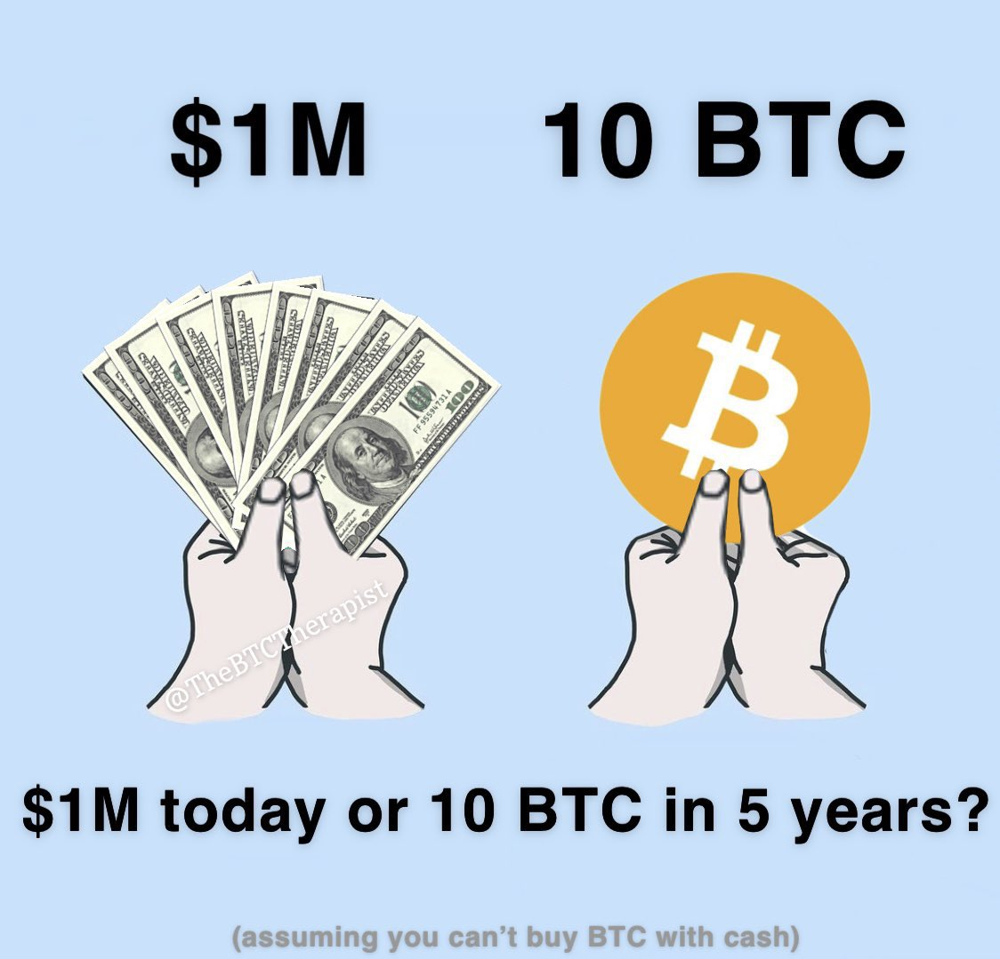
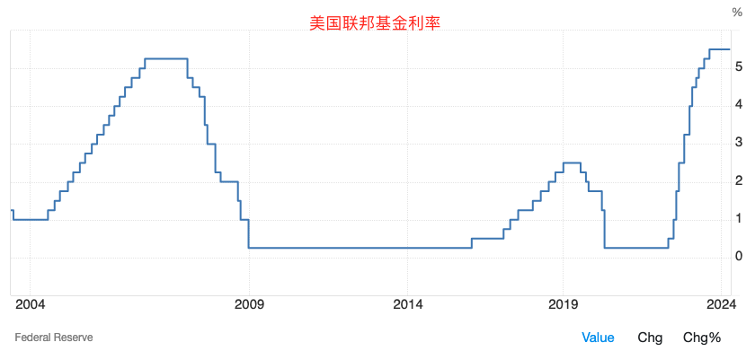
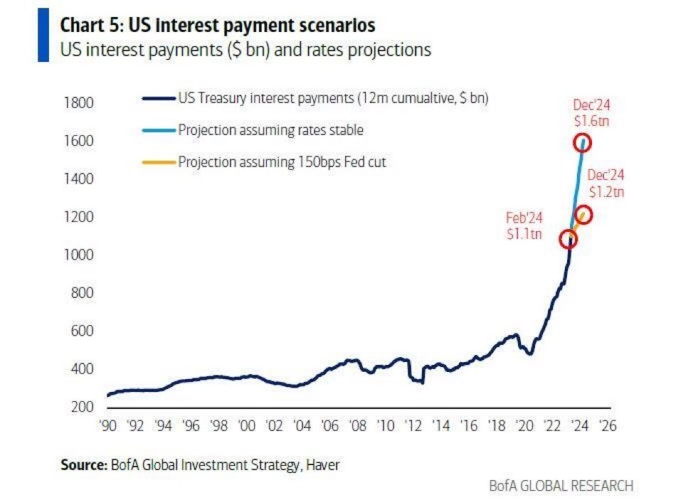

# 10枚比特币或100万美元，你选哪个？

号外：教链内参4.1[《加密市场量价背离，周期提前是否误读？》](http://rd.liujiaolian.com/i/20240401)

* * *

有志者事竟成，破釜沉舟，百二秦关终属楚。苦心人天不负，卧薪尝胆，三千越甲可吞吴。

隔夜BTC（比特币）再次向30日均线68k回调。3月下旬的见高回落，压弯了30日均线的腰。多头在这个心理关键支撑位坚决反击，以图阻止空头击穿30日均线，彻底打破连续7个月收涨的大好局面。（参阅教链4月1日文章[《BTC连续7个月收涨，三月收超7万刀——十年之约＃20（收益率120%）》](http://rd.liujiaolian.com/a/20240401)）

在4月1日教链内参[《加密市场量价背离，周期提前是否误读？》](http://rd.liujiaolian.com/i/20240401)中，教链分享了目前比特币量价背离的情况，以及通常而言，技术分析者是如何看待这一现象的。那么，你认为缩量是因为多头买入不积极，还是因为空头惜售呢？

3月初从66-67k向上冲击2021前高前的缩量上涨，可谓是轧空行情。正如教链在3月5日文章[《BTC已达前高：炒币者踏空，囤币者不败，劳动者光荣》](http://rd.liujiaolian.com/a/20240305)中所写的：

「缩量上涨，明确无误地向市场传递出一个信号：空头手里可以砸盘阻击上涨的筹码越来越少，就要弹尽粮绝了。 这就是轧空行情。 比特涨，比特涨，比特涨完比特涨。 一路扶摇直上的BTC就像历史的车轮，从空头的尸体上无情碾过。不自量力的空头，只能是螳臂当车。」

至3月14日回调前，比特币攻至历史新高73.8k。

月黑雁飞高，单于夜遁逃。
欲将轻骑逐，大雪满弓刀。

目前比特币在7万刀上下。10枚比特币价值约为70万美元。有网友提出一个有趣的问题：如果现在让你在拥有10枚比特币，或者拥有100万美元，持有5年，你会选择哪一个呢？（假设你不能拿100万美元去换成比特币）

现在是2024年4月。5年之后，就是2029年4月。

让我们来做一个前瞻推演。

持有比特币，在未来5年，你会经历两次产量减半。一次是2024年4-5月左右，另一次是4年后的2028年。两次减半后，BTC的增发速度将从今天的每区块6.25 BTC下降到1.5625 BTC。即，年产量从2023年的32.85万枚下降到区区82125枚！这意味着BTC的价格至少要翻4倍，才能向矿工支付与2023年相当的安全费用。

从幂律价格走廊上看，2029年4月份BTC的中轨是39.6万美刀，下轨是14万美刀，上轨是123.4万美刀。（参阅教链2021.7.24文章[《比特币的价格走廊》](http://rd.liujiaolian.com/a/20210724)、2024.1.6文章[《如果BTC达到100万刀（十年之约#15）》](http://rd.liujiaolian.com/a/20240106)、2024.3.30文章[《比特币幂律理论：为何其价格将继续等比例增长？》](http://rd.liujiaolian.com/a/20240330)、2024.3.25文章[《比特币的时间幂律模型及其协整性再探讨》](http://rd.liujiaolian.com/a/20240325)等）

在微观牛熊周期上，2025和2029年很可能会是位于中轨与上轨区间的所谓牛市，那么在2029年4月份，牛市价格将大概率位于中轨上方，即40万美刀至100万美刀。而在可能会是最糟糕的2026年底部，下轨刚好是现在的高度 —— 7万刀。

如果按照这个假设发展的话，那么选择持有10枚比特币的话，到5年后的2029年4月，你或许将会拥有价值超过400万刀的财富。

持有100万美元，在未来5年，你很可能会经历新一轮的美元宽松周期。目前的迹象显示，今年美联储大概率会进入降息通道。一般而言，降息通道打开后，将会开启短则3年，长则6、7年的宽松周期。

现在，两头吃紧的美国，想在放水前再争取一把。于是鲍威尔（美联储主席）扮黑脸，耶伦（美国财长）扮白脸，艾立森（哈佛大学肯尼迪政府学院创始院长、前美国副国防部长、修昔底德陷阱理论提出者）扮红脸。黑脸远远儿地躲在大洋彼岸，高声唱鹰，却难掩外强中干之气。白脸本月再访，低声求和，却仍无法调和内部的撕裂。红脸早到一步，抛出“吴越同舟”新理论，欲不战而屈人之兵。

保持战略定力，就要做到，既不会让狠话吓倒，也不会对软话上头，更不会被胡话忽悠。

这是投资成功的基本功。

囤比特币，亦复如是。

据美国银行推算，到今年12月底，如果美联储还不降息的话，联邦政府将要为美债支付每年高达1.6万亿美刀的利息！

因此，摆在美元面前的只有两条路：

要么，美联储抓紧降息。结果就是通胀爆炸。

要么，美联储坚持高息不降，美债利息爆炸，每年向市场上付出大量美元利息。结局还是通胀爆炸。

而比特币就是美元通胀爆炸的对冲。

今天的市场上，存在着大量并不明智的投资。大量的不当投资，不过是通胀驱使之下，盲目而可悲的羊群效应而已。

本不擅长投资的民众，被通胀驱赶着把多年辛苦积攒的积蓄投向一个个要么正在暴雷、要么即将暴雷的各种资产、各种投资项目、各种理财产品里面去，宛如飞蛾扑火一般。

投资本来不必如此辛苦。你所需要的，也并非投资，而仅仅是储蓄 —— 能够保值的、真正的储蓄罢了。

储蓄比特币。然后该吃吃、该玩玩，该睡睡。从此远离颠倒梦想，心无挂碍，无有忧虑。
