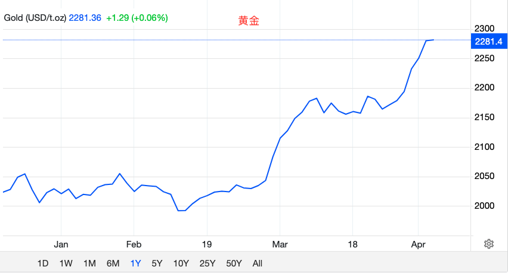
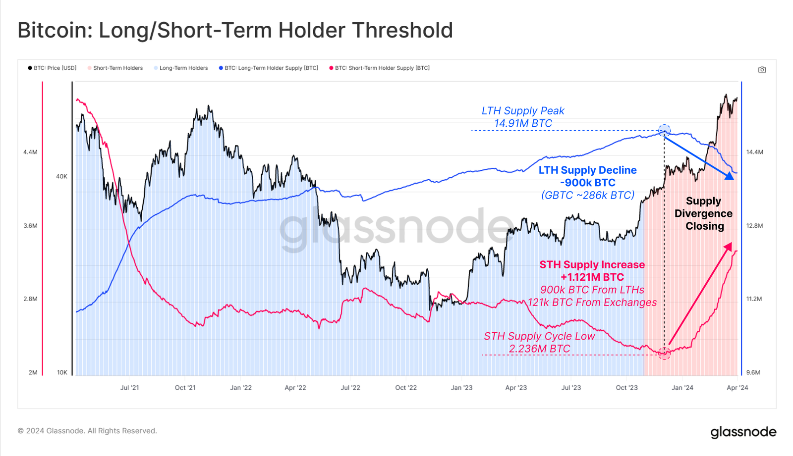
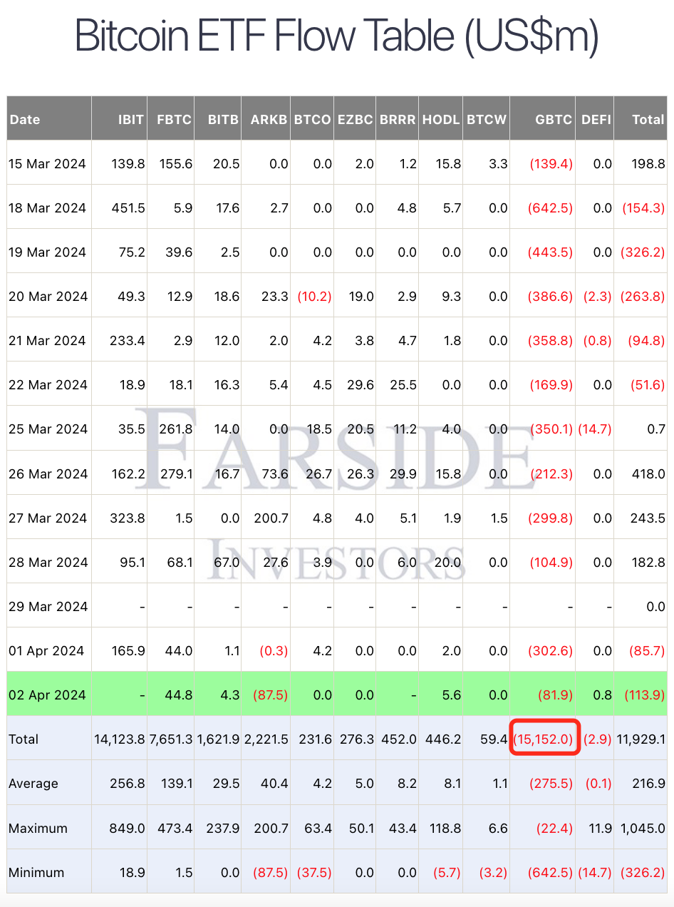
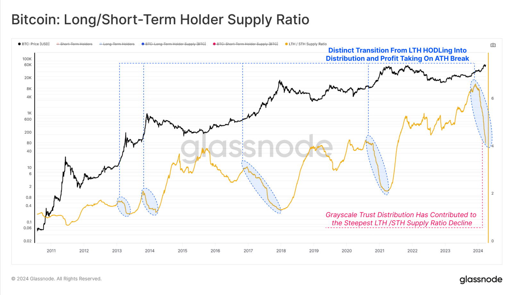
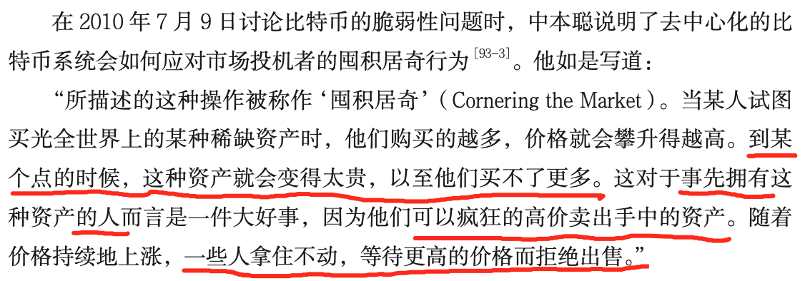

# 比特币刺穿30日均线支撑，真凶是谁？

号外：教链内参4.2[《一片瀑布，择机抄底》](http://rd.liujiaolian.com/i/20240402)

* * *

屋漏更遭连夜雨，船迟又遇打头风。

随着3月31日鲍威尔鹰派讲话抛出，降息预期节节退缩。这在4月1日教链文章《BTC连续7个月收涨，三月收超7万刀——十年之约#20（收益率120%）》中已有介绍。

BTC（比特币）在4月1日、2日连续两天急挫，跌穿30日均线支撑，从最高71k跌至65k，跌幅愈8%。

有人说，这是降息预期减弱，美债收益率上升，美元指数上升，美股下跌，比特币联动所致。

但是，但是，黄金却像脱缰野马，顶着降息预期减弱，继续攀升，已经冲破了$2280。又当作何解释？

唯一的解释，宏观面是烟雾弹。真相，潜伏于假相之下。

美人卷珠帘，深坐颦蛾眉。
但见泪痕湿，不知心恨谁。

数据显示，自2023年底BTC突破4万刀以来，LTH（长期持有者，链上持有155天以上）的持仓一直在持续下降，而STH（短期持有者）的持仓则相对应地在持续上升。这显示出，老韭菜在出货，而新韭菜在吃进。过去三四个月，就是两个群体高位换手的时期。下图，蓝色曲线为LTH持仓，红色曲线为STH持仓：

在BTC从4万冲到7万的过程中，老韭菜抛售了约90万枚BTC（其中GBTC ETF抛售了28.6万枚）。而新韭菜新积累了112.1万枚BTC，其中接盘老韭菜抛售的90万枚BTC，另外还从交易平台提出了12.1万枚BTC。

自从GBTC转ETF之后，它的持仓从转换前的62万枚BTC已经下降到了今天（4月3日）的32.9万枚BTC。三个月减少了47%。（参阅1月18日教链内参《灰度日抛一万枚》）

有人说，GBTC ETF的流出全部被其他几支ETF给吸收了呀？这应该是一个市场中性事件。

但是，很可惜这个解释是错的。因为韭菜手里的钱是有限的，不能双花的（double-spending）—— 拿去接盘ETF，就不能去接盘老韭菜们抛售的现货了。

在1月25日教链内参《摩根大通说灰度抛压或已结束》中记载，GBTC ETF两周流出43亿刀，超出摩根大通预计的30亿刀。而现在截至4月2日，GBTC已经流出超150亿刀。看下表数据：

不能说摩根大通预计的不准，只能说摩根大通预计的也太它么不准了。这实际失血量都已经是预计失血量的5倍了，还丝毫没见有止血的意思。难道是得了凝血因子缺乏症吗？

趁你病，要你命。这是要趁着BTC失血不止的当口，狂拉黄金，把资金给吸引到那边去吗？

教链此前多次说过，摩根大通是全球黄金的操盘手。这决定了它的立场总体上是排斥BTC、排斥加密资产的。 它的CEO杰米·戴蒙更是多次口吐芬芳。比如：《摩根大通CEO：撒塔西将会再次现身并删除所有的比特币》（刘教链2024.1.19文章）

而这一次，老韭菜逢涨减仓的操作，和以往每一轮周期，没有什么不一样。如果说有什么不一样，那就是这一次抛售的更加迅速、更加猛烈。原因，自然也是拜GBTC的流出所赐。见下图（橙色曲线为LTH持仓）：

对于曾经有些人一度表达的，ETF会买光所有BTC的担忧，中本聪早在2010年7月9日就谈过这个问题。据教链《比特币史话》（https://leanpub.com/history-of-bitcoin）第十八章93话，当时中本聪是这样说的：

简单地讲，中本聪的意思有三层：一、价格会越涨越高，涨到ETF买不动；二、早期囤币者可以逢涨抛售，趁机获利；三、还有很多人长期看涨，会拒绝出售。

由于灰度自从2022年跌入熊市后，就转入了负溢价。到了2022年底更是一度达到了惊人的-50%至-60%的夸张程度。这相当于半价促销了。回顾一系列教链内参，可以看到，一直持续到2023年三季度，GBTC依然是负溢价，虽然在不断收窄。一直到2024.2.1教链内参《现货BTC ETF表现超过黄金》中，才有记录道，「数据显示，灰度 GBTC 已无溢价/折价。」

因为信托的铜墙铁壁，当年在2020-2021利用正溢价加杠杆套利的机构，死的死，残的残。他们的破产，把利益转移给了过去两年负溢价大胆抄底的机构。

打折购买，类似于一种无风险的杠杆。是别人，已经帮你把风险吃掉了。五折抄底，收益放大一倍，风险缩小一半。

如果我们认为，成本无折扣的GBTC流出到其他ETF是中性事件的话，那么有折扣的GBTC就不是中性事件，教链这样觉得。

本来能买1个BTC的资金，现在因为五折促销，买了2个。那么，逢高抛售起来，额外多出来白送的那1个就不是中性的，而是负面的。

GBTC负溢价一度折半。现在GBTC流出也几乎近半。从中性程度积分的意义上来说，教链觉得，GBTC流失一半多可能就可以视为把负面因子释放殆尽，接下去，GBTC对市场造成的也许才真的是中性影响了。

我们看到LTH周期性抛售和积累的图线上，长期持有者总是在牛市上涨途中一路减仓，然后在见顶下跌途中一路加仓。其实，不是他们在下跌途中加仓，而是在上涨途中一路接盘老韭菜逢涨抛售的新韭菜们，熬成了老韭菜。

年年岁岁花相似，岁岁年年人不同。
