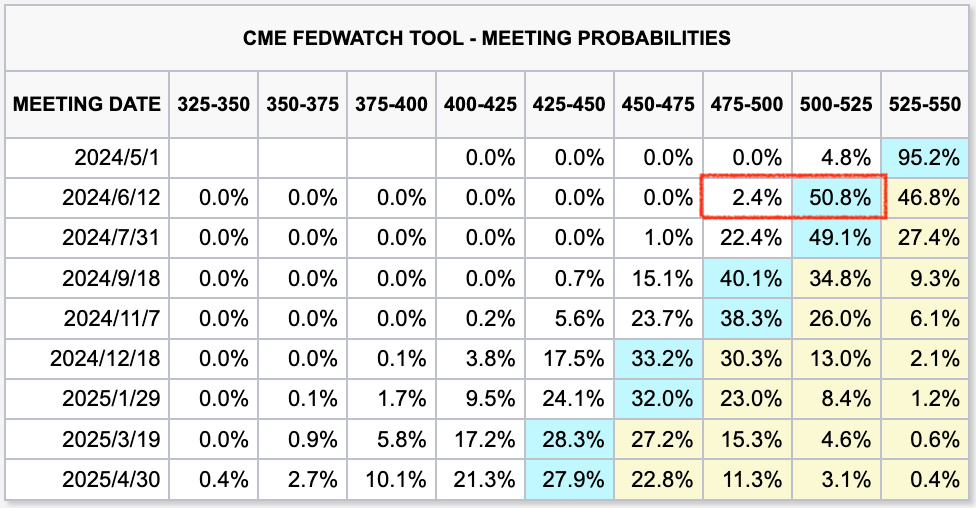
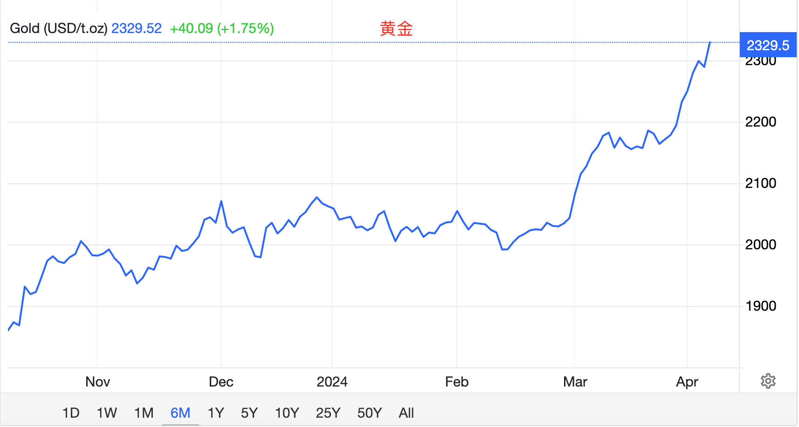
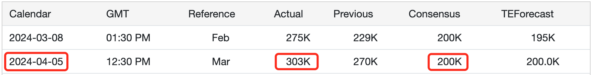
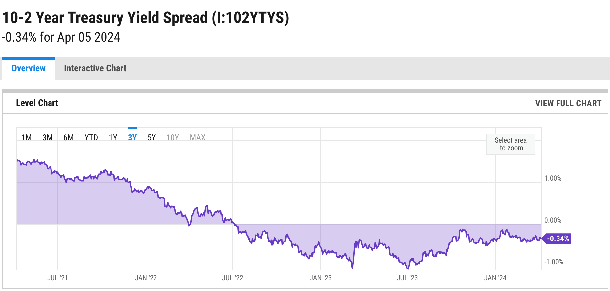
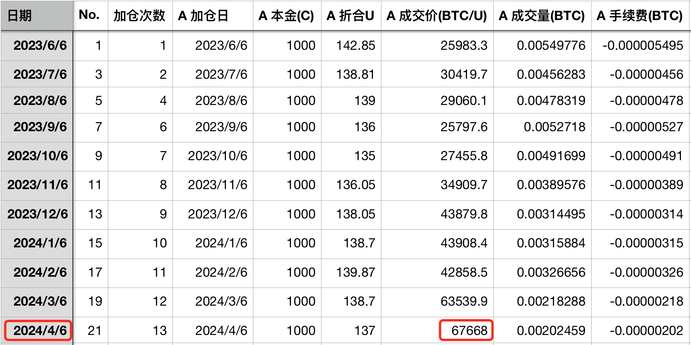
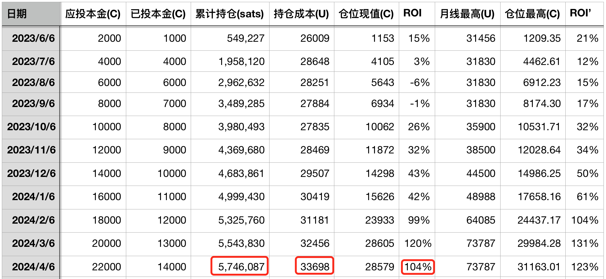

# 比特币和黄金联手痛击美联储 —— 十年之约＃21 (ROI 104%)

号外：教链内参4.5《研究人员称BTC本周末有望重回7万刀》

* * * 

大漠孤烟直，长河落日圆。

4月5日教链内参《研究人员称BTC本周末有望重回7万刀》提到，美联储最近又在进行预期管理（忽悠），对市场的降息期待给予镇压。「周四（4月4日），明尼阿波利斯联储主席尼尔·卡什卡利（Neel Kashkari）表示，如果通胀率保持粘性（sticky），今年可能不需要降息。美联储主席杰罗姆·鲍威尔（Jerome Powell）周三（4月3日）也表示，美联储在降息前需要更多证据证明通胀正持续向2%的目标迈进。」

受美联储唱鹰的影响，6月降息预期一降再降，已经从不久前的70%一路降到了50%左右。举棋不定，犹疑不决，左右为难。

但是黄金却丝毫不给美联储面子，继续突进冲上2300刀/盎司历史新高度，给予美联储的鹰派表态以迎头痛击。

美联储手握降息的开关，这是它说话有人听的主要原因。美联储口头表态，降低降息预期。降息预期降低，流动性宽松预期减弱，理应对黄金和BTC形成压制。但是，黄金和BTC却用上涨回应了这一切。

可是，故事还有另外一种讲法。

市场定价的是预期。而市场的涨跌是预期的导数。

4月5日，美国非农就业数据出台。大幅超出预期。

3月非农就业增加30.3万人，远超预期的20万人。

在如童话般美丽的故事里，美联储提前看到了这份远超预期的就业数据，担心数据突然发布，市场受到惊吓，于是先人一步，在数据发布前2天连续唱鹰，管理预期。

这就好比我们在告知别人一个坏消息的时候，总是会先面露凝重神色。而别人在看到我们的沉重表情之后，心里面对于接下去听到的坏消息就有了提前的准备。

看到美联储如此呵护市场，真的是让人倍感受宠若惊了。

而美债长短期利率倒挂已经1年零9个月了。

在去年（2023年）10月10日教链文章《巴以开战，美联储投降》中，展示了历史上每次美债长短期利率倒挂和经济衰退的先后关系。精准相关，算无遗策。而每一次衰退，又都会逼迫美联储扭转高息政策，转入降息通道。

而对于BTC的长期持有者而言，只需要静静等待，胜利的必然到来。

启动于2023年6月6日的《八字诀 · 十年之约》实盘见证计划，今天（2024年4月6日）迎来了第21次记录和第13次加仓。本次加仓价格67668刀。

加仓后，持仓量已累积至574.6万聪，平均成本33698刀，ROI（收益率）104%。

帘外雨潺潺，春意阑珊。
罗衾不耐五更寒。
梦里不知身是客，一晌贪欢。
独自莫凭栏，无限江山。
别时容易见时难。
流水落花春去也，天上人间。
