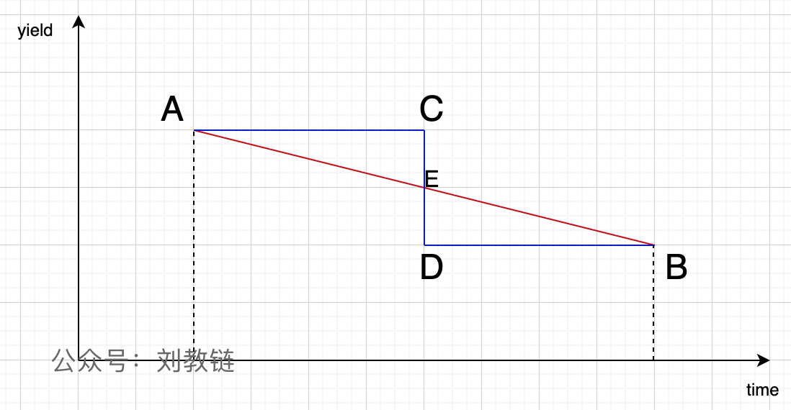

# 比特币跨越30日均线，重上6万9，迫近7万刀

号外：教链内参4.6《5大因素加热市场看涨BTC的情绪》

* * *

明日复明日，明日何其多，日日待明日，万事成蹉跎。

就在看空者蹉跎之际，BTC（比特币）已经雄赳赳、气昂昂，跨过30日均线，重新攻占69k高地，迫近7万刀关键心理防线。

5日教链内参《研究人员称BTC本周末有望重回7万刀》所报，已近应验。6日内参，则进一步指出《5大因素加热市场看涨BTC的情绪》。此谓之“知己” —— 知道多头一方看涨，以及市场确然上涨的主要原因。

而3日教链文章《比特币刺穿30日均线支撑，真凶是谁？》及内参《成功和失败都不重要，可重复的成功最重要》中，则给出了主要的空头方面的力量（5个群体）。此谓之“知彼” —— 了解空头一方于市场所施加的推动下跌的力量。

《孙子兵法》谋攻篇云：知己知彼，百战不殆。不知彼而知己，一胜一负；不知彼不知己，每战必殆。

来到一个市场，你既不知道自己凭啥能赚到钱，也说不出赚的是谁的钱，更不知道对手盘为什么会亏钱给你，那么你这样稀里糊涂的状态，大概率是要亏钱的。

来到一个市场，你很清楚自己如何能赚到钱，但是你不清楚你在赚谁的钱、赚什么钱，那么你这种一知半解的状态，就会有亏有赚，勉强打平不亏损就很不错了。

来到一个市场，你不仅很清楚自己如何赚到钱，而且很清楚为什么你能赚到这个钱，赚的是什么钱，赚的是谁的钱，以及给你提供利润的人是谁，他们为什么会给你提供利润，那么你就会稳稳地赚钱。

4日教链在内参《市场必将有力回击空头的嚣张气焰》中判断，GBTC流出事件或已于4月2日完成中性化转折。

而灰度的GBTC流出事件中心化，或许就是决定市场力量平衡的那一根稻草。

还有不到15天，也即不到2000个区块高度，比特币就要迎来史上又一次产量减半。

教链在此前一系列文章中论述过，减半事件于长期而言是一个中性事件，于短期而言是一个脉冲事件。

先抑后扬，这就是减半事件的巧妙之处。

减半前的均匀产出，距离减半事件点越近，其过量愈甚，给予空头一方的偏爱越大。

减半后的产出突然下降，不过是补偿此前的过量生产罢了。但这在客观上，形成了对空头的釜底抽薪。

教链画了个示意图如上。如果BTC的减产按照均匀下降的方式，即图中红色直线从A到B，那么抛压是均匀减弱的。我们把这叫做理论产量。

但中本聪给出的设计方案却是走蓝色的折线A-C-D-B。我们把这叫做实际产量。

从图上很明显地可以看出，前半个周期的真实产量是AC的积分，即AC下方到横轴的面积。这比理论产量，即AE的积分面积，要多出一个三角形ACE的面积来。

多头一方，即接盘的韭菜，劳动收入是线性积累的。工资只能一个月一个月地发，钱只能一个月一个月地赚，也不会存在说每隔4年工资或者利润突然翻倍的情况。

这就意味着，前半个周期相比理论值进行了过度生产，这就把过量的子弹交到了空头的手上，使之更有实力对多头一方形成压制。

而且，越是接近减半，这个实际产量相对于理论产量高出去的就越多、越过分，空头的抛售能力相对多头的购买力的优势就越大，空头一方就越是嚣张。

但是，风水轮流转。没有任何一方力量可以永远居于优势地位而不跌落。任何一个系统都不允许出现一方力量垄断力量优势而越来越强。这种不平衡如果不能被负反馈调节，就会最终摧毁系统。

中国古代数千年封建王朝的治乱兴衰，周期律背后的原因，与此大同小异。

比特币对这种不平衡优势的再平衡，正是通过每4年一次的产量减半来实现。

当事件跨过了减半事件点E，攻守易势，多头一方便忽然占据了上风。空头此前的优势被清算，转为极大的劣势。

这就是减半事件催生牛市脉冲的动力学原因。

只不过，比特币不是一次减半事件，而是32次。（参考阅读刘教链2023.1.29文章《中本聪的错误：比特币产量减半为什么是32次？》）

随着人们对减半事件的了解和认识越来越深刻，市场也就会越来越早、越来越提前对这一事件进行定价，从而削弱了空头对多头的优势差距，从而在一定程度上熨平了周期。

屈子当年赋楚骚，手中握有杀人刀。
艾萧太盛椒兰少，一跃冲向万里涛。
