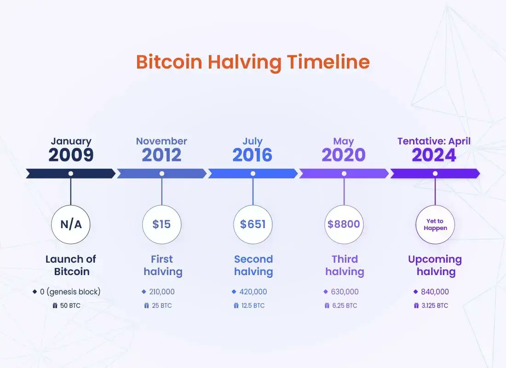
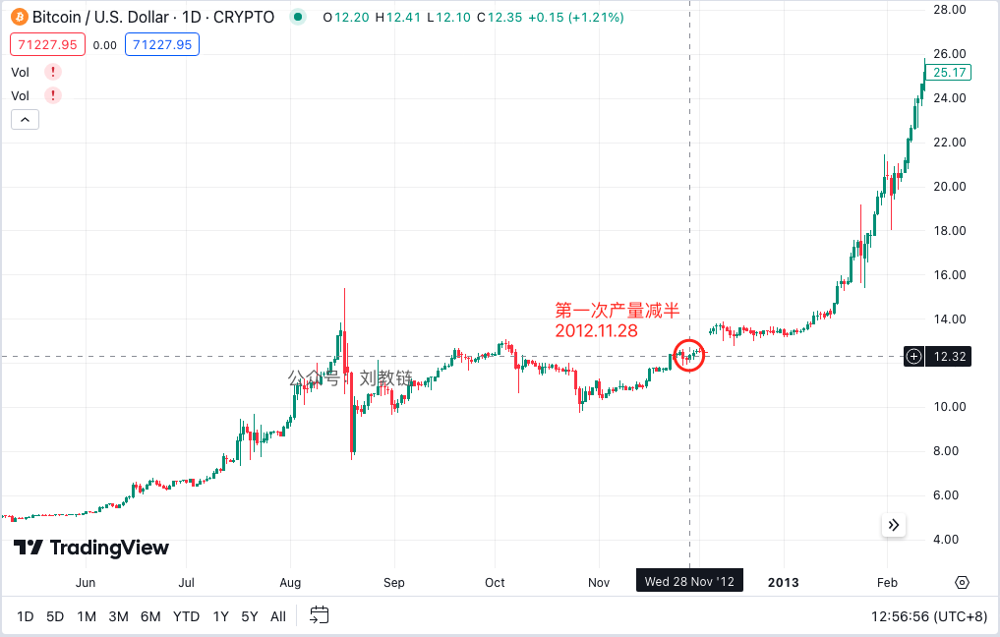
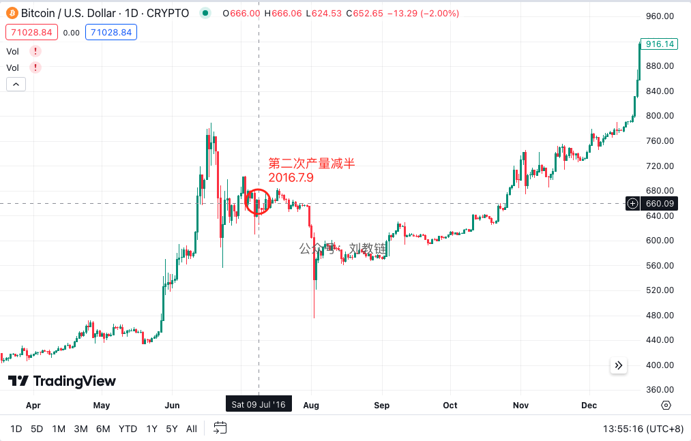
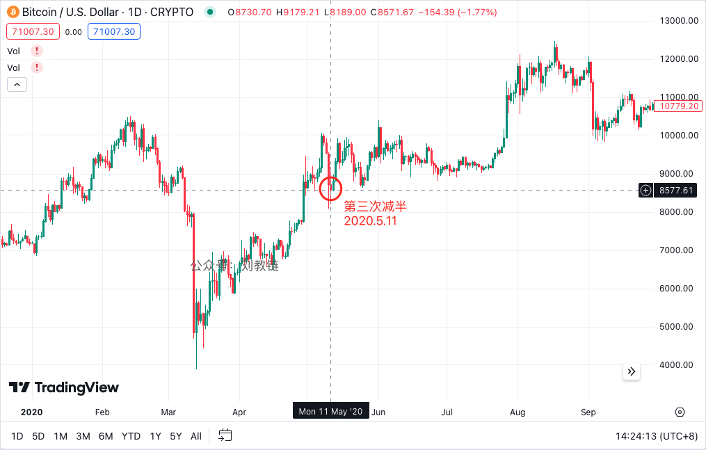
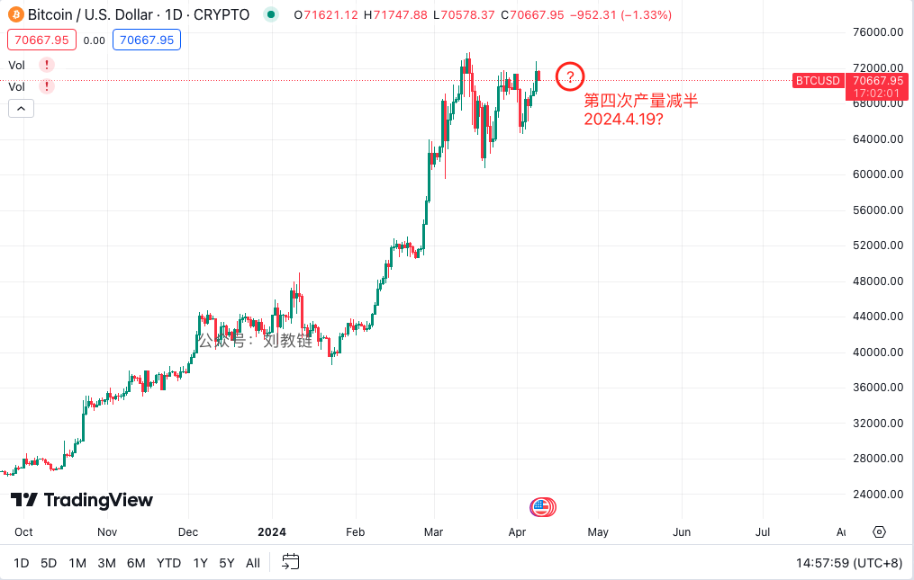

# 比特币产量减半简史

号外：教链内参4.8《BTC作势向上突破》

* * *

前事不忘，后事之师。以史为鉴，可知兴替。

就在昨早教链于文章《比特币稀缺吗？》开头指出近日来BTC（比特币）构筑了一个楔形收敛，BTC当夜便急切上攻一度接近73k，作势就要走出一个对称楔形的向上突破。如若突破成功，而空头未能把多头打回楔形之中（假突破），那么就要宣告楔形走势的结束。越是到收敛区的尾部，多空双方厮杀多时，双方体力皆渐有不支，任一方先顶不住而溃败，则一溃千里。

在外部风平浪静时，场内的纯粹力量对抗便呈现出各式各样的形态来。但是外部因素随时发生不可预料的变化，如风起云涌，白云苍狗，须臾莫测。看过比特币白皮书的人都知道，柏松过程的脚步，是比特币的脚步。这脚步，也是现实世界中，黑天鹅的脚步。

懂得敬畏柏松过程的人，就懂得“君子不卜”的道理。没有人是柏松过程的对手，包括上帝。因为全能的上帝，就一定能制造出一个自己也无法预测的柏松过程，也就否定了他的全知。全知与全能，在柏松过程面前失去了兼容性。于是柏松过程，便否定掉了全知全能的上帝的存在。

于是轻而易举的推论是，短线是最不靠谱的市场策略，因为你选择与柏松过程为敌。靠谱的市场策略，要么是甚高频交易，在外部柏松过程脚步之间出击，唯快不破；要么则是彻底的长线策略，让时间消化柏松过程的冲击，耐心等待一切冲击中性化。（教链2024.3.19文章《熊市买入，长期持有》）

还有不到10天，严格地说，是不到2000个区块高度，比特币就要迎来它历史上的第4次产量减半。基于教链提出的“32级火箭”理论（参阅2024.3.27文章《比特币正在摆脱地心引力》），这一次减半，燃尽和抛弃第4级火箭，开启第5级火箭，把比特币送往10^5数量级（即100,000-1,000,000）的“第六重天”（6位数，或者说，5个零）。

以史为鉴，让我们回顾一下，过往3次产量减半，即2012.11.28、2016.7.9、2020.5.11，之前之后，市场的走势变化，以及彼时彼刻的历史事件吧。

## 第一次产量减半

时间：2012年11月28日

产量变化：从每区块50 BTC下降为25 BTC

减半日价格：约12.3美刀。

减半前表现：楔形洗盘。
（1）曾在8月17日最高涨超15美刀。
（2）曾在8月19日最低跌超8美刀。
（3）上下洗盘后，从8月中至11月中走出一个对称楔形。11月16日完成楔形向上突破。

减半后表现：一路上扬。延续对称楔形向上突破的趋势，并在2013年1月份加速向上。

图形：（见下图）

重要事件：
（1）2012年9月，由前Bitcoin Core首席开发者Gavin Andresen等人牵头的比特币基金会成立。当然，后来的事实表明，这是一个失败的尝试。八月中旬之前的快速拉升，或许和市场将其解读为利好有关。
（2）2012年11月，wordpress博客平台宣布支持比特币付款。这在当年应该会被视为一个成功的案例。

复盘：

减半前的充分洗盘，向上插针洗掉空头杠杆，向下插针洗掉多头杠杆，并经过3个月的楔形收敛，多空激烈交战，最终在减半前完成了充分的博弈。这些都为迎接减半奠定了良好的基础。减半月出现应用落地的利好，且减半后没有出现黑天鹅利空事件，这些都为减半后的供应冲击和市场拉升营造了良好的外部氛围。

## 第二次产量减半

时间：2016年7月9日

产量变化：从每区块25 BTC下降为12.5 BTC

减半日价格：约660美刀。

减半前表现：楔形洗盘。
（1）曾在6月18日最高涨超780美刀。
（2）曾在6月23日最低跌超560美刀。
（3）上下洗盘后，从6月中旬至7月底走出一个对称楔形。

减半后表现：先抑后扬。
（1）7月31日完成楔形向下突破。8月2日最低跌超480美刀，相较于减半日660美刀跌幅近30%，相较于减半前局部高点780美刀跌幅则近40%。（3.22教链内参《摩根大通称BTC抛售尚未结束，减半后或跌至42k》是不是就是根据这个跌40%刻舟求剑推算出来的呀？71000刀 x (1 - 40%) = 42600刀）
（2）8月、9月、10月低位洗了三个月的盘之后，10月底（27日）重返减半日价格，并有效突破，开启了星辰大海的新征途。

图形：（见下图）

重要事件：
（1）3月，日本内阁宣布承认虚拟货币例如比特币具有货币功能。
（2）7月，研究人员发表研究论文，称自2013年以来，比特币商业不再由犯罪活动推动，而是主要是合法企业活动构成。
（3）7月，CheckSequenceVerify软分叉成功激活。
（4）8月，Bitfinex遭受黑客攻击，被盗近12万枚BTC。8月份的暴跌由此而促成。从盘面看，显然有内部人提前知道了失窃的消息并抢跑了市场。

复盘：

一个外部的黑天鹅事件打破了向上突破楔形整理的美梦，并造成了长达3个月的低位洗盘。短期投机者被套牢，磨不过的就此割肉，认输离场，倒在了黎明之前。柏松过程神出鬼没，非投机者所能胜也。

## 第三次产量减半

时间：2020年5月11日

产量变化：从每区块12.5 BTC下降为6.25 BTC

减半日价格：约8600美刀。

减半前表现：黑天鹅暴跌。
（1）曾在2月13日最高涨超10000美刀。
（2）曾在3月13日最低跌超3900美刀。
（3）美国疫情爆发，美股连续熔断，波及加密市场，造成了历史性地“312”大暴跌。一日跌幅近40%。一个月回撤超60%。2倍杠杆都被彻底爆掉，灰飞烟灭。

减半后表现：横盘修复。
由于“312”史无前例的洗盘，几乎爆掉了所有的杠杆（倍率低至2倍都会倍爆仓），造成了大面积的恐慌和心理阴影，以至于很长一段时间内，市场都陷于二次暴跌的恐惧中走不出来，以至于虽然市场洗的足够干净，包袱很轻，但却愣是延宕了半年（6个月），直至10月下旬才真正开始向上冲刺，吹响牛市的号角。这一次，减半日到进入牛市快速上升通道之间所间隔的时间，也比2016年（3个月）和2012年（1个月）都要长。

图形：（见下图）

重要事件：
（1）1月31日，特朗普总统宣布美国进入公共健康紧急状态。2月，美国发生第一例死亡病例。
（2）3月12日，黑色星期四。全球股票市场崩盘。
（3）10月，Paypal支付平台宣布将允许其用户买卖BTC。

复盘：

这一次的黑天鹅事件，不是发生在减半后，而是发生在减半前。神鬼莫测的柏松过程和投机者们开了一个大大的玩笑。洗盘是肯定要洗的，只是每一次的洗法儿，都各有花样。2012年是洗洗更健康。2016年是小洗完了还要大洗。2020年是深度清洗，然后晾起来了。

## 第四次产量减半

时间：2024年4月19?日

产量变化：从每区块6.25 BTC下降为3.125 BTC

减半日价格：约?????美刀。

这一次，我们又将经历怎样的减半事件呢？

翻倍拉升已经拉了。局部高位楔形收敛也已近于完成。变盘在即，减半将至。黑云压城城欲摧。山雨欲来风满楼。

所有的酸甜苦辣，所有的悲喜交加，所有的刻骨铭心，都随风逝去，唯有价格图线，把那全部历史浓缩为一个个数字的跳动，字字千钧。

故园东望路漫漫，双袖龙钟泪不干。
马上相逢无纸笔，凭君传语报平安。

