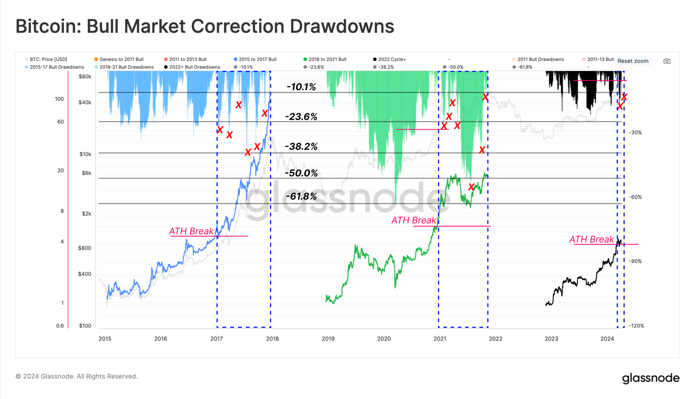
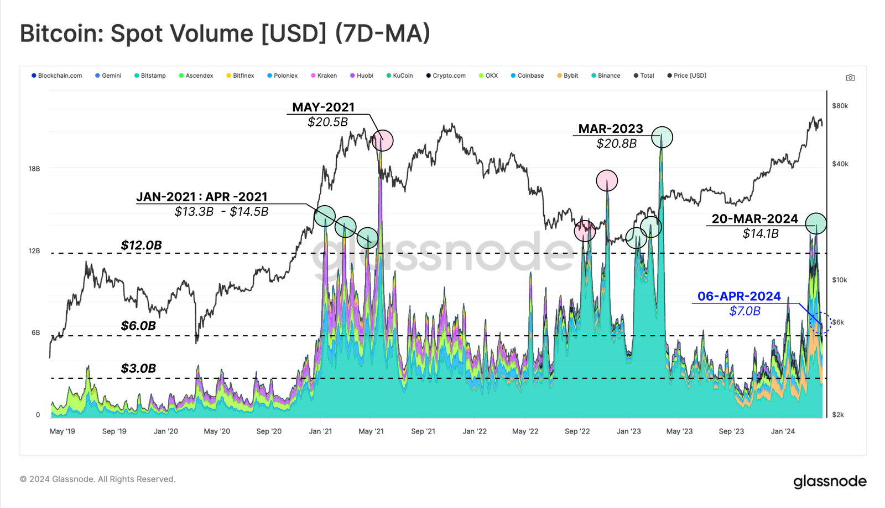

# 一张量价图，满纸荒唐言

号外：教链内参4.9《山雨欲来风满楼》

* * *

就在BTC（比特币）作势上攻，突破楔形上沿（约7万刀）阻力线、一度攻占72k上方阵地之际，空头突然杀个回马枪，把多头打回7万刀下方的楔形内。多头的这次突围，失败了。空头的底气，大致又那么几点，如9日内参《山雨欲来风满楼》所讲到的：其一是美国税季将至；其二是美联储紧缩政策；其三是ETF流入不振、流出扩大。

至于有读者朋友在9日文章《比特币产量减半简史》后所问的，这次减半前后是否会有暴跌（猜大概回撤40%算是暴跌？），其实单纯的场内博弈可能不足以产生那么大的振幅，而外部黑天鹅事件则是可遇而不可求（说的竟好像是多么盼望来个黑天鹅似的！）。

上面这个图，画出了第二次减半、第三次减半以及当前这一次减半三个周期内回撤的瀑布图，可以比9日文章有一个更加直观的感受。从图中可以看出，我们刚刚经历的2021年牛市这个周期，竟然是比前比后都更为“痛苦”的一个周期 —— 如果我们把回撤幅度和“痛苦”程度挂钩的话。

在上一个减半周期中，我们竟然经历了两次黑天鹅“暴跌”冲击，一次是2020年“312”（回撤超60%），一次是2021年“519”（回撤超50%）！何其“幸运”也！

回撤是杠杆脆弱性的表达。当抛售引起价格下跌。价格下跌引起杠杆被迫平仓。杠杆被迫平仓引起更多抛售。更多抛售引起价格崩溃。如此反馈循环，连锁反应，引起价格雪崩。

这一轮减半周期，走到现在，是温柔的。最大回撤幅度，尚不超过25%。

场内常见的杠杆倍数，大概有2x、3x、5x、10x这么几种。爆掉它们，分别需要回撤超50%、33%、20%、10%。回撤10%，爆掉10倍杠杆，应该是家常便饭。回撤20%，爆掉5倍杠杆，应该时不时来一下，减轻包袱。回撤33%，爆掉3倍杠杆，应该偶尔得见，如达摩克利斯之剑高悬。回撤50%，爆掉2倍杠杆，实属罕见，而2020一个减半周期内就遇到两次，也算是“历史性的”了。

凤凰台上凤凰游，凤去台空江自流。
吴宫花草埋幽径，晋代衣冠成古丘。

回顾自2019年以来的BTC现货量价图（如下），多少历史钩沉，尽在不言中。

从量价图上可以一眼看出，牛市顶部和熊市底部成交量都会放大，牛市衰退期和熊市复苏期成交量都会缩小。

价格是成交量的领先指标。价格先动，成交量慢半拍跟上。

牛市刚开始时，无量拉升。等到价格涨到大多数人开始反应过来，纷纷冲进来都想捞一把的时候，牛市基本就见顶了。于是这些后知后觉冲进来的人，就高位接盘，然后套牢。

无量拉升的原因，是因为卖方低价惜售，没有放出太多的筹码。而买方积累了充足的粮草，突然积极买入，不需要吃进太多量，就把价格给拉上去了。

拉升放量，也就见顶了。不是因为望风而动的人冲进来，而是因为后知后觉的囤币者开始被唤醒，趁高价“逢高减仓”、大量出货了。

牛市刚结束时，无量下跌。等到价格跌到大多数人都割肉离场的时候，熊市基本就见底了。死扛到最后的人，终于扛不住了，跑得越慢，割得越低，亏的越多。

无量下跌的原因，则是因为买方已经在牛市顶部接盘后，用过高的价格耗尽了手头的购买力，弹尽粮绝，根本无力阻挡卖方的抛售。卖方只是稍稍出一点儿量，就能把价格砸下去一丈深。

下跌放量，则是见底了。因为在最低价、亏损最大的时候，最多人才终于扛不住，最终割肉。而他们此时的抛售，因为价格低了太多，所以杀伤力就十分有限。

从色彩分层图，可见各平台之兴衰。

面积最大的青绿色，向我们诉说B站显然是2021-2023穿越牛熊最受益的那一个。紫色的消失，则是H站清退和衰败的刻画，一代风云，往事成空。

2023年底，随着美国铁拳对独领风骚的B站重拳出击，之前不温不火的O站、Bb站还有美国合规的C站，颜色面积开始扩大，此消彼长。真是你方唱罢我登场。

平台易倒，BTC永存。
