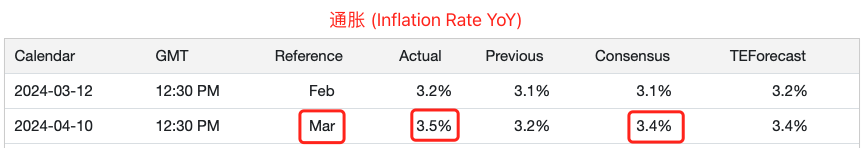
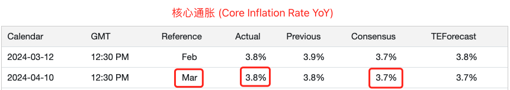
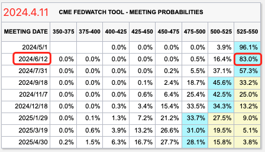
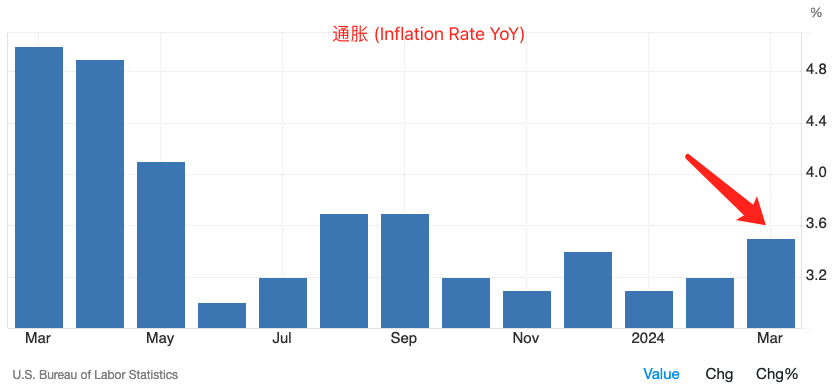
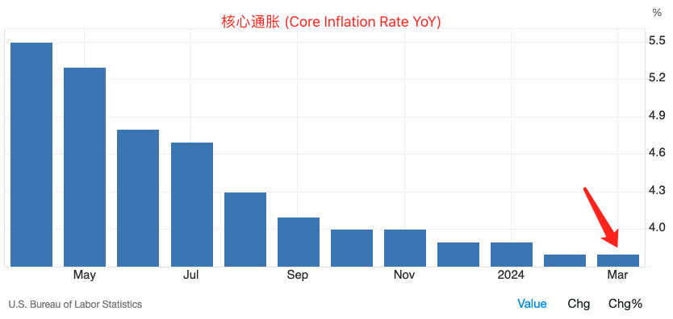
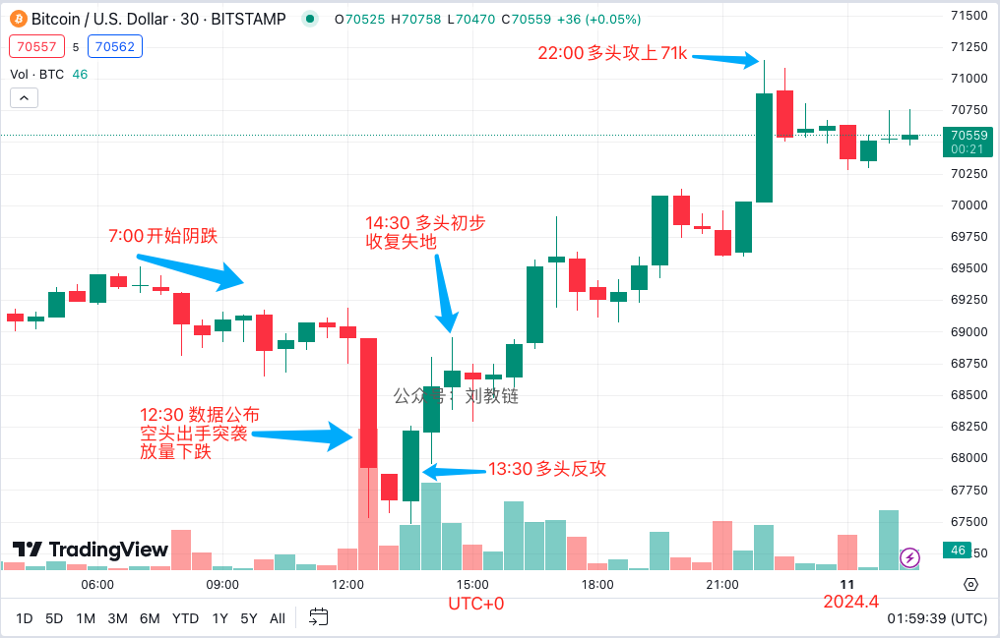
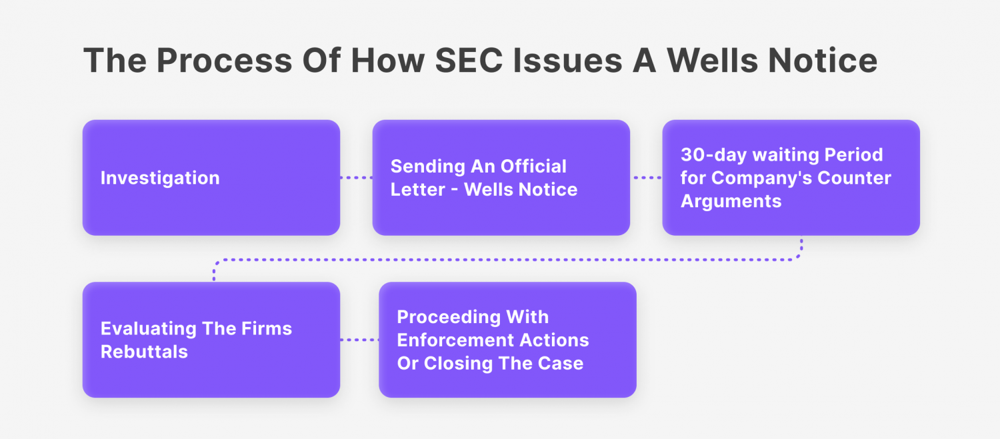

# 这一夜，两只靴子落地

号外：教链内参4.10《据称香港最快4月底前上市现货BTC ETF》

* * *

风萧萧兮易水寒。

10日夜，世界翘首期待，美国最新通胀数据的发布。东八区20时30分，数据释出。CPI通胀3.5%，高出预期3.4%零点一个百分点。核心通胀3.8%，同样是高出预期3.7%零点一的百分点。

媒体大肆渲染，通胀升温，控制路径进展不顺，美联储降息预期再度推迟。不错，期货市场确实大举放弃了对6月降息的押注。

但是，教链却觉得这大概又是虚惊一场。

我们看一下通胀的图：

我么再看一下核心通胀的图：

可以看出，虽然比预期高了一丢丢，但是通胀并没有大肆反弹，而核心通胀仍然在一个漂亮的下降通道中。鲍威尔完全可以说，一切尽在掌握。

数据是一回事。市场怎么解读是一回事。美联储怎么解读，则又是另一回事。

事实上，现货BTC（比特币）市场的反应，也佐证了这一判断。

上图显示，在10号晚8点半（UTC+8）之前，BTC就开始从69.5k（下午3点左右）磨磨蹭蹭地下跌，待8点半超预期的通胀数据一出，空头集中抛出全部筹码，一家伙把价格从68.8k砸到最低67.5k。但这番下跌立时放量，显示了多头一方早有准备，用充足的弹药完全笑纳了空头的抛售。21时再次抛售，彻底清空弹匣之后，空头就弹尽粮绝，任多头宰割了。多头仅用1个小时左右就完全收复失地，并在8个小时之后就反攻到了71k上方。空头的突袭以彻底的失败而告终。

大放厥词的惊弓之鸟惑乱人心，手握筹码和弹药的真正战士才是决定战场走向的人。

黑云压城城欲摧，甲光向日金鳞开。
角声满天秋色里，塞上燕脂凝夜紫。

这厢里，BTC吸收并化解了一次外部事件冲击。那厢里，10日隔夜，去中心化代币交换协议Uniswap的开发者、uniswap.org门户的运营主体Uniswap Labs确认收到了来自美国证券监管机构SEC的“宣战书” —— 韦尔斯通知（Wells Notice）。

韦尔斯通知以约翰·韦尔斯（John Wells）之名命名。在其于1972-1976年任职SEC期间，设计了SEC对个人或企业的金融违规行为发起执法行动的程序。韦尔斯通知是一个非正式文件，意在正式行动前进行预先警告，并促使接收方在正式诉讼前主动和SEC沟通协商。按照程序，Uniswap Labs有30天的事件进行响应。

受该通知的负面影响，Uniswap的治理代币UNI日内急挫超15%，从11美刀跌至9美刀附近。

说起来，Uniswap Labs收到SEC的韦尔斯通知，情理之内，意料之中。一直跟进的朋友都知道，早在2021年9月份，SEC就启动了对Uniswap Labs的调查程序。韦尔斯通知，不过是调查初步有了一些结果之后，自然而然要发生的事罢了。毕竟，这世界上，谁经得起仔细的调查呢？只要认真查，总能查出一些不明不白的问题出来。

自那时起，Uniswap Labs也开始了一系列的应对准备，比如重金雇佣前奥巴马发言人负责公关（参阅教链2021.10.15文章《年底没有下半场》），比如成立了DEF基金，打着教育的旗号进行政治游说活动（参阅教链2021.7.14文章《是谁，卖掉了100万枚UNI？》），等等。

当然，SEC目前对DeFi板块的态度嘛，可能不是太友好。在2023年6月17日教链内参中就说过，SEC执法部门主管Gurbir Grewal在一次接受采访时语出惊人地说，“DeFi提供既不去中心化也非金融的服务，是纯粹的欺诈”。

现在，Uniswap Labs也只能兵来将挡、水来土掩了。毕竟，当年接了SEC战书并开启诉讼的瑞波，也没怂，还取得了胜利。（参阅教链2020.12.24文章《SEC起诉瑞波，中本聪早有论断》，2023.7.15文章《瑞波三年长跑一朝胜诉》）

而这也是对Uniswap协议去中心化程度的一次有力考验。Uniswap协议，并不是Uniswap Labs。后者掌控着网站uniswap.org，但却并不掌控uniswap协议。

如果因为SEC的强力施压，能够迫使Uniswap Labs这个中心化主体进一步削弱自身的控制权，分散资源，促成uniswap协议生态完成更进一步的去中心化，也有可能坏事变好事，祸兮福之所倚了。

真正的去中心化，一定是可以吸收外部冲击，化为自身内力增进的。就像2021年比特币算力网络遭受史无前例的大国级攻击，但依然成功吸收，倚祸成福，华丽涅槃，算力网络更加去中心化，价值得到了进一步的提升。

只是苦了那些2、3月份时被UNI两波暴拉所吸引，心存对50刀、100刀、200刀幻想的投机心理，急慌慌冲进来接盘的人，这一下子，可能又要心慌慌，茫然而不知所措了。

任何对价格的单纯投机，如果不是自己确实深深懂得标的和策略的话，大概率会在一次次的洗牌中割肉离场，就算最后市场到达了当初投机的价格目标，手里也早已没有仓位了。

* * *

附1：补充阅读，Uniswap Labs针对SEC韦尔斯通知的公开抗辩（英文）：https://blog.uniswap.org/fighting-for-defi

附2：教链提醒各位，千万当心此时的钓鱼和欺诈活动！最好什么都不要做。我在推特上看到很多利用此次SEC和Uniswap Labs开战的恐慌进行钓鱼的欺诈帖子。通常，会伪装为Uniswap Labs或其创始人Hayden Adams的名字和头像，声称请你尽快点击链接保全自己在uniswap协议里的资金，或者点击链接联署对SEC的抗议，等等十分容易令人上当的信息。你一旦点进去，链接小狐狸钱包，点个授权，就全完了，你的资产可能立刻就会被洗劫一空！

