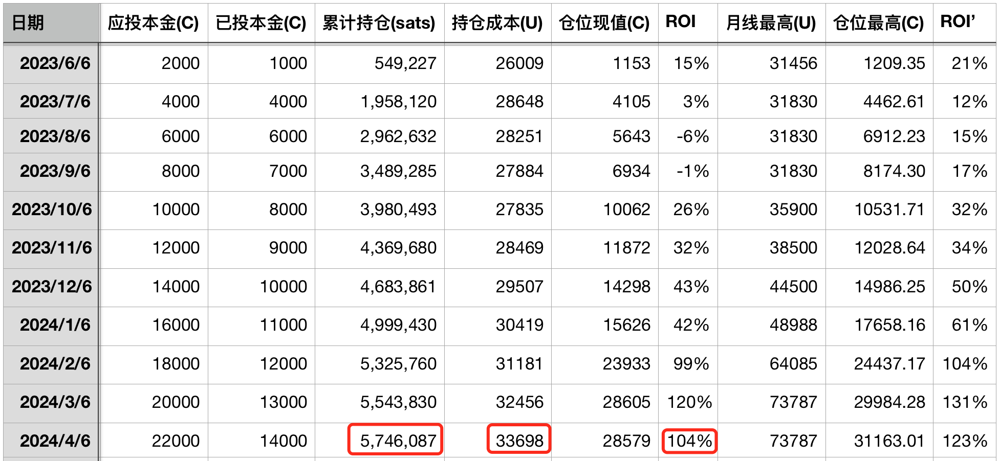

# 炮弹击沉仓位

号外：教链内参4.13《减半一夜变利空，风幡未动人心动》

* * *

一声惊雷万刀滚，斗破苍穹千里云。

华尔街日报一篇伊打小以的报道，让市场屁滚尿流，匆忙避险。说是避险，可这避险路径竟不似过往。风险资产美股下跌，避险资产黄金却也在下跌。加密市场更不必说，早就“疑是银河落九天”了。独独美元指数，疯了一般地向上窜。

或问对此局势，有何看法。教链在今年1月9日，美现货比特币ETF通过3天前，所写一文，《比特币大伏大起》，以史为鉴，对黄金ETF的种种，作了回顾。当时文中插图，再看一看：

2004年11月18日黄金ETF获批时，黄金现货是$440/盎司。12月2日，最高冲到$456/盎司。此后便陷入了横盘振荡，直至次年（2005年）9月5日突破箱体。横盘区间最大振幅为$410-$456，核心振幅在$415-$445。最大振幅约10%左右，核心振幅6%左右。振荡时间约为8个月左右。

但是，拉长视野，这8个月过后，黄金就一飞冲天，开启了2005-2011长达5年的大牛市，从$400多/盎司一直冲到最高$1900多/盎司，涨幅超过350%！

反观BTC（比特币），在1月9日教链发文时，收盘46.8k；1月11日ETF通过后，最高冲到49k；然后画了一个对勾，在2个月之后的3月14日，最高冲到73.7k；而后便开始了下跌整理。目前日内下插最低60k，距最高73.7k跌幅为18%多、不到20%。

若按照目前最“狠”的预测，3.22教链内参所介绍的，《摩根大通称BTC抛售尚未结束，减半后或跌至42k》。那么从73.7k到42k，最大跌幅约为43%左右。

依教链所见，什么新闻报道，地缘冲突爆发，不过是空头拿来炒菜的材料罢了。市场进展到了一个危楼高百尺的地步，就要下跌。这是内因。一切外因不过是通过内因起作用罢了。

也就是说，当市场需要上涨时，它会自动寻找一切利好，来支撑它的上涨。反之，当市场需要下跌时，它也会自动寻找一切利空，来作为它下跌的理由。

若说BTC这波箱体整理，底线会在哪里？教链的《八字诀·十年之约》实盘实证数据，可作一个旁证：从大概率上讲，跌穿十年之约持仓成本线的机会不大。那么这个持仓成本线是多少呢？都在公开记录里。看教链最近一次十年之约实证记录，4月6日《比特币和黄金联手痛击美联储——十年之约#21 (ROI 104%)》中的实盘数据表：

截至4月6日，十年之约已经坚持执行了11个月，持仓成本为33698刀。而从数据表中也可以看出，计划目前还留有36%左右的现金未投出，可以用于“逢跌加仓”。应在什么时候投出呢？显然，应该在价格向持仓成本线附近跌落时投出为最佳。向上偏离过甚，则略亏。一味等待跌至更低，则过贪。而在略亏和过贪之间，则宁可略亏，不可过贪。

这一顿炮弹，炸毁无数仓位，反倒是个好事。提前释放了风险，反而降低了下半年降息转折时的大崩溃概率。这一轮牛市，也就有了一个更稳的开局。想来就令人倍感欣慰。

只是狮王BTC这么抖上几抖，粘在身上吸血的虱子们，也就是那些土狗币、山寨币，又有不少要被甩下去、摔个粉身碎骨了。

